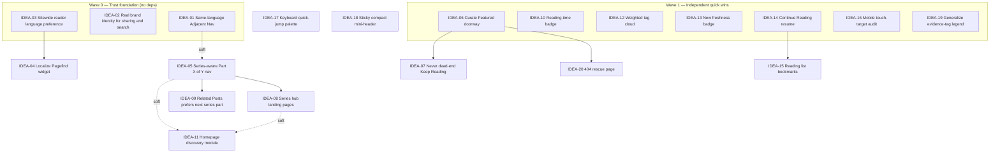

# memo — Roadmap

## 1. What this is

This document answers **What** and **Why** for `memo` (Hiep Lam's bilingual
engineering blog). It does **not** answer **How** — no component APIs, no file
plans, no implementation steps. It is forged by the Shaman (the owner's
delegate for product judgment), co-created with the owner, and executed by
dispatching one **Warchief** at a time per approved idea card.

It has two registers:

- **Problems** — 20 real, cited, currently-existing bugs/inconsistencies found
  by reading the actual code, content, and a fresh production build. Every
  claim below was verified against `file:line` or a rebuilt `dist/`; none are
  hypothetical.
- **Ideas** — 20 full-context cards for UI/UX improvements, scoped strictly to
  (a) seamless browsing and (b) reader attention/engagement/discovery of the
  next post, sequenced by dependency (not score).

## 2. How to use this roadmap (decision authority)

**Chain of command:** Owner ⇄ Shaman ⇄ Warchief ⇄ Hunter. The owner directs
the campaign batch size ("do the next idea" / "do N" / "run it all"). The
Shaman dispatches one Warchief per idea card, rules on `NEEDS_DIRECTION`,
verifies `SHIPPED` evidence against the card's measurable goal, and keeps this
file + the Decision Log current.

**Shaman decides autonomously:** sequencing, anything already pinned in a
card's scope fence, enforcement of Standing Constraints (§4), and any
`NEEDS_DIRECTION` that isn't on the Escalation Register (§7).

**Escalate to the owner — and only these:** irreversible data-shape changes,
product-promise/positioning changes, new permissions/trust surface,
privacy-surface changes (default answer: no), and cutting a scope fence. See
§7 for the standing tripwires specific to this roadmap — none of the 20 ideas
below currently require escalation; each was scoped precisely to avoid
tripping one (see each card's "Decision authority" line).

**Scoring convention:** Impact (1–5, user value) ÷ effort weight (S=1, M=2,
L=3) = Score. **Score ranks bang-for-buck, it does not set build order.**
Build order is the dependency-sequenced list in §6/§8.

**Definition of done (a card):** merged PR, CI green, before/after evidence,
and the card's measurable goal verified from that evidence — not from reading
code or trusting a "done" claim.

## 3. Product context

`memo` is Hiep Lam's personal bilingual (Vietnamese/English) engineering
notebook — long-form deep dives on software architecture, AI agents, testing,
and terminals, frequently published as multi-part series, often in both
languages. It is a static Astro 6 + Tailwind 4 site with **no backend, no
accounts, no server** — deployed to GitHub Pages under `/memo`. Roughly
60% of its 59 published posts are Vietnamese, written in a specific **Southern
Vietnamese dialect voice** that is a product promise, not a style choice
(PR #23 rewrote the semantic series from Northern to Southern register: "tôi"
→ "tui", "vào" → "vô", etc.). The visual identity is the "Sage/Fog" calm,
warm, low-contrast reading system (Hanken Grotesk, one muted sage-teal
accent, WCAG AA floor, honors `prefers-reduced-motion`, both themes
first-class). The core success metric, per `PRODUCT.md`: *"a reader who
finishes one piece and chooses to read a second, then remembers where they
read it."* Today's wayfinding toward that second post is a chronological
prev/next strip, a tag-based "Keep Reading" panel, tag/archive pages, and a
static Pagefind search index — all computed at build time, nothing dynamic at
request time.

## 4. Standing constraints

Every idea below inherits these. A proposal that violates one is rejected
without asking the owner.

- **SC-1 Static, serverless, no backend.** Astro output only, GitHub Pages,
  build-time data only (`astro.config.ts` — no SSR adapter, no API routes
  beyond static-at-build endpoints like `rss.xml.ts`/`og.png.ts`). No new idea
  may require a server, a database, or a runtime third-party API call.
- **SC-2 Bilingual by default, URLs stay flat.** EN/VI parity is first-class
  (`PRODUCT.md` design principle #4), but post URLs are deliberately **not**
  locale-prefixed — `adr-20260613-add-multilang-posts.md` explicitly rejected
  Astro i18n routing (`/en/`, `/vi/`) in favor of a flat `lang` field. No idea
  may reintroduce locale-prefixed routing without owner sign-off (§7).
- **SC-3 Southern Vietnamese dialect is canonical.** Established by the
  merged style fix (PR #23, commit `ffcf3a6`). Any new/edited Vietnamese
  string (UI copy or content) must use "tui" not "tôi," etc.
- **SC-4 Design system is token-only.** All color/spacing must flow through
  the CSS custom properties in `src/styles/theme.css`/`tokens.css`
  (`ref-tailwind-design-system`); no hardcoded hex in components. Per
  `DESIGN.md`: no "hacker/terminal" aesthetic, not colorful, not
  high-contrast, not a content-marketing template. `prefers-reduced-motion`
  must be honored for any new motion.
- **SC-5 Accessibility floor.** WCAG 2.1 AA, full keyboard + screen-reader
  support, visible focus states — "already a project feature," must be
  preserved (`PRODUCT.md` Accessibility & Inclusion).
- **SC-6 Content schema is additive-only by default.** `src/content.config.ts`
  is Zod-validated (`ref-content-schema`). New **optional** fields with safe
  defaults (the precedent: `lang`/`multiLangKey` in
  `adr-20260613-add-multilang-posts.md`) are Shaman-decidable. A **required**
  field that forces editing all 59 existing posts is an escalation (§7).
- **SC-7 No new trust/privacy surface.** No accounts, no comments, no
  server-side analytics, no third-party embeds that transmit reader data
  off-device. Client-only `localStorage`/`sessionStorage` that never leaves
  the browser is today's precedent (`theme`, `backUrl`) and is Shaman-decidable
  as long as it stays local-only (see Decision Log DL-3).
- **SC-8 Code hygiene (inherited, not Shaman's to police).** `rule-no-console`,
  `rule-prettier-format` — enforced by CI/the Warchief, not a What/Why
  concern, listed here only for completeness.

## 5. Problems register — 20 real, cited issues

Severity: 🔴 Critical · 🟠 High · 🟡 Medium · ⚪ Low. All verified against
source at HEAD and/or a fresh `bun run build` on 2026-07-05.

| # | Sev | Problem | Evidence |
|---|-----|---------|----------|
| P1 | 🔴 | **The default social-share image is an unedited AstroPaper template screenshot.** `public/default-og.jpg` (served as `og:image`/`twitter:image` on every page without a custom per-post image — confirmed on `/`, `/tags`, `/archives`) shows the wordmark "AstroPaper," the hero heading "Mingalaba" (Burmese greeting from the upstream demo), placeholder posts ("Adding new posts in AstroPaper theme"), demo tags (`#astro-paper`, `#nextjs`, `#forestry-cms`), and a September-2022 search demo — zero connection to Hiep Lam, memo, or the Sage brand. | `public/default-og.jpg` (viewed); wired via `astro-paper.config.ts:10` → `src/utils/resolveDefaultOgImagePath.ts`; confirmed `<meta property="og:image">` on `dist/index.html`, `dist/tags/index.html`, `dist/archives/index.html` |
| P2 | 🔴 | **Sitewide SEO/OG/RSS text description is unedited AstroPaper boilerplate.** `"A minimal, responsive and SEO-friendly Astro blog theme."` renders as `<meta name="description">`, `og:description`, `twitter:description` on Home, `/posts` (+ all pagination), `/tags` (+ every tag page + pagination), `/archives`, `/search`, `/posts/lang/{vi,en}`, and `/404` — confirmed on ~200 of 233 built pages — and as the RSS `<description>` channel element. Only individual post pages and `/about` set their own. | `astro-paper.config.ts:7`; default wired in `src/layouts/Layout.astro:22`; `src/pages/rss.xml.ts:13`; confirmed via fresh `bun run build` on `dist/index.html`, `dist/posts/index.html`, `dist/tags/index.html`, `dist/archives/index.html`, `dist/search/index.html`, `dist/404.html`, `dist/tags/golang/index.html`, `dist/rss.xml` |
| P3 | 🔴 | **The prev/next post navigation crosses languages.** `getStaticPaths` sorts **all** posts (both languages) by date with no `lang` filter, then hands `sortedPosts[index-1]`/`[index+1]` straight to `AdjacentPostNav`. Many EN/VI translation pairs share the *exact same* `pubDatetime` (all 7 "Beyond Coverage" pairs, all 3 "RTK vs Caveman" pairs, etc.), so the tie-break falls to file-glob order. Confirmed live: on `test-quality-part-1-metric-catalog-vi`, "Bài trước" points to the **English** twin of the very post you're on, and "Bài sau" jumps into the **English** next part — not the Vietnamese continuation. This directly undermines the site's stated success metric (a reader finishing one piece and finding a second). | `src/pages/posts/[...slug]/index.astro:22-48`; confirmed in fresh build: `dist/posts/test-quality-part-1-metric-catalog-vi/index.html` links to `/memo/posts/test-quality-part-1-metric-catalog/` ("Beyond Coverage, Part 1...") and `/memo/posts/test-quality-part-2-mutation-testing/` ("Beyond Coverage, Part 2...") |
| P4 | 🟠 | **Auto-generated per-post share images use the superseded pre-Sage "coffee" palette.** `index.png.ts`/`og.png.ts` hardcode hex `#f8f3ea`/`#312822`/`#9a5328`/`#ece3d7` — none match the current Sage/Fog tokens in `DESIGN.md`/`theme.css` (`#f3f2ec`/`#2c2e2a`/`#4f7c6b`/`#e1e0d6`). Confirmed **0 of 59 posts** set a custom `ogImage`, so every post's share card ships this stale palette from before the Sage re-theme (commit `23efa6e`). | `src/pages/posts/[...slug]/index.png.ts:52,58,126`; `src/pages/og.png.ts:31,38`; `grep -l "^ogImage:" src/content/posts/*.md` → 0 results |
| P5 | 🟠 | **The RSS feed declares no language at all.** `rss.xml.ts` emits zero `<language>` elements (channel- or item-level) despite the feed genuinely interleaving EN and VI posts. | `src/pages/rss.xml.ts`; confirmed `grep -c "<language>" dist/rss.xml` → 0 |
| P6 | 🟠 | **`favicon.ico` is a dead link.** `Layout.astro` links `<link rel="icon" href={getAssetPath("favicon.ico")} />` but no `favicon.ico` exists anywhere in `public/` or the built `dist/` — every page ships a 404'ing icon request. | `src/layouts/Layout.astro:45`; `ls public/*.ico` / `ls dist/*.ico` → no matches |
| P7 | 🟠 | **Homepage hero mixes a Vietnamese greeting with hardcoded English prose, bypassing i18n entirely.** "Xin chào 👋" is immediately followed by a hand-written English paragraph ("Welcome to **memo** — my personal blog...") and an English "README" link — the only surface in the whole codebase that never calls `useTranslations()`. | `src/pages/index.astro:37-59`; confirmed rendered in `dist/index.html` |
| P8 | 🟠 | **Vietnamese posts render dates with English month abbreviations.** `Datetime.astro` formats with `dayjs(...).format("D MMM, YYYY")` and never sets a dayjs locale — dayjs defaults to English regardless of the post's language. | `src/components/Datetime.astro:29-37`; confirmed on a 100%-Vietnamese post: `dist/posts/claude-code-workflow-internals-vi/index.html` shows "1 Jul, 2026" |
| P9 | 🟠 | **Northern-register "tôi" survives outside the semantic series, breaking the canonical Southern voice.** The merged dialect fix (PR #23) only touched the 6-part semantic series. Elsewhere the author's own narrative voice still uses "tôi" (Northern), not "tui" (Southern, now canonical). | `src/content/posts/terminal-explained-vi.md:12,111` ("của tôi"); `src/content/posts/test-quality-part-1-metric-catalog-vi.md:78,80,83` ("tôi đã viết đủ test chưa?", "coverage của tôi") |
| P10 | 🟠 | **Site-wide chrome defaults to English on every page except an individual post or the per-language listing route.** `astro.config.ts` registers only one Astro routing locale (`en`); `Astro.locals.uiLang` (the mechanism that actually renders Vietnamese chrome) is set **only** in `posts/[...slug]/index.astro` and `posts/lang/[lang]/[...page].astro`. Home, `/tags`, every `/tags/[tag]`, `/archives`, `/search`, `/about`, `/404` always show English nav/breadcrumb/page-title chrome regardless of how Vietnamese-heavy the content is. | `astro.config.ts:32-38`; `src/utils/getUiLocale.ts`; set only at `src/pages/posts/[...slug]/index.astro:66` and `src/pages/posts/lang/[lang]/[...page].astro:40` |
| P11 | 🟡 | **Archives page always groups posts under English month names.** `new Intl.DateTimeFormat(locale, {month:"long"})` uses the same hardcoded-English `locale` as P10, so "June 2026," "July 2026," etc. group dozens of Vietnamese posts under English month headings. | `src/pages/archives/index.astro:27` |
| P12 | 🟡 | **Footer/Socials tooltips stay hardcoded English even on fully-localized Vietnamese pages.** On a VI post page the footer copyright text is correctly translated (`t.footer.copyright`), but the social icons two lines away say "Hiep Lam on Github" / "Send an email to Hiep Lam" in English. The config schema even documents a `linkTitle` override field for exactly this ("Override when the default wording doesn't fit") — it's simply never set. | `src/components/Socials.astro:16-19`; `src/types/config.ts:72-76`; `astro-paper.config.ts:31-34` (`socials` array sets no `linkTitle`) |
| P13 | 🟡 | **The collapsible Table-of-Contents markdown feature is entirely dead.** `astro.config.ts` wires `remarkToc` + `remarkCollapse({ test: "Table of contents" })`, but not one of the 59 published posts has a heading matching that literal string — VI posts hand-roll `## Mục lục` with a manually-typed link list instead. Confirmed: **0** `
` elements exist anywhere across all 233 pages of a fresh production build. | `astro.config.ts:41-44`; `src/content/posts/claude-code-workflow-internals-vi.md:24-33` (hand-rolled ToC); `grep -rl "<details" dist/posts/*/index.html` → 0 matches |
| P14 | 🟡 | **A non-topical "vietnamese" tag pollutes the topic taxonomy, and is applied inconsistently.** 25 of ~35 Vietnamese-language posts carry a literal `vietnamese` tag that duplicates the `lang` field/LangFilter/badge system; the other ~10 VI posts don't have it. `/tags/vietnamese` sits in the same list as real topics like `golang`/`security`. | `src/content/posts/ast-viet-hard-rule-lint.md` tags list (example); `grep -l "^\s*-\s*vietnamese\s*$" src/content/posts/*.md` → 25 files |
| P15 | 🟡 | **The Pagefind search widget is English-only for every visitor; the matching Vietnamese strings are dead code.** `src/i18n/lang/vi.ts` defines `a11y.searchPlaceholder` ("Tìm bài viết...") and `a11y.noResults` ("Không tìm thấy kết quả") — confirmed **zero** usages anywhere outside the i18n files. `search.astro`'s `PagefindUI` init never passes a `translations` option, and Pagefind's bundled `default-ui` ships **no Vietnamese locale at all** (0 `"vi":` entries in `pagefind-ui.js`). The search page's `<html lang>` is also always `"en"`. | `src/i18n/lang/vi.ts:65-66`; `src/pages/search.astro` (no `uiLang`, no `translations` option); `grep -c '"vi":{' dist/pagefind/pagefind-ui.js` → 0 |
| P16 | 🟡 | **The homepage "Featured" section is fully dead code.** `index.astro` renders a "Nổi bật/Featured" section whenever `data.featured` is true, but **0 of 59 posts** have ever set `featured: true` — this prime, top-of-page real estate has never once rendered. | `src/pages/index.astro:23,82-101`; `grep -l "^featured: true" src/content/posts/*.md` → 0 results |
| P17 | ⚪ | **`LangFilter`'s accessible label is hardcoded English inside an otherwise-localized page.** Rendered on `/posts/lang/vi/...` where the surrounding title/description ARE Vietnamese (`t.pages.postsTitle`/`postsDesc`), but its `aria-label` never routes through `useTranslations`. | `src/components/LangFilter.astro:25` |
| P18 | ⚪ | **`Pagination`'s accessible label is hardcoded English**, two lines above its own correctly-localized `t.pagination.prev`/`next` labels. | `src/components/Pagination.astro:24` |
| P19 | ⚪ | **The site's brand wordmark is inconsistent.** The header/`<title>` always shows "Hiep Lam" (`config.site.title`), while every other brand surface — the About page, the homepage hero paragraph, and the README — introduces the site as "**memo**." A first-time visitor never sees the name the site actually calls itself anywhere in the persistent header. | `astro-paper.config.ts:6`; `src/components/Header.astro:56`; `src/content/pages/about.md`; `src/pages/index.astro:56` |
| P20 | ⚪ | **The 404 page is a pure dead end.** It offers only a "go home" link — no search box, no featured/popular posts — so a mistyped or stale link (including the P6 favicon 404 crawlers hit) loses the visitor with zero recovery path. | `src/pages/404.astro` |

## 6. Dependency map

**Critical path:** IDEA-01 (fix the broken wayfinding) → IDEA-05 (give the
blog's real content shape — heavy series — a first-class nav) → IDEA-08/09
(build the discovery layer on top of series awareness). IDEA-02 and IDEA-03
are the parallel "trust" track (what a reader sees before they even click, and
what they see once they land) and should run alongside, not after, the
critical path. Everything else is an independent or lightly-dependent
polish item that can slot in whenever effort allows — score (§8) tells you
which of those is the best value, never the order.

## 7. Escalation register

None of the 20 ideas below currently require owner escalation — each was
scoped to avoid tripping a wire (see each card's "Decision authority" line
and Decision Log DL-1..DL-4). This table is the **standing tripwire list**:
if a future idea (or a Warchief's `NEEDS_DIRECTION`) matches one of these,
it goes to the owner, sharpened, not decided solo.

| Trigger | Why it's owner-only | Applies to (watch for) |
|---|---|---|
| Reintroducing locale-prefixed URLs (`/vi/`, `/en/`) | Reverses a locked ADR decision (`adr-20260613-add-multilang-posts.md`); would break every existing external/social link to a post | Any i18n-routing idea |
| A **required** (non-optional) new frontmatter field forcing edits to all 59 posts | Irreversible-ish data-shape change / mass content migration | Any content-schema idea |
| Any idea adding a server call, analytics endpoint, or third-party embed that transmits reader data off-device | New trust/privacy surface; SC-7's default is no | Any "personalization" or "insights" idea |
| Making Vietnamese (or any non-English) the **default** served chrome for a fresh visitor with no stored preference | Product-promise/positioning change, not a bug fix | Any i18n-chrome idea beyond IDEA-03's scope fence |
| A ground-up visual redesign of the default OG/brand image (new direction, not a correction to already-approved Sage tokens) | Design-system-level decision beyond "fix the bug" | Any branding idea beyond IDEA-02's scope fence |

## 8. Ideas — 20 full-context cards

### Theme A — Fix the platform's broken promises (trust foundation)

---

#### IDEA-01 — Make Adjacent Post Navigation language-safe
`Impact 5 · Effort S · Score 5.0`

**Status:** IN PROGRESS — batch 1, dispatched to Warchief 2026-07-06 (build order: 1st).
- **Today:** `getStaticPaths` in `src/pages/posts/[...slug]/index.astro:22-48`
  sorts **all** posts (both languages) by date and hands the immediate
  neighbors to `AdjacentPostNav`, with no `lang` filter. `getRelatedPosts`
  (`src/utils/getRelatedPosts.ts:26-33`) already solves this exact problem
  correctly (filters `p.data.lang === lang`, excludes the translation
  sibling) — the fix pattern already exists in the codebase.
- **Missing:** `AdjacentPostNav`'s prev/next computation doesn't reuse that
  pattern, so it silently crosses languages whenever two posts (very often a
  translation pair) share or are adjacent in `pubDatetime` (see P3).
- **Why:** A Vietnamese reader mid-article who clicks "Bài sau" (next post)
  expecting to keep reading in Vietnamese can be dropped into an English
  post with zero warning — the single most damaging break of the site's
  stated success metric ("finishes one piece and chooses to read a second").
- **Payoff:** Prev/next always stays within the current post's language;
  crossing into the other language becomes a deliberate action
  (`LangSwitch`), never an accident.
- **Scope fence:** IN: filter the chronological neighbor computation by
  `post.data.lang`, same-language only, same exclusion of the translation
  sibling `getRelatedPosts` already uses. OUT: do not change `RelatedPosts`
  (already correct), do not add cross-language "also available in English"
  affordances here (that's `LangSwitch`'s job), do not touch URL routing.
- **Depends on:** — (none)
- **Decision authority:** Warchief decides the exact filtering implementation
  (e.g., pre-filter the sorted list by language before computing
  prev/next index vs. a dedicated same-language sort). Shaman only if the
  fix reveals a post whose language has zero neighbors (edge case: should
  prev/next just be hidden, matching `RelatedPosts`'s "hide the whole
  section if empty" precedent) — precedent already answers this, so this
  should not actually need to come back.

---

#### IDEA-02 — Give the site a real brand identity for sharing & search results
`Impact 5 · Effort M · Score 2.5`

- **Today:** Every shared link and every search-engine result for this site
  shows AstroPaper's own unedited template defaults: the OG/share image is a
  literal screenshot of the AstroPaper demo site (P1), the meta/OG/RSS
  description is boilerplate theme copy (P2), the per-post auto-generated
  share cards use a hex palette from before the Sage re-theme (P4), and
  `favicon.ico` 404s (P6).
- **Missing:** A default OG image, a site description, and a share-card
  palette that actually represent memo's real identity as already defined
  in `PRODUCT.md`/`DESIGN.md`.
- **Why:** This is the very first "UI" a reader ever sees — the link preview
  in a Slack message, a tweet, a Facebook share, or a Google result — before
  they've clicked anything. Attention capture starts here, not on the
  homepage.
- **Payoff:** A share/search preview that looks like memo (Sage/Fog palette,
  real title + real one-line description of the blog) everywhere it's
  currently wrong; a working favicon.
- **Scope fence:** IN: (1) replace `astro-paper.config.ts`'s `site.description`
  with a real one-sentence description of memo; (2) replace
  `public/default-og.jpg` with an image generated via the **existing**
  Satori/`og.png.ts` pipeline re-colored to the current Sage tokens (pull
  hex straight from `src/styles/theme.css`, do not invent new colors — see
  Escalation Register); (3) fix the same stale hex in
  `posts/[...slug]/index.png.ts`; (4) add a real `favicon.ico` (can be
  generated from the existing `favicon.svg`). OUT: no new visual direction,
  no logo redesign, no changes to `favicon.svg` itself, no RSS `<language>`
  work (that's IDEA-04's sibling problem, kept separate since it's a
  different file/mechanism — actually tracked as a direct fix of P5, small
  enough to bundle into this same card if the Warchief finds it trivial,
  but not required for this card's done-ness).
- **Depends on:** — (none)
- **Decision authority:** Warchief decides exact OG image layout/copy within
  the Sage tokens. Escalate only if achieving a good result requires a
  visual direction that isn't already describable from `DESIGN.md` tokens
  (per the Escalation Register) — expected not to happen since this is a
  correction, not a redesign.

---

#### IDEA-03 — Sitewide reader language preference for UI chrome
`Impact 4 · Effort M · Score 2.0`

- **Today:** `Astro.locals.uiLang` (the mechanism that renders Vietnamese
  nav/breadcrumb/page-title chrome) is only ever set on an individual post's
  own page or the `/posts/lang/{lang}` listing route (P10). Every other page
  — Home, `/tags`, `/archives`, `/search`, `/about`, `/404` — always renders
  English chrome, plus two concrete side-effects: archives month headings
  stay English (P11) and Socials/Footer tooltips stay English even inside an
  otherwise-Vietnamese post page (P12).
- **Missing:** A way for a reader who is clearly browsing in Vietnamese (or
  has told the site they prefer Vietnamese) to see Vietnamese chrome
  everywhere, not just on the one post page that happens to set it.
- **Why:** ~60% of the content and (per `PRODUCT.md`) a large share of the
  audience read Vietnamese as a first language. Seamless browsing means the
  furniture around the content (nav, footer, page titles) shouldn't
  switch languages every time you navigate away from a post.
- **Payoff:** A reader who opens one Vietnamese post, or explicitly picks
  "Tiếng Việt," sees Vietnamese chrome consistently across every page they
  visit next, in the same browsing session and on return visits.
- **Scope fence:** IN: a small client-side preference (localStorage, matching
  the existing `theme` precedent in `src/scripts/theme.ts`) set (a) when a
  reader opens a VI post/lang-list page, or (b) via an explicit toggle
  added to the existing `LangFilter`/`Header`; applied to set `uiLang` on
  every page template that doesn't already derive it from content. **OUT
  and pinned (do not reopen):** the **default** chrome language for a
  brand-new visitor with no stored preference stays English, exactly as
  today — this card only makes an *existing, already-chosen* preference
  persist and reach more pages, it does not change what a fresh visitor
  sees by default. Also OUT: any change to URL routing (SC-2) — chrome
  language is a rendering choice only, URLs stay flat.
- **Depends on:** — (none), but pairs naturally with IDEA-04.
- **Decision authority:** Warchief decides the storage key/mechanism and
  which pages get wired first if not all at once. Must NOT change the
  fresh-visitor default (pinned above) — if achieving good UX seems to
  require that, STOP and return `NEEDS_DIRECTION` (this would be the one
  legitimate escalation trigger from this card; see Escalation Register).

---

#### IDEA-04 — Localize the Pagefind search widget
`Impact 3 · Effort S · Score 3.0`

**Status:** DEFERRED (not in batch 1) — hard-depends on IDEA-03, which is not in this batch. Substituted in batch 1 by IDEA-20. See Decision Log DL-5.
- **Today:** The Pagefind search box's placeholder, "no results" text, and
  clear button are always in English — Pagefind's own bundled UI ships no
  Vietnamese locale at all, and the codebase already has matching Vietnamese
  strings (`a11y.searchPlaceholder`, `a11y.noResults`) that are never wired
  in (P15). The search page's `<html lang>` also never reflects Vietnamese.
- **Missing:** Passing Pagefind's supported `translations` option using the
  strings the codebase already authored, and setting `<html lang>` from the
  reader's chosen UI language.
- **Why:** Search is a core "seamless browsing" surface; a Vietnamese-reading
  visitor hunting for a post should not hit an all-English search widget,
  and a screen reader shouldn't mispronounce Vietnamese result snippets
  because the page claims to be English.
- **Payoff:** Search placeholder/no-results copy and `<html lang>` follow the
  reader's language preference from IDEA-03.
- **Scope fence:** IN: wire `PagefindUI`'s `translations` option from the
  existing i18n keys; set `<html lang>` on `/search` from the same signal
  IDEA-03 introduces. OUT: no attempt to add Vietnamese word-stemming to
  Pagefind itself (a library limitation, not fixable here) — this card is
  about the surrounding UI text only.
- **Depends on:** IDEA-03 (needs the language-preference signal to know
  which translation set to pass).
- **Decision authority:** Warchief decides implementation. No open
  What/Why questions expected.

### Theme B — Reading-flow & discovery (the core engagement goal)

---

#### IDEA-05 — Series-aware "Part X of Y" navigation
`Impact 5 · Effort M · Score 2.5`

- **Today:** A large share of memo's content is multi-part series
  (brainstorming-skill parts 0–6, test-quality parts 0–6, rtk-vs-caveman
  parts 1–3, the "Giải mã chữ semantic" 6-part series, etc.), but there is
  no structured "this is part N of M" affordance anywhere in the UI —
  series membership is only conveyed by prose links the author hand-writes
  inside each post body, and loosely by ad-hoc tags like `test-quality` or
  `brainstorming` (the same tag mechanism already shown to be inconsistently
  applied, P14).
  `AdjacentPostNav` is purely chronological (by publish date), unrelated to
  series order.
- **Missing:** A first-class "Part 2 of 7 · ← Part 1 · Part 3 →" strip near
  the top of a post that belongs to a series, independent of publish-date
  adjacency.
- **Why:** This blog's actual content shape is heavily serialized long-form
  writing. A reader who just finished Part 2 of "Beyond Coverage" wants
  Part 3 next — today they must scroll to the bottom and hope the author
  linked it in prose, or hunt via tags.
- **Payoff:** Every post that's part of a series shows its position and
  one-click access to the adjacent parts, at the top of the article where a
  reader decides whether to keep going.
- **Scope fence:** IN: two new **optional** frontmatter fields on the posts
  schema — `seriesKey?: string` and `seriesOrder?: number` (additive-only,
  matches the precedent set by `lang`/`multiLangKey`, see SC-6 — Shaman has
  already decided this does not need escalation, see Decision Log DL-1);
  backfilling these onto the ~24 existing series posts is mechanical
  (pattern-matched from existing filenames like `-part-N-`) and is in
  scope. A compact strip component rendered only when `seriesKey` is
  present. OUT: writing any new series content; a full series
  landing/index page (that's IDEA-08); changing `AdjacentPostNav`'s
  chronological behavior (that stays as-is, this is an addition alongside
  it, not a replacement).
- **Depends on:** — (none technically; benefits from IDEA-01's just-fixed
  lang-safety pattern as a design reference, not a hard blocker).
- **Decision authority:** Warchief decides component placement/styling
  within DESIGN.md tokens and the exact `seriesKey` values used during
  backfill (should be self-evident from filenames). Shaman only if a post's
  series membership is genuinely ambiguous from its filename/content.

---

#### IDEA-06 — Curate the homepage "Featured" doorway
`Impact 4 · Effort S · Score 4.0`

**Status:** QUEUED — batch 1 (build order: 2nd). Featured slugs pre-selected by Shaman, see Decision Log DL-7.
- **Today:** `index.astro` already has a fully-built "Nổi bật/Featured"
  section gated on `data.featured` — it has simply never been used (P16);
  the homepage today only ever shows the 4 most recent posts out of 59.
- **Missing:** Any curated "start here" entry point for a first-time visitor
  who lands on the homepage with no context.
- **Why:** A cold visitor arriving on `/` has no signal about which of 59
  posts is the best introduction to memo. Recency alone is a poor curation
  signal for a notebook meant to be a durable reference.
- **Payoff:** 3 hand-picked, evergreen or best-entry-point posts appear
  prominently at the top of the homepage feed, above the reverse-chronological
  stream.
- **Scope fence:** IN: set `featured: true` on 2–4 chosen posts (a content
  decision); no code changes required since the rendering already exists —
  if any small visual polish is needed to make the section read well with
  only 2–4 items (vs. the untested "many featured posts" case), that polish
  is in scope. OUT: any new curation UI/CMS, any automatic
  "trending"/algorithmic featuring.
- **Depends on:** — (none)
- **Decision authority:** **Shaman decides which posts to feature** (a
  content/editorial call, not implementation) — the Warchief should receive
  the chosen slugs as part of this card's brief rather than pick itself.

---

#### IDEA-07 — Never dead-end the "Keep Reading" panel
`Impact 3 · Effort S · Score 3.0`

**Status:** QUEUED — batch 1 (build order: 3rd, after IDEA-06 ships).
- **Today:** `RelatedPosts.astro` renders nothing at all when
  `getRelatedPosts` returns an empty array (e.g., a post in a language with
  very few entries, or one whose tags share nothing with any other
  same-language post) — `src/components/RelatedPosts.astro:30-80` is wrapped
  in `related.length > 0 &&`.
- **Missing:** A fallback for the empty case, right at the point in the page
  where "keep reading" engagement matters most.
- **Why:** The exact moment a reader finishes an article and has no natural
  next post is the moment they're most likely to just leave. Silence is the
  worst possible answer here.
- **Payoff:** A post with zero related matches still offers a graceful
  next step (e.g., the curated Featured picks from IDEA-06, or a link to
  browse all posts) instead of an abrupt end-of-page silence.
- **Scope fence:** IN: a fallback state inside the existing `RelatedPosts`
  component/section, reusing the same panel styling. OUT: building a new
  recommendation algorithm; this is a fallback for a rare edge case, not a
  redesign of the ranking logic.
- **Depends on:** IDEA-06 (needs the curated Featured picks as the fallback
  target; if IDEA-06 hasn't shipped yet, fall back to a link to `/posts`
  instead — Warchief's call).
- **Decision authority:** Warchief decides the exact fallback content/copy
  within the i18n system (must use `useTranslations`, per SC-2/existing
  convention).

---

#### IDEA-08 — Series hub landing pages
`Impact 4 · Effort M · Score 2.0`

- **Today:** A series like "Beyond Coverage" (7 parts) or "Giải mã chữ
  semantic" (6 parts) has no single page that lists all its parts in order —
  a reader (or a shared link) can only discover the full series by reading
  prose cross-links inside individual posts.
- **Missing:** A dedicated, linkable, shareable page per series
  (e.g., `/posts/series/test-quality`) listing every part in reading order,
  in both languages where available.
- **Why:** Series are memo's strongest engagement unit (a reader who commits
  to Part 0 is a very high-intent reader for Parts 1–6); today there's no
  single URL to point a new reader at "start this whole series here."
- **Payoff:** A shareable, bookmarkable "start here" page per series,
  listing all parts with language badges and direct links.
- **Scope fence:** IN: a new static route generated from the `seriesKey`
  field introduced by IDEA-05, listing posts grouped/ordered by
  `seriesOrder`. OUT: cross-series discovery/browsing (that's IDEA-11);
  RSS-per-series; do not invent series membership for posts that aren't
  already tagged via IDEA-05.
- **Depends on:** IDEA-05 (needs `seriesKey`/`seriesOrder` to exist first).
- **Decision authority:** Warchief decides URL shape/route naming within
  SC-2 (flat, no locale prefix).

---

#### IDEA-09 — Teach "Related Posts" to prefer the next series part
`Impact 3 · Effort S · Score 3.0`

**Status:** DEFERRED (not in batch 1) — hard-depends on IDEA-05, which is not in this batch. Substituted in batch 1 by IDEA-10. See Decision Log DL-6.
- **Today:** `getRelatedPosts` ranks purely by shared-tag count then
  recency (`src/utils/getRelatedPosts.ts:34-39`) — it has no concept of
  series order, so a post's actual next chapter could be outranked by an
  unrelated post that merely shares more tags.
- **Missing:** A ranking boost for "the next part of the same series I'm
  already reading," once series data exists.
- **Why:** For a reader already committed to a series, the single best "keep
  reading" suggestion is almost always the next chapter — tag-similarity
  ranking is a weaker proxy for that specific, common case.
- **Payoff:** On a series post, "Keep Reading" surfaces the next chapter
  first (if it exists and isn't already the current post), falling back to
  today's tag-based ranking otherwise.
- **Scope fence:** IN: a same-series, next-`seriesOrder` boost inside the
  existing `getRelatedPosts` ranking function. OUT: re-architecting the
  ranking algorithm beyond this one boost; do not remove the existing
  tag-based fallback (still needed for non-series posts).
- **Depends on:** IDEA-05.
- **Decision authority:** Warchief decides the exact ranking-weight
  implementation.

---

#### IDEA-10 — Reading-time estimate badge
`Impact 3 · Effort S · Score 3.0`

**Status:** QUEUED — batch 1 (build order: 5th), substituted in for IDEA-09. See Decision Log DL-6.
- **Today:** Neither `Card.astro` nor the post header shows any estimate of
  how long a piece takes to read — a reader must open a post to gauge its
  length, on a site whose posts range from short explainers to very long
  deep dives (several are 3,000+ words across many H2 sections).
- **Missing:** A computed, build-time "~N phút đọc" / "~N min read" badge.
- **Why:** Helps a reader decide, before clicking, whether to commit now or
  save it for later — directly supports both seamless browsing (better
  scannability of the post-stream) and engagement (sets accurate
  expectations, reducing early bounce from "this was longer than I
  expected").
- **Payoff:** Every post card and post header shows a reading-time estimate
  derived purely from word count at build time — no new stored data.
- **Scope fence:** IN: a pure derived-at-build util (word count ÷ a fixed
  words-per-minute constant), rendered on `Card.astro` and the post header,
  localized via the existing i18n system. OUT: per-reader personalized
  reading speed, any client-side/runtime computation.
- **Depends on:** — (none)
- **Decision authority:** Warchief decides the words-per-minute constant and
  exact copy/placement.

---

#### IDEA-11 — Homepage topic/series discovery module
`Impact 4 · Effort M · Score 2.0`

- **Today:** Below the 4 recent posts, the homepage's only further action is
  a single "All Posts" link (`src/pages/index.astro:118-123`) — there is no
  way to see the shape of the blog (its topics, its series) from the
  homepage without clicking through to `/tags` or `/archives` separately.
- **Missing:** A compact "browse by topic/series" module giving a
  first-time visitor an at-a-glance map of what memo covers.
- **Why:** Serves both stated goals directly: seamless browsing (one page
  reveals the whole site's shape) and attention capture (a visitor who
  isn't hooked by the 4 most-recent posts gets a second, different hook).
- **Payoff:** A visitor scanning the homepage sees not just "the 4 newest
  things" but "the handful of subjects/series this blog is actually about,"
  with one click into each.
- **Scope fence:** IN: a small module surfacing top tags and/or series
  (once IDEA-05/08 exist) with post counts, styled per DESIGN.md (Grid for
  2D layouts, existing `--surface` panel convention from `RelatedPosts`).
  OUT: full-text topic descriptions/curation copy (reuse existing tag
  names); a mega-menu in the header (this is a homepage-body module only).
- **Depends on:** Soft dependency on IDEA-05/IDEA-08 for the series half;
  can ship with tags-only if those aren't done yet.
- **Decision authority:** Warchief decides exact module content mix
  (tags vs. series vs. both) if IDEA-05/08 aren't done yet.

---

#### IDEA-12 — Weighted tag cloud on `/tags`
`Impact 2 · Effort S · Score 2.0`

- **Today:** `/tags` renders every tag at identical visual weight in a flat
  wrapped list (`src/pages/tags/index.astro:26-28`), regardless of how many
  posts use it.
- **Missing:** Any visual signal of which topics memo actually covers most.
- **Why:** A typographically-weighted tag cloud (bigger text = more posts)
  makes the blog's topical center of gravity scannable in one glance,
  supporting discovery/browsing.
- **Payoff:** `/tags` visually communicates "this blog is mostly about X, Y,
  Z" instead of an undifferentiated alphabetical list.
- **Scope fence:** IN: a font-size/weight scale driven by post-count per
  tag, using existing Tailwind/token classes only (no new colors, per SC-4).
  OUT: any change to the tag detail pages themselves; do not touch tag
  taxonomy/naming (that's P14's territory, out of this card).
- **Depends on:** — (none)
- **Decision authority:** Warchief decides the exact size scale/breakpoints.

---

#### IDEA-13 — "New" freshness badge in post streams
`Impact 2 · Effort S · Score 2.0`

- **Today:** The post-stream stagger-fade animation already exists
  (`.post-stream` in `src/styles/global.css:41-62`) but there is no visual
  cue distinguishing a post published yesterday from one published months
  ago within the same list.
- **Missing:** A small, low-key "Mới/New" indicator on very recently
  published posts.
- **Why:** Gives a returning visitor who checks the homepage periodically a
  quick, low-effort reason to notice something changed — a small, standard
  return-visit engagement hook.
- **Payoff:** Posts published within a short recency window (e.g., 7 days)
  carry a subtle badge on `Card.astro`.
- **Scope fence:** IN: a small badge computed from `pubDatetime` at build
  time, styled with existing muted/accent tokens (must whisper, per
  DESIGN.md's "even the semantic states are deliberately muted"). OUT: any
  "unread" tracking (that would require client-side state — see IDEA-14 if
  that's ever wanted); this is purely a build-time recency signal, same for
  every visitor.
- **Depends on:** — (none)
- **Decision authority:** Warchief decides the exact recency window and
  badge styling within tokens.

### Theme C — Seamless, personalized browsing (client-only)

---

#### IDEA-14 — "Continue Reading" resume affordance
`Impact 4 · Effort M · Score 2.0`

- **Today:** Nothing remembers what a returning visitor was reading. Every
  visit to the homepage starts cold, even for someone who was mid-article
  yesterday. The site already uses client-only `sessionStorage` for
  `backUrl` (`src/components/Main.astro:29-37`) and `localStorage` for theme
  preference (`src/scripts/theme.ts`) — this idea follows that exact,
  already-established pattern.
- **Missing:** Any memory of "what was I reading" across visits.
- **Why:** Long-form deep dives (many 3,000+ words) aren't always finished
  in one sitting. Helping a reader pick back up exactly where they left off
  is a direct, low-friction engagement win.
- **Payoff:** A returning visitor sees a small "Tiếp tục đọc: [title]" /
  "Continue reading: [title]" prompt near the top of the homepage if they
  have an in-progress read.
- **Scope fence:** IN: `localStorage` only, storing at most the
  last-visited post slug + scroll-percentage, read back only on the
  visitor's own device, never transmitted anywhere (Shaman has pre-ruled
  this does not need escalation — see Decision Log DL-3, and SC-7). OUT:
  any server sync, any cross-device continuity (would require an account —
  explicitly out of scope, would be an escalation if ever proposed, see
  Escalation Register).
- **Depends on:** — (none)
- **Decision authority:** Warchief decides exact storage schema/UI
  placement. Must stay client-only per the pinned scope fence.

---

#### IDEA-15 — Personal reading list / bookmarks
`Impact 3 · Effort M · Score 1.5`

- **Today:** There is no way to mark a post to come back to later; a reader
  who wants to save something for after work has to rely on their browser's
  own bookmarks or history.
- **Missing:** An in-site, lightweight "save for later" affordance.
- **Why:** Directly supports the "keep reading" goal across return visits,
  not just within one session — a reader who bookmarks 3 posts today has 3
  concrete reasons to come back to memo tomorrow.
- **Payoff:** A small "save" toggle on `Card.astro`/post headers, and a
  `/reading-list` page (or a homepage module) listing everything the reader
  has saved, entirely from their own browser's storage.
- **Scope fence:** IN: `localStorage` only (same pinned reasoning as
  IDEA-14/SC-7 — no escalation needed, see Decision Log DL-3), a save
  toggle + a listing view. OUT: any sync across devices/browsers, any
  server-side storage, any owner-visible analytics about what's being
  saved.
- **Depends on:** IDEA-14 (reuses its local-storage pattern/precedent;
  can technically ship independently, but sequencing after keeps the two
  client-storage features consistent).
- **Decision authority:** Warchief decides UI placement/exact interaction.

---

#### IDEA-16 — Mobile navigation touch-target audit (discovery spike)
`Impact 3 (unconfirmed) · Effort S (time-boxed) · Score 3.0`

- **Today:** The mobile hamburger menu (`src/components/Header.astro:74-163`)
  uses a 2-column grid with mixed `col-span-1`/`col-span-2` items; whether
  its tap targets meet the WCAG 2.1 AA 44×44px guidance and feel comfortable
  on a real phone has **not been verified** — this is a genuine gap in
  verification, not a confirmed bug (unlike the cited problems in §5, this
  has not been proven broken by reading code alone).
- **Missing:** A verified answer, and a fix if warranted.
- **Why:** A meaningful share of blog traffic to shared links is mobile;
  "seamless browsing" is meaningless if the primary nav is fiddly to tap.
- **Payoff:** Either confirmation the mobile menu is already fine (in which
  case: no code change, ship the finding), or a scoped, evidenced fix for
  whatever the audit finds.
- **Scope fence:** This is a **time-boxed discovery spike**, not a feature:
  IN: measure actual rendered tap-target sizes/spacing on real mobile
  viewports (per the repo's `agent-browser` skill convention), produce a
  go/no-go finding. A fix is only in scope if the audit finds a genuine AA
  violation, and the fix must stay within existing Tailwind/token classes
  (SC-4). OUT: any redesign of the menu's visual structure absent a
  confirmed finding.
- **Depends on:** — (none)
- **Decision authority:** Warchief reports the audit finding; if it reveals
  something bigger than a spacing fix (e.g., "the whole mobile nav pattern
  needs to change"), that comes back as `NEEDS_DIRECTION` since it would be
  a new idea, not this spike's scope.

---

#### IDEA-17 — Keyboard quick-jump / command palette
`Impact 3 · Effort L · Score 1.0`

- **Today:** The only way to navigate is clicking through Header links or
  using the dedicated `/search` page; there is no keyboard-first way to
  jump anywhere from any page.
- **Missing:** A `Cmd/Ctrl+K`-style palette that opens from anywhere, backed
  by the existing Pagefind index plus static links (Posts/Tags/Archives).
- **Why:** A power-user seamless-browsing affordance — the target reader
  persona (per `PRODUCT.md`, "working software engineers") skews toward
  keyboard-first navigation habits.
- **Payoff:** From any page, a keyboard shortcut opens a searchable palette
  that can jump to any post, tag, or static page without a mouse.
- **Scope fence:** IN: a client-side-only overlay component, reusing the
  already-built Pagefind index (no new search backend), full keyboard
  operability + focus trap + visible focus (SC-5), honors
  `prefers-reduced-motion` (SC-4). OUT: fuzzy-matching beyond what Pagefind
  already provides; command actions beyond navigation (no "toggle theme"
  command, etc. — that's a much larger scope, explicitly fenced out for a
  first version).
- **Depends on:** — (none), but larger effort makes it a good candidate to
  sequence after the smaller wins above.
- **Decision authority:** Warchief decides the exact keybinding and visual
  treatment within DESIGN.md tokens.

---

#### IDEA-18 — Sticky compact mini-header while scrolling long posts
`Impact 2 · Effort M · Score 1.0`

- **Today:** On a long post, once a reader scrolls past the title, there's
  no persistent reminder of what they're reading or a quick way to jump to
  "Keep Reading" without scrolling all the way down — only the existing
  reading-progress bar and the `BackToTopButton` (which only goes up, not to
  related content).
- **Missing:** A minimal, unobtrusive persistent header for deep scroll
  positions.
- **Why:** On memo's longest posts (several exceed 3,000 words across many
  sections), losing the sense of "which article am I in" is a real
  seamless-browsing friction point, and there's no fast way to preview
  what comes after the article without scrolling to the very bottom.
- **Payoff:** Past a scroll threshold, a slim sticky bar shows the post
  title and a one-click jump to the "Keep Reading" section.
- **Scope fence:** IN: a slim, low-key sticky element (must not repeat
  the existing `.ev-legend` sticky pattern's visual weight — this should be
  quieter), honoring `prefers-reduced-motion` and the existing reading
  progress bar (must not visually collide with it). OUT: turning this into
  a persistent in-page table of contents (that's IDEA-19's sibling
  territory conceptually but explicitly separate — no ToC here, title +
  jump-link only).
- **Depends on:** — (none)
- **Decision authority:** Warchief decides exact scroll threshold and
  styling.

---

#### IDEA-19 — Generalize the evidence-tag legend beyond 2 posts
`Impact 3 · Effort M · Score 1.5`

- **Today:** `global.css` already ships a full, polished "evidence-tag
  legend" pattern (`.ev-legend`, sticky, hover/focus tooltips, notch-safe,
  reduced-motion-aware — `src/styles/global.css:90-211`) — but per its own
  comment, it's "used on the transcript-anatomy posts" specifically (2
  posts). Meanwhile, the `[verified]`/`[UNVERIFIED]` inline citation
  convention it explains is used across a dozen+ other research-style posts
  (e.g., `agentic-ai-failure-modes.md`, `claude-code-workflow-internals-vi.md`)
  with **no legend at all** — a reader on those posts has to infer what the
  bracketed tags mean from context alone.
- **Missing:** The same already-designed, already-approved legend affordance
  on every post that actually uses the evidence-tag convention, not just 2.
- **Why:** This is a pure "close the gap" idea — the design work and CSS are
  already done and already approved (nothing new to invent), it's simply
  bespoke to too few posts. A reader hitting `[UNVERIFIED]` for the first
  time on a post without the legend has no way to ask what it means.
- **Payoff:** Any post using the evidence-tag convention gets the pinned,
  hoverable legend automatically, without per-post manual wiring.
- **Scope fence:** IN: detect the evidence-tag convention generically
  (e.g., presence of the bracketed markers in the rendered content) and
  render the existing `.ev-legend` markup/behavior automatically, instead
  of it being hand-added per post. OUT: changing the legend's visual design
  (reuse exactly what exists); do not invent new evidence-tag categories.
- **Depends on:** — (none)
- **Decision authority:** Warchief decides the detection mechanism (e.g., a
  shared layout partial vs. a remark plugin) as long as the existing CSS/UX
  is reused unchanged.

---

#### IDEA-20 — Rescue the 404 page
`Impact 3 · Effort S · Score 3.0`

**Status:** QUEUED — batch 1 (build order: 4th, after IDEA-06 ships), substituted in for IDEA-04. See Decision Log DL-5.
- **Today:** `src/pages/404.astro` offers only a "go home" link — a dead
  end (P20) that also happens to be exactly what every browser hits for the
  missing `favicon.ico` (P6) and any stale/mistyped external link.
- **Missing:** Any path back into the content from the one page specifically
  reached by a broken link.
- **Why:** A visitor who hits a 404 (from a stale backlink, a typo, or a
  renamed post) is already one click from bouncing entirely — the 404 page
  is the last chance to keep them, and today it does nothing to try.
- **Payoff:** The 404 page offers a small set of featured/popular posts (or
  a search box) so a broken link doesn't automatically mean a lost reader.
- **Scope fence:** IN: reuse the curated Featured picks from IDEA-06 (or a
  small static "start here" list if that isn't done yet) on the 404 page.
  OUT: any 404-specific analytics/logging (SC-7 — no new data collection).
- **Depends on:** IDEA-06 (for the featured content to show); can ship with
  a generic "browse posts" link if IDEA-06 isn't done yet.
- **Decision authority:** Warchief decides exact layout/copy within i18n
  (`t.notFound.*`).

## 9. Ranked summary (score ≠ sequence — see §6/§8 for build order)

| ID | Idea | Impact | Effort | Score |
|---|---|---|---|---|
| [IDEA-01](#idea-01--make-adjacent-post-navigation-language-safe) | Same-language Adjacent Post Nav | 5 | S | **5.0** |
| [IDEA-06](#idea-06--curate-the-homepage-featured-doorway) | Curate Featured doorway | 4 | S | **4.0** |
| [IDEA-04](#idea-04--localize-the-pagefind-search-widget) | Localize Pagefind widget | 3 | S | 3.0 |
| [IDEA-07](#idea-07--never-dead-end-the-keep-reading-panel) | Never dead-end Keep Reading | 3 | S | 3.0 |
| [IDEA-09](#idea-09--teach-related-posts-to-prefer-the-next-series-part) | Related Posts prefers next series part | 3 | S | 3.0 |
| [IDEA-10](#idea-10--reading-time-estimate-badge) | Reading-time estimate badge | 3 | S | 3.0 |
| [IDEA-16](#idea-16--mobile-navigation-touch-target-audit-discovery-spike) | Mobile touch-target audit (spike) | 3 | S | 3.0 |
| [IDEA-20](#idea-20--rescue-the-404-page) | Rescue the 404 page | 3 | S | 3.0 |
| [IDEA-02](#idea-02--give-the-site-a-real-brand-identity-for-sharing--search-results) | Real brand identity for sharing/search | 5 | M | 2.5 |
| [IDEA-05](#idea-05--series-aware-part-x-of-y-navigation) | Series-aware Part X of Y nav | 5 | M | 2.5 |
| [IDEA-03](#idea-03--sitewide-reader-language-preference-for-ui-chrome) | Sitewide reader language preference | 4 | M | 2.0 |
| [IDEA-08](#idea-08--series-hub-landing-pages) | Series hub landing pages | 4 | M | 2.0 |
| [IDEA-11](#idea-11--homepage-topicseries-discovery-module) | Homepage discovery module | 4 | M | 2.0 |
| [IDEA-12](#idea-12--weighted-tag-cloud-on-tags) | Weighted tag cloud | 2 | S | 2.0 |
| [IDEA-13](#idea-13--new-freshness-badge-in-post-streams) | "New" freshness badge | 2 | S | 2.0 |
| [IDEA-14](#idea-14--continue-reading-resume-affordance) | Continue Reading resume | 4 | M | 2.0 |
| [IDEA-15](#idea-15--personal-reading-list--bookmarks) | Reading list / bookmarks | 3 | M | 1.5 |
| [IDEA-19](#idea-19--generalize-the-evidence-tag-legend-beyond-2-posts) | Generalize evidence-tag legend | 3 | M | 1.5 |
| [IDEA-17](#idea-17--keyboard-quick-jump--command-palette) | Keyboard quick-jump palette | 3 | L | 1.0 |
| [IDEA-18](#idea-18--sticky-compact-mini-header-while-scrolling-long-posts) | Sticky compact mini-header | 2 | M | 1.0 |

**Reminder:** this table ranks bang-for-buck only. The actual build order is
the dependency-sequenced waves in §6 — e.g., IDEA-05 (score 2.5) must ship
before IDEA-08/IDEA-09 (score 2.0/3.0) regardless of their individual
scores, because they depend on it.

## 10. Decision Log

Append-only. Every campaign ruling (Mode 2) and every standing judgment call
made during forging (Mode 1) is recorded here — a ruling not written down was
never made.

| Date | Card/Scope | Question | Ruling | Decided by |
|---|---|---|---|---|
| 2026-07-05 | IDEA-05 (and any future optional-field idea) | Does adding optional `seriesKey`/`seriesOrder` fields to the posts schema require owner escalation? | No. Matches the existing precedent of `lang`/`multiLangKey` (`adr-20260613-add-multilang-posts.md`) — additive, optional, no migration forced on existing posts. Per SC-6, Shaman-decidable. | Shaman |
| 2026-07-05 | IDEA-14, IDEA-15 (and any future client-storage idea) | Does client-only `localStorage` that never transmits data off-device count as a "privacy-surface change" requiring escalation? | No, as long as it stays local-only and is never synced/transmitted — matches the existing `theme`/`backUrl` storage precedent already shipped. If any future idea proposes syncing this data anywhere (an account, a server), that reopens as a fresh escalation. Per SC-7. | Shaman |
| 2026-07-05 | IDEA-03 | Does extending UI-chrome localization to every page change the product's default language positioning? | No, as scoped: the card explicitly pins the fresh-visitor default to stay English; only an *already-expressed* reader preference gets to follow them further. Making Vietnamese the default for a visitor with no preference would be a different, escalation-worthy idea (see Escalation Register) — not what IDEA-03 does. | Shaman |
| 2026-07-05 | IDEA-02 | Does correcting the OG image/description to match already-approved Sage tokens require a design-approval escalation? | No — this is a bug fix (restoring what the config/design system already specifies), not a new visual direction. A ground-up redesign would be a different, escalation-worthy idea (see Escalation Register). | Shaman |
| 2026-07-06 | IDEA-04 (batch 1 sequencing) | IDEA-04 hard-depends on IDEA-03, which is not in the owner-directed batch of 5 (IDEA-01/06/04/07/09). How to proceed? | Substitute IDEA-04 with the next-ranked idea that has no unmet dependency inside this batch: **IDEA-20** (Rescue the 404 page — depends only on IDEA-06, which ships earlier in this same batch). Rejected alternatives: scoping IDEA-04 down without IDEA-03 would mean inventing an off-card language signal; pulling IDEA-03 (M effort) into the batch would silently grow the owner's stated "first 5" to 6. IDEA-03/IDEA-04 stay queued, in original dependency order, for a future batch. | Shaman |
| 2026-07-06 | IDEA-09 (batch 1 sequencing) | IDEA-09 hard-depends on IDEA-05 (series schema), which is not in this batch. How to proceed? | Substitute IDEA-09 with the next-ranked, dependency-clear idea: **IDEA-10** (Reading-time estimate badge, no deps). Rejected alternatives: adapting IDEA-09 without series data would mean building the very schema that is IDEA-05's job; pulling IDEA-05 (M effort, touches ~24 posts' frontmatter) into this batch would double the batch's scope beyond the owner's "first 5" directive and front-run a card the owner hasn't yet batched. IDEA-05 is flagged in this campaign's report as the recommended next-batch priority — it is the critical-path unlock for both IDEA-08 and IDEA-09. | Shaman |
| 2026-07-06 | IDEA-06 | Which 2–4 posts to feature — an editorial call the card explicitly reserves for the Shaman? | Feature 4 posts, one flagship per core content pillar named in `PRODUCT.md` (architecture, AI agents, testing, terminals), balanced 2 VI / 2 EN, all standalone-readable and evergreen: `hexagonal-architecture-vi` (architecture), `agentic-ai-failure-modes` (AI agents), `test-quality-part-0-why-coverage-lies` (testing — Part 0 is a natural series entry point), `pseudo-terminals-pty-deep-dive` (terminals, showcases the site's research-rigor voice). | Shaman |
| 2026-07-06 | Batch 1 sequencing (IDEA-01/06/07/20/10) | In what order should the 5 batch-1 cards be dispatched to respect §6? | IDEA-01 → IDEA-06 → IDEA-07 → IDEA-20 → IDEA-10. IDEA-01 is fully independent and fixes the most damaging problem (P3) first. IDEA-06 unlocks both IDEA-07 and IDEA-20 (both consume its Featured picks as a fallback target), so it ships second. IDEA-10 has no dependency on anything in this batch, so it can safely close out the batch last. | Shaman |

---

*Roadmap forged 2026-07-05. Owner approved the idea set and directed batch 1:
the first 5 ranked ideas (IDEA-01, IDEA-06, IDEA-04, IDEA-07, IDEA-09), executed in
dependency order with IDEA-04/IDEA-09 substituted per DL-5/DL-6. Mode 2 (campaign)
began 2026-07-06.*
