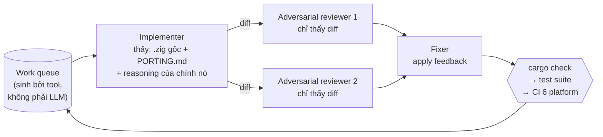

Tui đọc [bài blog Bun viết lại bằng Rust](https://bun.com/blog/bun-in-rust) và phản ứng đầu tiên là không tin. Sáu ngàn rưỡi commit trong mười một ngày. Một triệu dòng diff. Bảy trăm năm chục ngàn dòng Rust. Và Anthropic thì vừa mua Bun hồi tháng 12/2025.

Giả thuyết của tui lúc đó gọn lắm: một con Claude Code, kể cả bản Max 20x, không cách nào đẻ ra được đống đó. Vậy chắc chắn nội bộ Anthropic phải có một thứ gì khác — một con "Claude VIP PRO" không bán cho ai, hoặc một cái harness bí mật. Người ngoài nhìn vô rồi tưởng mình cũng làm được, thiệt ra là đang so với một sân chơi khác.

Tui bỏ một buổi đi kiểm chứng cái nghi ngờ đó. Kết quả: **vế đầu của tui đúng, vế sau sai**. Và chỗ tui sai mới là chỗ đáng học.

---

## Tóm tắt nhanh (TL;DR)

- Đúng: một instance Claude không tài nào làm nổi. Con số token tự chứng minh điều đó.
- Sai: từ đó suy ra "phải có tool bí mật". Cái harness họ xài là **dynamic workflows** — feature đã GA công khai, Pro bật trong `/config` là có.
- Cái làm nên chuyện không phải model, mà là **một oracle cơ học sẵn có**: test suite viết bằng TypeScript, ~1.39 triệu `expect()`, độc lập với ngôn ngữ runtime.
- Đơn vị làm việc là **cell 4 vai**: 1 implementer + 2 adversarial reviewer + 1 fixer. Hai reviewer không thấy nhau, và **không con nào cần đúng** — chỉ cần sai khác kiểu nhau.
- Phần điều phối (routing, queue, gom kết quả) nằm trong **code JavaScript**, đốt 0 token model. Agent chỉ làm phần cần phán đoán.
- Vẫn lọt 19 regression. Oracle mạnh cỡ nào cũng có tầng mù.

---

## 1. Giả thuyết của tui, và con số làm nó sụp

Trước hết chốt lại số liệu cho đúng — tui quote lộn ngay từ đầu, tưởng "7k commit":

| Chỉ số           | Giá trị                                                            |
| ---------------- | ------------------------------------------------------------------ |
| Thời gian        | 11 ngày, từ commit đầu tới merge (~3–14/5/2026)                    |
| Commits          | 6,502 (không tính merge); 6,778 tổng                               |
| Diff             | +1,009,272 dòng; ~750,000 dòng Rust                                |
| File nguồn       | 1,448 file `.zig`                                                  |
| Concurrency đỉnh | 4 workflow × 16 Claude ≈ **64 Claude cùng lúc**; ~50 workflow tổng |
| Throughput đỉnh  | 1,300 dòng/phút; 695 commit/giờ                                    |
| Token            | 5.9 tỷ uncached input; 690 triệu output; 72 tỷ cached input read   |
| Chi phí          | ~**$165,000** theo giá API                                         |
| Test suite       | ~1.39 triệu `expect()`, viết bằng TypeScript                       |
| Kết quả          | 99.8% test pass                                                    |
| Model            | Bản pre-release **Claude Fable 5** (Mythos-class)                  |
| Hạ tầng          | Một con EC2 (Jarred quên tăng IOPS)                                |

Giờ làm cái sanity check mà đáng lẽ tui phải làm trước khi đi nghi ngờ người ta.

**690 triệu output token, chia cho 11 ngày**, là 726 token/giây, liên tục, 24/7, không nghỉ. Không một instance nào sustain nổi cái đó. Tới đây tui vẫn đúng.

Nhưng **chia cho 64**, ra ~11 token/giây mỗi con. Đó là tốc độ sinh chữ của một con Claude bình thường đang làm việc bình thường.

Con số token không chứng minh có model bí mật. Nó chứng minh có **song song**.

Thử luôn mấy chỉ số kia:

- 6,502 commit / 11 ngày / 64 agent ≈ **9 commit/agent/ngày**.
- Peak 695 commit/giờ / 64 ≈ 11 commit/agent/giờ — một commit mỗi 5 phút rưỡi. Mà Jarred đặt rule: không `git stash`, không `git reset`, **commit từng file một**. Commit nguyên tử, cực nhỏ. Năm phút rưỡi một cái là chuyện thường.
- Peak 1,300 dòng/phút / 64 ≈ **20 dòng/phút/agent** — cho một bài _dịch máy móc_ 1-1 từ Zig sang Rust theo tài liệu có sẵn, không phải thiết kế mới.

Chia cho 64, mọi con số siêu nhiên đều trở về mức tầm thường. Đó là toàn bộ trò ảo thuật.

## 2. Vậy "Claude VIP PRO" có thật không?

Có — nhưng nó không phải kiến trúc bí mật. Cái "VIP" gồm bốn thứ, và không thứ nào là công nghệ giấu trong tủ:

**Model pre-release.** Rewrite chạy đầu tháng 5/2026, lúc đó Fable 5 chưa public. Lợi thế insider, thật, khỏi cãi.

**Feature đi trước public ba tuần.** Dynamic workflows launch công khai [ngày 28/5/2026](https://www.infoq.com/news/2026/06/dynamic-workflows-claude-code/) — tức Jarred xài trước cả tháng. _Chỗ này tui suy đoán, blog không nói_: vụ Bun gần như chắc chắn vừa là use case thật vừa là bài stress test cho feature trước khi ship. Câu của Jarred trong bài hậu thuẫn cho cách đọc đó: _"Claude Code's dynamic workflows kept 64 Claudes running for 11 days (I would've had to write my own harness to pull this off otherwise)."_

**Tiền.** $165k cho 11 ngày là ~$15k/ngày tiền API. Max 20x là $200 một **tháng**. Nên xét về subscription thì tui đúng tuyệt đối — gói của mọi người không mua nổi cái này. Nhưng đây là rào cản **tiền**, không phải rào cản **công nghệ**. Fable 5 giờ đã GA. Công ty nào chịu đốt $165k qua API thì về nguyên tắc tái hiện được.

**Người.** Jarred là tác giả gốc của Bun. Ổng ngồi canh 11 ngày. Và khi thấy failure pattern, ổng **sửa cái process sinh ra code, chớ không sửa tay code**.

Cái quan trọng nhất: **harness không bí mật**. Dynamic workflows [đã GA](https://code.claude.com/docs/en/workflows) trên CLI, Desktop, VS Code, cho Pro / Max / Team / Enterprise và cả API. Trên Pro chỉ cần bật trong `/config`. Anthropic còn lấy chính vụ Bun ra làm case study công khai.

Tui đi tìm cái tủ khóa, mở ra thì thấy nó không khóa.

## 3. Thứ thật sự làm nên chuyện: một cái oracle sẵn có

Nếu phải chỉ đúng **một** thứ quyết định thành bại, tui không chỉ vô model, cũng không chỉ vô orchestration. Tui chỉ vô đây:

> Test suite của Bun viết bằng **TypeScript**, nên nó độc lập với ngôn ngữ của runtime. Khoảng **1.39 triệu** lời gọi `expect()`.

Ngẫm kỹ đi. Bạn viết lại runtime từ Zig sang Rust, nhưng bộ test _không đổi một dòng_, vì nó test **hành vi** của runtime qua JavaScript, chớ không test nội tại. Nó là một cái máy chấm bài có sẵn, không thiên vị, chạy được vô hạn lần, và không phải LLM.

Đó là lý do 64 con Claude chạy được **không cần người canh**. Mỗi phase đều có một trọng tài cơ học:

- `cargo check` — đúng cú pháp, đúng type chưa?
- test suite — hành vi còn khớp không?
- CI trên 6 platform — chỗ khác có gãy không?

Không có chỗ nào LLM tự chấm bài LLM.

Và đây là chỗ tui nghĩ nhiều người sẽ đọc bài blog kia rồi rút ra bài học sai. Bài học **không phải** "quăng 64 agent vô là xong". Bài học là: **agent chạy unattended được đúng bằng chất lượng của cái oracle chấm nó**. Codebase không có oracle kiểu này mà copy nguyên workflow về thì sẽ được một triệu dòng code nhìn rất plausible và không ai dám merge.

Trước khi hỏi "làm sao xài 64 agent", hỏi "cái gì chấm bài tụi nó" trước.

## 4. Hai tài liệu đóng băng trí khôn

Có một bài toán mà stateless agent không thể tự giải: **lifetime**.

Zig không có lifetime trong type system. Rust thì borrow checker bắt buộc phải khai báo. Muốn biết field `foo: *TCPSocket` cần lifetime gì, phải trace toàn bộ control flow của một codebase 535k dòng. Một con agent đang dịch _một_ file không có cửa trả lời câu đó — nó chỉ có context local, mà câu hỏi thì global.

Nên họ tính trước, một lần, cho toàn cục, rồi serialize ra file:

- **`PORTING.md`** — sinh từ ~3 tiếng Jarred nói chuyện với Claude về cách map pattern Zig→Rust (`defer` map sang gì, arena allocator map sang gì, error union map sang gì), rồi Claude serialize thành tài liệu.
- **`LIFETIMES.tsv`** — bảng tra lifetime cho **từng struct field** trong cả codebase. Sinh bởi một dynamic workflow riêng: đọc mọi field, trace control flow, đề xuất lifetime, cho 2 adversarial reviewer soi chính cái lifetime đó, apply feedback, xuất ra TSV.

Cả hai file còn bị đem đi review chéo một vòng nữa để tìm chỗ mâu thuẫn, cộng với Jarred đọc tay.

Hai file này giải quyết cái vấn đề chết người của kiến trúc stateless: **1,448 file được dịch bởi hàng trăm agent, mỗi agent một context window trắng tinh**. Không có spec chung thì bạn nhận về 1,448 ý kiến khác nhau về cùng một pattern. `PORTING.md` biến "dịch cái này thế nào" từ **judgment call** thành **tra bảng**.

_Chỗ này blog không nói lý do, tui suy đoán:_ format `.tsv` được chọn vì nó greppable — agent lookup đúng một dòng thay vì đọc văn xuôi. Rẻ token, ít mơ hồ.

Cách gọi tên tui thích nhất cho hai file này: **trí khôn của phase planning bị đóng băng thành artifact** cho hàng trăm agent ngu ngu xài lại.

## 5. Cell 4 vai, và hai thằng reviewer không thấy mặt nhau

Đơn vị công việc không phải "một con agent". Nó là một **cell 4 vai**:



Luật cứng, nguyên văn Jarred: _"The implementer doesn't review. The reviewer doesn't implement."_

Và trong bài, ổng in thẳng cái vòng lặp ra dưới dạng pseudocode:

```js
let task;
while ((task = todoList.pop())) {
  const result = task();
  const feedback = await Promise.all([review(result), review(result)]);
  await apply(feedback, result);
}
```

Nhìn dòng `Promise.all([review(result), review(result)])`. Hai lượt review chạy **song song**, cùng một hàm `review()` gọi hai lần, **không con nào nhận output của con kia**. Sự cô lập nằm ngay trong cấu trúc code.

### Vì sao phải cô lập

Adversarial review ở đây nghĩa là: một con Claude trong **context window riêng biệt**, chỉ thấy **diff và không gì khác**, và được prime rằng **mặc định code này sai**, việc của mày là tìm cho ra vì sao.

Nó **không** được thấy reasoning của implementer. Cố ý. Jarred giải thích: _Claude viết code thì muốn code được merge; Claude review thì muốn tìm ra lỗi._ Giấu reasoning đi để reviewer khỏi bị "thuyết phục" bởi lời biện minh của thằng viết.

Ba con bug thật mà cách này bắt được — cả ba đều **compile sạch** và **nhìn rất hợp lý**:

1. `Box<uv::Pipe>` bị drop ở cuối match arm, trong khi `uv_close` async vẫn còn giữ raw pointer → use-after-free kèm double-free.
2. `trunc()` trên mtime âm (thời điểm trước 1970) đẻ ra nsec âm → timespec không hợp lệ. Phải dùng `floor()`.
3. `unwrap_or` evaluate eager, nên `second.percentage.unwrap()` panic ngay cả khi không cần tới nó. Phải xài `unwrap_or_else`.

Ba class bug khác nhau: async lifetime, ngữ nghĩa số học, thứ tự evaluation. Đó chính là dấu hiệu của cái mình muốn.

### Vì sao **hai** thằng, không phải một

Blog **không giải thích con số 2**. Phần dưới đây là tui suy đoán:

- **Toán recall.** Mỗi reviewer sót bug với xác suất `p`. Hai reviewer **độc lập** cùng sót là `p²`. Một con bắt được 70% thì hai con độc lập bắt ~91%. Khi merge một triệu dòng mà không ai đọc lại, recall là **tất cả**.
- **Kinh tế bất đối xứng.** Thêm một lượt review tốn vài cent. Một con use-after-free lọt vô runtime chạy trên hàng triệu máy là một cái CVE.
- **Vì sao không 5, không 10.** Diminishing returns. Reviewer thứ 3 trở đi overlap nhiều, bắt thêm rất ít, trong khi token và thời gian chờ tăng tuyến tính, và fixer thì phải hòa giải nhiều feedback mâu thuẫn hơn.

Cái quan trọng: chữ **độc lập** in đậm ở trên không phải trang trí. Cho hai reviewer chung context, hay cho thằng thứ hai đọc findings của thằng thứ nhất, là **phá hủy toàn bộ giá trị**:

- Mất tính độc lập thống kê — phép `p²` chỉ đúng khi hai lần thử độc lập.
- **Anchoring**: đọc thấy "reviewer 1 thấy vấn đề ở dòng 40" thì thằng 2 sẽ soi quanh dòng 40, và bỏ qua dòng 200.
- **Hùa theo**: model có xu hướng đồng thuận với ý kiến đã nằm sẵn trong context. Được "ừ tao cũng thấy vậy" thay vì một bug mới.
- Chung context = chung dòng suy luận = **chung điểm mù**. Lúc đó không phải hai reviewer, mà là một reviewer viết dài gấp đôi.

Hai gọng kìm phải khép lại từ hai phía độc lập. Hàn dính hai gọng vô nhau thì thành cái que.

### Và tụi nó **không cần đúng**

Đây là chỗ làm tui đổi cách nghĩ nhiều nhất.

Output của reviewer **không phải phán quyết**. Nó là **giả thuyết**. Reviewer không có quyền merge, không có quyền sửa. Nó chỉ sản xuất claim, rồi claim đó đi qua một chuỗi trọng tài:

```
reviewer claim → fixer (claim này có đáng sửa không?)
               → cargo check (sửa xong còn compile không?)
               → 1.39M assertion (hành vi còn đúng không?)
               → CI 6 platform
```

Giờ tính chi phí hai loại sai:

- **False positive** (tố một con bug không tồn tại): fixer đọc thấy vô lý thì bỏ. Lỡ sửa theo mà sai thì compiler với test chặn lại. Giá: vài chục ngàn token, vài phút. **Rẻ.**
- **False negative** (sót bug thật): con bug đó nằm im trong một triệu dòng không ai đọc lại. Giá tiềm năng: **một CVE**.

Vậy cái prior "mặc định code sai" **không phải để reviewer đúng hơn**. Nó để reviewer **nghi ngờ nhiều hơn** — cố tình mua thật nhiều false positive rẻ tiền để giảm false negative đắt tiền. Phần lọc nhiễu thì đẩy xuống tầng oracle cơ học lo.

Nhưng có một cái bẫy: **đừng ép reviewer lúc nào cũng phải tìm ra cái gì đó.** Một con reviewer không có đường PASS hợp lệ sẽ Goodhart cái chỉ tiêu — hết bug thật thì nó bịa nitpick, tố mấy thứ vô hại cho đủ chỉ tiêu nghi ngờ. Kết quả là **alarm fatigue**: y hệt cái monitor Datadog kêu suốt ngày, tới lúc người ta tắt notification, thì bữa nó kêu thiệt không còn ai nghe.

Cách Jarred xử chất lượng claim không phải bằng niềm tin, mà bằng **decision rule**. Ví dụ nguyên văn: _nếu cần cả một đoạn comment dài để biện minh cho workaround, thì code sai — đi sửa code đi._ Ổng biến một judgment mơ hồ ("code này có smell không?") thành một tiêu chí gần-như-cơ-học, áp được nhất quán bởi hàng trăm agent.

Còn khi **hai reviewer mâu thuẫn nhau**? Cái đó không phải lỗi hệ thống — nó là **tín hiệu định tuyến**:

- Hai con cùng tố một chỗ → confidence cao, fixer xử liền.
- Một con tố, một con im → giả thuyết, để fixer cân nhắc.
- Hai con tố ngược chiều nhau → escalate lên tầng nhiều context hơn (một vòng reconcile, hoặc con người).

Sự đồng thuận giữa các mẫu độc lập chính là một phép **đo confidence** — rẻ hơn nhiều so với bắt từng claim phải kèm chứng minh hình thức.

Sức mạnh của cặp adversarial reviewer không nằm ở chỗ tụi nó **biết** nhiều hơn implementer — cùng một model mà, biết gì hơn. Nó nằm ở chỗ hệ thống **cấu trúc hóa sự nghi ngờ thành hai lần thử độc lập, rồi để thực tại phân xử**.

Không con nào cần đúng. Chỉ cần tụi nó **sai khác kiểu nhau**.

## 6. Điều phối nằm trong code, không nằm trong LLM

Đây là chỗ tui thấy nhiều người — gồm cả tui — hiểu ngược.

Kiến trúc vụ Bun **không phải** một con orchestrator agent thông minh chỉ huy 63 con lính. Nó là **workflow-as-code**: một chương trình JavaScript do Claude viết cho task cụ thể đó, runtime chạy nền. Script giữ loop, giữ branching, giữ kết quả trung gian. Coordination nằm trong **code**, và đốt **0 token model**.

Nhìn lại cái work queue mà xem — nó **không** do một agent thông minh nào lập kế hoạch ra. Nó là **output của compiler**: `cargo check` ghi ~16,000 error ra file, group theo crate, chia cho các Claude. Phase test cũng vậy: chạy 100 file test ngẫu nhiên, mỗi test fail thì lưu stacktrace ra file, rồi 1 implementer đề xuất fix, 2 reviewer soi, 1 fixer apply.

Queue sinh bởi **tool deterministic**. Agent chỉ **tiêu thụ** queue. Không có chỗ cho goal drift.

Vậy điều phối bằng agent thì bất lợi gì? Bốn cái:

1. **Context của orchestrator là bottleneck.** Nó vừa lập kế hoạch vừa nhận báo cáo. Chạy càng lâu, context càng đầy. Anthropic có tên cho hiện tượng này: **agentic laziness** — làm 35/50 item rồi tuyên bố xong. Không phải model dốt, mà là working memory đầy, mất dấu, rồi tự hợp lý hóa cái điểm dừng. Một vòng `for` trong JS thì **không bao giờ quên item thứ 1,337**.
2. **Token cost tuyến tính theo số quyết định điều phối.** Orchestrator agent: mỗi lần route, mỗi lần gom kết quả, mỗi lần dedupe là một model turn, trả tiền. Vòng `for` trong JS: 0 token.
3. **Non-determinism ở chỗ không cần phán đoán.** Chuyện "error này thuộc crate nào → quăng vô worktree nào" là deterministic 100%. Giao cho LLM làm việc deterministic là **mua rủi ro mà không mua được giá trị**.
4. **Reproducibility và resume.** Workflow là script — đọc được, chạy lại được, đứt giữa chừng thì resume từ chỗ dừng. Còn "kế hoạch" của một orchestrator agent là một cái chat transcript. Không chạy lại y hệt được.

Nhưng đừng vội quăng hết agent đi. **Hai mô hình giải hai bài toán khác nhau:**

|                          | Workflow-as-code thắng                       | Agent coordination thắng             |
| ------------------------ | -------------------------------------------- | ------------------------------------ |
| Hình dạng task           | Biết trước, lặp lại, đồng dạng               | Chưa biết trước, đổi liên tục        |
| Chấm điểm                | Có oracle cơ học                             | Cần judgment giữa chừng              |
| Ví dụ trong chính vụ Bun | Dịch 1,448 file, queue do `cargo check` sinh | 3 tiếng đối thoại đẻ ra `PORTING.md` |

Để ý cái cột phải: **nó cũng nằm trong vụ Bun**. Phase sinh `PORTING.md` đúng là một phiên đối thoại có tích lũy, cần người, cần adapt — không script hóa được. Nhưng khi phase đó kết thúc, sản phẩm của nó là một **file**. Trí khôn đóng băng lại thành artifact, rồi hàng trăm agent stateless đem ra tra.

Persistent như một **phase**, không phải như một **daemon**.

Và nếu phải chỉ ra ai là "orchestrator" thật của dự án này thì đó là **Jarred**. Ổng ngồi 11 ngày, giữ vision, quyết process. Nhưng ổng **không** route 16,000 error cho 64 con Claude — **script làm**. Ổng chỉ can thiệp ở meta-level: thấy failure pattern thì đi sửa workflow prompt.

Quyền lực tối cao. Zero coordination mechanics.

## 7. Mười chín cái regression, và giới hạn của oracle

Ở mục 3 tui nói cái oracle 1.39 triệu assertion là thứ quyết định thành bại. Giờ tui phải tự hiệu chỉnh cách nói đó, vì bài blog ghi rõ:

> Bản rewrite này đẻ ra **19 regression đã biết**, tất cả đều đã được sửa.

Mười chín con bug lọt qua: 1.39 triệu assertion, **cộng với** 2 adversarial reviewer trên từng file, **cộng với** CI 6 platform. Vậy tụi nó thuộc loại gì?

Nhìn mấy ví dụ được kể ra thì thấy một pattern rất rõ — chúng đều là **khác biệt ngữ nghĩa giữa hai ngôn ngữ**:

- **Side effect trong `debug_assert!`.** Zig `assert` là một _function_. Rust `debug_assert!` là một _macro_ — release build xóa luôn cả biểu thức bên trong. Nên `insert_stale()` không bao giờ được gọi, và React fast refresh (HMR) vỡ.
- **Slice độ dài lẻ.** `Blob.text()` trên UTF-16 có byte lẻ ở cuối thì panic (hành vi của bytemuck khác), thay vì bỏ qua như bản cũ.
- **`comptime` format string.** Rust không có tương đương, phải chuyển sang `macro_rules!`. Cái marker màu `<r>` làm hỏng escape sequence OSC 8 hyperlink trong `bun update -i`.

Đây đúng là lớp bug mà **một test suite viết ở tầng hành vi TypeScript không nhìn thấy được**. Test suite hỏi "gọi hàm này thì trả về gì?" Nó không hỏi "macro có bị xóa khỏi release build không?"

Bài học tui rút: **oracle mạnh cỡ nào cũng có một tầng ngữ nghĩa nằm ngoài tầm với của nó.** Nên kế hoạch phải có lớp đỡ **sau** merge. Đừng coi merge là hết.

Và Jarred cũng không coi merge là hết:

- **11 vòng security review**, findings đã xử lý.
- **Coverage-guided fuzzing 24/7 cho mọi parser** — đã chạy khoảng **100 tỷ** lần.
- **Miri trong CI**, LeakSanitizer, borrow checker như công cụ dài hạn. Code `unsafe` chiếm ~4% (~13,000 keyword trên ~780k dòng), đang refactor giảm tiếp.
- Merge xong ổng **chưa release ngay**. Nguyên văn: _confidence in rewrite existed but not release confidence._

Kết quả đo được sau đó, cho ai tò mò cái rewrite này rốt cuộc đổi lấy được gì:

- **Memory**: chạy `Bun.build()` 2,000 lần: 6,745 MB → **609 MB**.
- **Binary**: Windows 94 → 76 MB; Linux 88 → 70 MB.
- **Performance**: `Bun.serve` 169.6k → 177.7k req/s (+4.8%); Next.js build +4.5%.
- **Production**: Claude Code từ v2.1.181 chạy trên Bun bản Rust; startup Linux 517ms → 464ms.

Và cái mốc quy đổi cho con số $165k, nguyên văn Jarred: _làm tay thì tui nghĩ nó tốn 3 kỹ sư nắm rõ codebase khoảng một năm._

## 8. Tui mang gì về

Tui đi vô bài này để tìm một cái tool bí mật. Không có cái tool nào hết. Cái tui tìm được thì hữu ích hơn nhiều:

**Trước khi hỏi "làm sao xài 64 agent", hỏi "cái gì chấm bài tụi nó".** Không có oracle cơ học thì song song hóa chỉ là cách đốt tiền nhanh hơn để sinh ra code không ai dám merge.

**Cái gì deterministic thì đẩy xuống code.** Routing, queue, barrier, gom kết quả — mấy cái đó là vòng `for`, không phải judgment. Giao cho LLM là mua non-determinism với giá token.

**Reviewer là máy sinh giả thuyết, không phải quan tòa.** Đừng đầu tư vô việc ép nó đúng. Đầu tư vô tầng phân xử (fixer + test + CI) để **cái sai của nó rẻ đi**. Và nhớ chừa cho nó một **đường PASS danh dự** — bắt nó lúc nào cũng phải tìm ra lỗi thì bạn đang nuôi một con sói kêu càn.

**Độc lập quan trọng hơn số lượng.** Hai reviewer chung context không bằng một reviewer. Merge findings ở tầng trên, đừng để tụi nó "thảo luận".

**Khi có gì sai, sửa cái process sinh ra code, đừng sửa tay code.** Đây là câu tui phải dán lên tường. Ở scale này, sửa tay một file là sửa một file. Sửa cái prompt là sửa một ngàn file.

Còn cái vế tui đúng — "một con Claude không làm nổi" — hóa ra lại là cái vế ít giá trị nhất. Ai chẳng biết một người không xây nổi cái cầu. Câu hỏi hay không phải "một con có làm nổi không", mà là **"cái gì cho phép sáu mươi bốn con làm việc mà không cần ai canh"**.

Câu trả lời là một triệu ba trăm chín mươi ngàn cái `expect()`.
