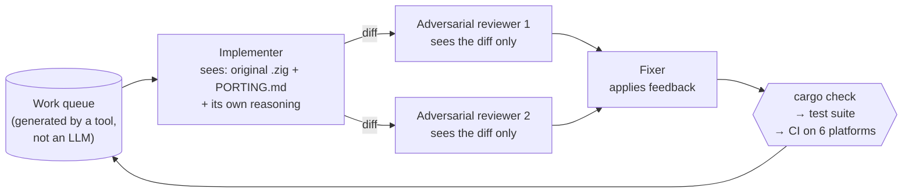

I read [Bun's post about rewriting itself in Rust](https://bun.com/blog/bun-in-rust) and my first reaction was disbelief. Sixty-five hundred commits in eleven days. A million-line diff. Three quarters of a million lines of Rust. And Anthropic had just acquired Bun back in December 2025.

My hypothesis was simple: one Claude Code instance, even on Max 20x, cannot possibly produce that. So Anthropic must have something else internally — a "Claude VIP PRO" they don't sell, or a secret harness. Everyone else reads the post, thinks they can do the same, and is quietly comparing themselves against a different playing field.

I spent a session trying to verify that suspicion. The result: **my premise was right and my conclusion was wrong.** The part where I was wrong turned out to be the part worth learning.

---

## TL;DR

- Right: a single Claude instance could never do this. The token numbers prove it.
- Wrong: concluding there must be a secret tool. The harness was **dynamic workflows** — a publicly GA feature you can turn on in `/config` on a Pro plan.
- The thing that actually made it work wasn't the model. It was **a pre-existing mechanical oracle**: a test suite written in TypeScript, ~1.39 million `expect()` calls, independent of the runtime's language.
- The unit of work was a **four-role cell**: 1 implementer + 2 adversarial reviewers + 1 fixer. The two reviewers never see each other, and **neither one needs to be right** — they just need to be wrong differently.
- Coordination (routing, queues, collecting results) lives in **JavaScript**, burning zero model tokens. Agents only do the parts that need judgment.
- It still shipped 19 regressions. However strong your oracle is, it has a blind layer.

---

## 1. My hypothesis, and the number that killed it

First, the actual figures — I'd been quoting them wrong, saying "7k commits":

| Metric | Value |
| --- | --- |
| Duration | 11 days, first commit to merge (~May 3–14, 2026) |
| Commits | 6,502 (excluding merges); 6,778 total |
| Diff | +1,009,272 lines; ~750,000 lines of Rust |
| Source files | 1,448 `.zig` files |
| Peak concurrency | 4 workflows × 16 Claudes ≈ **64 Claudes at once**; ~50 workflows total |
| Peak throughput | 1,300 LOC/min; 695 commits/hour |
| Tokens | 5.9B uncached input; 690M output; 72B cached input reads |
| Cost | ~**$165,000** at API pricing |
| Test suite | ~1.39M `expect()` calls, written in TypeScript |
| Result | 99.8% of the test suite passing |
| Model | Pre-release **Claude Fable 5** (Mythos-class) |
| Infrastructure | One EC2 instance (Jarred forgot to raise the IOPS) |

Now here's the sanity check I should have run *before* accusing anyone of hiding anything.

**690 million output tokens, over 11 days**, is 726 tokens/second, sustained, 24/7, without a break. No single instance sustains that. So far, so good — I was right.

But **divide by 64** and you get ~11 tokens/second per agent. That is just... a normal Claude, generating text at a normal rate, doing normal work.

The token count doesn't prove there's a secret model. It proves there's **parallelism**.

The other numbers collapse the same way:

- 6,502 commits / 11 days / 64 agents ≈ **9 commits per agent per day.**
- Peak 695 commits/hour / 64 ≈ 11 per agent per hour — one commit every 5½ minutes. And Jarred's rules were: no `git stash`, no `git reset`, **commit one file at a time**. Tiny atomic commits. One every five minutes is unremarkable.
- Peak 1,300 LOC/min / 64 ≈ **20 lines per minute per agent** — for a *mechanical* 1:1 Zig→Rust translation against an existing guide, not novel design.

Divide by 64 and every superhuman number lands back in the ordinary. That's the whole trick.

## 2. So is there a "Claude VIP PRO"?

Yes — but it isn't a secret architecture. The "VIP" part is four things, and none of them is technology hidden in a vault:

**A pre-release model.** The rewrite ran in early May 2026, when Fable 5 wasn't public yet. That's a genuine insider advantage.

**A feature three weeks before public.** Dynamic workflows [launched publicly on May 28, 2026](https://www.infoq.com/news/2026/06/dynamic-workflows-claude-code/) — so Jarred was using them well before anyone else could. *This next part is my inference, not something the blog states:* the Bun rewrite was almost certainly both a real use case and a dogfooding stress test for the feature before it shipped. Jarred's own line supports that reading: *"Claude Code's dynamic workflows kept 64 Claudes running for 11 days (I would've had to write my own harness to pull this off otherwise)."*

**Money.** $165k over 11 days is ~$15k/day in API spend. Max 20x is $200 a **month**. So in subscription terms I was completely right — your plan cannot buy this. But that's a **money** barrier, not a **technology** barrier. Fable 5 is GA now. Any company willing to burn $165k through the API could, in principle, reproduce this.

**A person.** Jarred wrote Bun. He watched it for eleven days. And when he saw a failure pattern, he **fixed the process that generated the code instead of hand-fixing the code**.

The crucial part: **the harness was never secret.** Dynamic workflows are [generally available](https://code.claude.com/docs/en/workflows) on the CLI, Desktop, and VS Code, for Pro, Max, Team, Enterprise, and the API. On Pro you just enable them in `/config`. Anthropic even uses the Bun rewrite as a public case study.

I went looking for a locked cabinet and found it unlocked.

## 3. The thing that actually made it work: a ready-made oracle

If I had to name **one** thing that decided success or failure here, I wouldn't point at the model, and I wouldn't point at the orchestration. I'd point here:

> Bun's test suite is written in **TypeScript**, so it's independent of the runtime's implementation language. Roughly **1.39 million** `expect()` calls.

Sit with that. You are rewriting a runtime from Zig to Rust, and the test suite doesn't change *a single line*, because it tests the runtime's **behavior** through JavaScript rather than its internals. It's a grading machine you already own: impartial, infinitely re-runnable, and not an LLM.

That's why 64 Claudes could run **unattended**. Every phase had a mechanical judge:

- `cargo check` — does it even type-check?
- the test suite — does it still behave correctly?
- CI on 6 platforms — did it break somewhere else?

At no point is an LLM grading an LLM.

And this is where I think a lot of people will read that blog post and take away the wrong lesson. The lesson is **not** "throw 64 agents at it." The lesson is: **agents can run unattended exactly to the degree that something mechanical can grade them.** Copy this workflow onto a codebase without that kind of oracle and you'll get a million lines of extremely plausible code that nobody dares merge.

Before asking "how do I run 64 agents," ask "what grades them."

## 4. Two documents that froze the smart part

There's one problem a stateless agent fundamentally cannot solve: **lifetimes.**

Zig has no lifetimes in its type system. Rust's borrow checker demands them. To know what lifetime `foo: *TCPSocket` needs, you have to trace control flow across a 535k-line codebase. An agent porting *one file* has no shot at that — its context is local and the question is global.

So they computed it once, globally, up front, and serialized it to disk:

- **`PORTING.md`** — produced from ~3 hours of Jarred talking with Claude about how to map Zig patterns to Rust (what does `defer` become, what does an arena allocator become, what does an error union become), which Claude then serialized into a document.
- **`LIFETIMES.tsv`** — a lookup table of the lifetime for **every struct field** in the codebase. Generated by its own dynamic workflow: read every field, trace control flow, propose a lifetime, have 2 adversarial reviewers attack that lifetime, apply the feedback, emit TSV.

Both files then went through a cross-review pass to find contradictory suggestions, plus Jarred reading them by hand.

These two files solve the fatal problem of a stateless architecture: **1,448 files are being translated by hundreds of agents, each with a blank context window.** Without a shared spec you get 1,448 different opinions about the same pattern. `PORTING.md` turns "how do I translate this" from a **judgment call** into a **table lookup**.

*The blog doesn't say why, so this is my guess:* `.tsv` was chosen because it's greppable — an agent looks up one row instead of reading prose. Cheap in tokens, low in ambiguity.

My favorite way to describe these two files: **the planning phase's intelligence, frozen into an artifact** that hundreds of dumb stateless agents can reuse.

## 5. A four-role cell, and two reviewers who never meet

The unit of work isn't "an agent." It's a **four-role cell**:



The rule, in Jarred's words: *"The implementer doesn't review. The reviewer doesn't implement."*

And he printed the loop itself, as pseudocode, right in the post:

```js
let task;
while ((task = todoList.pop())) {
  const result = task();
  const feedback = await Promise.all([review(result), review(result)]);
  await apply(feedback, result);
}
```

Look at `Promise.all([review(result), review(result)])`. Two reviews running **in parallel**, the same `review()` function called twice, and **neither receives the other's output**. The isolation is structural — it's in the code.

### Why the isolation matters

Adversarial review here means: a Claude in a **separate context window**, seeing **the diff and nothing else**, primed with the belief that **this code is wrong by default** and its job is to find out why.

It does **not** see the implementer's reasoning. Deliberately. Jarred's explanation: a Claude that wrote the code wants the code merged; a Claude reviewing it wants to find the bug. Hiding the reasoning keeps the reviewer from being *talked out of* a finding by the author's own justification.

Three real bugs this caught — all of which **compiled cleanly** and **looked entirely reasonable**:

1. A `Box<uv::Pipe>` dropped at the end of a match arm while the async `uv_close` still held a raw pointer to it → use-after-free plus double-free.
2. `trunc()` on a negative mtime (a timestamp before 1970) produced a negative nsec → an invalid timespec. It needed `floor()`.
3. `unwrap_or` evaluates eagerly, so `second.percentage.unwrap()` panicked even when the value was never needed. It needed `unwrap_or_else`.

Three different classes: async lifetime, numeric semantics, evaluation order. That spread is exactly the signal you want.

### Why **two**, and not one

The blog **doesn't explain the number 2**. What follows is my inference:

- **Recall math.** Each reviewer misses a bug with probability `p`. Two **independent** reviewers both miss it with probability `p²`. A reviewer that catches 70% becomes ~91% when you run two independently. When you're merging a million lines nobody will re-read, recall is *everything*.
- **Asymmetric economics.** One more review pass costs a few cents. One use-after-free reaching a runtime installed on millions of machines is a CVE.
- **Why not 5, or 10.** Diminishing returns. The third reviewer onward overlaps heavily and adds few new findings, while tokens and latency grow linearly and the fixer has to reconcile more contradictory feedback.

That word **independent** is doing real work. Sharing a context between the two reviewers — or letting the second one read the first one's findings — destroys the entire value:

- You lose statistical independence, and the `p²` math only holds for independent trials.
- **Anchoring**: reviewer 2 reads "reviewer 1 flagged line 40," scrutinizes line 40, and never looks at line 200.
- **Conformity**: models tend to agree with opinions already present in their context. You get "yes, I see it too" instead of a new bug.
- Shared context = shared chain of reasoning = **shared blind spot**. At that point you don't have two reviewers; you have one reviewer writing twice as much.

A pincer has to close from two independent sides. Weld the two arms together and you've just built a stick.

### And they don't need to be right

This is the part that changed how I think.

A reviewer's output is **not a verdict**. It's a **hypothesis**. Reviewers can't merge and can't edit. They only emit claims, and those claims run a gauntlet of judges:

```
reviewer claim → fixer (is this claim worth acting on?)
               → cargo check (does the fix still compile?)
               → 1.39M assertions (does the behavior still hold?)
               → CI on 6 platforms
```

Now price the two kinds of error:

- **False positive** (flagging a bug that isn't there): the fixer reads it, finds it absurd, drops it. If it gets applied and it's wrong, the compiler and tests catch it. Cost: a few tens of thousands of tokens and a few minutes. **Cheap.**
- **False negative** (missing a real bug): that bug now sits inside a million lines nobody will re-read. Potential cost: **a CVE**.

So the "assume the code is wrong" prior is **not there to make reviewers more correct**. It's there to make them more **suspicious** — deliberately buying lots of cheap false positives to reduce expensive false negatives. The noise filtering is pushed down to the mechanical oracle layer.

But there's a trap: **never force a reviewer to always find something.** A reviewer with no legitimate PASS available will Goodhart the metric — out of real bugs, it invents nitpicks and flags harmless things to fill its suspicion quota. The result is **alarm fatigue**: exactly like a Datadog monitor that screams every day until everyone mutes it, and then it screams for real and nobody is listening.

Jarred handled claim quality with a **decision rule** rather than with faith. Verbatim: *if you need a long comment to justify a workaround, the code is wrong — go fix the code.* He converted a fuzzy judgment ("does this smell?") into a near-mechanical criterion that hundreds of agents can apply consistently.

And when **the two reviewers disagree**? That isn't a system failure — it's a **routing signal**:

- Both flag the same thing → high confidence, the fixer acts.
- One flags, one is silent → a hypothesis for the fixer to weigh.
- They flag in opposite directions → escalate to a layer with more context (a reconcile pass, or a human).

Agreement between independent samples *is* a confidence measure — and a far cheaper one than demanding a formal proof attached to every claim.

The power of an adversarial reviewer pair isn't that they **know** more than the implementer. Same model; they don't know anything more. It's that the system **structures doubt into two independent trials and then lets reality adjudicate**.

Neither one needs to be right. They just need to be **wrong in different ways**.

## 6. Coordination lives in the code, not in the LLM

This is where I — and I suspect plenty of others — had it backwards.

The Bun architecture is **not** a clever orchestrator agent commanding 63 subordinates. It's **workflow-as-code**: a JavaScript program, written by Claude for that specific task, executed by the runtime in the background. The script holds the loop, the branching, the intermediate results. Coordination lives in **code** and burns **zero model tokens**.

Look at the work queue. It wasn't planned by some intelligent agent. It was **the compiler's output**: `cargo check` dumped ~16,000 errors to a file, grouped by crate, and handed them out to the Claudes. The test phase worked the same way: run 100 random test files, write each failing test's stack trace to a file, then 1 implementer proposes a fix, 2 reviewers attack it, 1 fixer applies it.

The queue is produced by a **deterministic tool**. Agents only **consume** it. There's no room for goal drift.

So what's actually wrong with coordinating via an agent? Four things:

1. **The orchestrator's context is the bottleneck.** It plans *and* it receives every report. The longer it runs, the fuller it gets. Anthropic has a name for the failure: **agentic laziness** — it does 35 of 50 items and declares victory. Not because the model is dumb, but because working memory is full, it loses track, and it rationalizes a stopping point. A `for` loop in JavaScript **never forgets item 1,337**.
2. **Token cost scales with the number of coordination decisions.** With an orchestrator agent, every route, every collect, every dedupe is a model turn you pay for. A `for` loop costs zero.
3. **Non-determinism where no judgment is needed.** "Which crate does this error belong to → which worktree does it go to" is 100% deterministic. Handing deterministic work to an LLM buys you risk without buying you value.
4. **Reproducibility and resume.** A workflow is a script: readable, re-runnable, resumable from where it stopped. An orchestrator agent's "plan" is a chat transcript. You can't re-run it identically.

But don't throw agents out. **The two models solve two different problems:**

| | Workflow-as-code wins | Agent coordination wins |
| --- | --- | --- |
| Shape of the task | Known up front, repetitive, uniform | Unknown, shifting as you go |
| Grading | A mechanical oracle exists | Judgment needed mid-flight |
| Example, from Bun itself | Porting 1,448 files; queue from `cargo check` | The 3-hour conversation that produced `PORTING.md` |

Notice that right-hand column: **it's also in the Bun project.** The `PORTING.md` phase genuinely was an accumulating, human-in-the-loop, adaptive conversation. You cannot script it. But when that phase ended, its product was a **file**. The intelligence froze into an artifact, and hundreds of stateless agents then looked things up in it.

Persistent as a **phase**, not as a **daemon**.

And if you have to name the real orchestrator of this project, it's **Jarred**. He sat there for eleven days, held the vision, decided the process. But he did **not** route 16,000 errors to 64 Claudes — **the script did**. He only intervened at the meta level: spot a failure pattern, go edit the workflow prompt.

Ultimate authority. Zero coordination mechanics.

## 7. Nineteen regressions, and the limits of an oracle

In section 3 I called that 1.39M-assertion oracle the thing that decided success. Now I have to walk that back a little, because the blog says plainly:

> This rewrite introduced **19 known regressions**, each of which has been fixed.

Nineteen bugs got through 1.39 million assertions **plus** two adversarial reviewers per file **plus** CI on six platforms. So what kind of bugs were they?

The examples share an obvious pattern — they're all **semantic differences between the two languages**:

- **A side effect inside `debug_assert!`.** Zig's `assert` is a *function*. Rust's `debug_assert!` is a *macro* — release builds delete the expression inside it entirely. So `insert_stale()` was never called, and React fast refresh (HMR) broke.
- **Odd-length slices.** `Blob.text()` on UTF-16 with a trailing odd byte panicked (bytemuck behaves differently) instead of ignoring it.
- **`comptime` format strings.** Rust has no equivalent, so they became `macro_rules!` — and the `<r>` color marker corrupted the OSC 8 hyperlink escape sequence in `bun update -i`.

This is precisely the class of bug **a behavior-level TypeScript test suite cannot see.** The test suite asks "what does this function return?" It never asks "does this macro survive a release build?"

The lesson I take: **however strong your oracle, there's a semantic layer beyond its reach.** So the plan needs a safety net *after* the merge. Merging is not the finish line.

Jarred didn't treat it as one either:

- **11 rounds of security review**, findings addressed.
- **Coverage-guided fuzzing running 24/7 against every parser** — roughly **100 billion** executions so far.
- **Miri in CI**, LeakSanitizer, and the borrow checker as long-term tooling. `unsafe` is ~4% of the codebase (~13,000 keywords across ~780k lines), and they're refactoring it down.
- After merging, he **didn't release**. Verbatim: *confidence in the rewrite existed but not release confidence.*

For anyone wondering what the rewrite actually bought:

- **Memory**: 2,000 iterations of `Bun.build()`: 6,745 MB → **609 MB**.
- **Binary size**: Windows 94 → 76 MB; Linux 88 → 70 MB.
- **Performance**: `Bun.serve` 169.6k → 177.7k req/s (+4.8%); Next.js builds +4.5%.
- **In production**: Claude Code has shipped on Rust-based Bun since v2.1.181; Linux startup went 517ms → 464ms.

And the human-cost benchmark for that $165k, in Jarred's words: *by hand, I think this would've taken 3 engineers with full context on the codebase about a year.*

## 8. What I took away

I went into this looking for a secret tool. There isn't one. What I found instead is more useful:

**Before asking "how do I run 64 agents," ask "what grades them."** Without a mechanical oracle, parallelism is just a faster way to spend money generating code nobody dares merge.

**Push everything deterministic down into code.** Routing, queues, barriers, collecting results — those are `for` loops, not judgment calls. Handing them to an LLM buys non-determinism at the price of tokens.

**A reviewer is a hypothesis generator, not a judge.** Don't invest in making it correct. Invest in the adjudication layer (fixer + tests + CI) so that **being wrong is cheap**. And leave it an honorable **PASS** — demand that it always find something, and you're raising a boy who cries wolf.

**Independence beats headcount.** Two reviewers sharing a context are worth less than one. Merge findings a layer above; never let them "discuss."

**When something goes wrong, fix the process that generates the code, not the code.** At this scale, hand-fixing a file fixes a file. Fixing the prompt fixes a thousand.

As for the part I got right — "one Claude couldn't do this" — it turned out to be the least valuable part. Of course one person can't build the bridge. The good question was never "can one agent do it," it's **"what lets sixty-four of them work with nobody watching."**

The answer is one million three hundred and ninety thousand `expect()` calls.
