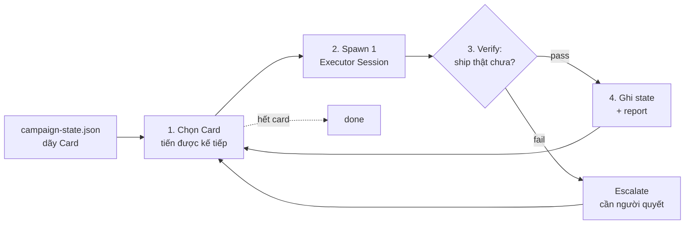
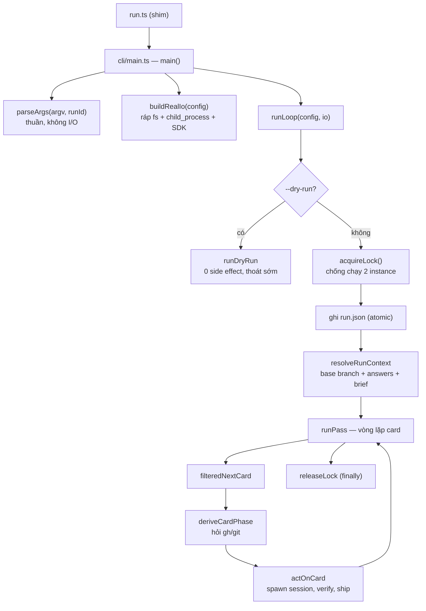
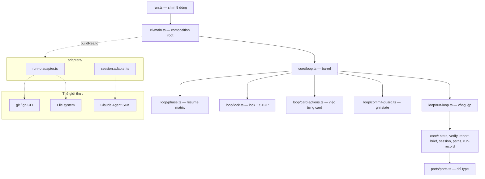

## Tóm tắt nhanh (TL;DR)

- **Campaign runner** là một script TypeScript điều phối việc "ship" từng hạng mục roadmap. Bản thân nó **không tốn token LLM nào** — chỉ các phiên Claude nó đẻ ra mới tốn.
- **Điểm đầu có hai lớp:** `run.ts` chỉ là shim 9 dòng; logic thật nằm ở `cli/main.ts`.
- **Kiến trúc 5 tầng một chiều:** kernel → ports → core → adapters → cli. Chiều import được kiểm bằng test, không phải bằng lời hứa.
- **`github.ts` đã bị xoá; `loop.ts` giờ chỉ là barrel re-export.** Nếu bạn đọc bài tháng 7 của tui thì phần bản đồ module trong đó đã cũ.
- **Debug bằng Bun cần adapter riêng** — Node debugger không attach được. Có sandbox `--dry-run` chạy offline hoàn toàn.

---

## 0. Bài này thay cho phần nào của bài cũ

Tháng 7 tui có viết một bài mổ xẻ bộ runner này, trong đó có sơ đồ "9 module chia 3 tầng" với `run.ts` là entrypoint kiêm chỗ ráp dependency, và một module tên `github.ts`. Kiểm lại hôm nay:

```bash
$ ls core/github.ts
ls: core/github.ts: No such file or directory

$ find . -name "*.ts" -not -name "*.test.ts" -not -path "./node_modules/*" | wc -l
19
```

Chín module thành mười chín, và `github.ts` không còn tồn tại. Bài này dựng lại bản đồ đúng với code hôm nay, rồi thêm phần bài cũ không có: **cách gắn debugger vô chạy thử**.

---

## 1. Nó là cái gì

Ba thuật ngữ, định nghĩa trước khi dùng:

- **Card (thẻ):** một đơn vị công việc — ví dụ "thêm feature X". Mỗi card có đường dẫn tới một _spec_ (mô tả cần gì) và một _plan_ (các bước làm), cộng với branch/PR của nó khi đã bắt đầu.
- **Campaign (chiến dịch):** một dãy card xếp theo thứ tự build, mô tả trong một file JSON tên `campaign-state.json`.
- **Executor session (phiên thực thi):** một tiến trình Claude Agent SDK được spawn ra để **thực sự** làm một card — viết code, commit, mở PR, merge.

Mô tả chính thức nằm ngay trong `package.json`:

```json
"description": "Stateless deterministic card-loop capability for the tribe plugin (Claude Agent SDK executor per staged roadmap card)."
```

Vòng lặp cốt lõi: **chọn card kế tiếp → spawn một session → verify bằng script (`gh`/`git`) → ghi state → lặp lại.**



Điểm đáng chú ý: **runner không tự tin vào lời khai của session.** Session nói "SHIPPED" chỉ là một tín hiệu; sự thật do `gh`/`git` trả lời. Nguyên tắc này được viết thẳng trong comment của `core/loop/phase.ts`:

```
/** … Never trusts `card.status` — every branch here is driven by a gh/git query or an fs
 * check, per the design's iron rule ("the file is data, gh/git is authority"). */
```

### "Stateless capability" nghĩa là gì

Cụm này nghe trừu tượng nên phải neo bằng code. Nó nghĩa là script **không hardcode giá trị môi trường nào** — repo nào, model nào, thư mục state ở đâu, tất cả đều là input qua dòng lệnh. Ba flag bắt buộc, và **cố ý không có giá trị mặc định**:

```typescript
const REQUIRED_FLAGS: Array<{
  flag: string;
  key: "repoRoot" | "model" | "homeDir";
}> = [
  { flag: "--repo", key: "repoRoot" },
  { flag: "--model", key: "model" },
  { flag: "--home", key: "homeDir" },
];
```

Thiếu một trong ba là lỗi cú pháp, không phải chỗ để đoán. Cùng một script đó chạy được cho bất kỳ repo hay campaign nào.

---

## 2. Điểm đầu — tại sao có tới hai file

Mở thư mục ra, thứ trông giống điểm đầu nhất là `run.ts`. Nó dài đúng 9 dòng:

```typescript
// run.ts — CLI contract shim. The real entrypoint is cli/main.ts; this file exists because
// external callers (orchestrate-campaign's resolve-runner.sh, test-fresh-machine.sh) prove
// the runner by this exact path: plugins/tribe/scripts/runner/run.ts.
import { main } from "./cli/main.ts";
export {
  main,
  parseArgs,
  type ParseArgsError,
  type ParseArgsResult,
} from "./cli/main.ts";

if (import.meta.main) {
  main();
}
```

**Shim** ở đây nghĩa là một lớp mỏng chỉ chuyển tiếp lời gọi, không chứa logic. Lý do nó tồn tại nằm ngay trong comment: hai script bên ngoài — một cái dò xem runner nằm ở đâu, một cái test trên máy mới tinh — đều khẳng định đường dẫn `scripts/runner/run.ts` phải có thật. Đường dẫn đó là **hợp đồng công khai**; logic thì được tự do dời chỗ.

Logic thật nằm ở `cli/main.ts`, và file này có một vai trò có tên riêng: **composition root** — điểm duy nhất trong chương trình được phép dựng các đối tượng chạm thế giới thực rồi tiêm chúng vào phần còn lại. Comment đầu file nói đúng điều đó:

```
// `parseArgs` is pure (no I/O) and fully unit-tested. `main()` below it is the COMPOSITION
// ROOT: the only module allowed to wire adapters — it builds the production `LoopIO` via
// `buildRealIo` … and hands it to `runLoop`.
```

Thân hàm `main()` gọn đúng như mô tả:

```typescript
export async function main(): Promise<void> {
  const runId = generateRunId(new Date().toISOString(), randomBytes(2).toString('hex'));
  const parsed = parseArgs(process.argv.slice(2), runId);
  if ('error' in parsed) {
    console.error(`campaign runner: ${parsed.error}`);
    process.exit(1);
    return;
  }

  const io = buildRealIo(parsed.config);   // ← ráp thế giới thực, đúng một lần
  // …
  result = await runLoop(parsed.config, io);
```

Hai chi tiết đáng học ở đây:

**Một — `parseArgs` trả về union thay vì `throw`.** Kiểu trả về là `ParseArgsResult | ParseArgsError`, caller phân biệt bằng `if ('error' in parsed)`. Không có exception nào bay lên, nên hàm này test được bằng cách gọi thẳng với một mảng chuỗi.

**Hai — flag lạ bị từ chối theo tên, không bị bỏ qua im lặng:**

```typescript
if (!KNOWN_FLAGS.has(token)) {
  return { error: `unknown flag: ${token}` };
}
```

Gõ sai `--max-card` thay vì `--max-cards` thì chương trình dừng và nói ra, chứ không lặng lẽ chạy với giá trị mặc định.

---

## 3. Luồng chạy đầy đủ



### 3.1 Vòng lặp trong: `runPass`

Đây là chỗ đáng đọc kỹ nhất. Nó đếm **hai thứ khác nhau** bằng hai biến, và việc gộp chúng lại từng là một bug thật:

```typescript
const attempted = new Set<string>();
let worked = 0;
const limit = resolved.maxCards ?? Infinity;
```

- `attempted` trả lời: _"card này đã được chọn trong lượt chạy này chưa?"_ — mọi card được chọn đều vào set, không điều kiện. Đây là thứ đảm bảo vòng lặp **chắc chắn dừng**: dãy card đưa cho hàm chọn co lại sau mỗi vòng, chặn trên là số card trong campaign.
- `worked` trả lời: _"đã tiêu bao nhiêu phần ngân sách `--max-cards` mà người vận hành cấp?"_ — chỉ tăng khi card **thật sự** có việc xảy ra.

Một card đang bị "park" vì escalation từ lượt chạy trước thì vào `attempted` nhưng **không** vào `worked` — vì lượt này nó không ghi gì, không quyết gì:

```typescript
if (phase.kind === "escalation_pending") {
  attempted.add(nc.cardId);
  processed.push({
    kind: "escalation_pending",
    cardId: nc.cardId,
    escalationPath: phase.escalationPath,
  });
  continue; // ← không tăng `worked`
}
```

**Escalation** ở đây nghĩa là runner gặp một câu hỏi nó không có quyền trả lời (ví dụ: đổi shape dữ liệu, thêm quyền mới) nên ghi ra file và để con người quyết.

### 3.2 Exit code — trộn nhiều kết quả thành một số

Một lượt chạy có thể vừa ship vài card, vừa escalate vài card, vừa có card chết giữa chừng. Thứ tự ưu tiên biến mớ đó thành một exit code:

```typescript
function computeExitCode(processed: CardOutcome[]): number {
  if (
    processed.some(
      o => o.kind === "escalated" || o.kind === "escalation_pending"
    )
  ) {
    return EXIT_ESCALATED;
  }
  if (processed.some(o => o.kind === "stopped")) {
    return EXIT_SESSION_INCOMPLETE;
  }
  return EXIT_OK;
}
```

Logic đằng sau: escalation **cần con người**, còn `stopped` chỉ là "chạy lại được, không cần ai phán". Nên escalation thắng.

Bảng đầy đủ (`core/types.ts`):

| Hằng số                   | Giá trị | Nghĩa                                                   |
| ------------------------- | ------- | ------------------------------------------------------- |
| `EXIT_OK`                 | 0       | mọi card đã thử đều ship, hoặc không có card nào để thử |
| `EXIT_LOCKED`             | 1       | có instance khác đang chạy                              |
| `EXIT_ESCALATED`          | 2       | có card cần người quyết                                 |
| `EXIT_SESSION_INCOMPLETE` | 3       | có session lỗi/timeout, chạy lại được                   |
| `EXIT_ERROR`              | 4       | exception không bắt được                                |

Và comment cạnh `EXIT_ERROR` nói rõ thứ tự tin cậy: _"the exit code is a hint, the report is the truth"_.

### 3.3 `deriveCardPhase` — phân loại thực tại

Hàm này quyết định phải làm gì với một card, và nó **không đọc `card.status` trong file**. Nhánh đầu tiên là nhánh rẻ nhất:

```typescript
if (!card.branch) {
  return { kind: "fresh" };
}

const pr = await queryPrForBranch(card.branch, config.repoRoot, io);
```

Card chưa có branch thì chắc chắn chưa ai đụng tới → `fresh`, **không tốn một lời gọi `gh`/`git` nào**. Có branch rồi mới đi hỏi GitHub: PR đã merge → chỉ cần verify; PR đang mở và có session id → resume; có branch mà không PR và không session id → xoá làm lại.

Cái nhánh `!card.branch` này chính là thứ làm cho sandbox debug ở phần 6 chạy được hoàn toàn offline.

---

## 4. Kiến trúc — pure core, impure edges

Ý niệm nền: **tách phần "quyết định" khỏi phần "chạm thế giới"**. Phần quyết định (tính toán, rẽ nhánh, biến đổi dữ liệu) phải _thuần_ — cùng input thì cùng output, lần chạy thứ 1 hay thứ 100 cũng vậy. Mọi thứ chạm ra ngoài — file, mạng, đồng hồ, process — chỉ được vào qua một **abstraction do người gọi cung cấp**.

Trong repo này abstraction đó có tên: **port**. `ports/ports.ts` chỉ chứa khai báo kiểu, không có một giá trị runtime nào:

```typescript
export interface ExecPort {
  exec(cmd: string[], opts?: { cwd?: string }): Promise<ExecResult>;
}
export interface ClockPort {
  now(): string;
}
export interface SessionSpawnPort {
  spawnSession(params: SpawnSessionParams): AsyncIterable<SessionMessage>;
}
```

Cài đặt thật của mấy port đó nằm ở `adapters/`. Ví dụ `exec` thật:

```typescript
function realExec(cmd: string[], opts?: { cwd?: string }): Promise<ExecResult> {
  return new Promise(resolve => {
    const child = spawn(cmd[0] as string, cmd.slice(1), { cwd: opts?.cwd });
    let stdout = "";
    child.stdout?.on("data", chunk => (stdout += chunk.toString()));
    child.on("close", code => resolve({ stdout, stderr, exitCode: code ?? 1 }));
    child.on("error", err =>
      resolve({ stdout, stderr: err.message, exitCode: 1 })
    );
  });
}
```

Chú ý: `child.on('error')` cũng `resolve` chứ không `reject` — mọi thất bại đều thành một `ExecResult` có `exitCode: 1`, để phần core chỉ phải xử lý một hình dạng dữ liệu.

Còn đây là toàn bộ file duy nhất được phép import Claude Agent SDK — 13 dòng:

```typescript
// session.adapter.ts — the runner's ONLY import of `@anthropic-ai/claude-agent-sdk`
import { query } from "@anthropic-ai/claude-agent-sdk";
import type { SessionMessage, SpawnSessionParams } from "../core/session.ts";

export function sdkSpawnSession(
  params: SpawnSessionParams
): AsyncIterable<SessionMessage> {
  return query({
    prompt: params.prompt,
    options: params.options,
  }) as unknown as AsyncIterable<SessionMessage>;
}
```

SDK nâng version thì sửa đúng file này, không đụng chỗ nào khác.

### Chiều import — và nó được kiểm bằng test

Năm tầng, một chiều:

| Tầng                                        | Được import gì                          |
| ------------------------------------------- | --------------------------------------- |
| kernel (`core/types.ts`)                    | không import gì local                   |
| ports (`ports/ports.ts`)                    | chỉ `core/types.ts`, và chỉ ở dạng type |
| core (mọi thứ trong `core/` trừ `types.ts`) | kernel, ports                           |
| adapters (`adapters/*.adapter.ts`)          | kernel, ports, core, adapter khác       |
| cli (`cli/main.ts`) và shim `run.ts`        | tất cả                                  |

Điểm mấu chốt: quy tắc này **không phải lời hứa trong docs** — có `structure.test.ts` đi đệ quy qua `core/`, `ports/`, `adapters/`, `cli/` và `run.ts` để kiểm. Chạy chung với type-check bằng `bun run check`.

```
$ bun test
 205 pass
 0 fail
 569 expect() calls
Ran 205 tests across 10 files. [363.00ms]
```

205 test trong 363 mili-giây — không cần repo thật, không cần mạng, không cần Claude. Đó chính là phần thưởng của việc giữ core thuần.

### Bản đồ module hôm nay



Một chi tiết dễ nhầm: `core/loop.ts` **không còn chứa logic**. Nó là barrel — file chỉ re-export lại thứ nằm chỗ khác:

```
// This module is a PURE re-export surface: the orchestrator's actual logic lives in
// `core/loop/` … This file exists so every external importer … keeps importing from
// `./loop.ts`/`../core/loop.ts` unchanged — the directory split under it is an
// implementation detail.
```

Tức là code cũ `import { runLoop } from './loop.ts'` vẫn chạy y nguyên sau khi tách thư mục. Đó là cách refactor mà không phá caller.

---

## 5. Ba quyết định thiết kế đáng mượn

**Fail closed — mặc định an toàn khi thiếu cấu hình.** Campaign khai báo `docsOnlyPaths`: những đường dẫn được coi là "chỉ tài liệu", dùng để miễn trừ khi CI đỏ vì flake. Nếu tác giả để rỗng:

> **Fails CLOSED: an empty list means nothing counts as docs-only, so a code diff never auto-waives a red check.**

Danh sách rỗng nghĩa là _không gì được miễn_, chứ không phải _mọi thứ được miễn_.

**Trailer trong commit thay cho một database.** Vì mọi state vận hành nằm ngoài repo, thứ duy nhất lưu vết lâu dài là chính lịch sử git. Mỗi session được dặn kết thúc commit bằng `Campaign: <slug>`, và cách phục hồi là một dòng lệnh:

```bash
git log --grep="Campaign: <campaign-slug>"
```

README nói thẳng giới hạn của nó: **"This is instructional, not enforced."** — runner dặn, chứ không kiểm.

**Ghi file kiểu atomic.** Ghi ra file tạm rồi đổi tên, nên người đọc không bao giờ thấy file viết dở:

```typescript
writeFileAtomic: (resolvedPath, content) => {
  const tmp = `${resolvedPath}.tmp-${process.pid}`;
  writeFileSync(tmp, content);
  renameSync(tmp, resolvedPath);
},
```

---

## 6. Tự debug — phần bài cũ không có

Runtime là **Bun** — một JavaScript runtime thay thế Node, ở đây là bản 1.3.13. Điều này đổi cách debug: Bun nói **WebKit inspector protocol**, còn debugger của Node nói **Chrome DevTools Protocol**. Hai giao thức khác nhau, nên debugger Node **không attach được**.

### 6.1 Cách không cần cài gì

```bash
bun --inspect-brk run.ts --repo "$(git rev-parse --show-toplevel)" \
    --model sonnet --home "$PWD/.debug/home" --dry-run
```

Nó in ra:

```
--------------------- Bun Inspector ---------------------
Listening:
  ws://127.0.0.1:6499/debug
--------------------- Bun Inspector ---------------------
Inspect in browser:
  https://debug.bun.sh/#127.0.0.1:6499/debug
```

Mở URL đó là có debugger đầy đủ trong trình duyệt. `--inspect-brk` nghĩa là dừng ngay dòng đầu tiên và chờ.

### 6.2 VS Code — và cái bẫy làm tui mất 20 phút

Cần extension `oven.bun-vscode` để có debug type `bun`. Cài xong tui bấm F5 thì **không có gì xảy ra**, Debug Console trống trơn, không thấy lỗi.

Nguyên nhân, tìm ra bằng cách so hai mốc thời gian:

```
extension host   PID 24955   khởi động  13:44:06
oven.bun-vscode  cài xong               13:49:32   ← muộn hơn 5 phút 26 giây
```

**Extension host** là tiến trình riêng mà VS Code dùng để chạy toàn bộ extension. Nó chỉ nạp phần đóng góp của một extension mới khi khởi động lại. Trong phần đóng góp đó có debug type `bun` — thứ mà mọi config launch đều khai:

```json
{ "type": "bun", "request": "launch", "program": "${workspaceFolder}/run.ts" }
```

Debug type chưa đăng ký thì VS Code chỉ nhả một toast nhỏ rồi tự tắt. Nhìn từ ghế người dùng, nó y hệt "bị nuốt lỗi".

**Cách sửa: `Cmd+Shift+P` → "Developer: Reload Window".** Muốn xem lỗi thật thì `Help → Toggle Developer Tools → Console`.

Cái bẫy thứ hai, rẻ hơn nhưng cũng mất thời gian: **VS Code chỉ đọc `launch.json` ở workspace root.** Thư mục runner hay được mở như một root riêng, nên cần hai bản `launch.json` — một ở gốc repo, một trong thư mục runner.

### 6.3 Sandbox chạy offline

Runner đòi một `--home`: thư mục chứa state vận hành của campaign, và nó **không tự tạo** file `campaign-state.json` — file đó phải có sẵn. Nên muốn debug thì phải dựng một cái giả. Card quan trọng trong đó:

```json
"C1": {
  "status": "staged",
  "spec": "plugins/tribe/README.md",
  "plan": "plugins/tribe/scripts/runner/README.md",
  "branch": null,
  "baseSha": null, "pr": null, "mergeSha": null,
  "sessionId": null, "updatedAt": null
}
```

`branch: null` là chỗ ăn tiền: nó rơi thẳng vào nhánh `if (!card.branch) return { kind: 'fresh' }` ở mục 3.3, nên **không có lời gọi `gh`/`git` nào**. Kết quả:

```bash
$ bun run.ts --repo <repo> --model sonnet --home "$PWD/.debug/home" --dry-run
{
  "cardId": "C1",
  "phase": { "kind": "fresh" }
}
```

Vì sao `--dry-run` an toàn tuyệt đối chứ không phải "chắc là an toàn"? Vì nó thoát ra **trước** khi lock được lấy:

```typescript
export async function runLoop(config: RunLoopConfig, io: LoopIO): Promise<LoopResult> {
  if (config.dryRun) {
    return runDryRun(config, io);   // ← trước acquireLock, trước mọi lần ghi
  }

  const lockResult = acquireLock(io);
```

Không lock, không ghi file, không session, không report. **Bỏ `--dry-run` là chạy thật** — lấy lock, ghi state, và spawn một session Claude thật sự commit và mở PR.

### 6.4 Đặt breakpoint ở đâu trước

| Vị trí                                       | Thấy được gì                            |
| -------------------------------------------- | --------------------------------------- |
| `cli/main.ts` — sau `parseArgs`              | toàn bộ input của lượt chạy             |
| `cli/main.ts` — tại `runLoop(...)`           | ranh giới composition root → core       |
| `core/loop/run-loop.ts` — `filteredNextCard` | card nào được chọn                      |
| `core/loop/phase.ts` — `deriveCardPhase`     | quyết định fresh / resume / verify_only |
| `core/loop/run-loop.ts` — `actOnCard`        | chỗ session thật được spawn             |

Một lưu ý về trải nghiệm: dry-run xong là `process.exit` ngay, chạy hết trong khoảng 100 mili-giây. Không đặt breakpoint thì phiên debug chớp một cái là hết — dễ tưởng nhầm là không chạy. Cứ dùng config có `stopOnEntry: true`.

---

## 7. Đọng lại

Điều làm tui thích bộ code này không phải vòng lặp — vòng lặp thì đơn giản. Là chỗ nó **đặt ranh giới**:

1. **Đường dẫn là hợp đồng, logic thì không.** `run.ts` tồn tại chỉ để một đường dẫn không đổi, còn logic tự do dời sang `cli/main.ts`.
2. **File là data, `gh`/`git` là thẩm quyền.** State file có thể sai; thực tại thì không.
3. **Chiều import được kiểm bằng test, không phải bằng docs.** `structure.test.ts` biến một quy ước thành một điều kiện fail được.
4. **Một import SDK, 13 dòng.** Muốn biết chi phí của việc nâng SDK, mở đúng một file là biết.
5. **Thiếu cấu hình thì fail closed.** Danh sách rỗng nghĩa là không miễn trừ gì, không phải miễn trừ tất.

Còn về debug: bài học đắt nhất không nằm trong code mà nằm ở công cụ — **một debug type chưa đăng ký thì lỗi của nó biến mất im lặng.** Gặp "bấm F5 mà không có gì xảy ra", việc đầu tiên nên làm là reload window, việc thứ hai là mở Developer Tools Console.
