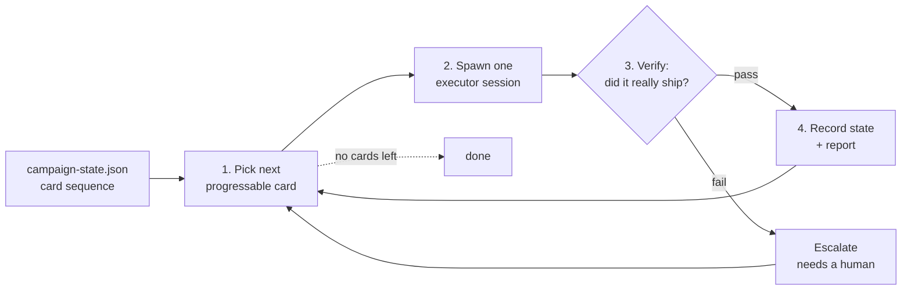
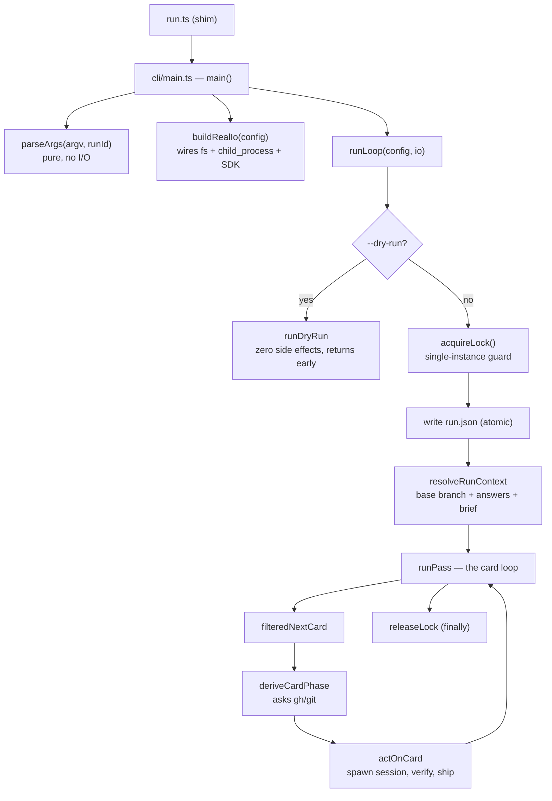
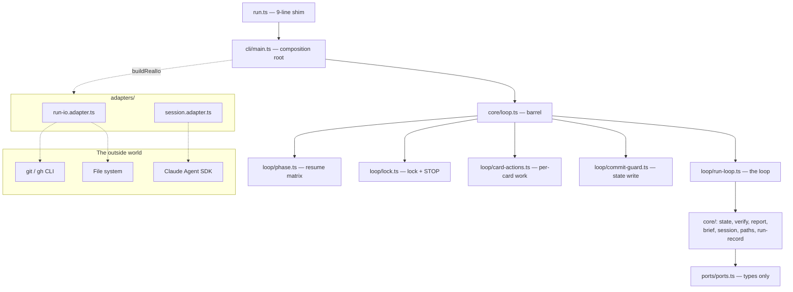

## TL;DR

- The **campaign runner** is a TypeScript script that drives shipping one roadmap item at a time. The loop itself burns **zero LLM tokens** — only the sessions it spawns do.
- **The entry point has two layers:** `run.ts` is a 9-line shim; the real logic lives in `cli/main.ts`.
- **Five one-way layers:** kernel → ports → core → adapters → cli. Import direction is checked by a test, not promised in docs.
- **`github.ts` was deleted; `loop.ts` is now a pure re-export barrel.** If you read my July post, its module map is stale.
- **Debugging on Bun needs its own adapter** — a Node debugger cannot attach. There is a `--dry-run` sandbox that runs fully offline.

---

## 0. What this replaces

In July I wrote a walkthrough of this runner. It included a map of "9 modules in 3 layers", with `run.ts` as the entrypoint that also wired dependencies, and a module called `github.ts`. Checking today:

```bash
$ ls core/github.ts
ls: core/github.ts: No such file or directory

$ find . -name "*.ts" -not -name "*.test.ts" -not -path "./node_modules/*" | wc -l
19
```

Nine modules became nineteen, and `github.ts` no longer exists. This post redraws the map against today's code, then adds what the old post never had: **how to actually put a debugger on it.**

---

## 1. What it is

Three terms, defined before use:

- **Card:** one unit of work — say "add feature X". Each card carries paths to a _spec_ (what is needed) and a _plan_ (the steps), plus its branch and PR once work starts.
- **Campaign:** an ordered sequence of cards, described in a JSON file called `campaign-state.json`.
- **Executor session:** a Claude Agent SDK process spawned to **actually do** one card — write code, commit, open a PR, merge it.

The official description sits in `package.json`:

```json
"description": "Stateless deterministic card-loop capability for the tribe plugin (Claude Agent SDK executor per staged roadmap card)."
```

The core loop: **pick the next card → spawn one session → verify by script (`gh`/`git`) → record state → repeat.**



The part worth noticing: **the runner does not take the session's word for anything.** A session saying "SHIPPED" is a signal; `gh`/`git` is the truth. That rule is written into `core/loop/phase.ts` itself:

```
/** … Never trusts `card.status` — every branch here is driven by a gh/git query or an fs
 * check, per the design's iron rule ("the file is data, gh/git is authority"). */
```

### What "stateless capability" actually means

That phrase is abstract, so anchor it in code. It means the script **hardcodes no environment value** — which repo, which model, where state lives are all command-line inputs. Three flags are required, and deliberately have **no default**:

```typescript
const REQUIRED_FLAGS: Array<{
  flag: string;
  key: "repoRoot" | "model" | "homeDir";
}> = [
  { flag: "--repo", key: "repoRoot" },
  { flag: "--model", key: "model" },
  { flag: "--home", key: "homeDir" },
];
```

Omitting one is a usage error, not a value worth guessing. The same script runs against any repo or campaign.

---

## 2. The entry point — why there are two files

Open the directory and the thing that looks most like an entry point is `run.ts`. It is exactly 9 lines:

```typescript
// run.ts — CLI contract shim. The real entrypoint is cli/main.ts; this file exists because
// external callers (orchestrate-campaign's resolve-runner.sh, test-fresh-machine.sh) prove
// the runner by this exact path: plugins/tribe/scripts/runner/run.ts.
import { main } from "./cli/main.ts";
export {
  main,
  parseArgs,
  type ParseArgsError,
  type ParseArgsResult,
} from "./cli/main.ts";

if (import.meta.main) {
  main();
}
```

A **shim** here means a thin forwarding layer that holds no logic. Its reason to exist is in the comment: two external scripts — one that locates the runner, one that tests a fresh machine — both assert that the path `scripts/runner/run.ts` exists. That path is a **public contract**; the logic is free to move.

The real logic lives in `cli/main.ts`, and that file has a named role: the **composition root** — the single place in a program allowed to construct the objects that touch the outside world and inject them into everything else. Its header says exactly that:

```
// `parseArgs` is pure (no I/O) and fully unit-tested. `main()` below it is the COMPOSITION
// ROOT: the only module allowed to wire adapters — it builds the production `LoopIO` via
// `buildRealIo` … and hands it to `runLoop`.
```

The body is as small as advertised:

```typescript
export async function main(): Promise<void> {
  const runId = generateRunId(new Date().toISOString(), randomBytes(2).toString('hex'));
  const parsed = parseArgs(process.argv.slice(2), runId);
  if ('error' in parsed) {
    console.error(`campaign runner: ${parsed.error}`);
    process.exit(1);
    return;
  }

  const io = buildRealIo(parsed.config);   // ← the world gets wired, exactly once
  // …
  result = await runLoop(parsed.config, io);
```

Two details worth stealing:

**One — `parseArgs` returns a union instead of throwing.** Its return type is `ParseArgsResult | ParseArgsError`, and the caller discriminates with `if ('error' in parsed)`. No exception ever leaves it, so it is testable by calling it with an array of strings.

**Two — unknown flags are rejected by name, never ignored:**

```typescript
if (!KNOWN_FLAGS.has(token)) {
  return { error: `unknown flag: ${token}` };
}
```

Typing `--max-card` instead of `--max-cards` stops the program and says so, rather than quietly running with a default.

---

## 3. The full run flow



### 3.1 The inner loop: `runPass`

This is the part worth reading closely. It counts **two different things** with two variables, and conflating them was once a real bug:

```typescript
const attempted = new Set<string>();
let worked = 0;
const limit = resolved.maxCards ?? Infinity;
```

- `attempted` answers: _"have I already selected this card id this pass?"_ — every selected card goes in, unconditionally. This is what makes termination **structural**: the sequence handed to the selection function strictly shrinks each iteration, bounded by the campaign's card count.
- `worked` answers: _"how much of the operator's `--max-cards` budget have I spent?"_ — it increments only when something actually happened.

A card parked on an escalation from a previous run enters `attempted` but **not** `worked`, because this pass writes nothing and decides nothing for it:

```typescript
if (phase.kind === "escalation_pending") {
  attempted.add(nc.cardId);
  processed.push({
    kind: "escalation_pending",
    cardId: nc.cardId,
    escalationPath: phase.escalationPath,
  });
  continue; // ← does not increment `worked`
}
```

**Escalation** here means the runner hit a question it has no authority to answer (changing a data shape, granting a new permission) so it writes a file and leaves the call to a human.

### 3.2 Exit codes — collapsing a mixed pass into one number

A single pass can ship some cards, escalate others, and have one die mid-flight. A precedence rule turns that mix into one exit code:

```typescript
function computeExitCode(processed: CardOutcome[]): number {
  if (
    processed.some(
      o => o.kind === "escalated" || o.kind === "escalation_pending"
    )
  ) {
    return EXIT_ESCALATED;
  }
  if (processed.some(o => o.kind === "stopped")) {
    return EXIT_SESSION_INCOMPLETE;
  }
  return EXIT_OK;
}
```

The reasoning: an escalation **needs a human**, while `stopped` merely means "safe to retry, no judgment required". So escalation outranks it.

The full table (`core/types.ts`):

| Constant                  | Value | Meaning                                              |
| ------------------------- | ----- | ---------------------------------------------------- |
| `EXIT_OK`                 | 0     | every attempted card shipped, or none were attempted |
| `EXIT_LOCKED`             | 1     | another instance is running                          |
| `EXIT_ESCALATED`          | 2     | a card needs a human ruling                          |
| `EXIT_SESSION_INCOMPLETE` | 3     | a session errored or timed out; retryable            |
| `EXIT_ERROR`              | 4     | an unhandled exception                               |

And the comment next to `EXIT_ERROR` states the trust order plainly: _"the exit code is a hint, the report is the truth"_.

### 3.3 `deriveCardPhase` — classifying reality

This function decides what to do with a card, and it **never reads `card.status` from the file**. Its first branch is the cheapest one:

```typescript
if (!card.branch) {
  return { kind: "fresh" };
}

const pr = await queryPrForBranch(card.branch, config.repoRoot, io);
```

A card with no branch has certainly not been touched → `fresh`, with **not a single `gh`/`git` call**. Only once a branch exists does it go ask GitHub: PR merged → verify only; PR open with a recorded session id → resume; branch exists with no PR and no session id → revert and redo.

That `!card.branch` branch is exactly what makes the debugging sandbox in section 6 run fully offline.

---

## 4. Architecture — pure core, impure edges

The underlying idea: **separate deciding from touching the world.** The deciding part — calculation, branching, data transformation — must be _pure_: same inputs, same output, on run 1 and run 100. Anything reaching outside — files, network, the clock, the process table — may enter only through an **abstraction the caller supplies**.

In this repo that abstraction has a name: a **port**. `ports/ports.ts` holds type declarations only, with no runtime value anywhere in it:

```typescript
export interface ExecPort {
  exec(cmd: string[], opts?: { cwd?: string }): Promise<ExecResult>;
}
export interface ClockPort {
  now(): string;
}
export interface SessionSpawnPort {
  spawnSession(params: SpawnSessionParams): AsyncIterable<SessionMessage>;
}
```

The real implementations live in `adapters/`. Here is the real `exec`:

```typescript
function realExec(cmd: string[], opts?: { cwd?: string }): Promise<ExecResult> {
  return new Promise(resolve => {
    const child = spawn(cmd[0] as string, cmd.slice(1), { cwd: opts?.cwd });
    let stdout = "";
    child.stdout?.on("data", chunk => (stdout += chunk.toString()));
    child.on("close", code => resolve({ stdout, stderr, exitCode: code ?? 1 }));
    child.on("error", err =>
      resolve({ stdout, stderr: err.message, exitCode: 1 })
    );
  });
}
```

Note that `child.on('error')` also **resolves** rather than rejecting — every failure becomes an `ExecResult` with `exitCode: 1`, so the core only ever handles one shape of data.

And here is the entire file allowed to import the Claude Agent SDK — 13 lines:

```typescript
// session.adapter.ts — the runner's ONLY import of `@anthropic-ai/claude-agent-sdk`
import { query } from "@anthropic-ai/claude-agent-sdk";
import type { SessionMessage, SpawnSessionParams } from "../core/session.ts";

export function sdkSpawnSession(
  params: SpawnSessionParams
): AsyncIterable<SessionMessage> {
  return query({
    prompt: params.prompt,
    options: params.options,
  }) as unknown as AsyncIterable<SessionMessage>;
}
```

An SDK upgrade touches this file and nothing else.

### Import direction — enforced by a test

Five layers, one way:

| Layer                                             | May import                              |
| ------------------------------------------------- | --------------------------------------- |
| kernel (`core/types.ts`)                          | nothing local                           |
| ports (`ports/ports.ts`)                          | `core/types.ts` only, and only as types |
| core (everything under `core/` except `types.ts`) | kernel, ports                           |
| adapters (`adapters/*.adapter.ts`)                | kernel, ports, core, other adapters     |
| cli (`cli/main.ts`) and the `run.ts` shim         | all of the above                        |

The key point: this is **not a promise in documentation** — `structure.test.ts` walks `core/`, `ports/`, `adapters/`, `cli/` and `run.ts` recursively and checks it. It runs alongside type-checking via `bun run check`.

```
$ bun test
 205 pass
 0 fail
 569 expect() calls
Ran 205 tests across 10 files. [363.00ms]
```

205 tests in 363 milliseconds — no real repo, no network, no Claude. That is the payoff for keeping the core pure.

### Today's module map



One easy thing to get wrong: `core/loop.ts` **no longer holds logic**. It is a barrel — a file that only re-exports what lives elsewhere:

```
// This module is a PURE re-export surface: the orchestrator's actual logic lives in
// `core/loop/` … This file exists so every external importer … keeps importing from
// `./loop.ts`/`../core/loop.ts` unchanged — the directory split under it is an
// implementation detail.
```

So existing `import { runLoop } from './loop.ts'` keeps working unchanged after the directory split. That is how you refactor without breaking callers.

---

## 5. Three design decisions worth stealing

**Fail closed — the safe default when config is missing.** A campaign declares `docsOnlyPaths`: paths that count as "docs only", used to waive a red CI check caused by flake. If the author leaves it empty:

> **Fails CLOSED: an empty list means nothing counts as docs-only, so a code diff never auto-waives a red check.**

An empty list means _nothing is waived_, not _everything is_.

**A commit trailer instead of a database.** Because all operational state lives outside the repo, the only durable trace is git history itself. Every session is instructed to end its commits with `Campaign: <slug>`, and recovery is one command:

```bash
git log --grep="Campaign: <campaign-slug>"
```

The README states the limit plainly: **"This is instructional, not enforced."** — the runner tells the session to do it; nothing checks that it did.

**Atomic file writes.** Write to a temp file, then rename, so a reader never sees a half-written file:

```typescript
writeFileAtomic: (resolvedPath, content) => {
  const tmp = `${resolvedPath}.tmp-${process.pid}`;
  writeFileSync(tmp, content);
  renameSync(tmp, resolvedPath);
},
```

---

## 6. Debugging it — what the old post never covered

The runtime is **Bun** — an alternative JavaScript runtime to Node, here version 1.3.13. That changes how you debug: Bun speaks the **WebKit inspector protocol**, while Node's debugger speaks the **Chrome DevTools Protocol**. Different protocols, so a Node debugger **cannot attach**.

### 6.1 The zero-install path

```bash
bun --inspect-brk run.ts --repo "$(git rev-parse --show-toplevel)" \
    --model sonnet --home "$PWD/.debug/home" --dry-run
```

It prints:

```
--------------------- Bun Inspector ---------------------
Listening:
  ws://127.0.0.1:6499/debug
--------------------- Bun Inspector ---------------------
Inspect in browser:
  https://debug.bun.sh/#127.0.0.1:6499/debug
```

Open that URL for a full debugger in the browser. `--inspect-brk` means "stop on the first line and wait".

### 6.2 VS Code — and the trap that cost me 20 minutes

You need the `oven.bun-vscode` extension to get the `bun` debug type. I installed it, pressed F5, and **nothing happened** — empty Debug Console, no visible error.

The cause, found by comparing two timestamps:

```
extension host   PID 24955   started    13:44:06
oven.bun-vscode  installed              13:49:32   ← 5 minutes 26 seconds later
```

The **extension host** is the separate process VS Code uses to run all extensions. It loads a newly installed extension's contributions only when it restarts. Among those contributions is the `bun` debug type — the one every launch config declares:

```json
{ "type": "bun", "request": "launch", "program": "${workspaceFolder}/run.ts" }
```

An unregistered debug type fails as a small toast that auto-dismisses. From the user's seat, that is indistinguishable from a swallowed error.

**The fix: `Cmd+Shift+P` → "Developer: Reload Window".** To see the real error, `Help → Toggle Developer Tools → Console`.

A second, cheaper trap: **VS Code reads `launch.json` only from the workspace root.** The runner directory often gets opened as a root of its own, so you want two copies — one at the repo root, one inside the runner directory.

### 6.3 An offline sandbox

The runner requires a `--home`: the directory holding a campaign's operational state. It **never creates** `campaign-state.json` — that file must already exist. So debugging means building a fake one. The card that matters:

```json
"C1": {
  "status": "staged",
  "spec": "plugins/tribe/README.md",
  "plan": "plugins/tribe/scripts/runner/README.md",
  "branch": null,
  "baseSha": null, "pr": null, "mergeSha": null,
  "sessionId": null, "updatedAt": null
}
```

`branch: null` is the trick: it falls straight into the `if (!card.branch) return { kind: 'fresh' }` branch from section 3.3, so **no `gh`/`git` call is made at all**. The result:

```bash
$ bun run.ts --repo <repo> --model sonnet --home "$PWD/.debug/home" --dry-run
{
  "cardId": "C1",
  "phase": { "kind": "fresh" }
}
```

Why is `--dry-run` safe by construction rather than "probably safe"? Because it returns **before** the lock is ever acquired:

```typescript
export async function runLoop(config: RunLoopConfig, io: LoopIO): Promise<LoopResult> {
  if (config.dryRun) {
    return runDryRun(config, io);   // ← before acquireLock, before any write
  }

  const lockResult = acquireLock(io);
```

No lock, no writes, no session, no report. **Dropping `--dry-run` is a real run** — it takes the lock, writes state, and spawns a real Claude session that commits and opens PRs.

### 6.4 Where to put the first breakpoints

| Location                                     | What it shows                             |
| -------------------------------------------- | ----------------------------------------- |
| `cli/main.ts` — after `parseArgs`            | every input to the run                    |
| `cli/main.ts` — at `runLoop(...)`            | the composition root → core boundary      |
| `core/loop/run-loop.ts` — `filteredNextCard` | which card got selected                   |
| `core/loop/phase.ts` — `deriveCardPhase`     | the fresh / resume / verify_only decision |
| `core/loop/run-loop.ts` — `actOnCard`        | where a session is actually spawned       |

One usability note: a dry-run calls `process.exit` immediately and finishes in roughly 100 milliseconds. With no breakpoint set, the debug session flashes and is gone — easy to mistake for "it didn't run". Use the config with `stopOnEntry: true`.

---

## 7. What stays with me

What I like about this codebase is not the loop — loops are easy. It is **where it draws its lines**:

1. **A path is a contract; logic is not.** `run.ts` exists solely so one path stays stable, leaving the logic free to move into `cli/main.ts`.
2. **The file is data, `gh`/`git` is authority.** A state file can be wrong; reality cannot.
3. **Import direction is checked by a test, not documented in prose.** `structure.test.ts` turns a convention into something that can fail.
4. **One SDK import, thirteen lines.** The cost of an SDK upgrade is legible from a single file.
5. **Missing config fails closed.** An empty list waives nothing, rather than everything.

As for debugging, the most expensive lesson was not in the code but in the tooling: **an unregistered debug type makes its own error disappear.** When "pressing F5 does nothing", reload the window first, and open the Developer Tools Console second.
