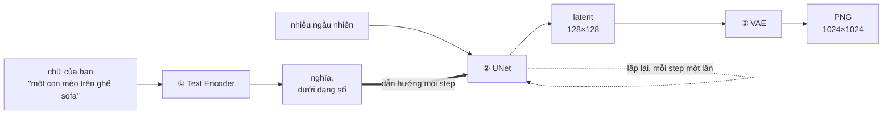

## Câu hỏi khởi đầu

Tôi tải về một model sinh ảnh — đúng một file `.safetensors`, 6,46 GB — rồi đặt một câu hỏi lẽ ra
phải rất đơn giản:

> Cái này có cần thêm VAE với text encoder không?

Câu hỏi hợp lý thôi, vì model tôi import hôm trước thì **có cần** cả hai: một file model 7,7 GB, một
text encoder 8,3 GB, và một VAE 255 MB, phải nạp riêng đủ ba thứ nếu không thì không chạy. Hai
model, cùng một công việc, cách đóng gói khác hẳn nhau.

Câu trả lời hoá ra là _không_ — và **lý do** thì đáng giá hơn câu trả lời nhiều.

## TL;DR

1. Một diffusion model là **ba chuyên gia**, không phải một chương trình: **text encoder** (chữ →
   nghĩa), **UNet** (phần thực sự vẽ), và **VAE** (→ pixel).
2. UNet **không bao giờ đụng tới pixel**. Nó làm việc trên một bản phác nén, nhỏ hơn ~48 lần. Đúng
   một mẹo đó khiến việc sinh ảnh trở nên kham nổi.
3. **Model nào cũng cần đủ ba vai. Nhưng không phải model nào cũng phát hành ba file.** Khác biệt
   này _không hiện ra_ trên trang tải về, và chính nó làm người ta vấp.
4. **Hãy đọc header tensor thay vì đoán.** Mất năm giây và cho câu trả lời dứt khoát.
5. Mọi cách làm sai ở đây đều hỏng **trong im lặng** — bạn nhận ảnh xấu, không bao giờ nhận thông
   báo lỗi.

---

## Trước hết: ba bộ phận sinh ra để giải bài toán gì

Một ảnh màu 1024×1024 là **3.145.728 con số** — 1024 × 1024 × 3 kênh màu. Không có thứ gì biến một
câu chữ thành ba triệu con số có tương quan chỉ trong một nhát.

Nên công việc được chia làm ba chặng, mỗi chặng giải một bài toán khác nhau:



Cứ hình dung đó là một người phiên dịch, một hoạ sĩ, và một cái máy in. Chúng chạy đúng thứ tự đó —
trừ anh hoạ sĩ, chạy một lượt **cho mỗi step**.

---

## ① Text encoder — biến chữ thành nghĩa

**Vào:** prompt của bạn. **Ra:** một dãy số biểu diễn ý nghĩa của mấy chữ đó. Nó không vẽ gì cả.

Đây là chỗ làm nhiều người bất ngờ. **File encoder không quyết định nó nói "phương ngữ" nào.** Trong
ComfyUI, node nạp encoder nhận _cả file lẫn một tham số `type` riêng_:

```
CLIPLoader
  clip_name: qwen3vl_4b_bf16.safetensors
  type:      krea2          # ← chính cái này, không phải tên file, chọn kiến trúc
```

Cùng một file encoder phục vụ được nhiều kiến trúc model khác nhau. `type` nói rõ phải dựng đầu ra
theo định dạng của kiến trúc nào. Chính phần mô tả node của ComfyUI ghi rõ các cặp:

```
wan:      umt5 xxl
hidream:  llama-3.1 (Recommend) or t5
minimax:  MiniMax H3 Qwen3-VL or Music3 Qwen/RVQ
```

Đặt `type` sai thì anh hoạ sĩ phía sau nhận về một mớ vô nghĩa nhưng "trôi chảy". **Bạn không nhận
được lỗi nào cả** — chỉ có ảnh xấu, và không có gì chỉ ra nguyên nhân.

---

## ② UNet — anh hoạ sĩ vẽ trong lúc bịt mắt

**Vào:** nhiễu ngẫu nhiên, cộng với mấy con số mang nghĩa. **Ra:** một bức ảnh đã xong (nhưng chưa
xem được).

Cơ chế là một vòng lặp, và đơn giản hơn vẻ ngoài của nó:

1. Bắt đầu bằng một khung toàn nhiễu trắng thuần tuý.
2. Hỏi: _"chỗ nào trong đây là sai?"_
3. Trừ chỗ đó đi.
4. Lặp lại.

**Mỗi lần lặp là một step.** Sau khoảng 28 lần, nhiễu đã thành một bức tranh.

Đây chính là chỗ trú của hai cái núm mà ai cũng vặn:

| Tham số   | Thực chất là gì              | Hệ quả                                                                                      |
| --------- | ---------------------------- | ------------------------------------------------------------------------------------------- |
| **steps** | số lần UNet chạy             | tỉ lệ thuận trực tiếp với thời gian. Trên laptop M4, một step 1024×1024 tốn **50–160 giây** |
| **CFG**   | mức ép model bám theo prompt | model "turbo" muốn **1.0**; model thường muốn **4–7**                                       |

Riêng dòng CFG gây khổ thật sự. Model chưng cất (distilled) kiểu "turbo" được huấn luyện để gần như
không cần ép. Lấy giá trị turbo (1.0) áp cho model thường thì ảnh nhợt nhạt bệt màu; lấy giá trị
thường (5) áp cho model turbo thì ảnh cháy. **Cùng một con số, kết quả ngược nhau, và không cảnh báo
ở cả hai chiều.**

UNet **luôn là phần lớn nhất** — nó chứa gần như toàn bộ những gì model đã học về hình ảnh.

> **Nói thêm về cái tên.** "UNet" là kiến trúc mà ngành này khởi đầu, từ năm 2015. Phần lớn model
> hiện nay _không_ còn là UNet — một model tôi thử ghi log `model_type FLUX` lúc nạp. Nhưng cái tên
> thì ở lại. ComfyUI lách bằng cách đặt tên thư mục là `diffusion_models` trong khi vẫn giữ node tên
> `UNETLoader`.

---

## ③ VAE — và cái mẹo khiến mọi thứ trở nên kham nổi

**Vào:** latent đã hoàn chỉnh. **Ra:** pixel thật.

Giờ đến ý tưởng cốt lõi. Chạy 28 step trên 3,1 triệu con số thì chậm đến tàn nhẫn. Nên UNet **không
hề làm việc trên bức ảnh**. Nó làm việc trên một **latent** — biểu diễn nén cỡ 128 × 128 × 4 =
**65.536 con số**.

Nhỏ hơn khoảng **48 lần**. Gần như toàn bộ tính khả thi của việc sinh ảnh hiện đại đến từ đúng quyết
định này.

Nhưng latent thì không xem được. Nó là bản phác nén ở định dạng chỉ model mới hiểu. **VAE** chính là
codec chuyển đổi giữa hai bên:

- **decode**: latent → pixel. Mọi workflow text-to-image đều kết thúc ở đây.
- **encode**: pixel → latent. Đây là cách img2img và inpainting đưa một ảnh _có sẵn_ _vào_ latent
  space để UNet chỉnh sửa.

VAE **luôn là phần nhỏ nhất** — thường 200 MB đến 1,5 GB, so với một UNet nhiều gigabyte.

**Và nó bắt buộc phải khớp với định dạng latent mà UNet của nó được huấn luyện.** Ví dụ thật: một
model ảnh tôi đang dùng đi cặp với VAE tên `qwen_image_vae.safetensors` — mang tên một dòng model
_hoàn toàn khác_ — bởi hai bên dùng chung định dạng latent. **Không có gì trong tên hai file gợi ý
điều đó.** Lấy VAE của dòng sai thì cái latent hoàn toàn đúng của bạn sẽ giải ra thành một đống màu
nhoè. Trong im lặng.

---

## Vậy model nào cũng cần đủ ba chứ?

**Về mặt khái niệm thì đúng.** Phải có thứ đọc prompt, thứ khử nhiễu, và thứ xuất ra pixel.

**Nhưng "ba vai" không có nghĩa là "ba file".** Đó thuần tuý là lựa chọn đóng gói:

| Cách đóng gói                   | Bạn tải về cái gì             | Nạp thế nào                        |
| ------------------------------- | ----------------------------- | ---------------------------------- |
| **Checkpoint gộp (all-in-one)** | một file, đủ ba thứ bên trong | một node: `CheckpointLoaderSimple` |
| **Tách rời / UNet trần**        | ba file bạn tự lắp            | ba node: UNet + CLIP + VAE loader  |

Hai model trong câu hỏi mở đầu, đặt cạnh nhau:

|                   | Gộp            | Tách                                          |
| ----------------- | -------------- | --------------------------------------------- |
| Số file           | 1 × 6,94 GB    | 7,7 GB + 8,3 GB + 255 MB                      |
| Thư mục           | `checkpoints/` | `diffusion_models/`, `text_encoders/`, `vae/` |
| CFG thường dùng   | ~5             | 1.0                                           |
| Steps thường dùng | ~28            | 8                                             |

**Vì sao model mới hay tách ra.** Hàng nghìn bản fine-tune dùng chung _cùng một_ text encoder và
_cùng một_ VAE — chỉ có UNet là được huấn luyện lại. Phát hành UNet 7,7 GB thay vì gói 16 GB giúp
khỏi phải tải lại đúng cái encoder y hệt mỗi lần. Một file VAE phục vụ cả một dòng model.

**Và vì sao thư mục lại quan trọng.** `CheckpointLoaderSimple` _chỉ_ đọc thư mục `checkpoints/`. Thả
một file gộp vào `diffusion_models/` nằm cạnh mấy UNet trần thì nó đơn giản là **không hiện trong
dropdown** — không lỗi, chỉ là vắng mặt. Đây là ca "chắc file tải về hỏng rồi" phổ biến nhất mà thực
ra file chẳng hỏng gì.

---

## Cách biết trong năm giây: đọc header

Mọi file `.safetensors` đều mở đầu bằng một header JSON liệt kê tên tất cả tensor. Các tiền tố
(prefix) ở cấp cao nhất cho bạn biết chính xác bên trong có những bộ phận nào — nhanh và đáng tin hơn
đọc model card:

```bash
python3 -c "
import json,struct,collections
p='<đường dẫn tới file .safetensors của bạn>'
f=open(p,'rb'); hdr=json.loads(f.read(struct.unpack('<Q',f.read(8))[0]))
print(collections.Counter(k.split('.')[0] for k in hdr if k!='__metadata__'))"
```

Kết quả thật từ chính file 6,46 GB trong câu hỏi mở đầu:

```
Counter({'model': 1680, 'conditioner': 587, 'first_stage_model': 248})
```

Ba nhóm — nghĩa là đủ cả ba bộ phận nằm bên trong. Đây là bảng giải mã:

| Prefix bạn thấy                     | Nghĩa là               | Vậy thì                |
| ----------------------------------- | ---------------------- | ---------------------- |
| `model.diffusion_model`             | phần UNet              | luôn luôn có           |
| `first_stage_model`                 | **đã có VAE**          | khỏi cần VAE rời       |
| `conditioner.embedders`             | **đã có text encoder** | khỏi cần encoder rời   |
| `conditioner.embedders.0` _và_ `.1` | **hai** encoder        | đây là model dòng SDXL |

Có đủ ba → model gộp → bỏ vào `checkpoints/`. Chỉ có `model.diffusion_model` → UNet trần → bỏ vào
`diffusion_models/`, rồi đi tìm hai file đi kèm.

### Hoặc chỉ cần nhìn dung lượng file

Ba vai chênh nhau nhiều đến mức chỉ cần liếc danh sách file là đoán ra:

| Dung lượng                        | Gần như chắc chắn là |
| --------------------------------- | -------------------- |
| 200 MB – 1,5 GB                   | một **VAE**          |
| 5 – 15 GB                         | một **text encoder** |
| file lớn nhất trong bộ            | phần **UNet**        |
| một file ~4–7 GB ghi "checkpoint" | **gộp cả ba**        |

---

## Hai ngoại lệ đáng biết

"Ba phần" là một quy ước mạnh, không phải luật:

**Có model không có VAE.** Dropdown VAE của ComfyUI có sẵn một mục tên `pixel_space` nằm cạnh các
file VAE thật. Mục đó dành cho model khử nhiễu thẳng trong pixel — không nén, không codec. Mỗi step
chậm hơn, nhưng bớt được một chỗ có thể ghép sai.

**Có model cần nhiều hơn ba.** Một model video trên cùng máy đó phát hành **hai** VAE — một cho
video, một cho âm thanh — vì nó sinh ra cả hai. Hai loại đầu ra, hai codec.

---

## Vì sao chuyện này quan trọng: mọi lỗi đều im lặng

Đây là mẫu số chung đằng sau mọi sai lầm nói ở trên:

| Sai ở đâu                       | Bạn thấy gì                         | Không gì nói cho bạn biết             |
| ------------------------------- | ----------------------------------- | ------------------------------------- |
| Sai `type` của encoder          | ảnh nhoè nhưng "trông có vẻ hợp lý" | mấy con số mang nghĩa vốn là vô nghĩa |
| Sai VAE                         | màu chảy nhoè                       | cái latent vốn hoàn toàn đúng         |
| Đúng file, sai thư mục          | dropdown trống trơn                 | file vốn chẳng sao cả                 |
| Dùng CFG turbo cho model thường | ảnh nhợt nhạt                       | thủ phạm là CFG                       |

ComfyUI có sẵn một bước kiểm tra `validate_workflow` để soát loại node, giá trị hợp lệ, và cách nối
dây — và **cả bốn lỗi trên đều vượt qua trót lọt toàn bộ các phép kiểm tra đó.** Không phải vì bộ
kiểm tra yếu, mà vì mỗi giá trị sai vẫn là một lựa chọn _hợp lệ_. Validation chứng minh đồ thị của
bạn đúng cú pháp. Nó không thể chứng minh bộ model của bạn ghép với nhau có hợp lý hay không.

Vậy chỉ còn đúng hai lớp phòng thủ, và cả hai đều chẳng hào nhoáng gì:

1. **Chạy thật một lượt từ đầu đến cuối rồi nhìn bức ảnh.** Không phải "có validate được không" — mà
   là nó có ra được thứ trông đúng hay không.
2. **Ghi cặp ghép ra** chỗ mà người sau sẽ thực sự đọc.

Điều thứ hai chính là lý do bài viết này tồn tại.
