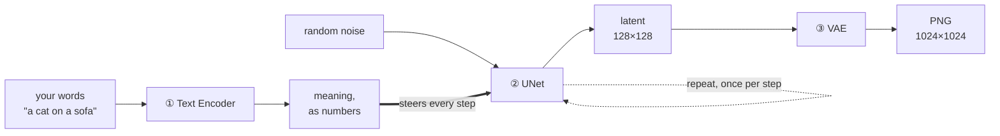

## The question that started this

I downloaded an image-generation model — one `.safetensors` file, 6.46 GB — and asked what should
have been a simple question:

> Do I also need a VAE and a text encoder for this one?

It is a reasonable question, because the model I had imported the day before **did** need both: a
7.7 GB model file, an 8.3 GB text encoder, and a 255 MB VAE, all three loaded separately or nothing
worked. Two models, same job, completely different packaging.

The answer turned out to be no — and the _reason_ is worth more than the answer.

## TL;DR

1. A diffusion model is **three specialists**, not one program: a **text encoder** (words → meaning),
   a **UNet** (the actual drawing), and a **VAE** (→ pixels).
2. The UNet **never touches pixels**. It works on a compressed sketch ~48× smaller. That one trick is
   what makes image generation affordable at all.
3. **Every model needs all three roles. Not every model ships three files.** That distinction is
   invisible on a download page and is the thing that trips people up.
4. **Read the tensor header instead of guessing.** It takes five seconds and is definitive.
5. Every way of getting this wrong fails **silently** — a bad image, never an error message.

---

## First, the problem all three parts exist to solve

A 1024×1024 colour image is **3,145,728 numbers** — 1024 × 1024 × 3 colour channels. Nothing turns a
sentence into three million correlated numbers in one shot.

So the work is split into three stages, each solving a different problem:



Think of them as a translator, an artist, and a printer. They run in that order — except the artist,
who runs once **per step**.

---

## ① The text encoder — turning words into meaning

**In:** your prompt. **Out:** a list of numbers representing what the words mean. It draws nothing.

Here is the part that surprises people. **The encoder file does not decide which "dialect" it
speaks.** In ComfyUI, the loader node takes a file _and_ a separate `type` setting:

```
CLIPLoader
  clip_name: qwen3vl_4b_bf16.safetensors
  type:      krea2          # ← this, not the filename, picks the architecture
```

The same encoder file serves several different model architectures. `type` says which one's output
format to build. ComfyUI's own node description spells out the pairings:

```
wan:      umt5 xxl
hidream:  llama-3.1 (Recommend) or t5
minimax:  MiniMax H3 Qwen3-VL or Music3 Qwen/RVQ
```

Set `type` wrong and the artist downstream receives fluent gibberish. **You get no error** — just a
bad image, with nothing pointing at the cause.

---

## ② The UNet — the artist, working blindfolded

**In:** random noise, plus the meaning-numbers. **Out:** a finished (but not yet viewable) image.

The mechanism is a loop, and it is simpler than it sounds:

1. Start with a rectangle of pure random static.
2. Ask: _"which parts of this are wrong?"_
3. Subtract them.
4. Repeat.

**Each repetition is one step.** After ~28 of them, static has become a picture.

This is where the two settings everyone fiddles with actually live:

| Setting   | What it really is                               | Consequence                                                                                 |
| --------- | ----------------------------------------------- | ------------------------------------------------------------------------------------------- |
| **steps** | how many times the UNet runs                    | directly proportional to time. On an M4 laptop, one 1024×1024 step costs **50–160 seconds** |
| **CFG**   | how hard the model is pushed toward your prompt | "turbo" models want **1.0**; normal models want **4–7**                                     |

That CFG row causes real pain. Distilled "turbo" models are trained to need almost no push. Use the
turbo value (1.0) on a normal model and you get a washed-out mess; use a normal value (5) on a turbo
model and the image burns out. **Same number, opposite outcomes, no warning either way.**

The UNet is **always the biggest part** — it holds essentially everything the model learned about
imagery.

> **A note on the name.** "UNet" is the architecture the field started with, back in 2015. Most
> current models are not UNets at all — one model I tested logs `model_type FLUX` on load. The name
> stuck anyway. ComfyUI hedges by calling the folder `diffusion_models` while keeping a node named
> `UNETLoader`.

---

## ③ The VAE — and the trick that makes all this affordable

**In:** the finished latent. **Out:** actual pixels.

Now the key idea. Running 28 steps over 3.1 million numbers would be brutally slow. So the UNet
doesn't work on the image at all. It works on a **latent** — a compressed representation of roughly
128 × 128 × 4 = **65,536 numbers**.

That is about **48× smaller**. Nearly all of the practicality of modern image generation comes from
this single decision.

But a latent isn't viewable. It's a compressed sketch in a format only the model understands. The
**VAE** is the codec that converts between the two:

- **decode**: latent → pixels. Every text-to-image workflow ends here.
- **encode**: pixels → latent. This is how img2img and inpainting get an _existing_ image _into_
  latent space so the UNet can modify it.

The VAE is **always the smallest part** — usually 200 MB to 1.5 GB, against a multi-gigabyte UNet.

**And it must match the latent format its UNet was trained on.** A real example: one image model I
use pairs with a VAE named `qwen_image_vae.safetensors` — named after a _completely different_ model
family — because the two share a latent format. Nothing in either filename hints at this. Use a VAE
from the wrong family and your perfectly correct latent decodes into colourful mush. Silently.

---

## So does every model need all three?

**Conceptually, yes.** Something has to read the prompt, something has to denoise, something has to
produce pixels.

**But "three roles" is not "three files."** That's purely a packaging choice:

| Packaging                 | What you download          | How you load it                        |
| ------------------------- | -------------------------- | -------------------------------------- |
| **All-in-one checkpoint** | one file, all three inside | one node: `CheckpointLoaderSimple`     |
| **Split / bare UNet**     | three files you assemble   | three nodes: UNet + CLIP + VAE loaders |

The two models from my opening question, side by side:

|               | All-in-one     | Split                                         |
| ------------- | -------------- | --------------------------------------------- |
| Files         | 1 × 6.94 GB    | 7.7 GB + 8.3 GB + 255 MB                      |
| Folder        | `checkpoints/` | `diffusion_models/`, `text_encoders/`, `vae/` |
| Typical CFG   | ~5             | 1.0                                           |
| Typical steps | ~28            | 8                                             |

**Why newer models split.** Thousands of fine-tuned variants share the _same_ text encoder and the
_same_ VAE — only the UNet gets retrained. Shipping a 7.7 GB UNet instead of a 16 GB bundle avoids
re-downloading the identical encoder every single time. One VAE file serves an entire family.

**And why the folder matters.** `CheckpointLoaderSimple` reads _only_ the `checkpoints/` folder. Drop
an all-in-one file into `diffusion_models/` next to the bare UNets and it simply won't appear in the
dropdown — no error, just an absence. This is the most common "my download must be corrupt" that
isn't a corrupt download.

---

## How to tell in five seconds: read the header

Every `.safetensors` file begins with a JSON header listing all its tensor names. The top-level
prefixes tell you exactly which parts are inside — faster and more reliable than reading the model
card:

```bash
python3 -c "
import json,struct,collections
p='<path to your .safetensors>'
f=open(p,'rb'); hdr=json.loads(f.read(struct.unpack('<Q',f.read(8))[0]))
print(collections.Counter(k.split('.')[0] for k in hdr if k!='__metadata__'))"
```

Real output from the 6.46 GB file from my opening question:

```
Counter({'model': 1680, 'conditioner': 587, 'first_stage_model': 248})
```

Three groups — so all three parts are inside. Here's the decoder ring:

| Prefix you see                       | Means                     | So                         |
| ------------------------------------ | ------------------------- | -------------------------- |
| `model.diffusion_model`              | the UNet                  | always there               |
| `first_stage_model`                  | **VAE included**          | no separate VAE needed     |
| `conditioner.embedders`              | **text encoder included** | no separate encoder needed |
| `conditioner.embedders.0` _and_ `.1` | **two** encoders          | it's an SDXL-family model  |

All three present → all-in-one → goes in `checkpoints/`. Only `model.diffusion_model` → bare UNet →
goes in `diffusion_models/`, and now go find its two companions.

### Or just look at the file sizes

The three roles differ so much in size that a directory listing usually gives it away:

| Size                                        | Almost certainly       |
| ------------------------------------------- | ---------------------- |
| 200 MB – 1.5 GB                             | a **VAE**              |
| 5 – 15 GB                                   | a **text encoder**     |
| the biggest file in the set                 | the **UNet**           |
| a single ~4–7 GB file labelled "checkpoint" | **all three, bundled** |

---

## Two exceptions worth knowing

"Three parts" is a strong convention, not a law:

**Some models have no VAE at all.** ComfyUI's VAE dropdown contains a literal `pixel_space` entry
next to the real VAE files. That's for models that denoise directly in pixels — no compression, no
codec. Slower per step, but one fewer thing to mismatch.

**Some need more than three.** A video model on the same machine ships **two** VAEs — one for video,
one for audio — because it generates both. Two output types, two codecs.

---

## Why any of this matters: the failures are all silent

Here is the pattern behind every mistake described above:

| Mistake                     | What you see           | What nothing tells you             |
| --------------------------- | ---------------------- | ---------------------------------- |
| Wrong encoder `type`        | plausible-looking mush | the meaning-numbers were gibberish |
| Wrong VAE                   | melted colours         | the latent was perfectly fine      |
| Right file, wrong folder    | empty dropdown         | the file is fine                   |
| Turbo CFG on a normal model | washed-out image       | CFG was the cause                  |

ComfyUI ships a `validate_workflow` check that verifies node types, valid setting values, and
wiring — and **all four mistakes pass every one of those checks.** Not because the checker is weak,
but because each wrong value is a perfectly _valid_ option. Validation proves your graph is
well-formed. It cannot prove your model set makes sense together.

Which leaves exactly two defences, and they're both unglamorous:

1. **Run it end to end and look at the picture.** Not "does it validate" — does it produce something
   that looks right.
2. **Write the pairing down** somewhere the next person will actually read.

That second one is why this post exists.
