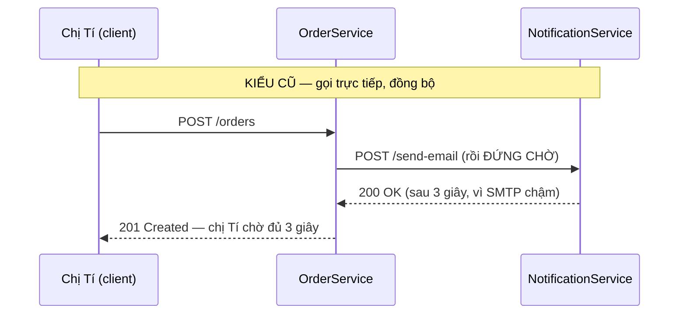
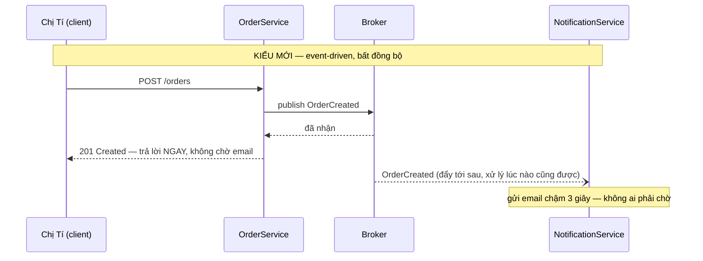
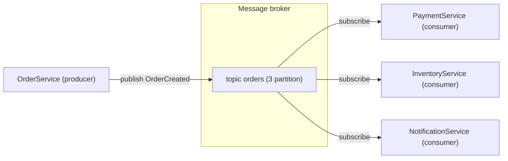
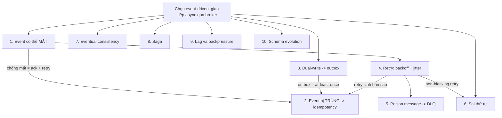

> **"Event-Driven: 10 Bài Toán Kinh Điển" — Phần 0/7.** Khi hệ thống chuyển từ gọi nhau trực tiếp sang bắn sự kiện (event), ta đổi một nhóm vấn đề cũ lấy một nhóm vấn đề mới — event trùng, event mất, event sai thứ tự, transaction vỡ đôi. Loạt bài này đi qua 10 bài toán gặp nhiều nhất trong kiến trúc event-driven, mỗi bài theo đúng ba câu hỏi: **vấn đề là gì → vì sao xảy ra → giải quyết thế nào**, kèm định nghĩa từng tính chất đứng sau nó (idempotency, at-least-once, backpressure…) từ con số 0. Phần 0 này dựng sân khấu: từ vựng và ví dụ dùng xuyên suốt 6 phần còn lại.

- Audience mặc định: backend developer, **chưa cần biết trước gì về hệ phân tán** (distributed systems — hệ thống chạy trên nhiều máy độc lập, nói chuyện với nhau qua mạng).
- Microservice (vi-dịch-vụ — chia một hệ thống lớn thành nhiều dịch vụ nhỏ, mỗi dịch vụ tự chạy, tự có database riêng) và event-driven (hướng sự kiện) là hai khái niệm khác nhau nhưng cộng sinh: hệ càng chia nhỏ, bài toán giao tiếp không dính chặt càng sống còn.
- Ví dụ xuyên suốt cả loạt bài: hệ đặt hàng giả định **MuaLẹ**, với hai nhân vật **chị Tí** (khách) và **Tèo** (kỹ sư backend trực hệ thống).

---

## 1. Từ gọi trực tiếp sang bắn sự kiện

Cách giao tiếp quen thuộc nhất giữa hai service (dịch vụ) là **gọi trực tiếp, đồng bộ** (synchronous request/response): `OrderService` (dịch vụ nhận đơn hàng) gọi HTTP sang `NotificationService` (dịch vụ gửi email) — "gửi email đi" — rồi _đứng chờ_ đến khi bên kia trả lời mới làm tiếp. Cách này dễ hiểu, nhưng có hai cái giá:

1. **Dính chặt (tight coupling).** `OrderService` phải biết `NotificationService` ở đâu, nhận tham số gì. Muốn thêm một service nữa (ví dụ dịch vụ tích điểm) cũng phải quay lại sửa code `OrderService`.
2. **Sống chết cùng nhau.** `NotificationService` chậm hay chết thì thao tác đặt hàng của chị Tí cũng treo hoặc lỗi theo, dù việc gửi email chẳng liên quan gì tới việc đơn hàng có được tạo hay không.

**Event-driven** đảo ngược hướng phụ thuộc. `OrderService` không ra lệnh cho ai cả — nó chỉ _công bố một sự thật_: "đơn hàng #4711 vừa được tạo". Ai quan tâm thì tự nghe. Sự thật đó gọi là **event** — một bản ghi _bất biến_ (immutable, đã phát ra thì không sửa được nữa) về _chuyện đã xảy ra_, nên tên event luôn ở thì quá khứ: `OrderCreated`, `PaymentCompleted` — chứ không phải `CreateOrder` (đó là **command**, một _yêu cầu_ làm gì đó, có thể bị từ chối; event thì không thể "từ chối" vì nó đã xảy ra rồi).

`OrderService` chỉ cần broker xác nhận đã nhận event là xong việc. `NotificationService` chết 10 phút? Event nằm chờ trong broker, sống lại xử lý tiếp — chị Tí không hề biết.

## 2. Các nhân vật trong hệ thống

Ở giữa hai kiểu giao tiếp trên có một hộp mới xuất hiện: **message broker** (gọi tắt: broker) — phần mềm trung gian chuyên nhận, lưu trữ và chuyển tiếp message. Các broker phổ biến: Apache Kafka, RabbitMQ, AWS SQS/SNS, Google Pub/Sub, NATS. Quanh broker là bộ từ vựng dùng suốt loạt bài:

| Thuật ngữ                 | Nghĩa                                                                                                                                                                    | Trong ví dụ MuaLẹ                                                          |
| ------------------------- | ------------------------------------------------------------------------------------------------------------------------------------------------------------------------ | -------------------------------------------------------------------------- |
| **Producer**              | Bên _phát_ event vào broker (còn gọi publisher)                                                                                                                          | `OrderService` phát `OrderCreated`                                         |
| **Consumer**              | Bên _nhận và xử lý_ event từ broker (còn gọi subscriber)                                                                                                                 | `PaymentService`, `InventoryService`, `NotificationService`                |
| **Topic**                 | "Kênh" phân loại event theo chủ đề; producer phát vào topic, consumer đăng ký (subscribe) topic mình quan tâm                                                            | topic `orders`, topic `payments`                                           |
| **Queue vs Pub/Sub**      | Hai kiểu phân phối: **queue** (point-to-point) — mỗi message được đúng _một_ consumer xử lý; **pub/sub** — mỗi event được phát cho _tất cả_ nhóm đăng ký                 | `OrderCreated` phát pub/sub: cả Payment, Inventory, Notification cùng nhận |
| **Partition**             | Một topic được cắt thành nhiều "làn" song song để nhiều consumer xử lý cùng lúc. Thứ tự chỉ được đảm bảo _trong một làn_ (gốc của Phần 3)                                | topic `orders` có 8 partition                                              |
| **Offset**                | Số thứ tự của message trong một partition — consumer ghi nhớ "tôi đã đọc đến offset N", như bookmark kẹp sách                                                            | `NotificationService` đang ở offset 1042 của partition 3                   |
| **Acknowledgement (ack)** | Tín hiệu consumer báo broker "message này tôi xử lý xong rồi". Với Kafka, hành động tương đương là _commit offset_. Chưa ack thì broker coi như chưa xong và sẽ giao lại | `NotificationService` gửi email xong mới ack                               |
| **Consumer group**        | Nhiều instance của cùng một service hợp thành một nhóm; broker chia partition cho các thành viên — mỗi partition chỉ một thành viên đọc                                  | 3 instance `NotificationService` chia nhau 8 partition                     |

Kiến trúc MuaLẹ dùng suốt loạt bài: một producer, một broker, ba consumer độc lập. Thêm consumer thứ tư (ví dụ dịch vụ tích điểm)? Chỉ cần subscribe topic — không sửa một dòng nào của `OrderService`. Đây chính là **loose coupling** (khớp nối lỏng) mà kiến trúc này mua được.

> [!NOTE]
> **Vì sao phải trả giá bằng 10 bài toán tiếp theo?** Mọi lợi ích ở trên đến từ một quyết định duy nhất: **chen một bên thứ ba (broker) vào giữa, và cắt đứt sự chờ đợi**. Nhưng chính quyết định đó cũng tạo ra toàn bộ các bài toán còn lại của loạt bài: đã có thêm một chặng mạng thì có thể _mất_ (Phần 1); chống mất bằng gửi lại thì có thể _trùng_ (Phần 1); không ai chờ ai thì dữ liệu có lúc _lệch nhau_ (Phần 4); nhiều làn song song thì có thể _sai thứ tự_ (Phần 3). Không có bữa trưa miễn phí — chỉ có sự đánh đổi được lựa chọn một cách có hiểu biết.

## 3. Sợi chỉ đỏ — bản đồ nhân quả của cả loạt bài

Đọc hết 7 phần, ta sẽ thấy 10 bài toán không rời rạc mà móc vào nhau thành một chuỗi nhân quả:

Bốn câu tóm cả loạt bài:

1. Đưa mạng + trung gian vào giữa mọi giao tiếp → event có thể mất, và cách duy nhất chống mất (ack + gửi lại) sinh trùng lặp.
2. Không ngăn được trùng/xáo trộn từ gốc → thiết kế nghiệp vụ **miễn nhiễm**: idempotency (tính luỹ đẳng — làm lại không đổi kết quả) cho trùng, version cho xáo trộn, compensating transaction (giao dịch bù) cho dở dang.
3. Phần còn lại là quản lý dòng chảy (backoff, DLQ, backpressure) và quản lý lời hứa (mức nhất quán, hợp đồng schema).
4. Gieo sẵn khả năng quan sát (correlation ID) vào từng message trước khi cần.

Chú ý bao nhiêu mũi tên đổ về "② Event bị trùng" — đó là lý do Phần 1 (bài toán số 2) là phần quan trọng nhất của cả loạt bài.

## 4. Khung đọc mỗi bài toán, và cách dùng loạt bài này

Mỗi bài toán trong 6 phần tiếp theo được trình bày theo ba tầng:

- **What** — vấn đề là gì, nhìn thấy bằng triệu chứng nào.
- **Why** — vì sao nó _tất yếu_ xảy ra (thường là do vật lý của hệ phân tán, không phải do code dở).
- **How** — các pattern (khuôn mẫu giải pháp) giải quyết và cái giá phải trả.

Xen giữa là các hộp **Tính chất** (property) — định nghĩa từ đầu những thuật ngữ như idempotency, at-least-once, backpressure — vì chính các tính chất này, chứ không phải tên pattern, mới là thứ giúp ta suy luận được khi gặp biến thể mới của vấn đề.

---

**Tiếp theo:** [Phần 1 — Event Bị Mất Và Bị Trùng](/memo/posts/event-driven-part-1-lost-and-duplicate-events-vi/) →

**Loạt bài — Event-Driven: 10 Bài Toán Kinh Điển:** **0 · Nền tảng (đang ở đây)** · [1 · Mất & Trùng](/memo/posts/event-driven-part-1-lost-and-duplicate-events-vi/) · [2 · Outbox & Retry](/memo/posts/event-driven-part-2-outbox-and-retries-vi/) · [3 · Poison & Thứ tự](/memo/posts/event-driven-part-3-poison-messages-and-ordering-vi/) · [4 · Consistency & Saga](/memo/posts/event-driven-part-4-consistency-and-sagas-vi/) · [5 · Backpressure & Schema](/memo/posts/event-driven-part-5-backpressure-and-schema-evolution-vi/) · [6 · Observability & Tổng kết](/memo/posts/event-driven-part-6-observability-and-recap-vi/)
