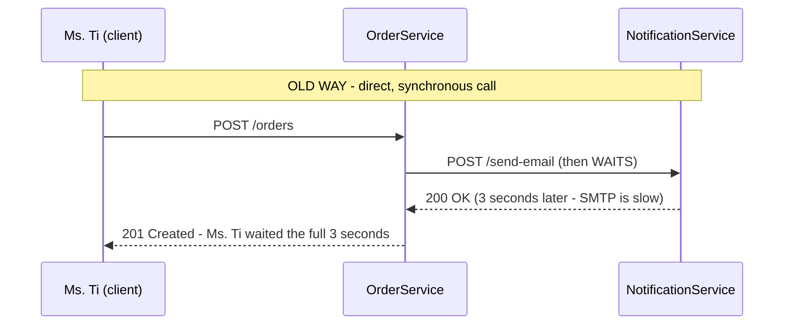
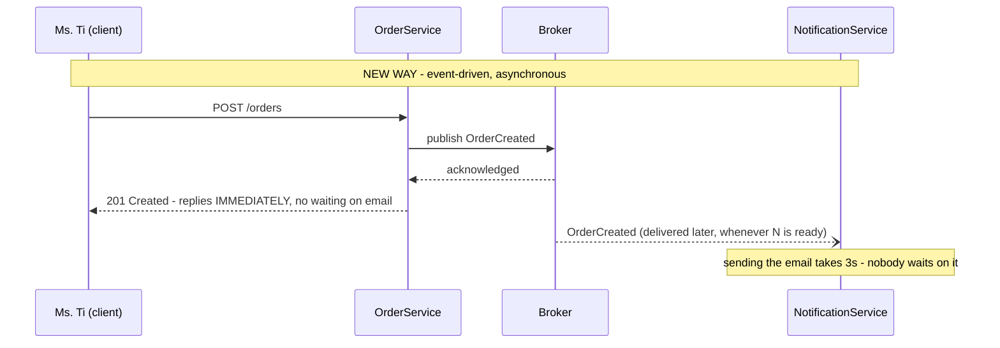
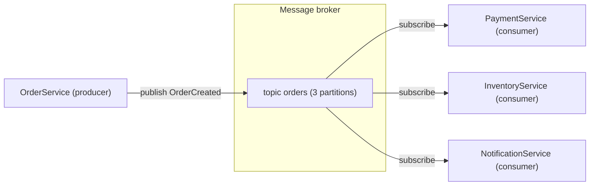
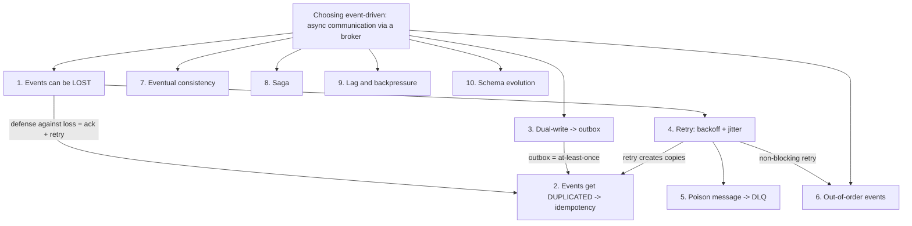

> **"Event-Driven Architecture: The Top 10 Classic Problems" — Part 0 of 7.** When a system moves from calling itself directly to firing events, it trades one set of problems for another: duplicated events, lost events, out-of-order events, transactions split across two databases. This series walks through the 10 problems you'll actually hit, each framed the same way — **what is it → why does it happen → how do you fix it** — defining every property behind it (idempotency, at-least-once, backpressure…) from zero. Part 0 sets the stage: the vocabulary and the running example the other six parts build on.

- Assumed audience: backend developers who **don't need any prior background in distributed systems** (software that runs across multiple independent machines talking over a network).
- Microservices (splitting one large system into many small, independently deployable services, each with its own database) and event-driven architecture are two different ideas that reinforce each other: the more a system is split apart, the more the problem of "how do the pieces talk without gluing back together" matters.
- Running example for the whole series: a fictional order system called **MuaLẹ**, with two characters — **Ms. Tí** (a customer) and **Tèo** (the on-call backend engineer).

---

## 1. From direct calls to firing events

The most familiar way for two services to talk is a **synchronous request/response call**: `OrderService` makes an HTTP call to `NotificationService` — "send this email" — and _waits_ for a reply before moving on. It's easy to reason about, but it costs two things:

1. **Tight coupling.** `OrderService` has to know where `NotificationService` lives and what parameters it expects. Adding a fourth service (say, a loyalty-points service) means going back and editing `OrderService`'s code.
2. **Shared fate.** If `NotificationService` is slow or down, placing an order hangs or fails right along with it — even though sending a confirmation email has nothing to do with whether the order itself should succeed.

**Event-driven architecture reverses the dependency.** `OrderService` doesn't command anyone — it just _announces a fact_: "order #4711 was just created." Whoever cares can listen. That fact is called an **event**: an _immutable_ record (once published, it can't be changed) of _something that already happened_, which is why event names are always past-tense — `OrderCreated`, `PaymentCompleted` — never `CreateOrder` (that's a **command**, a _request_ to do something, which can be rejected; an event can't be "rejected," because it already happened).

`OrderService` only needs the broker to confirm receipt, and it's done. If `NotificationService` is down for 10 minutes? The event just sits in the broker and gets processed once the service comes back — Ms. Tí never notices.

## 2. The cast of characters

Between the two communication styles above, a new box appears: the **message broker** (or just "broker") — middleware dedicated to receiving, storing, and forwarding messages. Common brokers: Apache Kafka, RabbitMQ, AWS SQS/SNS, Google Pub/Sub, NATS. Around the broker sits a vocabulary this whole series relies on:

| Term                      | Meaning                                                                                                                                                                                             | In the MuaLẹ example                                                                   |
| ------------------------- | --------------------------------------------------------------------------------------------------------------------------------------------------------------------------------------------------- | -------------------------------------------------------------------------------------- |
| **Producer**              | The side that _publishes_ an event to the broker                                                                                                                                                    | `OrderService` publishes `OrderCreated`                                                |
| **Consumer**              | The side that _receives and processes_ events from the broker                                                                                                                                       | `PaymentService`, `InventoryService`, `NotificationService`                            |
| **Topic**                 | A named "channel" grouping events by subject; producers publish to a topic, consumers subscribe to the ones they care about                                                                         | topic `orders`, topic `payments`                                                       |
| **Queue vs. pub/sub**     | Two delivery models: a **queue** (point-to-point) delivers each message to exactly _one_ consumer; **pub/sub** delivers each event to _every_ subscribed group                                      | `OrderCreated` is pub/sub: Payment, Inventory, and Notification all get their own copy |
| **Partition**             | A topic is split into parallel "lanes" so multiple consumers can process it at once. Ordering is only guaranteed _within a single lane_ (the root cause behind Part 3)                              | topic `orders` has 8 partitions                                                        |
| **Offset**                | A message's position within a partition — the consumer remembers "I've read up to offset N," like a bookmark                                                                                        | `NotificationService` is currently at offset 1042 of partition 3                       |
| **Acknowledgement (ack)** | The signal a consumer sends the broker: "I'm done with this message." In Kafka, the equivalent action is _committing an offset_. No ack means the broker assumes it's unfinished and will redeliver | `NotificationService` acks only after the email is actually sent                       |
| **Consumer group**        | Multiple instances of the same service form a group; the broker splits partitions across the members — each partition is read by exactly one member                                                 | 3 instances of `NotificationService` split 8 partitions between them                   |

This is the MuaLẹ architecture used throughout the series: one producer, one broker, three independent consumers. Adding a fourth consumer (say, a loyalty-points service)? It just subscribes to the topic — not a single line of `OrderService` changes. This is exactly the **loose coupling** this architecture buys you.

> [!NOTE]
> **So why does it cost 10 more problems?** Every benefit above comes from one decision: **insert a third party (the broker) in the middle, and stop waiting.** That same decision creates every problem the rest of this series covers: one more network hop means events can _get lost_ (Part 1); the only defense against loss is resending, which creates _duplicates_ (Part 1); nobody waiting on anybody means data can _drift out of sync_ (Part 4); many parallel lanes means events can _arrive out of order_ (Part 3). There's no free lunch here — only a trade-off made with open eyes.

## 3. The red thread — a causal map of the whole series

By the end of all 7 parts, the 10 problems won't look scattered — they chain into a single causal story:

Four sentences summarize the whole series:

1. Putting a network and a middleman between every conversation means events can be lost, and the only defense against loss — acknowledge, then resend on doubt — creates duplicates.
2. Since duplication and reordering can't be eliminated at the source, the fix is a business design that's **immune** to them: idempotency (doing something twice behaves like doing it once) for duplicates, version numbers for reordering, compensating transactions (business-level undos) for work left half-done.
3. Everything else is flow management (backoff, dead-letter queues, backpressure) and promise management (consistency levels, schema contracts).
4. And because it's all distributed, seed observability (a correlation ID) into every message before you need it.

Notice how many arrows point at "② Events get duplicated" — that's why Part 1 (problem #2) is the single most important part of this series.

## 4. How each problem is framed, and how to read this series

Every problem in the next six parts gets the same three-layer treatment:

- **What** — what the problem looks like, what symptom gives it away.
- **Why** — why it's _inevitable_ (usually the physics of distributed systems, not sloppy code).
- **How** — the patterns that solve it, and what they cost.

In between are **Property** boxes — definitions from first principles for terms like idempotency, at-least-once, and backpressure. Those properties, not the pattern names, are what let you reason through a new variant of a problem you haven't seen before.

---

**Next:** [Part 1 — Lost and Duplicate Events](/memo/posts/event-driven-part-1-lost-and-duplicate-events/) →

**The series — Event-Driven Architecture: The Top 10 Classic Problems:** **0 · Foundations (you are here)** · [1 · Lost & Duplicate Events](/memo/posts/event-driven-part-1-lost-and-duplicate-events/) · [2 · Outbox & Retries](/memo/posts/event-driven-part-2-outbox-and-retries/) · [3 · Poison Messages & Ordering](/memo/posts/event-driven-part-3-poison-messages-and-ordering/) · [4 · Consistency & Sagas](/memo/posts/event-driven-part-4-consistency-and-sagas/) · [5 · Backpressure & Schema Evolution](/memo/posts/event-driven-part-5-backpressure-and-schema-evolution/) · [6 · Observability & Recap](/memo/posts/event-driven-part-6-observability-and-recap/)
