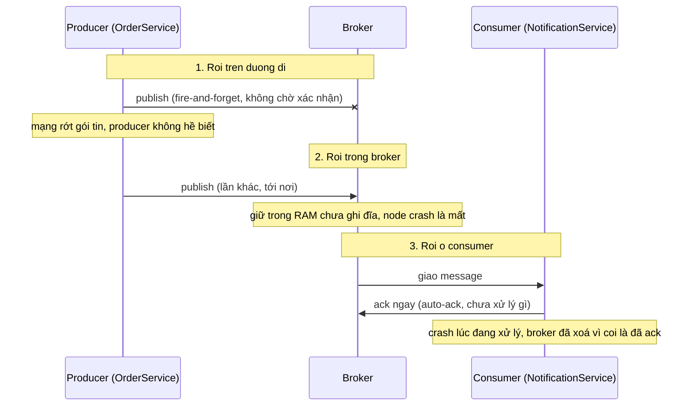
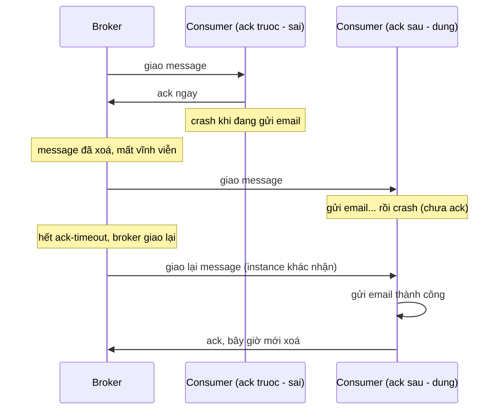
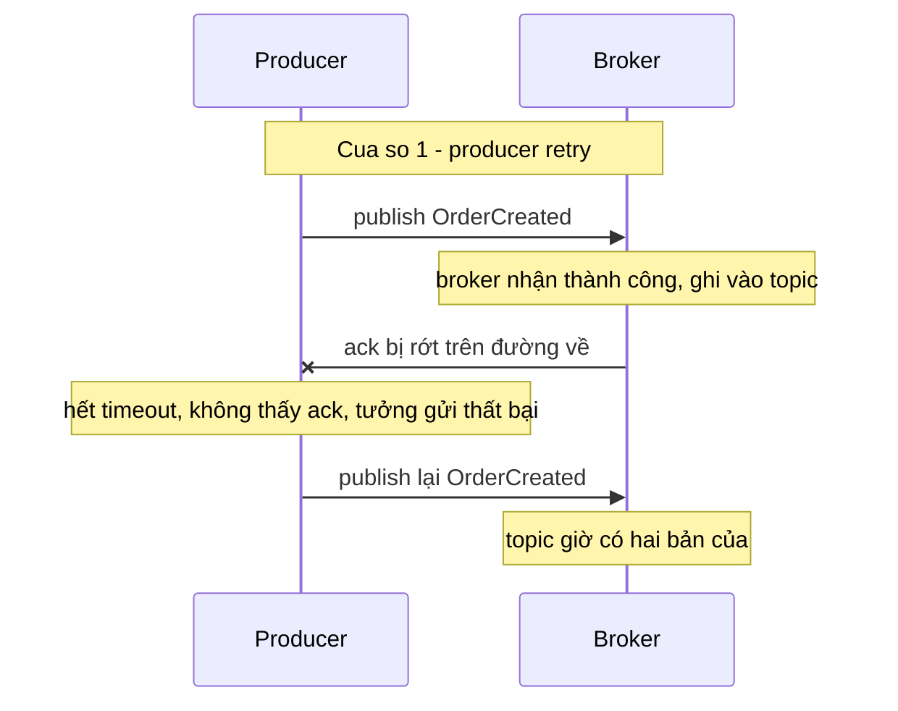
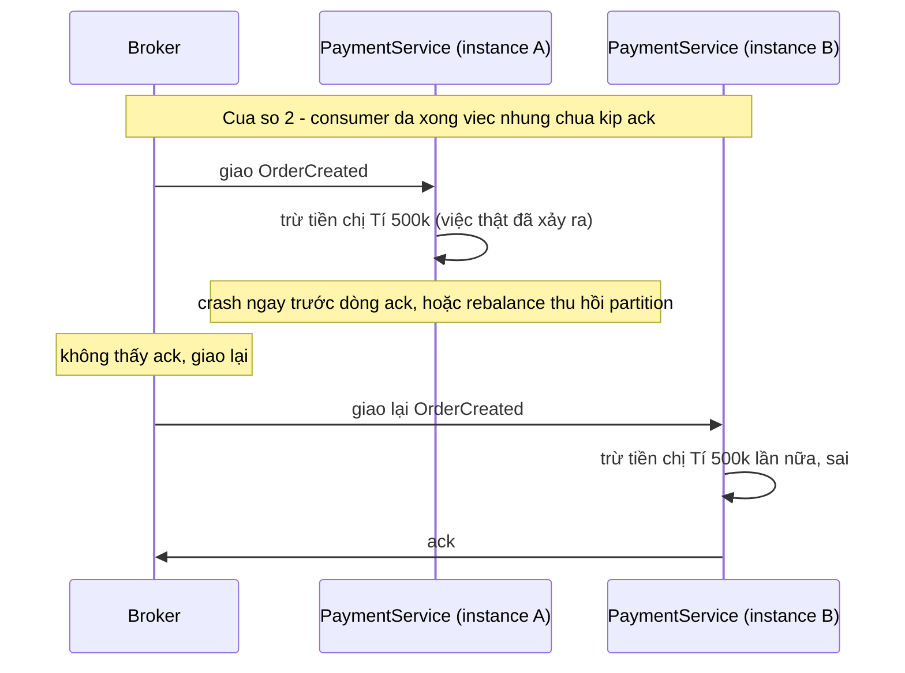

> **"Event-Driven: 10 Bài Toán Kinh Điển" — Phần 1/7.** Chị Tí đặt hàng thành công, tiền đã trừ, nhưng email xác nhận không bao giờ tới — event bị mất. Hoặc: chị Tí đặt một đơn 500 nghìn, tài khoản bị trừ 1 triệu — event bị trùng. Hai bài toán này đi liền nhau vì bài toán sau là hệ quả trực tiếp của cách chữa bài toán trước. [← Phần 0 — Nền tảng](/memo/posts/event-driven-part-0-foundations-vi/) nếu bạn chưa quen với producer/consumer/broker/ack.

- Event bị mất là lỗi **im lặng**: producer tưởng đã gửi xong, consumer không biết mình bỏ lỡ gì — chỉ lộ ra ở tầng nghiệp vụ, có khi hàng giờ sau.
- Có ba điểm rơi khiến event mất: producer bắn-rồi-quên, broker chưa ghi bền, consumer ack trước khi xử lý xong. Bịt cả ba đẩy hệ từ **at-most-once** lên **at-least-once**.
- Nhưng at-least-once đúng nghĩa là "1 hoặc n lần" — nó **sinh trùng lặp**, một cách tất yếu, không phải bug.
- Lời giải không phải "ngăn trùng" (không ngăn được) mà là **idempotency** (tính luỹ đẳng — làm n lần cho kết quả như 1 lần): tính chất trung tâm của toàn bộ kiến trúc event-driven.

---

## 1. Event bị mất — gửi rồi mà như chưa từng gửi

**What — vấn đề là gì?** Một event được phát đi nhưng **không bao giờ được xử lý** — và tệ nhất là _không ai biết_. Khác với lỗi đồng bộ (gọi HTTP lỗi thì thấy mã 500 ngay), event mất là lỗi _im lặng_: producer tưởng đã gửi xong, consumer không biết mình đã bỏ lỡ điều gì. Triệu chứng thường chỉ lộ ra ở tầng nghiệp vụ: khách không nhận email, kho không trừ hàng, báo cáo thiếu số liệu — hàng giờ hoặc hàng ngày sau.

**Why — vì sao xảy ra? Ba điểm rơi của một event.** Một event đi từ producer đến consumer phải qua ba chặng, và chặng nào cũng có thể làm rơi nó:



- **① Producer "bắn rồi quên" (fire-and-forget).** Nếu producer không chờ broker xác nhận (Kafka: `acks=0`), gói tin rớt trên đường là mất — hàm publish vẫn "thành công" vì nó chỉ có nghĩa "đã đẩy ra card mạng".
- **② Broker chưa ghi bền.** Nhận vào RAM rồi mới ghi đĩa / nhân bản sang node khác là chuyện bình thường (để nhanh). Node chết trong khe hở đó là mất. Ví dụ: RabbitMQ với message không đánh dấu persistent, hoặc Kafka `acks=1` — chỉ node trưởng (leader) xác nhận, leader chết trước khi nhân bản xong là mất.
- **③ Consumer ack trước, xử lý sau.** Nhiều thư viện mặc định auto-ack: vừa _nhận_ message đã báo "xong". Consumer crash giữa lúc xử lý thì broker đã xoá message — không còn gì để giao lại.

**How — giải quyết thế nào? Bịt từng điểm rơi, và gọi tên mức đảm bảo.** Trước khi bịt lỗ, cần một khung ngôn ngữ. Mọi hệ thống nhắn tin đều rơi vào một trong ba mức **delivery guarantee** (đảm bảo giao nhận):

| Mức                 | Nghĩa                                                                                                                     | Rủi ro                                                                            |
| ------------------- | ------------------------------------------------------------------------------------------------------------------------- | --------------------------------------------------------------------------------- |
| **At-most-once**    | mỗi event được xử lý 0 hoặc 1 lần — "gửi một phát, mất thì thôi", không retry                                             | mất event — chấp nhận được với metric/log, không chấp nhận được với đơn hàng/tiền |
| **At-least-once ★** | mỗi event được xử lý 1 hoặc n lần — gửi đến khi chắc chắn bên kia đã xong. **Lựa chọn mặc định của hầu hết hệ nghiệp vụ** | trùng event — toàn bộ mục 2 dưới đây                                              |
| **Exactly-once**    | mỗi event được xử lý đúng 1 lần — điều ai cũng muốn, và **không tồn tại thuần khiết** giữa các hệ độc lập                 | thực dụng: exactly-once = at-least-once + idempotency                             |

Với khung đó, "chống mất event" nghĩa là đẩy hệ thống từ at-most-once lên at-least-once, bằng cách bịt đúng ba điểm rơi:

- **Bịt ① —** producer chờ xác nhận và retry: Kafka `acks=all` + `retries` lớn; RabbitMQ publisher confirms.
- **Bịt ② —** broker ghi bền và nhân bản: message persistent / queue durable; replication factor ≥ 3 và `min.insync.replicas=2` (Kafka) — message phải nằm trên ít nhất 2 máy rồi mới xác nhận với producer.
- **Bịt ③ —** consumer xử lý xong mới ack: tắt auto-ack; đặt lệnh ack _sau_ dòng code cuối cùng của việc xử lý.



Cùng một vụ crash, hai số phận: ack-trước biến crash thành mất dữ liệu vĩnh viễn; ack-sau biến crash thành "xử lý lại". Quy tắc nhớ: **ack là chữ ký nghiệm thu, không phải giấy biên nhận** — ký khi việc đã xong, không phải khi vừa nhận việc.

> [!NOTE]
> **Tính chất — Durability (độ bền dữ liệu).** Một message là _durable_ khi nó đã được ghi xuống nơi **sống sót qua sự cố**: ghi xuống đĩa (không chỉ RAM), và/hoặc nhân bản sang máy khác. Chữ D trong ACID của database cũng là tính chất này. Ví dụ: Kafka replication factor 3 + `min.insync.replicas=2` nghĩa là một event chỉ được xác nhận với producer khi đã nằm trên ít nhất 2 máy — một máy chết bất kỳ lúc nào cũng không mất.
>
> **Tính chất — Acknowledgement/ack (xác nhận xử lý).** Cơ chế hai bên _thoả thuận thời điểm chuyển giao trách nhiệm_: chừng nào consumer chưa ack, trách nhiệm giữ message vẫn thuộc broker. Vị trí đặt lệnh ack trong code — trước hay sau phần xử lý — quyết định hệ thống là at-most-once hay at-least-once. Trong Kafka không có "ack từng message" mà là _commit offset_: "tôi đã xử lý xong đến vị trí N".

> [!WARNING]
> **Cái giá của at-least-once.** Nhìn lại sơ đồ "ack SAU — đúng": consumer đã gửi email rồi mới crash, và message được giao lại → email **được gửi lần thứ hai**. Ta vừa đổi "mất event" lấy "trùng event". Đây không phải bug — đây là bản chất của thoả thuận at-least-once, và là cây cầu dẫn thẳng sang mục 2 dưới đây.

## 2. Event bị trùng — một đơn hàng, hai lần trừ tiền

**What — vấn đề là gì?** Cùng một event nghiệp vụ được **xử lý nhiều hơn một lần**, gây hậu quả nhân đôi: trừ tiền 2 lần, gửi 2 email, trừ kho 2 lần. Nguy hiểm ở chỗ: về mặt hạ tầng, _không có gì sai cả_ — broker được cấu hình at-least-once (mục 1) đang làm đúng hợp đồng của nó: "1 hoặc n lần". Lỗi chỉ xuất hiện khi tầng nghiệp vụ _giả định_ "n luôn bằng 1".

**Why — vì sao xảy ra? Hai cửa sổ nhân đôi.** Duplicate sinh ra ở đúng hai chỗ, tương ứng hai chặng mạng của event. Cả hai đều có chung một cấu trúc: **một bên làm xong việc, nhưng tín hiệu "đã xong" bị thất lạc, nên bên kia làm lại**.



Cửa sổ nhân đôi thứ nhất — giữa producer và broker: lần gửi đầu thực ra đã thành công, chỉ có tiếng "OK" vọng về là mất. Producer không thể phân biệt "gửi hỏng" với "gửi được nhưng ack hỏng", nên buộc phải gửi lại (không gửi lại là rơi về at-most-once, mất event — mục 1).



Cửa sổ nhân đôi thứ hai — giữa broker và consumer: side effect (trừ tiền) đã xảy ra nhưng chữ ký nghiệm thu (ack) chưa kịp gửi. Broker làm đúng phận sự: chưa có ack thì giao lại. Tình huống "rebalance" (broker chia lại partition khi một consumer vào/ra nhóm — chi tiết ở Phần 5) cũng tạo ra đúng kịch bản này mà không cần ai crash.

Điểm mấu chốt cần khắc sâu: **không thể loại bỏ hai cửa sổ này bằng cách "code cẩn thận hơn"**. Chúng là hệ quả logic của một sự thật vật lý: giữa hai máy tính, tín hiệu xác nhận có thể mất, và bên gửi không thể phân biệt "việc chưa xảy ra" với "việc đã xảy ra nhưng lời xác nhận thất lạc" — trong lý thuyết hệ phân tán đây là bài toán Hai Vị Tướng (**Two Generals Problem**), đã được chứng minh không có lời giải trọn vẹn trên kênh truyền không tin cậy. Vậy hướng đi đúng không phải là _ngăn_ duplicate xuất hiện, mà là làm cho duplicate _vô hại_.

**How — giải quyết thế nào? Làm cho "xử lý 2 lần" cho kết quả y như 1 lần.**

> [!NOTE]
> **Tính chất trung tâm của cả loạt bài — Idempotency (tính luỹ đẳng).** Một thao tác là **idempotent** khi thực hiện nó _nhiều lần_ cho kết quả cuối cùng _giống hệt_ thực hiện _một lần_: `f(f(x)) = f(x)`. Ví dụ đời thường: nút gọi thang máy — bấm 1 lần hay 5 lần sốt ruột, thang cũng chỉ tới một chuyến.
>
> Ranh giới nằm giữa hai kiểu thao tác. **Idempotent tự nhiên:** `x = 5` (SET — chạy 10 lần, x vẫn là 5) · `status = "PAID"` · UPSERT theo khoá chính. **KHÔNG idempotent:** `x = x + 5` (INCREMENT — mỗi lần chạy cộng thêm) · `INSERT` không có khoá · trừ tiền · gửi email. Nghệ thuật của mục này là biến nhóm sau thành nhóm trước.

Có ba tầng phòng thủ, dùng phối hợp:

**Tầng 1 — thiết kế thao tác cho idempotent tự nhiên (rẻ nhất, ưu tiên trước).** Nguyên tắc chung: ghi **trạng thái đích** thay vì ghi **mức thay đổi** (state-based thay vì delta-based), và dùng định danh nghiệp vụ làm khoá duy nhất:

```sql
-- KHONG idempotent: chay 2 lan se tru kho 2 lan
UPDATE inventory SET quantity = quantity - 2 WHERE sku = 'AO-THUN-M';

-- Idempotent: ban ghi giu-hang co khoa duy nhat theo don.
-- Chay lan 2 vi pham UNIQUE, biet ngay la duplicate, bo qua.
INSERT INTO reservations (order_id, sku, qty) VALUES ('4711', 'AO-THUN-M', 2);
-- (ton kho kha dung = ton kho vat ly tru SUM(reservations), tinh ra chu khong cong don)
```

**Tầng 2 — idempotent consumer: idempotency key + bảng khử trùng lặp.** Với thao tác không thể "viết lại cho tự nhiên" (trừ tiền, gọi API ngoài), dùng cơ chế tổng quát: mỗi event mang một **idempotency key** (thường là `eventId` — UUID sinh lúc tạo event — hoặc khoá nghiệp vụ như `orderId`). Consumer giữ một bảng các key đã xử lý, và điều then chốt: _ghi key và ghi side effect phải nằm trong CÙNG một transaction database_ — để "đã làm" và "đã đánh dấu là làm" không bao giờ tách rời:

```javascript
// Idempotent consumer - khung xu ly chuan cho MOI consumer nghiep vu
async function handle(event) {
  await db.transaction(async tx => {
    // (1) Ghi "ve da soat" - PRIMARY KEY chan lan thu hai
    const inserted = await tx.query(
      `INSERT INTO processed_events (event_id) VALUES ($1)
       ON CONFLICT DO NOTHING`,
      [event.id]
    );
    if (inserted.rowCount === 0) {
      log.info(`duplicate ${event.id} - bo qua`);
      return; // da xu ly roi
    }
    // (2) Side effect nam CUNG transaction voi (1):
    //     cung commit hoac cung rollback - khong co trang thai lung lang
    await tx.query(`UPDATE accounts SET balance = balance - $1 WHERE id = $2`, [
      event.amount,
      event.customerId,
    ]);
  });
  await broker.ack(event); // (3) ack SAU CUNG (bai hoc muc 1)
}
// Crash sau commit, truoc ack? -> broker giao lai -> INSERT dung khoa -> bo qua. An toan.
```

Trình tự crash nào cũng an toàn: crash trước commit — transaction rollback, chưa có gì xảy ra; crash sau commit nhưng trước ack — lần giao lại bị chặn ở bước (1). Bảng `processed_events` cần dọn định kỳ (giữ 7–30 ngày tuỳ retention của topic), vì duplicate chỉ xuất hiện trong khoảng thời gian message còn có thể được giao lại.

**Tầng 3 — hạ tầng hỗ trợ khử trùng ở phạm vi hẹp.**

- **Kafka idempotent producer** (`enable.idempotence=true`, mặc định bật từ Kafka 3.0): broker gán cho mỗi producer một số hiệu và đánh số thứ tự từng message, tự loại bản gửi lại — _bịt cửa sổ ①_. Không giúp gì cho cửa sổ ②.
- **Kafka transactions** (exactly-once semantics): đảm bảo "đọc từ topic A, xử lý, ghi ra topic B và commit offset" là một khối nguyên tử — exactly-once _trong phạm vi các topic Kafka_. Chạm ra ngoài (ghi database khác, gọi API, gửi email) là hết phạm vi bảo hộ.
- **SQS FIFO / JMS:** dedup theo `MessageDeduplicationId` trong cửa sổ 5 phút — tiện, nhưng cửa sổ hẹp, không thay được Tầng 2.
- **Đẩy key xuống downstream:** khi side effect là gọi API bên thứ ba, gửi kèm idempotency key để _họ_ khử trùng — như Stripe với header `Idempotency-Key`.

> [!WARNING]
> **Hiểu lầm phổ biến: "chọn broker có exactly-once là xong".** Không có broker nào cho exactly-once _end-to-end_ tới side effect tuỳ ý (email đã gửi thì không "un-send" được). Công thức thực dụng đúng là: **exactly-once processing = at-least-once delivery (hạ tầng) + idempotent consumer (nghiệp vụ, Tầng 2 ở trên)**. Phần hạ tầng mua được; phần nghiệp vụ phải tự viết — và phải viết ở _mọi_ consumer có side effect.

> [!NOTE]
> **Tính chất — Deduplication/dedup (khử trùng lặp).** Kỹ thuật _phát hiện và loại bỏ_ bản sao dựa trên một định danh duy nhất, trong một **cửa sổ thời gian** nhất định (dedup window). Khác với idempotency: idempotency là tính chất của _thao tác_ (làm lại vô hại), dedup là cơ chế _chặn không cho làm lại_ — cần bộ nhớ nên luôn có giới hạn cửa sổ. Ví dụ: bảng `processed_events` giữ 30 ngày = dedup window 30 ngày; SQS FIFO dedup window = 5 phút.

---

← **Trước:** [Phần 0 — Nền tảng](/memo/posts/event-driven-part-0-foundations-vi/) · **Tiếp theo:** [Phần 2 — Dual-Write Và Retry](/memo/posts/event-driven-part-2-outbox-and-retries-vi/) →

**Loạt bài — Event-Driven: 10 Bài Toán Kinh Điển:** [0 · Nền tảng](/memo/posts/event-driven-part-0-foundations-vi/) · **1 · Mất & Trùng (đang ở đây)** · [2 · Outbox & Retry](/memo/posts/event-driven-part-2-outbox-and-retries-vi/) · [3 · Poison & Thứ tự](/memo/posts/event-driven-part-3-poison-messages-and-ordering-vi/) · [4 · Consistency & Saga](/memo/posts/event-driven-part-4-consistency-and-sagas-vi/) · [5 · Backpressure & Schema](/memo/posts/event-driven-part-5-backpressure-and-schema-evolution-vi/) · [6 · Observability & Tổng kết](/memo/posts/event-driven-part-6-observability-and-recap-vi/)
