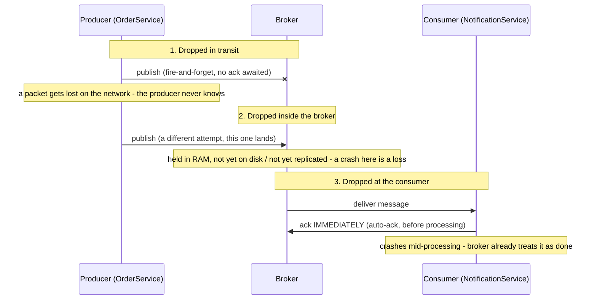
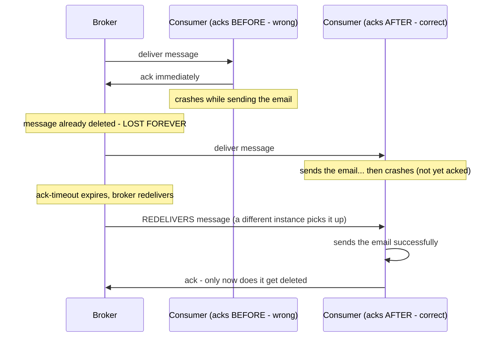
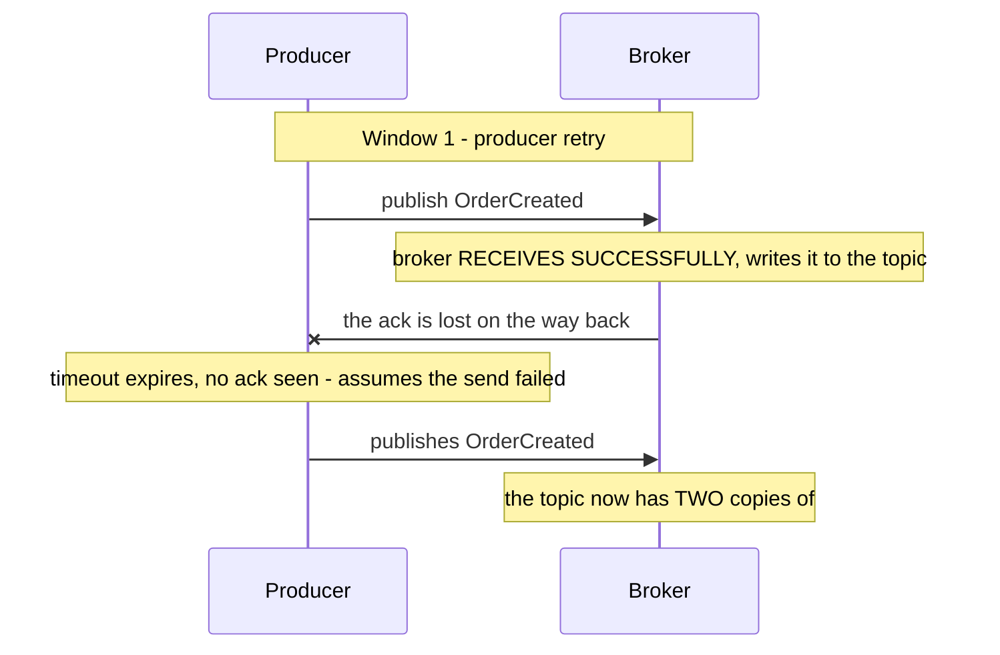
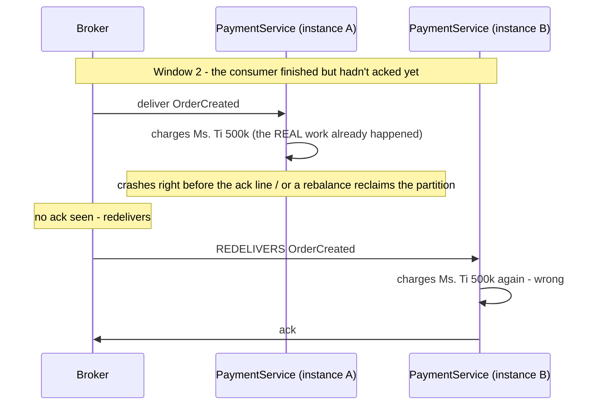

> **"Event-Driven Architecture: The Top 10 Classic Problems" — Part 1 of 7.** Ms. Tí's order goes through, the payment succeeds, but the confirmation email never arrives — an event got lost. Or: she places a 500k order and her account is charged 1 million — an event got duplicated. These two problems belong together, because the second is a direct consequence of how you fix the first. [← Part 0 — Foundations](/memo/posts/event-driven-part-0-foundations/) if producer/consumer/broker/ack aren't familiar yet.

- A lost event is a **silent** failure: the producer thinks it sent successfully, the consumer has no idea what it missed — it only surfaces at the business layer, sometimes hours later.
- There are three places an event can drop: a fire-and-forget producer, a broker that hasn't durably written it yet, and a consumer that acks before it's actually done processing. Plugging all three moves the system from **at-most-once** to **at-least-once**.
- But at-least-once, by definition, means "1 or n times" — it **creates duplicates**, inevitably, not as a bug.
- The fix isn't "prevent duplicates" (you can't) — it's **idempotency** (doing something n times behaves like doing it once): the central property of the entire event-driven architecture.

---

## 1. Lost events — sent, but as if it never happened

**What is it?** An event gets published but is **never processed** — and the worst part is _nobody knows_. Unlike a synchronous failure (an HTTP call that fails returns a 500 right away), a lost event is a _silent_ failure: the producer thinks it succeeded, and the consumer has no idea what it missed. The symptom usually only shows up at the business layer: the customer never gets an email, inventory never gets debited, a report is missing numbers — hours or days later.

**Why does it happen? Three places an event can drop.** An event traveling from producer to consumer crosses three hops, and any of them can drop it:



- **① The producer "fires and forgets."** If the producer doesn't wait for the broker's acknowledgment (Kafka: `acks=0`), a dropped packet is simply lost — the publish call still "succeeds," because it only meant "pushed onto the network card."
- **② The broker hasn't durably written it yet.** Accepting into RAM before writing to disk or replicating to another node is normal (it's faster). A node dying in that gap is a loss. Example: RabbitMQ with a message not marked persistent, or Kafka's `acks=1` — only the leader node acknowledges, and it dies before replication finishes.
- **③ The consumer acks before, processes after.** Many libraries default to auto-ack: the moment a message is _received_, it's reported "done." If the consumer crashes mid-processing, the broker has already deleted the message — there's nothing left to redeliver.

**How do you fix it? Plug each hole, and name the guarantee.** Before plugging anything, you need a shared vocabulary. Every messaging system falls into one of three **delivery guarantee** levels:

| Level               | Meaning                                                                                                                             | Risk                                                               |
| ------------------- | ----------------------------------------------------------------------------------------------------------------------------------- | ------------------------------------------------------------------ |
| **At-most-once**    | each event processed 0 or 1 times — "send it once, if it's lost so be it," no retry                                                 | lost events — acceptable for metrics/logs, not for orders or money |
| **At-least-once ★** | each event processed 1 or n times — resend until the other side is confirmed done. **The default choice for most business systems** | duplicate events — the entire subject of section 2 below           |
| **Exactly-once**    | each event processed exactly once — what everyone wants, and **doesn't exist in pure form** between independent systems             | in practice: exactly-once = at-least-once + idempotency            |

With that framework, "defending against loss" means pushing the system from at-most-once to at-least-once, by plugging exactly those three drop points:

- **Plug ① —** the producer waits for confirmation and retries: Kafka `acks=all` + a high `retries`; RabbitMQ publisher confirms.
- **Plug ② —** the broker writes durably and replicates: mark messages persistent / queues durable; replication factor ≥3 with `min.insync.replicas=2` (Kafka) — a message has to sit on at least 2 machines before the producer gets confirmation.
- **Plug ③ —** the consumer acks only after processing succeeds: turn off auto-ack; place the ack call _after_ the last line of processing code.



The same crash, two different outcomes: acking before turns a crash into permanent data loss; acking after turns a crash into "reprocess it." A rule of thumb: **an ack is a sign-off, not a receipt** — sign it when the work is done, not when the work just arrived.

> [!NOTE]
> **Property — Durability.** A message is _durable_ once it's been written somewhere that **survives a failure**: written to disk (not just RAM), and/or replicated to another machine. This is the same "D" in ACID. Example: Kafka with a replication factor of 3 plus `min.insync.replicas=2` means an event is only confirmed to the producer once it's on at least 2 machines — any single machine dying at any moment doesn't lose it.
>
> **Property — Acknowledgement/ack.** The mechanism two parties use to _agree on the moment responsibility transfers_: as long as the consumer hasn't acked, the broker is responsible for holding (and redelivering) the message. Where you place the ack in your code — before or after processing — decides whether the system is at-most-once or at-least-once. In Kafka there's no "ack per message," only _committing an offset_: "I've finished processing up to position N."

> [!WARNING]
> **The cost of at-least-once.** Look again at the "acks AFTER — correct" diagram: the consumer sent the email and then crashed, and the message got redelivered → the email **got sent a second time**. We just traded "lost event" for "duplicated event." That's not a bug — it's the nature of the at-least-once contract, and it's the bridge straight into section 2.

## 2. Duplicate events — one order, charged twice

**What is it?** The same business event gets **processed more than once**, doubling its effect: money debited twice, two emails sent, inventory debited twice. What makes it dangerous: at the infrastructure level, _nothing is actually broken_ — a broker configured for at-least-once (section 1) is correctly honoring its contract of "1 or n times." The bug only appears when the business layer _assumes_ "n always equals 1."

**Why does it happen? Two windows of duplication.** Duplicates come from exactly two places, matching the event's two network hops. Both share the same shape: **one side finished the work, but the "it's done" signal got lost, so the other side does it again.**



The first duplication window — between producer and broker: the first send actually succeeded, only the "OK" echoing back got lost. The producer can't distinguish "the send failed" from "it succeeded but the ack failed," so it's forced to resend (not resending falls back to at-most-once and loses the event — section 1).



The second duplication window — between broker and consumer: the side effect (the charge) already happened, but the sign-off (the ack) never made it out in time. The broker is doing exactly what it should: no ack means redeliver. A "rebalance" (the broker reassigning partitions when a consumer joins or leaves the group — details in Part 5) creates this exact scenario without anyone crashing at all.

The core point worth internalizing: **you cannot eliminate these two windows by "writing more careful code."** They're the logical consequence of a physical fact: between two computers, a confirmation signal can be lost, and the sender can't distinguish "it hasn't happened" from "it happened, but confirmation got lost" — in distributed systems theory this is the Two Generals Problem, proven to have no complete solution over an unreliable channel. So the right move isn't _preventing_ duplicates from occurring — it's making duplicates _harmless_.

**How do you fix it? Make "processed twice" behave exactly like "processed once."**

> [!NOTE]
> **The central property of this whole series — Idempotency.** An operation is **idempotent** when running it _multiple times_ produces a final result _identical_ to running it _once_: `f(f(x)) = f(x)`. An everyday example: an elevator call button — press it once, or five times out of impatience, and the elevator still only makes one trip.
>
> The line falls between two kinds of operations. **Naturally idempotent:** `x = 5` (SET — run it 10 times, x is still 5) · `status = "PAID"` · an UPSERT on a primary key. **NOT idempotent:** `x = x + 5` (INCREMENT — every run adds more) · an `INSERT` with no key · charging a card · sending an email. The craft of this section is turning the second group into the first.

There are three layers of defense, used together:

**Layer 1 — design operations to be naturally idempotent (cheapest, do this first).** The general rule: write the **target state**, not a **delta** (state-based instead of delta-based), and use a business identifier as a unique key:

```sql
-- NOT idempotent: run it twice, inventory drops twice
UPDATE inventory SET quantity = quantity - 2 WHERE sku = 'SHIRT-M';

-- Idempotent: a reservation row keyed uniquely per order.
-- Run it a second time -> hits the UNIQUE constraint -> instantly known as a duplicate, skipped.
INSERT INTO reservations (order_id, sku, qty) VALUES ('4711', 'SHIRT-M', 2);
-- (available stock = physical stock - SUM(reservations), computed, never accumulated)
```

**Layer 2 — idempotent consumer: an idempotency key plus a dedup table.** For operations that can't be "rewritten to be naturally idempotent" (charging a card, calling an external API), use a general-purpose mechanism: every event carries an **idempotency key** (usually `eventId` — a UUID generated when the event is created — or a business key like `orderId`). The consumer keeps a table of keys it has already processed, and the crucial part: _writing the key and applying the side effect must happen in the SAME database transaction_ — so "it was done" and "it's marked as done" can never come apart:

```javascript
// Idempotent consumer - the standard shape for EVERY consumer with side effects
async function handle(event) {
  await db.transaction(async tx => {
    // (1) Punch the "already checked" ticket - the PRIMARY KEY blocks a second run
    const inserted = await tx.query(
      `INSERT INTO processed_events (event_id) VALUES ($1)
       ON CONFLICT DO NOTHING`,
      [event.id]
    );
    if (inserted.rowCount === 0) {
      log.info(`duplicate ${event.id}, skipping`);
      return; // already processed
    }
    // (2) The side effect lives in the SAME transaction as (1):
    //     they commit together or roll back together - no dangling state
    await tx.query(`UPDATE accounts SET balance = balance - $1 WHERE id = $2`, [
      event.amount,
      event.customerId,
    ]);
  });
  await broker.ack(event); // (3) ack LAST (the lesson from section 1)
}
// Crashes after commit, before ack? -> broker redelivers -> the INSERT hits the key -> skipped. Safe.
```

Every possible crash point is safe: crash before commit — the transaction rolls back, nothing happened yet; crash after commit but before ack — the redelivery gets stopped at step (1). The `processed_events` table needs periodic cleanup (keep 7-30 days, depending on the topic's retention), since duplicates can only appear within the window a message could still be redelivered.

**Layer 3 — narrow-scope infrastructure support.**

- **Kafka's idempotent producer** (`enable.idempotence=true`, on by default since Kafka 3.0): the broker assigns each producer a sequence number per message and automatically drops resends — _plugging window ①_. It doesn't help window ② at all.
- **Kafka transactions** (exactly-once semantics): guarantees "read from topic A, process, write to topic B, commit the offset" as one atomic unit — exactly-once _within the scope of Kafka topics only_. Reach outside that (write a different database, call an API, send an email) and the protection ends.
- **SQS FIFO / JMS:** dedup via `MessageDeduplicationId` within a 5-minute window — handy, but a narrow window that doesn't replace Layer 2.
- **Push the key downstream:** when the side effect is calling a third-party API, pass along the idempotency key so _they_ do the deduplication — like Stripe's `Idempotency-Key` header.

> [!WARNING]
> **A common misunderstanding: "pick a broker with exactly-once and you're done."** No broker delivers _end-to-end_ exactly-once all the way to an arbitrary side effect (an email already sent can't be "un-sent"). The practical formula is: **exactly-once processing = at-least-once delivery (infrastructure) + an idempotent consumer (business logic, Layer 2 above)**. The infrastructure half you can buy off the shelf; the business half has to be hand-written — at _every_ consumer with a side effect.

> [!NOTE]
> **Property — Deduplication.** The technique of _detecting and dropping_ copies based on a unique identifier, within a specific **time window** (a dedup window). It differs from idempotency: idempotency is a property of an _operation_ (repeating it is harmless); dedup is a mechanism that _blocks the repeat from running at all_ — it needs memory, so it always has a bounded window. Example: a `processed_events` table kept for 30 days is a 30-day dedup window; SQS FIFO's dedup window is 5 minutes.

---

← **Previous:** [Part 0 — Foundations](/memo/posts/event-driven-part-0-foundations/) · **Next:** [Part 2 — Dual-Write & Retries](/memo/posts/event-driven-part-2-outbox-and-retries/) →

**The series — Event-Driven Architecture: The Top 10 Classic Problems:** [0 · Foundations](/memo/posts/event-driven-part-0-foundations/) · **1 · Lost & Duplicate Events (you are here)** · [2 · Outbox & Retries](/memo/posts/event-driven-part-2-outbox-and-retries/) · [3 · Poison Messages & Ordering](/memo/posts/event-driven-part-3-poison-messages-and-ordering/) · [4 · Consistency & Sagas](/memo/posts/event-driven-part-4-consistency-and-sagas/) · [5 · Backpressure & Schema Evolution](/memo/posts/event-driven-part-5-backpressure-and-schema-evolution/) · [6 · Observability & Recap](/memo/posts/event-driven-part-6-observability-and-recap/)
