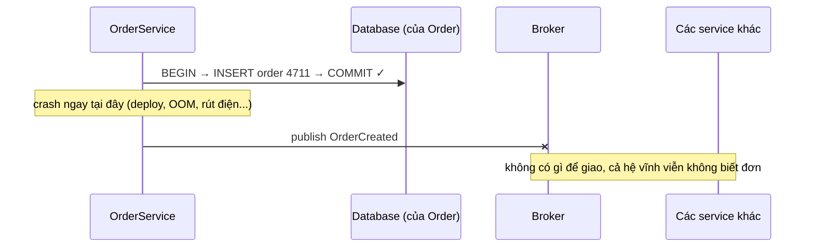
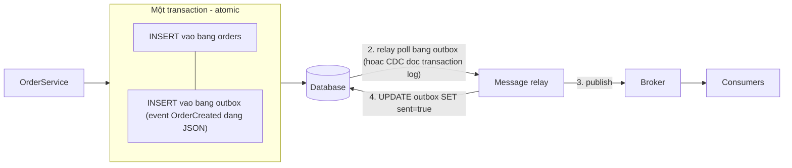
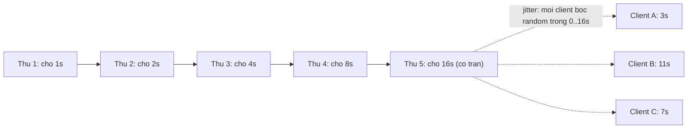
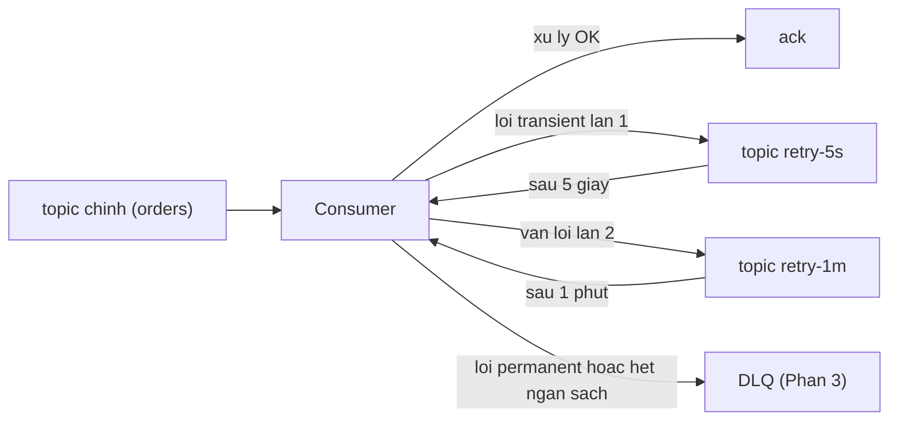
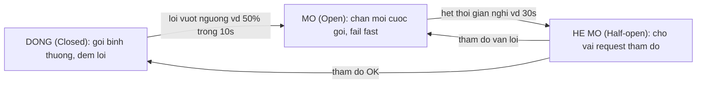

> **"Event-Driven: 10 Bài Toán Kinh Điển" — Phần 2/7.** 14:00, Tèo deploy phiên bản mới. Đúng lúc đó một instance `OrderService` bị kill giữa chừng: đơn của chị Tí đã nằm trong database, nhưng event `OrderCreated` chưa kịp publish. Rồi ở chương sau: `PaymentService` gọi cổng thanh toán, cổng timeout vì quá tải — code retry ngay lập tức, nhân với 200 instance đang làm y hệt, cổng thanh toán vừa ngoi lên lại bị dập tiếp. Hai bài toán khác nhau, cùng một bài học: hạ tầng phân tán không cho không thứ gì, kể cả việc "thử lại". [← Phần 1 — Mất & Trùng](/memo/posts/event-driven-part-1-lost-and-duplicate-events-vi/)

- **Dual-write** (ghi kép): DB và broker không chia sẻ transaction — không thứ tự nào của "ghi DB" và "publish event" là an toàn. Lời giải: **transactional outbox**, ghi event vào chính DB của mình rồi để một relay publish sau.
- **Retry** tưởng đơn giản nhưng ẩn 4 câu hỏi: lỗi nào đáng thử lại, khi nào, mấy lần, và message phía sau có bị chặn không.
- Retry ngây thơ (ngay lập tức, đồng loạt) tạo ra **retry storm** — nhân bội tải đúng lúc downstream yếu nhất.
- Bộ tứ chống retry storm: phân loại lỗi trước, **exponential backoff + jitter**, ngân sách số lần thử, và **circuit breaker**.

---

## 1. Dual-write — ghi database thành công, publish event thất bại

**What — vấn đề là gì?** **Dual-write** (ghi kép) là tình huống một thao tác nghiệp vụ phải ghi vào _hai hệ thống độc lập_ — database của `OrderService` và message broker — và ta muốn "cả hai cùng thành công hoặc cả hai cùng thất bại", nhưng không có gì đảm bảo điều đó. Hai kết cục hỏng:

- **Ghi DB xong, publish hỏng** (crash, mạng đứt, broker bận): đơn tồn tại nhưng phần còn lại của hệ thống không bao giờ biết — lệch nhau _vĩnh viễn_, không phải lệch tạm thời như eventual consistency ở Phần 4.
- **Publish xong, ghi DB hỏng** (nếu đảo thứ tự): các service khác nhận event về một đơn hàng… không tồn tại — event "ma".

Khe hở chết người: giữa dòng `COMMIT` và dòng `publish` luôn tồn tại một khoảnh khắc — dù chỉ vài micro giây — mà crash tại đó để lại hệ thống ở trạng thái nửa vời. Tần suất thấp không phải là an ủi: với 1 triệu đơn/tháng, sự cố "một phần triệu" xảy ra hàng tháng.

**Why — vì sao xảy ra?** Vì database và broker là hai thế giới không có transaction chung. Trong một database, ta quen được nuông chiều bởi _atomicity_ (xem hộp dưới): gom nhiều lệnh vào một transaction, tất cả cùng sống cùng chết. Nhưng transaction của Postgres không thể "với tay" sang Kafka.

Giải pháp cổ điển cho "commit trên nhiều hệ" là **two-phase commit** (2PC — một điều phối viên hỏi tất cả các bên "chuẩn bị xong chưa?", tất cả gật đầu rồi mới ra lệnh commit đồng loạt). Nghe hợp lý nhưng gần như không dùng được ở đây: các broker phổ biến (Kafka, SQS…) không hỗ trợ; nó buộc các bên giữ khoá chờ nhau; và điều phối viên trở thành điểm chết đơn (single point of failure). Vậy cần một lối đi khác — và lối đẹp nhất là _đừng ghi hai nơi nữa_.

> [!NOTE]
> **Tính chất — Atomicity (tính nguyên tử).** Một nhóm thao tác là _atomic_ khi chúng "không thể chia cắt": hoặc **tất cả** cùng có hiệu lực, hoặc **không cái nào** có hiệu lực — không tồn tại trạng thái làm-được-một-nửa, kể cả khi crash giữa chừng. Đây là chữ A trong ACID: `BEGIN … COMMIT` là lời hứa atomicity trong phạm vi _một_ database — và bài toán dual-write chính là lời hứa đó không vươn qua biên giới hai hệ thống. Mẹo tư duy: không thể có atomicity _giữa_ DB và broker → hãy thu xếp để thao tác cần atomic chỉ diễn ra _bên trong_ một DB, nơi atomicity có sẵn.

**How — giải quyết thế nào? Transactional Outbox.** Ý tưởng: đừng publish trực tiếp nữa. Trong cùng transaction ghi đơn hàng, ghi luôn event vào một bảng phụ ngay trong database của mình — bảng `outbox` (hộp thư đi). Vì cùng một database, hai lệnh ghi này _atomic miễn phí_. Một tiến trình riêng (relay) sau đó đọc bảng outbox và publish lên broker, đánh dấu đã gửi.

Bước ghi đơn + ghi event atomic vì cùng DB. Relay có thể crash thoải mái ở bước 2–4: chưa đánh dấu `sent` thì lần sau gửi lại. Chú ý hệ quả: relay "gửi lại khi nghi ngờ" nghĩa là outbox giao event **at-least-once** — duplicate lại xuất hiện, và idempotent consumer của Phần 1 lại gánh. Mọi con đường đổ về Phần 1 là vì vậy.

Hai cách hiện thực relay:

- **Polling publisher:** một vòng lặp `SELECT * FROM outbox WHERE sent = false ORDER BY id LIMIT 100` mỗi vài trăm mili giây, publish rồi đánh dấu. Dễ viết; giá: thêm độ trễ một nhịp poll và thêm tải đọc lên DB.
- **Change Data Capture (CDC):** đọc thẳng _nhật ký transaction_ của database (WAL của Postgres, binlog của MySQL). Công cụ phổ biến nhất: **Debezium** — giả làm một bản sao của DB, nhận dòng thay đổi theo thời gian thực và bơm vào Kafka. Độ trễ thấp hơn polling, không thêm tải query; giá: thêm một mảnh hạ tầng phải vận hành.

> [!WARNING]
> **Anti-pattern cần gọi tên.** "Publish trong try-catch, lỗi thì ghi log rồi bỏ qua" là chọn _âm thầm_ chấp nhận mất event — chọn at-most-once mà không nói cho ai biết. Và "publish xong mới COMMIT" cũng không thoát: crash giữa publish và commit tạo event-ma. Không có thứ tự nào của hai lệnh ghi là an toàn — chỉ có _một_ lệnh ghi (outbox) là an toàn. Hai biến thể cùng họ đáng biết: **listen-to-yourself** (publish trước, chính service subscribe lại topic đó để ghi DB — không cần bảng outbox, nhưng dữ liệu của chính mình cũng thành eventual consistency); **event sourcing** (bỏ luôn bảng trạng thái, chuỗi event chính là database — cam kết kiến trúc lớn, ngoài phạm vi loạt bài này).

## 2. Retry sao cho đúng — gửi lại mà không tự bắn vào chân

**What — vấn đề là gì?** Consumer xử lý event thất bại (downstream lỗi, timeout, deadlock). Câu hỏi tưởng đơn giản — "thử lại chứ sao" — thực ra là bốn câu hỏi: thử lại **cái gì** (lỗi nào đáng thử)? **khi nào** (ngay hay chờ)? **bao nhiêu lần** (đến bao giờ bỏ cuộc)? và **các event khác thì sao** (chặn hàng đợi hay cho vượt)? Trả lời sai câu nào cũng có án phạt riêng: retry lỗi vĩnh viễn → lặp vô hạn (Phần 3); retry ngay lập tức → retry storm; retry cho vượt hàng → sai thứ tự (Phần 3).

**Why — vì sao retry ngây thơ lại nguy hiểm?**

Thứ nhất, không phải lỗi nào cũng đáng retry:

| Loại lỗi                   | Bản chất                                | Ví dụ                                           | Retry có ích?                                                 |
| -------------------------- | --------------------------------------- | ----------------------------------------------- | ------------------------------------------------------------- |
| **Transient** (thoáng qua) | nguyên nhân _tự hết_ theo thời gian     | timeout, mạng chớp, HTTP 503, deadlock DB       | **Có** — chờ một nhịp rồi thử lại thường thành công           |
| **Permanent** (vĩnh viễn)  | thử một triệu lần vẫn _y nguyên_ lỗi đó | payload sai định dạng, HTTP 400, bug trong code | **Không** — retry chỉ đốt tài nguyên, số phận là Phần 3 (DLQ) |

Thứ hai, retry là nhân bội tải đúng lúc yếu nhất. Downstream lỗi _vì đang quá tải_, và phản ứng của mọi client là… gửi thêm request. Nếu tất cả cùng retry ngay và cùng chu kỳ, chúng tạo thành từng đợt sóng đồng pha — dịch vụ vừa gượng dậy lại gục — hiện tượng gọi là **retry storm** (hay thundering herd — bầy trâu giẫm đạp). Đây là cơ chế đứng sau nhiều sự cố dây chuyền (cascading failure) nổi tiếng.

**How — giải quyết thế nào? Bộ tứ: phân loại, backoff + jitter, ngân sách, cầu dao.**

**1. Phân loại lỗi trước khi retry.** Bắt exception phải phân nhánh: transient → retry theo chính sách dưới đây; permanent → không retry, chuyển thẳng sang DLQ (Phần 3). Đừng bắt tuốt mọi exception rồi retry tuốt.

**2. Exponential backoff + jitter.** **Exponential backoff** (lùi theo cấp số nhân): khoảng chờ giữa các lần thử _nhân đôi_ dần — 1s, 2s, 4s, 8s, 16s… có trần. **Jitter** (nhiễu ngẫu nhiên): cộng/trừ một lượng ngẫu nhiên vào mỗi khoảng chờ để các client _lệch pha_ nhau — phá vỡ những đợt sóng đồng loạt. Công thức được khuyến nghị rộng rãi (AWS Architecture Blog, _Exponential Backoff and Jitter_) là _full jitter_: `delay = random(0, base × 2^n)`.

Backoff bảo vệ downstream theo _thời gian_; jitter bảo vệ theo _pha_ — cùng là "lần thử #5" nhưng ba client bốc ngẫu nhiên trong khoảng, không còn đợt sóng nào đập cùng lúc.

**3. Ngân sách retry và hai kiểu xếp hàng chờ.** Đặt trần số lần thử (ví dụ 5 lần) — hết trần thì chuyển sang DLQ (Phần 3). Nhưng còn một quyết định kiến trúc tinh tế: trong lúc một message đang chờ-để-thử-lại, các message phía sau nó làm gì?

- **Blocking retry** (chặn tại chỗ): consumer giữ nguyên message, chờ, thử lại — cả partition đứng chờ theo. Được: giữ nguyên thứ tự. Mất: một message khó tính chặn hàng nghìn message vô tội phía sau — **head-of-line blocking** (kẹt xe từ xe đầu hàng).
- **Non-blocking retry** (retry topic riêng): publish message lỗi sang các topic chờ phân tầng — `retry-5s`, `retry-1m`, `retry-10m` — dòng chính chạy tiếp ngay; consumer của topic chờ đến hạn sẽ bơm message lại (kiến trúc Uber Engineering mô tả trong _Building Reliable Reprocessing and Dead Letter Queues with Apache Kafka_). Được: throughput. Mất: message quay lại _sau_ các message đàn em — thứ tự vỡ (xem Phần 3 trước khi chọn kiểu này nếu nghiệp vụ cần thứ tự theo key).

**4. Circuit breaker — biết lúc nào nên ngừng cố.** Retry là "cố thêm"; **circuit breaker** (cầu dao điện) là chiều ngược lại — "ngừng cố một lúc". Bộ đếm theo dõi tỷ lệ lỗi khi gọi downstream; vượt ngưỡng thì _mở cầu dao_: mọi cuộc gọi bị chặn ngay tại chỗ (fail fast) trong một khoảng nghỉ, rồi _hé mở_ cho vài request thăm dò, êm thì đóng lại như cũ.

> [!NOTE]
> **Tính chất — Exponential backoff + jitter.** Backoff: nguyên tắc tăng dần khoảng chờ giữa các lần thử lại, thường theo cấp số nhân có trần. Jitter: thành phần ngẫu nhiên cộng vào khoảng chờ để các client không đồng pha. Chuẩn mực trong mọi client library tử tế (AWS SDK, gRPC, Kafka producer đều cài sẵn).
>
> **Tính chất — Circuit breaker (cầu dao ngắt mạch).** Cơ chế tự vệ _chủ động ngừng gọi_ một dịch vụ đang lỗi nặng, thay vì tiếp tục dồn tải lên nó. Khác retry về triết lý: retry lạc quan ("chắc lần này được"), breaker bi quan có tổ chức ("nghỉ đã, lát thăm dò"). Hai cơ chế bổ sung nhau: retry xử lý lỗi _lẻ tẻ_, breaker xử lý lỗi _hàng loạt_. Thư viện phổ biến: Resilience4j (Java), Polly (.NET), opossum (Node.js).

> [!WARNING]
> **Điều kiện tiên quyết bị quên nhiều nhất.** Mọi lần retry là một lần _có thể_ tạo side effect trùng (lần thử trước có khi đã thành công một nửa — đã trừ tiền nhưng timeout ở bước trả lời). **Chưa có idempotency thì chưa được bật retry.** Thứ tự triển khai đúng: idempotent consumer trước ([Phần 1](/memo/posts/event-driven-part-1-lost-and-duplicate-events-vi/)), chính sách retry sau.

---

← **Trước:** [Phần 1 — Mất & Trùng](/memo/posts/event-driven-part-1-lost-and-duplicate-events-vi/) · **Tiếp theo:** [Phần 3 — Poison & Thứ Tự](/memo/posts/event-driven-part-3-poison-messages-and-ordering-vi/) →

**Loạt bài — Event-Driven: 10 Bài Toán Kinh Điển:** [0 · Nền tảng](/memo/posts/event-driven-part-0-foundations-vi/) · [1 · Mất & Trùng](/memo/posts/event-driven-part-1-lost-and-duplicate-events-vi/) · **2 · Outbox & Retry (đang ở đây)** · [3 · Poison & Thứ tự](/memo/posts/event-driven-part-3-poison-messages-and-ordering-vi/) · [4 · Consistency & Saga](/memo/posts/event-driven-part-4-consistency-and-sagas-vi/) · [5 · Backpressure & Schema](/memo/posts/event-driven-part-5-backpressure-and-schema-evolution-vi/) · [6 · Observability & Tổng kết](/memo/posts/event-driven-part-6-observability-and-recap-vi/)
