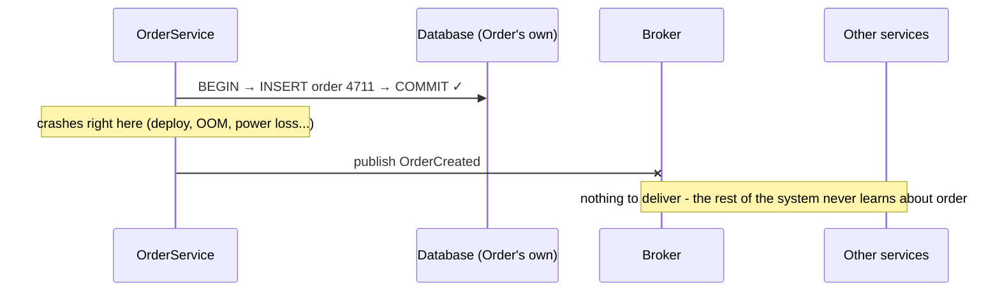
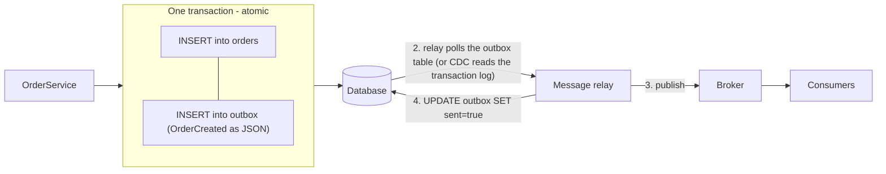
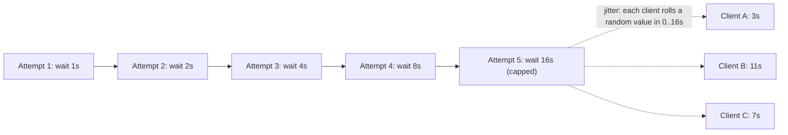
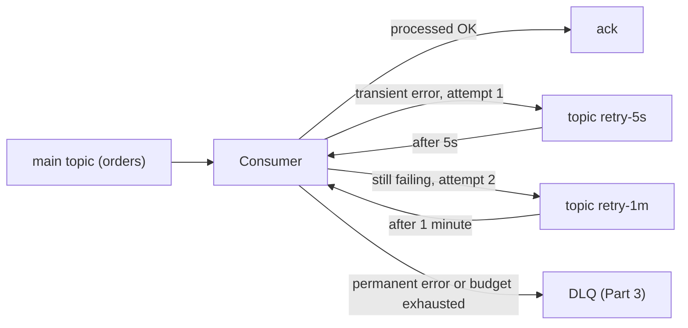
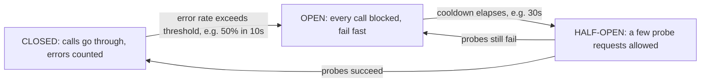

> **"Event-Driven Architecture: The Top 10 Classic Problems" — Part 2 of 7.** 2 PM: Tèo deploys a new release. Right then, an `OrderService` instance gets killed mid-flight — Ms. Tí's order already made it into the database, but the `OrderCreated` event never got published. Later in this part: `PaymentService` calls the payment gateway, which times out because it's overloaded — the code retries immediately, and 200 other instances do the exact same thing, hammering the gateway right as it tries to come back up. Two different problems, one shared lesson: a distributed system doesn't give anything away for free, not even "just try again." [← Part 1 — Lost & Duplicate Events](/memo/posts/event-driven-part-1-lost-and-duplicate-events/)

- **Dual-write:** the database and the broker don't share a transaction — neither ordering of "write the DB" and "publish the event" is safe. The fix is the **transactional outbox**: write the event into your own database, and let a separate relay publish it afterward.
- **Retry** sounds simple but hides four questions: which errors deserve a retry, when, how many times, and does it block the messages behind it?
- A naive retry (immediate, in lockstep) creates a **retry storm** — it multiplies load exactly when downstream is weakest.
- The four-part defense: classify errors first, **exponential backoff + jitter**, a retry budget, and a **circuit breaker**.

---

## 1. Dual-write — the database write succeeds, the publish doesn't

**What is it?** **Dual-write** is when one business operation has to write to _two independent systems_ — `OrderService`'s database and the message broker — and you want "both succeed or both fail," but nothing guarantees that. Two ways it breaks:

- **The DB write succeeds, the publish fails** (a crash, a network blip, a busy broker): the order exists, but the rest of the system never finds out — a gap that's _permanent_, not the temporary kind covered by eventual consistency in Part 4.
- **The publish succeeds, the DB write fails** (if you reverse the order): other services receive an event about an order that... doesn't exist — a phantom event.

There's a fatal gap between the `COMMIT` line and the `publish` line — even a few microseconds wide — where a crash leaves the system in a half-finished state. A low frequency is no comfort: at 1 million orders a month, a "one-in-a-million" incident happens every month.

**Why does it happen?** Because the database and the broker are two worlds that don't share a transaction. Inside a single database, we're spoiled by _atomicity_ (see the box below): bundle multiple statements into one transaction, and they all live or die together. But a Postgres transaction can't reach across into Kafka.

The classic answer to "commit across multiple systems" is **two-phase commit (2PC)** — a coordinator asks every party "ready to commit?", everyone says yes, and only then does the coordinator tell everyone to commit at once. It sounds reasonable, but it's nearly unusable here: mainstream brokers (Kafka, SQS, ...) don't support it; it forces every party to hold locks across the network while waiting on each other; and the coordinator itself becomes a single point of failure. So the fix has to come from somewhere else — and the cleanest one is _stop writing to two places_.

> [!NOTE]
> **Property — Atomicity.** A group of operations is _atomic_ when it's "indivisible": either **all** of it takes effect, or **none** of it does — there's no half-done state, even across a crash. This is the "A" in ACID: `BEGIN … COMMIT` is a promise of atomicity _within one_ database — and the dual-write problem is exactly that promise not stretching across two systems. The mental trick: there's no atomicity _between_ a DB and a broker, so arrange things so that whatever needs to be atomic happens _inside_ one database, where atomicity is free.

**How do you fix it? The Transactional Outbox pattern.** The idea: stop publishing directly. In the same transaction that writes the order, also write the event into a side table in your own database — an `outbox` table. Because it's the same database, these two writes are _atomic for free_. A separate process (a relay) then reads the outbox, publishes each event, and marks it sent.

The order write and the event write are atomic because they're in the same DB. The relay is free to crash at any point in steps 2-4: as long as `sent` isn't marked true, it resends next time. Notice the consequence: a relay that "resends when in doubt" means the outbox delivers events **at-least-once** — duplicates reappear, and Part 1's idempotent consumer picks up the bill. Every path in this series eventually leads back to Part 1.

Two ways to implement the relay:

- **Polling publisher:** a loop that runs `SELECT * FROM outbox WHERE sent = false ORDER BY id LIMIT 100` every few hundred milliseconds, publishes, and marks rows sent. Easy to build; the cost is one poll interval of extra latency plus added read load on the DB.
- **Change Data Capture (CDC):** read the database's _transaction log_ directly (Postgres's WAL, MySQL's binlog). The most common tool is **Debezium** — it pretends to be a database replica, streams change events in real time, and pushes them into Kafka. Lower latency than polling, no added query load; the cost is one more piece of infrastructure to operate.

> [!WARNING]
> **An anti-pattern worth naming.** "Publish inside a try/catch, log and swallow the error" is _silently_ choosing to accept lost events — choosing at-most-once without telling anyone. And "commit only after publish" doesn't escape it either: a crash between publish and commit creates a phantom event. There is no safe ordering of the two writes — only _one_ write (the outbox) is safe. Two related variants worth knowing: **listen-to-yourself** (publish first, and have the service itself subscribe back to that topic to write the DB — no outbox table needed, but now your own data is eventually consistent too); **event sourcing** (drop the state table entirely — the event stream _is_ the database — a much bigger architectural commitment, out of scope for this series).

## 2. Getting retries right — resending without shooting yourself in the foot

**What is it?** A consumer fails to process an event (downstream error, timeout, deadlock). "Just retry it" sounds simple but is actually four questions: retry **what** (which errors deserve it)? **when** (immediately, or wait)? **how many times** (when do you give up)? and **what happens to the messages behind it** (blocked, or allowed to pass)? Get any of these wrong and there's a specific penalty: retrying a permanent error forever (Part 3); retrying immediately causes a retry storm; letting retries jump the queue breaks ordering (Part 3).

**Why is naive retry dangerous?**

First, not every error deserves a retry:

| Error type    | Nature                                             | Examples                                        | Worth retrying?                                                      |
| ------------- | -------------------------------------------------- | ----------------------------------------------- | -------------------------------------------------------------------- |
| **Transient** | the cause _resolves itself_ over time              | timeouts, network blips, HTTP 503, DB deadlocks | **Yes** — waiting a beat and trying again usually works              |
| **Permanent** | the same failure, no matter how many times you try | a malformed payload, HTTP 400, a code bug       | **No** — retrying only burns resources; its fate is Part 3 (the DLQ) |

Second, retry multiplies load exactly when the target is weakest. Downstream is failing _because it's overloaded_, and every client's instinct is to... send more requests. If everyone retries immediately and on the same schedule, they arrive in synchronized waves — the service barely recovers and gets knocked down again — a phenomenon called a **retry storm** (or thundering herd). This is the mechanism behind many famous cascading failures.

**How do you fix it? Four moves: classify, backoff + jitter, a budget, and a circuit breaker.**

**1. Classify the error before retrying.** Catching an exception needs to branch: transient → retry per the policy below; permanent → don't retry, route straight to the DLQ (Part 3). Don't catch everything and retry everything.

**2. Exponential backoff + jitter.** **Exponential backoff:** the wait between retries _doubles_ each time — 1s, 2s, 4s, 8s, 16s... up to a cap. **Jitter:** a random amount added to (or subtracted from) each wait so clients fall _out of phase_ with each other, breaking up synchronized waves. The widely recommended formula (from the AWS Architecture Blog's _Exponential Backoff and Jitter_) is _full jitter_: `delay = random(0, base × 2^n)`.

Backoff protects downstream over _time_; jitter protects it across _phase_ — three clients on the same "attempt #5" roll different random waits, so no synchronized wave lands at once.

**3. A retry budget, and two ways to queue while waiting.** Cap the number of attempts (say, 5) — once exhausted, route to the DLQ (Part 3). But there's a subtler architectural choice: while one message is waiting to retry, what happens to the messages behind it?

- **Blocking retry:** the consumer holds the message, waits, retries — the whole partition waits along with it. You keep ordering, but a single stubborn message blocks thousands of innocent ones behind it — **head-of-line blocking**.
- **Non-blocking retry (a dedicated retry topic):** publish the failed message to a tiered set of waiting topics — `retry-5s`, `retry-1m`, `retry-10m` — the main line keeps flowing immediately; a consumer on the retry topic re-injects the message once its wait is up (the architecture described in Uber Engineering's _Building Reliable Reprocessing and Dead Letter Queues with Apache Kafka_). You gain throughput; you lose ordering, since the message now lands _after_ its younger siblings (check Part 3 first if the business needs per-key ordering before picking this).

**4. Circuit breaker — knowing when to stop trying.** Retry is "try harder"; the **circuit breaker** is the opposite — "stop trying for a while." A counter tracks the error rate on calls to downstream; past a threshold it _opens the circuit_: every call is blocked immediately (fail fast) for a cooldown period, then it _half-opens_ to let a few probe requests through — succeed, and it closes again.

> [!NOTE]
> **Property — Exponential backoff + jitter.** Backoff is the practice of increasing the wait between retries, usually exponentially with a cap. Jitter is a random component added to that wait so clients don't stay in phase. This pair is standard in any well-built client library — AWS SDKs, gRPC, and Kafka producers all ship it built in.
>
> **Property — Circuit breaker.** A self-protective mechanism that _actively stops calling_ a service that's failing hard, instead of continuing to pile load on it. It's philosophically the opposite of retry: retry is optimistic ("this one might work"), a breaker is organized pessimism ("let's pause, then probe"). The two complement each other — retry handles _sporadic_ errors, breakers handle _correlated, large-scale_ ones. Common libraries: Resilience4j (Java), Polly (.NET), opossum (Node.js).

> [!WARNING]
> **The most commonly forgotten precondition.** Every retry is a chance to duplicate a side effect — the previous attempt might have half-succeeded (money already debited, but the response timed out). **You can't turn retry on until idempotency already exists.** The correct build order: idempotent consumer first ([Part 1](/memo/posts/event-driven-part-1-lost-and-duplicate-events/)), retry policy second.

---

← **Previous:** [Part 1 — Lost & Duplicate Events](/memo/posts/event-driven-part-1-lost-and-duplicate-events/) · **Next:** [Part 3 — Poison Messages & Ordering](/memo/posts/event-driven-part-3-poison-messages-and-ordering/) →

**The series — Event-Driven Architecture: The Top 10 Classic Problems:** [0 · Foundations](/memo/posts/event-driven-part-0-foundations/) · [1 · Lost & Duplicate Events](/memo/posts/event-driven-part-1-lost-and-duplicate-events/) · **2 · Outbox & Retries (you are here)** · [3 · Poison Messages & Ordering](/memo/posts/event-driven-part-3-poison-messages-and-ordering/) · [4 · Consistency & Sagas](/memo/posts/event-driven-part-4-consistency-and-sagas/) · [5 · Backpressure & Schema Evolution](/memo/posts/event-driven-part-5-backpressure-and-schema-evolution/) · [6 · Observability & Recap](/memo/posts/event-driven-part-6-observability-and-recap/)
