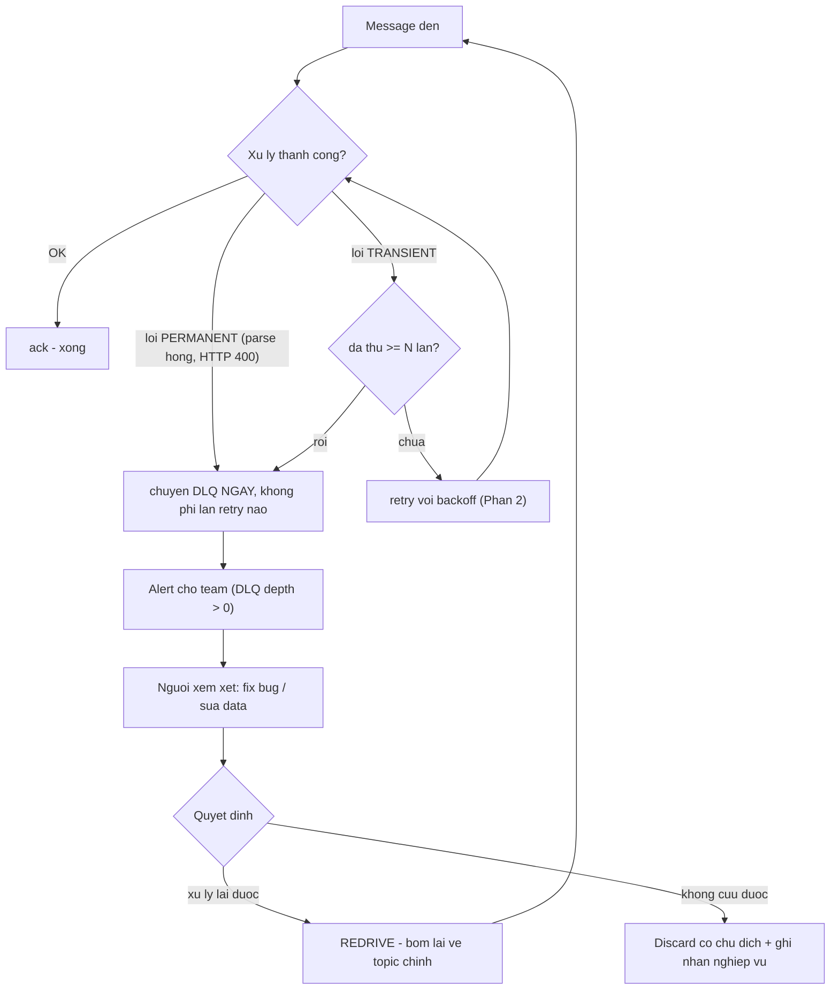
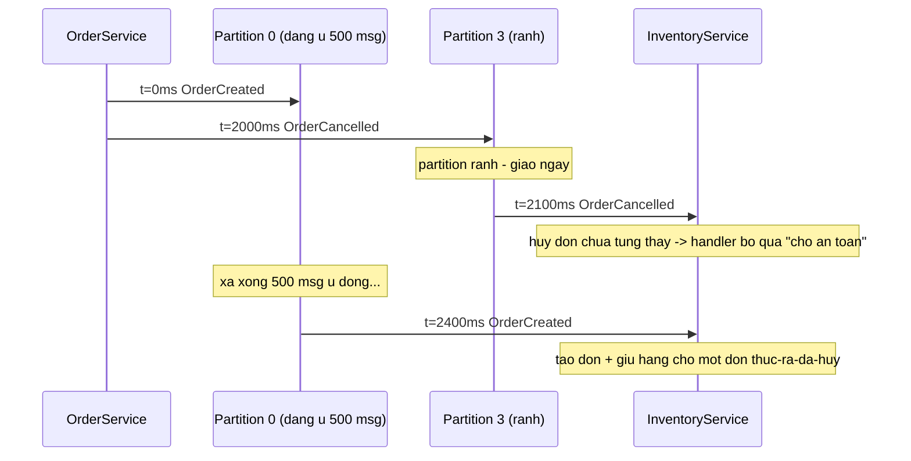

> **"Event-Driven: 10 Bài Toán Kinh Điển" — Phần 3/7.** 2 giờ sáng, alert réo: `NotificationService` ngừng gửi email đã 40 phút — một event lỗi parse bị retry hàng nghìn lần, chắn ngay đầu hàng. Rồi: chị Tí đặt hàng, đổi ý huỷ ngay trong 2 giây — `InventoryService` nhận được `OrderCancelled` _trước khi_ nhận `OrderCreated`. Cả hai bài toán này đều là hậu quả trực tiếp của lựa chọn retry ở [Phần 2](/memo/posts/event-driven-part-2-outbox-and-retries-vi/): retry-vô-hạn đẻ ra poison message; non-blocking retry đẻ ra sai thứ tự.

- **Poison message:** message không bao giờ xử lý thành công dù thử bao nhiêu lần. Sau N lần fail (hoặc ngay khi biết là lỗi vĩnh viễn) → cách ly sang **Dead Letter Queue (DLQ)**, kèm alert và quy trình người trực.
- DLQ không người trực = mất event có giấy chứng tử — sai lầm phổ biến nhất không phải thiếu DLQ, mà là có DLQ nhưng không ai nhìn.
- **Sai thứ tự:** broker chỉ giữ thứ tự _trong một partition_ — song song hoá và thứ tự toàn cục là hai kẻ thù bẩm sinh.
- Lời giải: **partition key** = ID thực thể nghiệp vụ (đủ cho đa số trường hợp) + **version number** để consumer tự phát hiện xáo trộn.

---

## 1. Poison message — một message hỏng bóp nghẹt cả hàng đợi

**What — vấn đề là gì?** **Poison message** (message độc, còn gọi poison pill) là message mà consumer _không bao giờ_ xử lý thành công, dù thử bao nhiêu lần: payload sai định dạng, dữ liệu vi phạm ràng buộc nghiệp vụ, hoặc chọc trúng một bug trong code consumer. Kết hợp với cơ chế "lỗi thì giao lại" của at-least-once ([Phần 1](/memo/posts/event-driven-part-1-lost-and-duplicate-events-vi/)), nó tạo thành vòng lặp vô hạn: giao → lỗi → trả về → giao lại → lỗi… Hậu quả kép: đốt CPU và log vô nghĩa; và nếu consumer xử lý tuần tự theo partition, mọi message phía sau bị chặn — **head-of-line blocking** đã gặp ở [Phần 2](/memo/posts/event-driven-part-2-outbox-and-retries-vi/), lần này vĩnh viễn vì message đầu hàng không bao giờ đi được.

**Why — vì sao xảy ra?** Vì cơ chế retry mặc định **không phân biệt được lỗi transient với lỗi permanent** (phân loại ở Phần 2): nó đối xử với "payload sai định dạng" (thử một triệu lần vẫn sai) y như "database chớp nguồn" (thử lại là được). Với lỗi permanent, retry không phải là kiên trì — là làm mãi một việc và mong kết quả khác đi. Nguồn sinh poison message thì vô tận: producer deploy bug, schema đổi mà consumer chưa kịp ([Phần 5](/memo/posts/event-driven-part-5-backpressure-and-schema-evolution-vi/)), dữ liệu góc cạnh hiếm gặp, hoặc chính consumer có bug với một nhánh input đặc biệt.

**How — giải quyết thế nào? Dead Letter Queue: chỗ nằm tử tế cho message chết.** Nguyên tắc: **sau N lần thất bại, cách ly**. Message được chuyển sang một hàng đợi riêng gọi là **Dead Letter Queue** (DLQ — mượn tên phòng thư vô thừa nhận của bưu điện), kèm metadata pháp y: lỗi gì, stack trace nào, thử mấy lần, từ topic/partition/offset nào. Dòng chính lập tức thông trở lại.



Chú ý nhánh "permanent → DLQ ngay": phân loại lỗi tốt tiết kiệm toàn bộ chi phí retry vô ích. Và chú ý phần bên phải — DLQ không phải điểm kết thúc mà là điểm _bàn giao cho con người_.

Hỗ trợ sẵn có tuỳ hạ tầng: **RabbitMQ** có dead letter exchange (DLX) native; **AWS SQS** có redrive policy với `maxReceiveCount` — quá số lần nhận, tự chuyển sang DLQ; **Kafka** không có DLQ native — tự hiện thực bằng một topic quy ước (ví dụ `orders.DLT`), framework như Spring Kafka có sẵn `DeadLetterPublishingRecoverer`.

> [!WARNING]
> **DLQ không có người trực = mất event có giấy chứng tử.** Sai lầm phổ biến nhất không phải là thiếu DLQ, mà là **có DLQ nhưng không ai nhìn**. Message vào DLQ rồi nằm đó vĩnh viễn thì kết cục nghiệp vụ y hệt mất event ([Phần 1](/memo/posts/event-driven-part-1-lost-and-duplicate-events-vi/)) — chỉ khác là có chỗ để khai quật. DLQ đúng nghĩa phải đi kèm: (1) alert khi có message mới (DLQ depth là metric bắt buộc — [Phần 6](/memo/posts/event-driven-part-6-observability-and-recap-vi/)); (2) quy trình có người chịu trách nhiệm: xem xét → sửa nguyên nhân → **redrive** (bơm lại message về topic chính, lúc này code đã fix) hoặc discard có biên bản. Redrive cũng là lý do consumer phải idempotent — message có thể đã xử lý được một nửa trước khi chết.

> [!NOTE]
> **Tính chất — Dead-lettering & redrive.** **Dead-lettering:** cơ chế tự động cách ly message thất bại lặp lại sang nơi lưu trữ riêng, đổi "lặp vô hạn" lấy "chờ người phân xử". **Redrive:** thao tác ngược — bơm message từ DLQ về hàng đợi gốc sau khi nguyên nhân đã được xử lý. Câu hỏi kiểm tra sức khoẻ hệ thống: "DLQ của bạn đang có bao nhiêu message, và ai là người sẽ nhìn thấy con số đó tăng?" — không trả lời được là chưa có DLQ thật.

## 2. Event sai thứ tự — "huỷ đơn" đến trước "tạo đơn"

**What — vấn đề là gì?** Các event có **quan hệ nhân quả** (cái này phải xảy ra trước cái kia: tạo → sửa → huỷ) được consumer nhận và xử lý **sai trật tự**. Khác với mất và trùng, sai thứ tự thường _không gây lỗi kỹ thuật nào_ — mọi handler đều chạy "thành công" — chỉ có trạng thái cuối cùng là sai: địa chỉ giao hàng bị ghi đè bằng bản cũ, đơn đã huỷ vẫn được giữ kho.

**Why — vì sao xảy ra? Song song hoá và thứ tự là hai kẻ thù bẩm sinh.** Nhớ lại [Phần 0](/memo/posts/event-driven-part-0-foundations-vi/): topic được cắt thành nhiều partition để nhiều consumer xử lý song song. Broker chỉ hứa giữ thứ tự _bên trong một partition_ — giữa các partition là cuộc đua tự do. Bốn nguồn xáo trộn phổ biến:

- **Hai event rơi vào hai partition khác nhau.** Nếu producer không chỉ định khoá phân làn, `OrderCreated #4711` có thể vào partition đang ứ đọng, `OrderCancelled #4711` vào partition đang rảnh — kẻ sinh sau về đích trước.
- **Nhiều consumer instance xử lý song song** — mỗi instance một tốc độ, GC pause, độ trễ mạng khác nhau.
- **Producer retry đảo hàng:** message 1 lỗi mạng phải gửi lại, trong lúc đó message 2 đã đi thoát.
- **Non-blocking retry của chính chúng ta** ([Phần 2](/memo/posts/event-driven-part-2-outbox-and-retries-vi/)): message lỗi đi vòng qua topic retry rồi quay lại — tự động xếp sau mọi message đàn em.



Cuộc đua giữa hai partition: event sinh sau (Cancelled) về đích trước vì đi làn rảnh. Trạng thái cuối của `InventoryService` sai hoàn toàn, dù từng bước đều "chạy ngon". Lỗi loại này không nằm trong log lỗi — nó nằm trong số liệu lệch mà vài ngày sau kế toán mới phát hiện.

Vì sao không bắt cả hệ thống xếp một hàng cho xong? Được — dùng 1 partition duy nhất, 1 consumer duy nhất: thứ tự toàn cục (total ordering) hoàn hảo, và throughput bị đóng đinh ở năng lực một máy đơn, mất luôn lý do tồn tại của kiến trúc phân tán. Thứ tự toàn cục và song song hoá là trade-off trực tiếp — may mắn là nghiệp vụ hiếm khi cần thứ tự toàn cục thật sự.

**How — giải quyết thế nào? Thứ tự theo khoá là đủ, phần còn lại dùng version.**

**1. Partition key: thứ tự ở đúng chỗ cần thứ tự.** Nhận xét then chốt: chẳng ai cần event của đơn #4711 và đơn #4712 đúng thứ tự _với nhau_ — chỉ cần các event _của cùng một đơn_ đúng thứ tự. Vậy: producer đặt **partition key** (khoá phân làn) = định danh thực thể (`orderId`). Broker băm key → mọi event của #4711 luôn rơi vào _cùng một partition_ → được giao _đúng thứ tự phát_ → và vì mỗi partition chỉ một consumer trong nhóm đọc, chúng được xử lý tuần tự. Song song giữa các đơn, tuần tự trong từng đơn — hai thế giới cùng thắng.

```javascript
// Kafka producer - key quyet dinh partition, quyet dinh thu tu
producer.send({
  topic: "orders",
  key: event.orderId, // #4711 -> hash -> luon cung partition
  value: JSON.stringify(event),
});
// Kem theo (bit nguon xao tron so 3 - producer retry dao hang):
// enable.idempotence=true  -> broker danh so thu tu, tu loai ban lech hang
```

**2. Version number: cho consumer khả năng tự phát hiện xáo trộn.** Partition key xử lý được nguồn ①–③ nhưng không cứu được nguồn ④ (retry topic) và không giúp gì khi event đến từ _nhiều topic khác nhau_. Tuyến phòng thủ thứ hai đặt ở consumer: producer đánh **số phiên bản tăng dần theo thực thể** (`version: 1, 2, 3…`) vào event; consumer lưu version đã áp dụng gần nhất và so sánh:

```javascript
// Consumer chong xao tron bang version - ket hop luon dedup Phan 1
async function apply(event) {
  const current = await db.get(`orders/${event.orderId}`); // version dang co, vd 3
  if (event.version <= current.version) {
    return;
  } // cu hon hoac trung -> bo (idempotent!)
  if (event.version > current.version + 1) {
    // nhay coc (vd nhan 5 khi dang 3)
    await parkAndWait(event);
    return; // treo cho manh 4 den
  }
  await db.applyWithVersion(event); // dung manh ke tiep -> ap dung
}
```

Ba nhánh trên là ba chiến lược con: bỏ qua bản cũ (last-write-wins theo version — đủ dùng khi event mang _trạng thái đích_); buffer chờ mảnh thiếu (khi bắt buộc áp dụng đủ và đúng thứ tự — trả giá bằng bộ nhớ và độ trễ); hoặc thiết kế event để thứ tự không còn quan trọng — xem hộp commutativity.

> [!NOTE]
> **Tính chất — Ordering guarantee & Causality.** **Total ordering** (thứ tự toàn cục): mọi consumer thấy mọi event theo đúng một trình tự duy nhất — chỉ đạt được khi hy sinh song song hoá. **Per-key ordering** (thứ tự cục bộ theo khoá): chỉ các event cùng khoá giữ thứ tự với nhau — mức các broker phân tán cung cấp (Kafka: per-partition) và là mức nghiệp vụ thường thật sự cần. **Causality** (quan hệ nhân quả): "A phải có trước thì B mới có nghĩa" — mục tiêu thực chất của cả mục này là bảo toàn nhân quả, và per-key ordering là cách rẻ nhất để đạt nó.
>
> **Tính chất — Commutativity (tính giao hoán).** Hai thao tác _giao hoán_ khi đổi chỗ thứ tự thực hiện mà kết quả cuối không đổi: `a + b = b + a`. Nếu thiết kế được handler giao hoán, bài toán thứ tự... biến mất. Ví dụ: "cộng 50 điểm thưởng" và "cộng 30 điểm thưởng" giao hoán; "đặt địa chỉ = X" và "đặt địa chỉ = Y" thì không — với loại sau phải dùng version. Cấu trúc dữ liệu xây trên nguyên lý này có tên riêng: **CRDT** (Conflict-free Replicated Data Type) — dùng trong hệ cộng tác thời gian thực như Figma, Google Docs.

> [!WARNING]
> **Bẫy liên hoàn với Phần 2 và Phần 5.** Hai quyết định ở phần khác âm thầm phá thứ tự của mục này: (1) non-blocking retry topic ([Phần 2](/memo/posts/event-driven-part-2-outbox-and-retries-vi/)) đưa message lỗi ra khỏi làn — nếu nghiệp vụ cần per-key ordering, các message _cùng key_ với message đang retry cũng phải chờ, không được cho vượt; (2) tăng số partition của topic đang chạy ([Phần 5](/memo/posts/event-driven-part-5-backpressure-and-schema-evolution-vi/)) làm hash key đổi đích — event cũ của #4711 ở partition 2, event mới vào partition 5: thứ tự theo key vỡ trong thời gian chuyển tiếp. Chọn số partition dư dả từ đầu chính là để né bẫy thứ hai.

---

← **Trước:** [Phần 2 — Outbox & Retry](/memo/posts/event-driven-part-2-outbox-and-retries-vi/) · **Tiếp theo:** [Phần 4 — Consistency & Saga](/memo/posts/event-driven-part-4-consistency-and-sagas-vi/) →

**Loạt bài — Event-Driven: 10 Bài Toán Kinh Điển:** [0 · Nền tảng](/memo/posts/event-driven-part-0-foundations-vi/) · [1 · Mất & Trùng](/memo/posts/event-driven-part-1-lost-and-duplicate-events-vi/) · [2 · Outbox & Retry](/memo/posts/event-driven-part-2-outbox-and-retries-vi/) · **3 · Poison & Thứ tự (đang ở đây)** · [4 · Consistency & Saga](/memo/posts/event-driven-part-4-consistency-and-sagas-vi/) · [5 · Backpressure & Schema](/memo/posts/event-driven-part-5-backpressure-and-schema-evolution-vi/) · [6 · Observability & Tổng kết](/memo/posts/event-driven-part-6-observability-and-recap-vi/)
