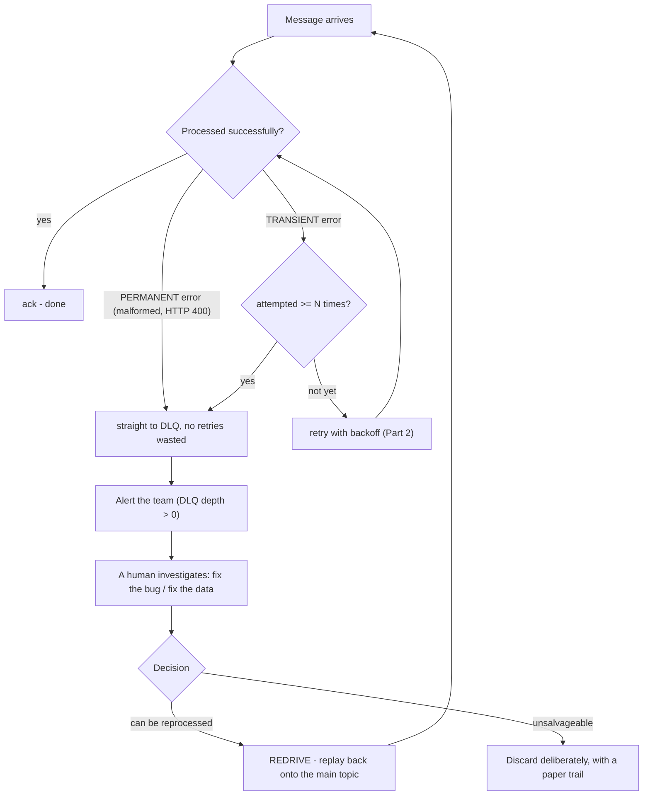
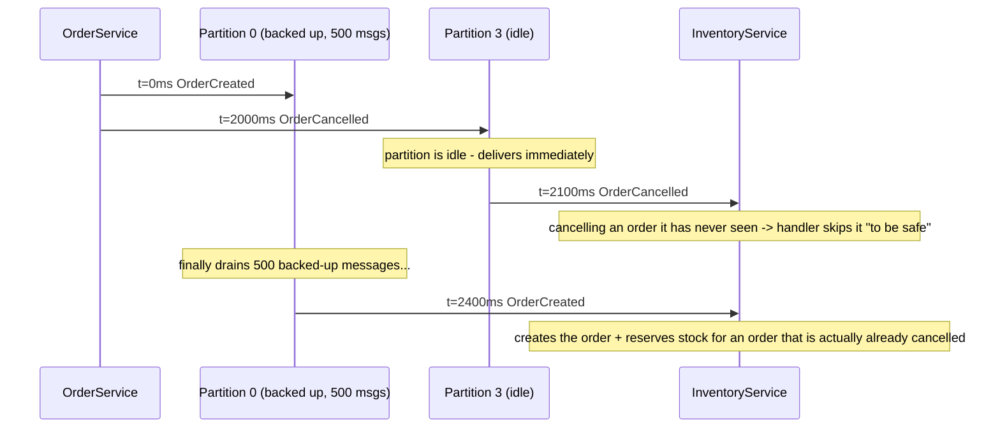

> **"Event-Driven Architecture: The Top 10 Classic Problems" — Part 3 of 7.** 2 AM, an alert fires: `NotificationService` has stopped sending emails for 40 minutes — one malformed event has been retried thousands of times, jammed right at the head of the line. Later: Ms. Tí places an order, then cancels it 2 seconds later — `InventoryService` receives `OrderCancelled` _before_ it receives `OrderCreated`. Both problems here are direct consequences of the retry choices made in [Part 2](/memo/posts/event-driven-part-2-outbox-and-retries/): retrying forever produces poison messages; non-blocking retry produces out-of-order events.

- **Poison message:** a message that never processes successfully, no matter how many times you try. After N failures (or the moment you know the error is permanent) → quarantine it to a **Dead Letter Queue (DLQ)**, with an alert and a human-owned process.
- An unattended DLQ is a lost event with a death certificate — the most common mistake isn't skipping the DLQ, it's having one nobody watches.
- **Out-of-order events:** a broker only preserves ordering _within a single partition_ — parallelism and global ordering are natural enemies.
- The fix: a **partition key** on the business entity's ID (enough for most cases) plus a **version number** so the consumer can detect reordering itself.

---

## 1. Poison messages — one broken message chokes the whole queue

**What is it?** A **poison message** (or poison pill) is a message a consumer _never_ processes successfully, no matter how many times it tries: a malformed payload, data that violates a business rule, or an input that trips a bug in the consumer's own code. Combined with at-least-once's "on error, redeliver" mechanism ([Part 1](/memo/posts/event-driven-part-1-lost-and-duplicate-events/)), it becomes an infinite loop: deliver → fail → return → redeliver → fail... The damage is twofold: wasted CPU and useless log spam; and if the consumer processes a partition sequentially, everything behind it is blocked — the **head-of-line blocking** we met in [Part 2](/memo/posts/event-driven-part-2-outbox-and-retries/), except this time permanently, because the message at the front of the line never moves.

**Why does it happen?** Because the default retry mechanism **can't tell a transient error from a permanent one** (the classification from Part 2): it treats "malformed payload" (still wrong on the millionth try) the same as "the database blipped" (works fine on retry). For a permanent error, retrying isn't persistence — it's doing the same thing forever and expecting a different result. The sources of poison messages are effectively unlimited: a producer deploys a bug, a schema changes before every consumer is ready ([Part 5](/memo/posts/event-driven-part-5-backpressure-and-schema-evolution/)), rare edge-case data, or a bug in the consumer itself triggered by one specific input.

**How do you fix it? The Dead Letter Queue — a decent resting place for dead messages.** The principle: **after N failures, quarantine it.** The message moves to a separate queue called a **Dead Letter Queue (DLQ)** — borrowing the name from the post office's room for undeliverable mail — along with forensic metadata: what error, which stack trace, how many attempts, which topic/partition/offset it came from. The main line is immediately unblocked.



Notice the "permanent → straight to DLQ" branch: good error classification saves the entire cost of a wasted retry loop. And notice the right-hand side — the DLQ isn't an ending, it's a _handoff to a human_.

Built-in support varies by infrastructure: **RabbitMQ** has a native dead letter exchange (DLX); **AWS SQS** has a redrive policy with `maxReceiveCount` — exceed it, and the message is automatically moved to the configured DLQ; **Kafka** has no native DLQ — teams roll their own via a convention topic (e.g., `orders.DLT`), and frameworks like Spring Kafka ship a `DeadLetterPublishingRecoverer` for it.

> [!WARNING]
> **An unattended DLQ is a lost event with a death certificate.** The most common mistake isn't skipping a DLQ — it's **having one nobody watches**. A message that lands in the DLQ and sits there forever has the exact same business outcome as a lost event ([Part 1](/memo/posts/event-driven-part-1-lost-and-duplicate-events/)) — the only difference is there's a spot to dig it back up. A real DLQ needs: (1) an alert when new messages arrive (DLQ depth is a mandatory metric — [Part 6](/memo/posts/event-driven-part-6-observability-and-recap/)); (2) an owned process: investigate → fix the cause → **redrive** (replay the message back onto the main topic, now that the code is fixed) or discard it with a paper trail. Redrive is also why the consumer has to be idempotent — the message may have half-processed before it died.

> [!NOTE]
> **Property — Dead-lettering & redrive.** **Dead-lettering** is the mechanism that automatically quarantines a repeatedly failing message to separate storage, trading "infinite loop" for "waiting on a human judgment call." **Redrive** is the reverse operation — replaying a message from the DLQ back onto the original queue once the root cause has been addressed. A good health check for any system: "how many messages are sitting in your DLQ right now, and who's going to notice if that number climbs?" If nobody can answer, there isn't really a DLQ.

## 2. Out-of-order events — "cancelled" arrives before "created"

**What is it?** Events with a **causal relationship** (this one has to happen before that one: create → modify → cancel) get received and processed **out of order** by the consumer. Unlike loss and duplication, out-of-order delivery usually _doesn't throw any technical error_ — every handler runs "successfully" — only the final state is wrong: a shipping address gets overwritten with a stale value; a cancelled order still gets its stock reserved.

**Why does it happen? Parallelism and ordering are natural enemies.** Recall from [Part 0](/memo/posts/event-driven-part-0-foundations/): a topic is split into partitions so multiple consumers can process it in parallel. The broker only promises ordering _within a single partition_ — across partitions, it's a free-for-all. Four common sources of reordering:

- **Two events land in different partitions.** If the producer doesn't specify a partition key, `OrderCreated #4711` might land in a backed-up partition while `OrderCancelled #4711` lands in an idle one — the younger event finishes first.
- **Multiple consumer instances processing in parallel** — each at its own speed, with its own GC pauses and network latency.
- **Producer retries reshuffle the send order:** message 1 hits a network error and has to be resent, while message 2 already made it through.
- **Our own non-blocking retry** ([Part 2](/memo/posts/event-driven-part-2-outbox-and-retries/)): a failed message loops through a retry topic and comes back — automatically landing behind every message that arrived after it.



A race between two partitions: the younger event (Cancelled) finishes first because it took the idle lane. `InventoryService`'s final state is completely wrong, even though every individual step "ran fine." This class of bug never shows up in an error log — it shows up as a discrepancy accounting finds days later.

Why not just force the whole system into a single line? You could — one partition, one consumer: perfect total ordering, and throughput pinned to the capacity of a single machine, which erases the entire reason to go distributed in the first place. Total ordering and parallelism are a direct trade-off — fortunately, the business rarely actually needs true global ordering.

**How do you fix it? Per-key ordering is enough; version numbers cover the rest.**

**1. Partition key: put ordering exactly where it's needed.** The key insight: nobody needs order #4711's events and order #4712's events to be ordered _relative to each other_ — only events _for the same order_ need to stay in order. So: the producer sets a **partition key** equal to the entity's ID (`orderId`). The broker hashes the key → every event for #4711 always lands in the _same partition_ → gets delivered _in send order_ → and since each partition is read by exactly one consumer within a group, it's processed sequentially. Parallel across orders, sequential within one order — both worlds win.

```javascript
// Kafka producer - the key decides the partition, which decides the order
producer.send({
  topic: "orders",
  key: event.orderId, // #4711 -> hash -> always the same partition
  value: JSON.stringify(event),
});
// Pair with (closes reordering source #3 - producer retries reshuffling order):
// enable.idempotence=true  -> broker numbers messages and drops reshuffled duplicates
```

**2. Version numbers: let the consumer detect reordering on its own.** A partition key handles sources ①-③ but doesn't save you from source ④ (retry topics), and it doesn't help when events arrive from _multiple different topics_. The second line of defense sits on the consumer: the producer stamps an **increasing version number, per entity** (`version: 1, 2, 3...`) on the event; the consumer stores the last version it applied and compares:

```javascript
// Consumer that guards against reordering using version numbers - also folds in Part 1's dedup
async function apply(event) {
  const current = await db.get(`orders/${event.orderId}`); // current version, e.g. 3
  if (event.version <= current.version) {
    return;
  } // stale or duplicate -> skip (idempotent!)
  if (event.version > current.version + 1) {
    // a gap (e.g. receiving 5 while at 3)
    await parkAndWait(event);
    return; // park it, wait for #4 to arrive
  }
  await db.applyWithVersion(event); // exactly the next piece -> apply it
}
```

The three branches are three sub-strategies: discard stale versions (last-write-wins — fine when the event carries _target state_); buffer while waiting for a missing piece (when you truly need every event, in order — the cost is memory and latency); or design events so ordering stops mattering — see the commutativity box.

> [!NOTE]
> **Property — Ordering guarantee & Causality.** **Total ordering:** every consumer sees every event in exactly the same sequence — only achievable by giving up parallelism. **Per-key ordering:** only events sharing a key stay ordered relative to each other — this is what distributed brokers actually provide (Kafka: per-partition) and it's usually all the business actually needs. **Causality:** the relationship "A has to happen before B makes sense" — the real goal of this whole section is preserving causality, and per-key ordering is the cheapest way to get it.
>
> **Property — Commutativity.** Two operations are _commutative_ when swapping their order doesn't change the final result: `a + b = b + a`. If you can design a commutative handler, the ordering problem... disappears. Example: "add 50 loyalty points" and "add 30 loyalty points" commute; "set address = X" and "set address = Y" don't — the latter needs a version number. Data structures built on this principle have their own name: **CRDTs** (Conflict-free Replicated Data Types), used in real-time collaboration tools like Figma and Google Docs.

> [!WARNING]
> **Chained traps with Part 2 and Part 5.** Two decisions made elsewhere quietly break the ordering this section works to establish: (1) a non-blocking retry topic ([Part 2](/memo/posts/event-driven-part-2-outbox-and-retries/)) pulls a failed message out of its lane — if the business needs per-key ordering, every message _sharing that key_ has to wait too, not jump ahead; (2) increasing a live topic's partition count ([Part 5](/memo/posts/event-driven-part-5-backpressure-and-schema-evolution/)) re-hashes keys to new destinations — an old event for #4711 sits in partition 2, a new one lands in partition 5, and per-key ordering breaks during the transition. Provisioning partitions generously up front is exactly how you dodge the second trap.

---

← **Previous:** [Part 2 — Outbox & Retries](/memo/posts/event-driven-part-2-outbox-and-retries/) · **Next:** [Part 4 — Consistency & Sagas](/memo/posts/event-driven-part-4-consistency-and-sagas/) →

**The series — Event-Driven Architecture: The Top 10 Classic Problems:** [0 · Foundations](/memo/posts/event-driven-part-0-foundations/) · [1 · Lost & Duplicate Events](/memo/posts/event-driven-part-1-lost-and-duplicate-events/) · [2 · Outbox & Retries](/memo/posts/event-driven-part-2-outbox-and-retries/) · **3 · Poison Messages & Ordering (you are here)** · [4 · Consistency & Sagas](/memo/posts/event-driven-part-4-consistency-and-sagas/) · [5 · Backpressure & Schema Evolution](/memo/posts/event-driven-part-5-backpressure-and-schema-evolution/) · [6 · Observability & Recap](/memo/posts/event-driven-part-6-observability-and-recap/)
