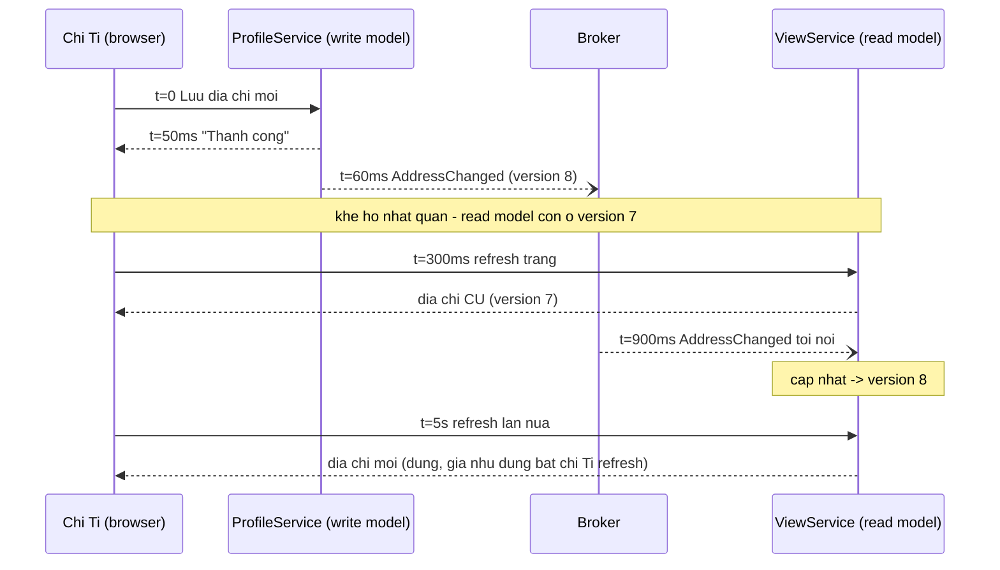
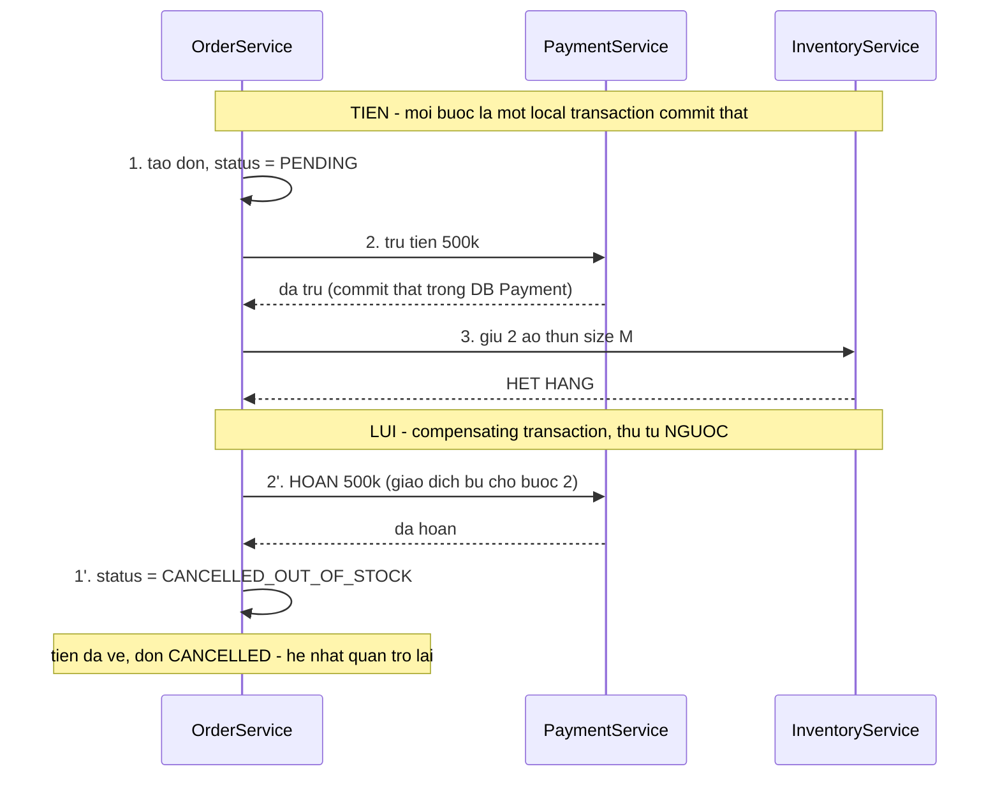
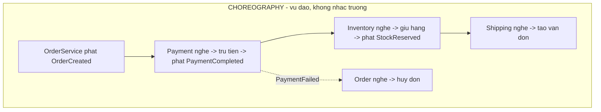
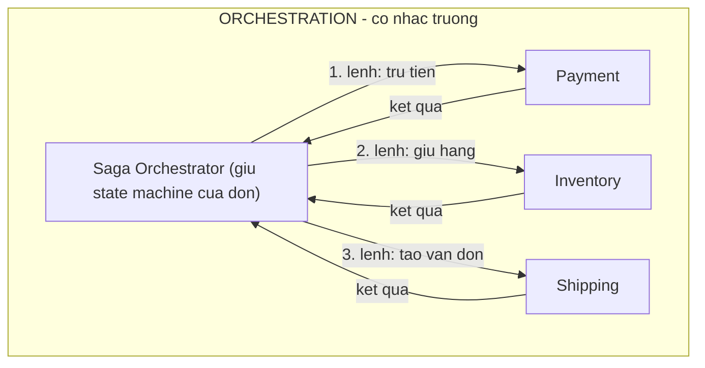

> **"Event-Driven: 10 Bài Toán Kinh Điển" — Phần 4/7.** Chị Tí đổi địa chỉ giao hàng, bấm Lưu, thấy "Thành công ✓". Chị refresh trang — vẫn địa chỉ cũ. Không có gì hỏng cả — hệ thống đang nhất quán _dần dần_, đúng như thiết kế, chỉ là chưa ai nói điều đó với chị Tí. Rồi: đặt hàng ở MuaLẹ = trừ tiền + giữ kho + tạo vận đơn — tiền đã trừ xong thì kho báo hết hàng. Trong monolith, một dòng `ROLLBACK` cứu tất cả; ở đây tiền và kho nằm ở hai database khác nhau. Hai bài toán khác nhau, chung một gốc: `database-per-service` (mỗi service tự có database) đổi lấy deploy độc lập, nhưng xoá luôn khái niệm transaction xuyên service.

- **Eventual consistency** (nhất quán sau cùng): dữ liệu ghi ở một nơi, lan truyền sang nơi khác qua event, luôn có độ trễ. Đây là tính chất _được chọn_ (định lý CAP), không phải bug.
- Vá lỗ hổng khó chịu nhất — mất **read-your-own-writes** — bằng optimistic UI, version token, hoặc nói thật với người dùng về độ trễ.
- **Saga**: cắt một giao dịch lớn thành chuỗi transaction nhỏ; bước nào hỏng thì chạy **compensating transaction** (giao dịch bù) cho các bước trước, theo thứ tự ngược.
- Hai cách tổ chức saga: **choreography** (nghe event dây chuyền) và **orchestration** (state machine trung tâm).

---

## 1. Eventual consistency — vừa lưu xong mà đọc lại chưa thấy

**What — vấn đề là gì?** Trong hệ event-driven, dữ liệu ghi ở một nơi và _lan truyền_ sang các nơi khác qua event — luôn với một độ trễ. Trong khoảng trễ đó, ai đọc ở "nơi khác" sẽ thấy **dữ liệu cũ** (stale data). Vấn đề trở thành sự cố khi độ trễ chạm vào con người: người _vừa ghi_ mà đọc lại không thấy thay đổi của chính mình (mất read-your-own-writes), hoặc hai màn hình cạnh nhau hiển thị hai con số khác nhau.

**Why — vì sao xảy ra? Đây là tính chất, không phải bug.** Vì kiến trúc này _được định nghĩa_ bằng sự bất đồng bộ ([Phần 0](/memo/posts/event-driven-part-0-foundations-vi/)): write model trả lời ngay khi phần của nó xong, còn read model (view, dashboard) cập nhật _sau_, khi event lan tới.

Độ dài khe hở nhất quán = độ trễ lan truyền event = chính là consumer lag của [Phần 5](/memo/posts/event-driven-part-5-backpressure-and-schema-evolution-vi/). Bình thường vài chục ms — không ai để ý; lúc hệ thống ứ đọng thành vài phút — mọi thứ "trông như mất dữ liệu".

Nền lý thuyết, gói trong một câu: trong hệ phân tán, khi mạng có thể đứt gãy giữa các node, ta buộc phải chọn giữa _chờ nhau để luôn nhất quán_ (hy sinh tính sẵn sàng và độ trễ) và _trả lời ngay rồi đồng bộ sau_ (hy sinh nhất quán tức thời) — **định lý CAP** mô tả ràng buộc này. Event-driven đã chọn vế thứ hai một cách có chủ đích.

> [!NOTE]
> **Tính chất — Strong vs Eventual consistency, và Read-your-own-writes.** **Strong consistency:** mọi lần đọc, ở bất kỳ đâu, luôn thấy bản ghi mới nhất — như một database duy nhất có transaction. **Eventual consistency** (nhất quán sau cùng): lời hứa yếu hơn — _nếu ngừng ghi mới, tất cả các nơi rồi sẽ hội tụ về cùng một giá trị_; không hứa "bao lâu", chỉ hứa "rồi sẽ". Ở giữa hai cực có **read-your-own-writes**: không cần cả thế giới thấy ngay, nhưng _người vừa ghi_ phải thấy thay đổi của chính mình — vi phạm nó là thứ người dùng cảm nhận rõ nhất ("tôi vừa lưu mà?!"). **Staleness** (độ cũ): khoảng cách thời gian giữa dữ liệu đang đọc và sự thật mới nhất — đo được (= consumer lag), quản lý được bằng SLO, ví dụ "p99 staleness của read model < 2 giây".

**How — giải quyết thế nào? Không xoá được khe hở thì thiết kế quanh nó.**

**1. Chọn đúng mức nhất quán cho từng chỗ đọc.** Không phải màn hình nào cũng cần như nhau. Số dư ví tiền, tồn kho lúc bấm thanh toán: đọc thẳng write model (strong, chấp nhận chậm hơn). Danh sách đơn hàng, dashboard: read model eventual là hoàn toàn ổn. Sai lầm phổ biến là trả lời "hệ này strong hay eventual?" _một lần cho toàn hệ thống_ — câu hỏi đúng phải hỏi _cho từng luồng đọc_.

**2. Vá trải nghiệm read-your-own-writes.**

- **Optimistic UI:** client vừa ghi xong tự cập nhật giao diện bằng dữ liệu nó _đã biết_ — không cần chờ read model.
- **Version token:** write model trả về `version=8`; client gửi kèm token đó khi đọc: "cho tôi dữ liệu _ít nhất_ version 8"; read model chưa tới 8 thì chờ một nhịp hoặc chuyển hướng đọc từ write model. Cách các hệ CQRS nghiêm túc hay dùng.
- **Ghim phiên đọc** (session pinning): trong X giây sau khi ghi, mọi lần đọc của phiên đó đi thẳng write model.

**3. Nói thật với người dùng.** Dashboard ghi rõ "số liệu trễ tối đa 1 phút"; màn hình sau thanh toán ghi "đơn hàng đang được xử lý". Rẻ nhất trong mọi giải pháp, và thường là đủ — phần lớn cơn giận của người dùng không đến từ độ trễ, mà đến từ độ trễ _không được báo trước_.

> [!NOTE]
> **CQRS — thuật ngữ hay đi kèm mục này.** **CQRS** (Command Query Responsibility Segregation — tách trách nhiệm ghi và đọc): pattern tách hẳn _write model_ (nơi xử lý lệnh, giữ ràng buộc nghiệp vụ) khỏi _read model_ (nơi tối ưu cho truy vấn), dùng event làm chất keo đồng bộ từ write sang read. Sơ đồ ProfileService/ViewService ở trên chính là CQRS tối giản. Sức mạnh: mỗi bên tối ưu độc lập, read scale vô hạn. Cái giá: khe hở nhất quán trở thành công dân hạng nhất của kiến trúc, phải được đặt tên, đo lường và thiết kế quanh nó.

## 2. Saga — transaction trải qua ba service, hỏng ở bước thứ hai

**What — vấn đề là gì?** Đặt hàng ở MuaLẹ = trừ tiền (`PaymentService`) + giữ kho (`InventoryService`) + tạo vận đơn (`ShippingService`). Tiền của chị Tí đã trừ xong thì kho báo: hết hàng. Trong monolith, một dòng `ROLLBACK` cứu tất cả. Ở đây, tiền nằm ở database của Payment, kho nằm ở database của Inventory — không có `ROLLBACK` nào với tay qua hai database.

Một **giao dịch nghiệp vụ** (business transaction) trải trên nhiều service, mỗi service một database riêng. Yêu cầu nghiệp vụ vẫn là all-or-nothing như atomicity ở [Phần 2](/memo/posts/event-driven-part-2-outbox-and-retries-vi/) — "hoặc đơn hoàn tất trọn vẹn, hoặc coi như chưa từng đặt" — nhưng phương tiện kỹ thuật (transaction ACID) chỉ tồn tại _bên trong từng database_.

**Why — vì sao xảy ra?** Gốc rễ là nguyên tắc **database-per-service**: mỗi microservice sở hữu độc quyền database của mình — chính điều đó cho phép các team deploy độc lập, đổi schema tự do (lợi ích cốt lõi của microservice). Còn two-phase commit — giải pháp giáo khoa cho transaction phân tán — đã bị loại từ [Phần 2](/memo/posts/event-driven-part-2-outbox-and-retries-vi/) (không được hạ tầng phổ biến hỗ trợ, giữ khoá qua mạng, điểm chết đơn). Vậy phải xây "all-or-nothing" từ vật liệu khác: nhiều transaction nhỏ + cam kết dọn dẹp.

**How — giải quyết thế nào? Saga: chuỗi transaction nhỏ + hoàn tác nghiệp vụ.** **Saga** (tên gốc từ bài báo "Sagas" của Garcia-Molina & Salem, 1987 — trước microservice ba thập kỷ) cắt giao dịch lớn thành **chuỗi local transaction**, mỗi bước commit thật sự trong database của service đó; nếu bước thứ k thất bại, chạy **compensating transaction** (giao dịch bù) cho các bước 1..k-1 _theo thứ tự ngược_, đưa hệ thống về trạng thái tương đương ban đầu.

Để ý: lịch sử "đã trừ rồi hoàn" _vẫn tồn tại_ trên sao kê của chị Tí — saga không xoá quá khứ như ROLLBACK, nó viết thêm một chương sửa sai. Đó là khác biệt bản chất giữa hoàn tác nghiệp vụ và hoàn tác kỹ thuật.

> [!NOTE]
> **Tính chất — Compensating transaction (giao dịch bù).** Thao tác nghiệp vụ _đảo ngược hiệu ứng_ của một bước đã commit: refund đảo cho charge, nhả-hàng đảo cho giữ-hàng. Khác rollback kỹ thuật ở hai điểm: (1) nó là code nghiệp vụ phải _tự viết và tự test_ cho từng bước tiến; (2) nó không làm quá khứ biến mất — chỉ trung hoà hậu quả. Hệ quả thiết kế: bước nào không bù được (gửi email không "rút lại" được, bắn tiền sang ngân hàng khác không tự đòi được) phải xếp _cuối saga_ — gọi là **pivot transaction**, điểm không quay đầu. Lưu ý ngầm: message giữa các bước saga vẫn là at-least-once — bước "hoàn tiền" cũng có thể được giao 2 lần → compensating transaction _cũng phải idempotent_ ([Phần 1](/memo/posts/event-driven-part-1-lost-and-duplicate-events-vi/) xuất hiện lần thứ tư).

**Hai cách tổ chức saga: ai là người nhớ kịch bản?**

| Tiêu chí       | Choreography                                        | Orchestration                                                                          |
| -------------- | --------------------------------------------------- | -------------------------------------------------------------------------------------- |
| Nhìn thấy flow | Khó — phải ghép n file config trong đầu             | Dễ — kịch bản là một state machine đọc được                                            |
| Coupling       | Lỏng nhất — service chỉ biết event, không biết nhau | Orchestrator biết mọi bước (coupling dồn về một chỗ có chủ đích)                       |
| Hạ tầng thêm   | Không                                               | Orchestrator phải HA + lưu bền trạng thái saga (Temporal, AWS Step Functions, Camunda) |
| Hợp với        | Saga ngắn 2–3 bước, ít nhánh lỗi                    | Saga dài, nhiều nhánh bù, cần audit "đơn này đang kẹt ở bước nào"                      |

> [!WARNING]
> **Khe hở giữa lúc saga đang chạy — semantic lock.** Trong lúc saga của đơn #4711 còn dang dở, service khác có thể đọc trúng trạng thái nửa vời (tiền đã trừ, đơn chưa chốt). Vì không còn khoá của database (2PC mới có khoá — và ta đã từ chối nó), saga dùng **semantic lock** (khoá ngữ nghĩa): đánh dấu trạng thái trung gian ngay trong dữ liệu — `status = PENDING` — và mọi bên đọc phải hiểu quy ước "PENDING = đừng tin hẳn, đừng sửa đè". Đó là lý do bước ① ở sơ đồ trên tạo đơn với PENDING chứ không phải CONFIRMED — ăn khớp với triết lý "nói thật với người dùng" ở mục 1.

---

← **Trước:** [Phần 3 — Poison & Thứ Tự](/memo/posts/event-driven-part-3-poison-messages-and-ordering-vi/) · **Tiếp theo:** [Phần 5 — Backpressure & Schema](/memo/posts/event-driven-part-5-backpressure-and-schema-evolution-vi/) →

**Loạt bài — Event-Driven: 10 Bài Toán Kinh Điển:** [0 · Nền tảng](/memo/posts/event-driven-part-0-foundations-vi/) · [1 · Mất & Trùng](/memo/posts/event-driven-part-1-lost-and-duplicate-events-vi/) · [2 · Outbox & Retry](/memo/posts/event-driven-part-2-outbox-and-retries-vi/) · [3 · Poison & Thứ tự](/memo/posts/event-driven-part-3-poison-messages-and-ordering-vi/) · **4 · Consistency & Saga (đang ở đây)** · [5 · Backpressure & Schema](/memo/posts/event-driven-part-5-backpressure-and-schema-evolution-vi/) · [6 · Observability & Tổng kết](/memo/posts/event-driven-part-6-observability-and-recap-vi/)
