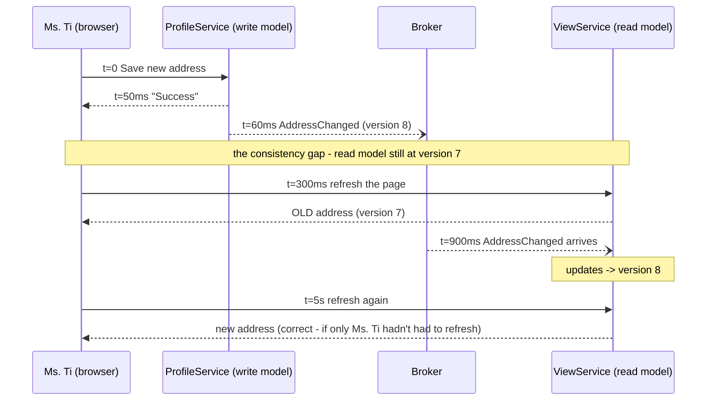
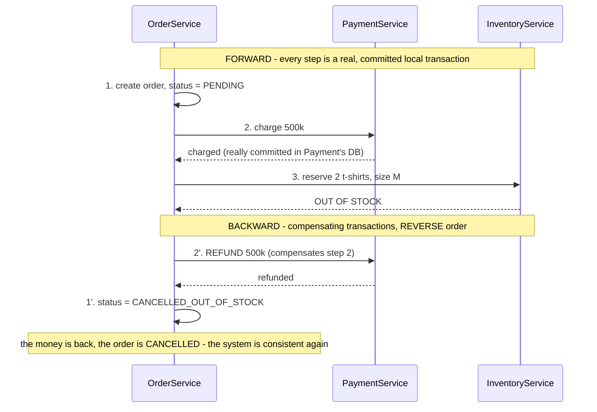
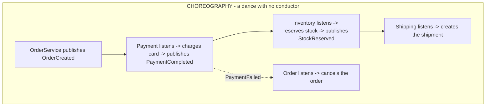
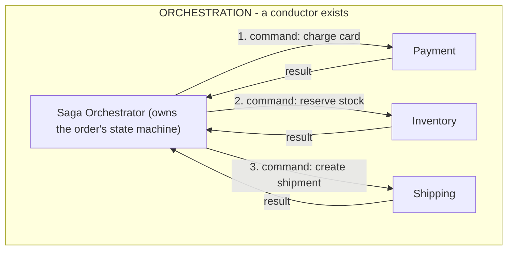

> **"Event-Driven Architecture: The Top 10 Classic Problems" — Part 4 of 7.** Ms. Tí changes her shipping address, clicks Save, sees "Success ✓." She refreshes the page — it still shows the old address. Nothing is broken — the system is becoming consistent _gradually_, exactly as designed; nobody has told Ms. Tí that yet. Later: placing an order at MuaLẹ means charging the card + reserving stock + creating a shipment — the charge goes through, then inventory reports out of stock. In a monolith, one `ROLLBACK` fixes everything; here, the money and the stock live in two different databases. Two different problems, one shared root: **database-per-service** (every service owns its own database) buys independent deployability, but it also erases the very concept of a cross-service transaction.

- **Eventual consistency:** data written in one place propagates to other places via events, always with some delay. This is a _chosen_ property (per the CAP theorem), not a bug.
- The most annoying gap it opens — losing **read-your-own-writes** — gets patched with optimistic UI, a version token, or just being honest with users about the delay.
- **Saga:** split one large transaction into a chain of small transactions; if any step fails, run a **compensating transaction** for the earlier ones, in reverse order.
- Two ways to organize a saga: **choreography** (each service reacts to the previous one's event) and **orchestration** (one central state machine).

---

## 1. Eventual consistency — you save it, read it back, and it isn't there

**What is it?** In an event-driven system, data written in one place _propagates_ to other places via events — always with some delay. During that gap, anyone reading from the "other place" sees **stale data**. This turns into an actual incident when the delay touches a human: someone who _just wrote_ something reads it back and doesn't see their own change (losing read-your-own-writes), or two screens sitting side by side show two different numbers.

**Why does it happen? It's a property, not a bug.** This architecture is _defined_ by asynchrony ([Part 0](/memo/posts/event-driven-part-0-foundations/)): the write model replies the moment its own part is done, while the read model (a view, a dashboard) updates _later_, once the event propagates.

The length of the consistency gap equals the propagation delay of the event — which is exactly the consumer lag from [Part 5](/memo/posts/event-driven-part-5-backpressure-and-schema-evolution/). Normally it's tens of milliseconds and nobody notices; when the system backs up, it stretches to minutes — and everything "looks like" data loss.

The theory, in one sentence: in a distributed system, where the network between nodes can break, you're forced to choose between _waiting for everyone so you're always consistent_ (sacrificing availability and latency) and _answering immediately, then syncing later_ (sacrificing immediate consistency) — the **CAP theorem** describes this constraint. Event-driven architecture deliberately picks the second option.

> [!NOTE]
> **Property — Strong vs. Eventual Consistency, and Read-your-own-writes.** **Strong consistency:** every read, from anywhere, always sees the latest write — as if there were one single database with transactions. **Eventual consistency:** a weaker promise — _if writes stop, every replica will eventually converge on the same value_; it doesn't promise "how soon," only "eventually." Between the two extremes sits **read-your-own-writes**: the whole world doesn't need to see a change immediately, but the _person who just wrote it_ has to see their own change — violating it is the thing users notice most ("I literally just saved this?!"). **Staleness:** the time gap between what you're reading and the latest truth — it's measurable (it equals consumer lag), and manageable with an SLO, e.g. "p99 staleness of the read model < 2 seconds."

**How do you fix it? You can't close the gap, so you design around it.**

**1. Pick the right consistency level per read path.** Not every screen needs the same thing. A wallet balance, or stock availability at checkout: read straight from the write model (strong, accept the extra latency). An order history list, a dashboard: an eventual read model is completely fine. The common mistake is answering "is this system strong or eventual?" _once, for the whole system_ — the right question is _per read path_.

**2. Patch the read-your-own-writes experience.**

- **Optimistic UI:** right after writing, the client updates its own display using data it _already knows_ — no need to wait on the read model.
- **Version token:** the write model returns `version=8`; the client attaches that token on its next read: "give me data at _at least_ version 8"; if the read model hasn't caught up, it waits a beat or redirects the read to the write model. This is how serious CQRS systems typically handle it.
- **Session pinning:** for X seconds after a write, every read in that session goes straight to the write model.

**3. Be honest with users.** A dashboard that says "figures may lag up to one minute"; a post-checkout screen that says "your order is being processed." The cheapest of all the fixes, and usually enough — most user frustration doesn't come from delay itself, it comes from delay that _wasn't announced_.

> [!NOTE]
> **CQRS — a term that comes up a lot here.** **CQRS** (Command Query Responsibility Segregation): a pattern that fully separates the _write model_ (where commands are processed and business rules enforced) from the _read model_ (optimized for queries), using events as the glue that syncs write to read. The ProfileService/ViewService diagram above is CQRS in its simplest form. The power: each side optimizes independently, and reads scale without limit. The cost: the consistency gap becomes a first-class citizen of the architecture — it has to be named, measured, and designed around.

## 2. Sagas — a transaction spanning three services, failing at step two

**What is it?** Placing an order at MuaLẹ means: charge the card (`PaymentService`) + reserve stock (`InventoryService`) + create a shipment (`ShippingService`). Ms. Tí's card gets charged, then inventory reports: out of stock. In a monolith, one `ROLLBACK` fixes everything. Here, the money lives in Payment's database and the stock lives in Inventory's database — no `ROLLBACK` can reach across two databases.

A **business transaction** spans multiple services, each with its own database. The business requirement is still all-or-nothing, exactly like the atomicity from [Part 2](/memo/posts/event-driven-part-2-outbox-and-retries/) — "either the order completes entirely, or it's as if it never happened" — but the technical mechanism for that (an ACID transaction) only exists _inside a single database_.

**Why does it happen?** The root cause is the **database-per-service** principle: every microservice exclusively owns its own database — which is exactly what lets teams deploy independently and change schemas freely (the core benefit of microservices). And two-phase commit — the textbook answer for distributed transactions — was already ruled out in [Part 2](/memo/posts/event-driven-part-2-outbox-and-retries/) (unsupported by mainstream infrastructure, holds locks across the network, has a single point of failure). So "all-or-nothing" has to be built from different materials: many small transactions plus a commitment to clean up.

**How do you fix it? Sagas: a chain of small transactions plus business-level undo.** The **Saga pattern** (from Garcia-Molina & Salem's 1987 paper "Sagas" — three decades before microservices existed) breaks a large transaction into a **chain of local transactions**, each one genuinely committed inside that service's own database; if step k fails, run a **compensating transaction** for steps 1 through k-1, _in reverse order_, bringing the system back to an equivalent starting state.

Notice: the history of "charged, then refunded" _still exists_ on Ms. Tí's statement — a saga doesn't erase the past the way ROLLBACK does, it writes an additional correcting chapter. That's the fundamental difference between a business-level undo and a technical one.

> [!NOTE]
> **Property — Compensating transaction.** A business operation that _reverses the effect_ of an already-committed step: a refund reverses a charge, releasing stock reverses a reservation. It differs from a technical rollback in two ways: (1) it's business logic that has to be _written and tested by hand_ for every forward step; (2) it doesn't make the past disappear — it only neutralizes the consequence. Design implication: any step that can't be undone (an email already sent, money wired to a different bank that you can't claw back) has to go _last_ in the saga — the **pivot transaction**, the point of no return. A quiet detail: messages between saga steps are still at-least-once — the "refund" step can also be delivered twice → the compensating transaction _also has to be idempotent_ ([Part 1](/memo/posts/event-driven-part-1-lost-and-duplicate-events/) makes its fourth appearance here).

**Two ways to organize a saga: who remembers the script?**

| Criterion            | Choreography                                        | Orchestration                                                                                          |
| -------------------- | --------------------------------------------------- | ------------------------------------------------------------------------------------------------------ |
| Seeing the flow      | Hard — you have to mentally assemble N config files | Easy — the script is one readable state machine                                                        |
| Coupling             | Loosest — services only know events, not each other | The orchestrator knows every step (coupling concentrated deliberately)                                 |
| Extra infrastructure | None                                                | The orchestrator must be highly available + persist saga state (Temporal, AWS Step Functions, Camunda) |
| Good fit for         | Short sagas, 2-3 steps, few failure branches        | Long sagas, many compensation branches, need to audit "which step is order X stuck at"                 |

> [!WARNING]
> **The gap while a saga is in flight — the semantic lock.** While order #4711's saga is still incomplete, another service might read exactly that half-finished state (money charged, order not yet confirmed). Since there's no database lock spanning both systems (only 2PC had that, and it's already been ruled out), sagas use a **semantic lock**: mark the intermediate state directly in the data — `status = PENDING` — and every reader has to understand the convention: "PENDING means don't fully trust it, don't overwrite it." That's why step ① in the diagram above creates the order as PENDING, not CONFIRMED — it lines up with the "be honest with users" philosophy from section 1.

---

← **Previous:** [Part 3 — Poison Messages & Ordering](/memo/posts/event-driven-part-3-poison-messages-and-ordering/) · **Next:** [Part 5 — Backpressure & Schema Evolution](/memo/posts/event-driven-part-5-backpressure-and-schema-evolution/) →

**The series — Event-Driven Architecture: The Top 10 Classic Problems:** [0 · Foundations](/memo/posts/event-driven-part-0-foundations/) · [1 · Lost & Duplicate Events](/memo/posts/event-driven-part-1-lost-and-duplicate-events/) · [2 · Outbox & Retries](/memo/posts/event-driven-part-2-outbox-and-retries/) · [3 · Poison Messages & Ordering](/memo/posts/event-driven-part-3-poison-messages-and-ordering/) · **4 · Consistency & Sagas (you are here)** · [5 · Backpressure & Schema Evolution](/memo/posts/event-driven-part-5-backpressure-and-schema-evolution/) · [6 · Observability & Recap](/memo/posts/event-driven-part-6-observability-and-recap/)
