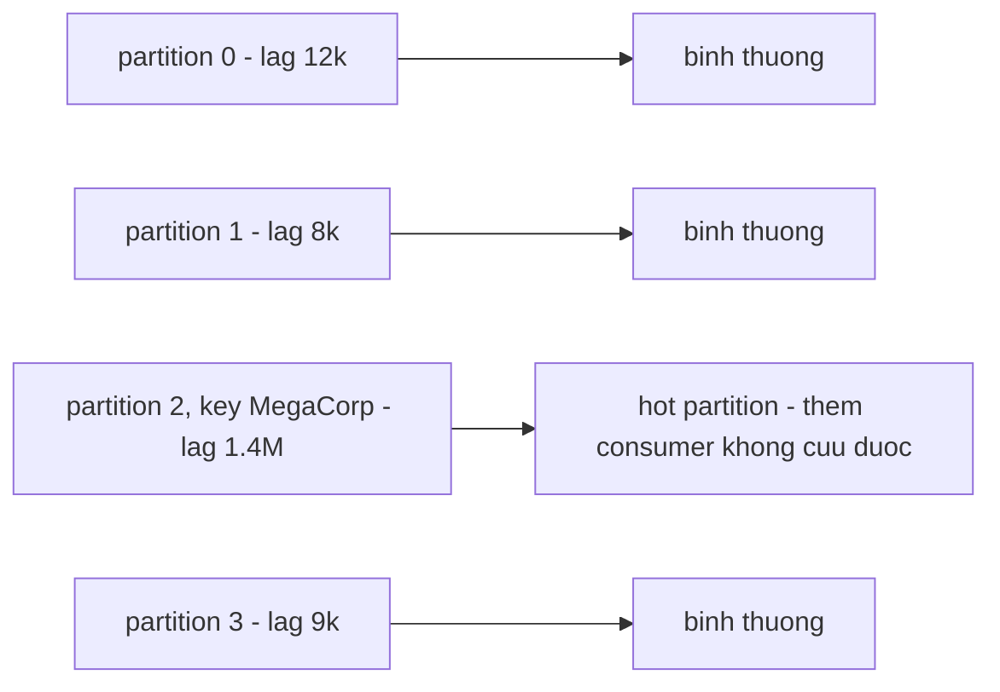
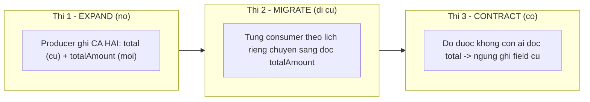

> **"Event-Driven: 10 Bài Toán Kinh Điển" — Phần 5/7.** 0h đêm Flash Sale, `OrderService` bơm 50.000 event/phút vào topic; `NotificationService` chỉ tiêu hoá nổi 10.000/phút — không exception nào, chỉ có hàng đợi phình ra mỗi phút thêm 40.000 message. Rồi: team Order đổi field `total` (số) thành `totalAmount` (object), deploy chiều thứ Sáu — tối đó, `NotificationService` của team khác nhận `undefined`, throw hàng loạt. Hai bài toán khác nhau, cùng một bài học: event-driven mua được deploy độc lập bằng cách xoá bỏ hai thứ ta hay coi là hiển nhiên — tốc độ đồng đều giữa các bên, và một compiler kiểm tra hợp đồng giữa hai team.

- **Consumer lag** (độ trễ tiêu thụ): số message vào topic nhưng chưa xử lý. Lag ổn định là bình thường; lag _tăng không ngừng_ là bệnh.
- **Backpressure** (áp lực ngược): cơ chế cho hạ nguồn báo thượng nguồn "chậm lại" — pull (Kafka) có tự nhiên, push (RabbitMQ) cần cấu hình.
- **Failover** (chuyển vai tự động) và **rebalancing** (chia lại vai) giữ hệ sống khi một node/consumer chết — cái giá là sinh thêm duplicate.
- **Schema evolution:** event là hợp đồng công khai kể cả với consumer producer không biết tồn tại. Luật an toàn: chỉ thêm field optional; đổi lớn thì đi ba thì **expand–contract**.

---

## 1. Consumer lag & backpressure — producer chạy 100, consumer chạy 10

**What — vấn đề là gì?** **Consumer lag** (độ trễ tiêu thụ): khoảng cách giữa vị trí mới nhất của topic và vị trí consumer đã xử lý tới — đo bằng số message đang xếp hàng. Lag ổn định ở mức nhỏ là bình thường (hàng đợi sinh ra để đệm!); vấn đề là **lag tăng không ngừng**: tốc độ vào > tốc độ ra kéo dài. Hệ quả dây chuyền: mọi khe hở nhất quán của [Phần 4](/memo/posts/event-driven-part-4-consistency-and-sagas-vi/) giãn từ mili giây thành giờ; hết hạn retention của topic thì message chưa kịp đọc bị broker xoá — lag biến thành **mất event** ([Phần 1](/memo/posts/event-driven-part-1-lost-and-duplicate-events-vi/) quay lại bằng cửa sau).

**Why — vì sao xảy ra?**

- **Bất đối xứng bẩm sinh:** producer thường chỉ ghi một message (rẻ, hàng chục nghìn/giây); consumer phải làm việc thật — gọi API, ghi database, render email (đắt, hàng trăm/giây mỗi instance).
- **Burst theo sự kiện thật:** flash sale, chiến dịch marketing, đầu giờ sáng.
- **Consumer chậm đi vì downstream:** database quá tải, API bên thứ ba giới hạn tốc độ (rate limit).
- **Hot partition** (làn quá nóng): hệ quả ngược của partition key ở [Phần 3](/memo/posts/event-driven-part-3-poison-messages-and-ordering-vi/) — key phân bố lệch (một khách hàng doanh nghiệp chiếm 40% đơn) thì mọi event của key đó dồn vào _một_ partition; partition đó nghẽn trong khi các làn khác rảnh, và _thêm consumer không giúp gì_ vì một partition chỉ một consumer đọc.

Chân dung sự cố: lag không nhảy vọt — nó _bò đều một chiều_ (vào 50k/phút, ra 10k/phút = phình 40k/phút, tuyến tính). Vì tăng đều nên dễ bị ngó lơ lúc còn xanh; alert đúng phải đặt trên _xu hướng_ (lag tăng liên tục X phút) chứ không chỉ trên ngưỡng tuyệt đối.

**How — giải quyết thế nào? Ba đòn: chảy nhanh hơn, chảy chậm lại, và chọn việc mà bỏ.**

**1. Tăng tốc độ ra (scale out + tối ưu consumer).** Thêm instance consumer vào group — broker tự chia lại partition (xem hộp failover dưới). **Trần cứng: số consumer hữu ích ≤ số partition** (mỗi partition chỉ một người đọc trong group). Vì tăng partition về sau vừa phiền vừa phá thứ tự theo key (bẫy ở [Phần 3](/memo/posts/event-driven-part-3-poison-messages-and-ordering-vi/)), hãy chọn số partition _dư dả từ đầu_. Song song đó, tối ưu từng instance: xử lý theo lô (batch — gom 100 email một lần gọi API thay vì 100 lần), I/O bất đồng bộ.

**2. Backpressure — cho hạ nguồn quyền nói "chậm lại".**

> [!NOTE]
> **Tính chất — Backpressure (áp lực ngược).** Cơ chế để bên _tiêu thụ_ truyền tín hiệu ngược lên bên _sản xuất_: "tôi đang đầy — chậm lại", thay vì âm thầm chết chìm. Tên mượn từ thuỷ lực: ống tắc thì áp suất dội ngược về nguồn. **Mô hình pull** (Kafka — consumer chủ động hỏi xin message) có backpressure _tự nhiên_: xử lý chưa xong thì đơn giản là chưa poll tiếp. **Mô hình push** (RabbitMQ đẩy message tới) cần van chỉnh tay: `prefetch`/QoS — "chỉ đưa tôi tối đa N message chưa ack". Ở biên ngoài cùng (API nhận request từ người dùng), backpressure là rate limit và HTTP 429. Dấu hiệu thiếu backpressure: OutOfMemory ở consumer vì buffer nội bộ phình — chết vì no, đúng nghĩa đen.

**3. Load shedding và hàng đợi ưu tiên — không phải message nào cũng bình đẳng.** **Load shedding** (xả tải): khi quá tải, _chủ động_ hoãn hoặc bỏ việc ít quan trọng để việc quan trọng sống — quyết định nghiệp vụ được cài thành code, thay vì để may rủi quyết định. Cách hiện thực phổ biến: **tách topic theo mức ưu tiên** — OTP và email giao dịch đi topic `notifications-critical` (đội consumer riêng, luôn dư công suất), email marketing đi `notifications-bulk` (cho phép trễ hàng giờ). Sự cố "OTP chậm 4 tiếng vì xếp sau 1 triệu email khuyến mãi" là lỗi _trộn hai loại tải chung một hàng đợi_ — lỗi thiết kế, không phải lỗi công suất.

Tổng lag trông "chia đều thì ổn", nhưng 97% dồn ở một làn vì một key khổng lồ. Chữa: salt key (chia key lớn thành `MegaCorp-0..9` — đổi lấy việc mất thứ tự giữa các mảnh), hoặc tách hẳn khách lớn ra topic riêng có cấu hình riêng.

> [!NOTE]
> **Tính chất — Failover & Rebalancing (tự chuyển vai khi node chết).** **Failover:** khi một node đang giữ vai trò nào đó chết, một node khác _tự động tiếp quản vai trò ấy_ — hệ tiếp tục chạy, không cần người can thiệp. Điều kiện tiên quyết: phải có sẵn bản sao/ứng viên — không thể failover sang thứ không tồn tại.
>
> **Phía broker:** mỗi partition có 1 leader (nhận đọc/ghi) + n follower sao chép dữ liệu. Node chứa leader chết → một follower đã có đủ dữ liệu được bầu làm leader mới (leader election). Durability ở [Phần 1](/memo/posts/event-driven-part-1-lost-and-duplicate-events-vi/) chính là điều kiện để failover ở đây không mất dữ liệu.
>
> **Phía consumer:** một instance trong consumer group chết (hoặc ngừng gửi heartbeat) → broker kích hoạt **rebalance**: chia lại các partition mà instance đó đang giữ cho những instance còn sống. Cùng cơ chế đó chạy khi _thêm_ instance (scale out). Hai cái giá phải biết: (1) rebalance kiểu cổ điển làm cả group tạm dừng một nhịp (Kafka đời mới dùng cooperative rebalancing để chỉ dừng phần bị chia lại); (2) message instance chết đang xử lý dở sẽ được giao lại cho người khác — lại một nguồn duplicate nữa ([Phần 1](/memo/posts/event-driven-part-1-lost-and-duplicate-events-vi/) đứng ra bảo hiểm).
>
> Tóm bằng một câu: _failover = vai diễn không chết theo diễn viên; rebalance = chia lại vai cho diễn viên còn lại._

## 2. Schema evolution — đổi một cái tên field, sập ba service

**What — vấn đề là gì?** Team Order dọn code: đổi field `total` (số) thành `totalAmount` (object có `value` và `currency` — "chuẩn hơn mà!"), deploy chiều thứ Sáu. Tối đó, `NotificationService` của team khác — vốn đọc `event.total` — nhận `undefined`, throw hàng loạt, DLQ ngập 200 nghìn message. Không ai sai cú pháp, không ai quên test — hai team chỉ quên rằng họ đang nói chuyện với nhau qua một bản hợp đồng không ai viết ra.

Cấu trúc dữ liệu của event (**schema**: có field nào, kiểu gì, bắt buộc hay không) thay đổi theo thời gian. Nhưng schema của event không phải chuyện nội bộ của producer: **nó là hợp đồng công khai** mà mọi consumer — kể cả những consumer producer _không biết tồn tại_ (chính decoupling ở [Phần 0](/memo/posts/event-driven-part-0-foundations-vi/) tạo ra sự "không biết" đó!) — đang dựa vào.

**Why — vì sao xảy ra? "Deploy cùng lúc" không tồn tại.** Trong monolith, đổi struct thì compiler quét mọi chỗ dùng, sửa hết, deploy _một_ binary. Trong hệ event-driven, ba sự thật xoá bỏ điều đó: **deploy độc lập** — mục tiêu số một của microservice — nghĩa là luôn tồn tại khoảng thời gian producer mới chạy cạnh consumer cũ (hoặc ngược lại); **event cũ không biến mất** — topic giữ message theo retention, consumer mới vẫn phải đọc được event ghi từ tuần trước; và **không có compiler nào đứng giữa** hai codebase.

|                                          | đọc EVENT CŨ (`total: 500000`)                                                           | đọc EVENT MỚI (`totalAmount: {...}`)                                                 |
| ---------------------------------------- | ---------------------------------------------------------------------------------------- | ------------------------------------------------------------------------------------ |
| **CONSUMER CŨ** (chỉ biết `total`)       | bình thường                                                                              | **Forward compatibility** — cần khi PRODUCER deploy trước (tình huống phổ biến nhất) |
| **CONSUMER MỚI** (đã biết `totalAmount`) | **Backward compatibility** — cần khi CONSUMER deploy trước, và khi đọc lại event lịch sử | bình thường                                                                          |

Hai ô chéo là chuyện đương nhiên; giá trị nằm ở hai ô còn lại. Đạt cả hai (**full compatibility**) thì các team deploy theo thứ tự tuỳ ý, không cần hẹn nhau. Mẹo nhớ hướng: _backward = người mới đọc được đồ cũ; forward = người cũ đọc được đồ mới_.

**How — giải quyết thế nào? Luật sửa đổi + trạm kiểm soát + lộ trình hai thì.**

**1. Luật sửa đổi an toàn (đủ dùng cho 90% trường hợp).** **Được:** thêm field mới _không bắt buộc_, có giá trị mặc định; consumer cũ lờ field lạ (đọc kiểu bao dung — _tolerant reader_). **Cấm:** đổi tên field, xoá field đang có người đọc, đổi kiểu dữ liệu (number → object chính là ca sập ở đầu mục này), thay đổi _ngữ nghĩa_ mà giữ nguyên tên (đơn vị tiền từ đồng sang nghìn đồng — thảm hoạ im lặng, không crash nhưng sai gấp nghìn lần).

**2. Muốn đổi thứ nằm ngoài luật? — Expand–contract (nở ra rồi mới co lại).**

Thay vì một cú đổi phá vỡ, đi ba thì: nở (ghi song song cũ+mới, tương thích với tất cả), di cư (từng consumer tự chuyển, không ai phải hẹn ai), co (dọn field cũ khi _đo được_ là không còn ai dùng). Biến thể cho thay đổi quá lớn: mở topic mới `orders.v2`, chạy song song hai topic đến khi topic cũ cạn người đọc.

**3. Trạm kiểm soát: schema registry.** Dịch vụ trung tâm lưu mọi phiên bản schema của từng topic (phổ biến: Confluent Schema Registry, đi cùng Avro/Protobuf/JSON Schema). Producer trước khi publish schema mới phải đăng ký; registry _so với các phiên bản cũ theo luật tương thích đã cấu hình_ và **từ chối thẳng** schema vi phạm — lỗi bung ra ở CI/CD chiều thứ Sáu, thay vì ở production nửa đêm. Đó đúng nghĩa là "compiler cho hợp đồng giữa các team". Bổ sung phía tổ chức: consumer-driven contract testing và một _event catalog_ — nơi tra cứu "topic này ai phát, schema gì, ai đang nghe".

> [!NOTE]
> **Tính chất — Contract & Compatibility.** **Contract** (hợp đồng): thoả thuận về hình dạng và ý nghĩa dữ liệu giữa bên phát và bên nhận — tồn tại _dù có viết ra hay không_; không viết ra thì nó tồn tại ở dạng nguy hiểm nhất: ngầm định, mỗi bên nhớ một dị bản. **Compatibility:** thước đo một thay đổi hợp đồng có phá vỡ bên đối tác không — _backward_ (mới đọc được cũ), _forward_ (cũ đọc được mới), _full_ (cả hai). Bài học tổ chức: schema evolution là bài toán _giao tiếp giữa các team_ đội lốt bài toán kỹ thuật — công cụ (registry) chỉ cưỡng chế được thứ mà quy trình (luật sửa đổi, expand–contract) đã thoả thuận. Câu hỏi kiểm tra: "nếu team bạn đổi schema event ngay bây giờ, ai sẽ biết trước khi production biết?"

---

← **Trước:** [Phần 4 — Consistency & Saga](/memo/posts/event-driven-part-4-consistency-and-sagas-vi/) · **Tiếp theo:** [Phần 6 — Observability & Tổng Kết](/memo/posts/event-driven-part-6-observability-and-recap-vi/) →

**Loạt bài — Event-Driven: 10 Bài Toán Kinh Điển:** [0 · Nền tảng](/memo/posts/event-driven-part-0-foundations-vi/) · [1 · Mất & Trùng](/memo/posts/event-driven-part-1-lost-and-duplicate-events-vi/) · [2 · Outbox & Retry](/memo/posts/event-driven-part-2-outbox-and-retries-vi/) · [3 · Poison & Thứ tự](/memo/posts/event-driven-part-3-poison-messages-and-ordering-vi/) · [4 · Consistency & Saga](/memo/posts/event-driven-part-4-consistency-and-sagas-vi/) · **5 · Backpressure & Schema (đang ở đây)** · [6 · Observability & Tổng kết](/memo/posts/event-driven-part-6-observability-and-recap-vi/)
