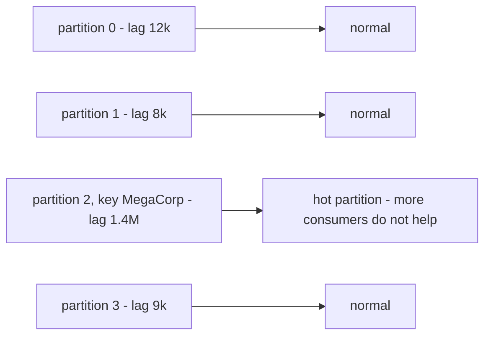
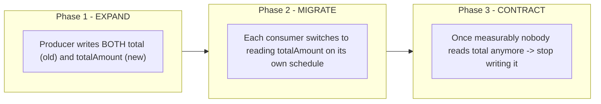

> **"Event-Driven Architecture: The Top 10 Classic Problems" — Part 5 of 7.** Midnight during a flash sale: `OrderService` is pushing 50,000 events a minute into a topic; `NotificationService` can only digest 10,000 a minute — no exceptions, just a queue growing by 40,000 messages every minute. Later: the Order team renames the field `total` (a number) to `totalAmount` (an object), and deploys on a Friday afternoon — that night, another team's `NotificationService` gets `undefined` and throws in a loop. Two different problems, one shared lesson: event-driven architecture buys independent deployability by erasing two things we usually take for granted — matched processing speed across parties, and a compiler checking the contract between two teams.

- **Consumer lag:** how many messages have entered the topic but haven't been processed yet. Steady lag is normal; lag that _keeps climbing_ is a symptom.
- **Backpressure:** the mechanism letting the consumer tell the producer "slow down" — pull-based systems (Kafka) get it naturally, push-based ones (RabbitMQ) need it configured.
- **Failover** (automatic role handoff) and **rebalancing** (reassigning roles) keep the system alive when a node or consumer dies — the cost is more duplicates.
- **Schema evolution:** an event is a public contract, including with consumers the producer doesn't know exist. The safe rule: only add optional fields; big changes go through a three-phase **expand-contract**.

---

## 1. Consumer lag & backpressure — the producer runs at 100, the consumer runs at 10

**What is it?** **Consumer lag** is the gap between a topic's latest position and where the consumer has actually processed up to — measured in queued messages. Small, steady lag is normal (queues exist to absorb bursts!); the problem is **lag that keeps climbing**: inflow persistently exceeding outflow. The knock-on effects: every consistency gap from [Part 4](/memo/posts/event-driven-part-4-consistency-and-sagas/) stretches from milliseconds to hours; and once a message outlives the topic's retention window, the broker deletes it before anyone reads it — lag turns into **lost events**, [Part 1](/memo/posts/event-driven-part-1-lost-and-duplicate-events/) sneaking back in through a side door.

**Why does it happen?**

- **A built-in asymmetry:** producing is usually cheap (one write, tens of thousands per second); consuming does real work — API calls, database writes, rendering an email (expensive, hundreds per second per instance).
- **Real bursts:** flash sales, marketing campaigns, the start of the business day.
- **The consumer slows down because of downstream:** an overloaded database, a rate-limited third-party API.
- **Hot partitions:** the flip side of the partition key from [Part 3](/memo/posts/event-driven-part-3-poison-messages-and-ordering/) — a skewed key (one enterprise customer generating 40% of orders) dumps every event for that key into _one_ partition; that partition chokes while every other lane sits idle, and _adding more consumers doesn't help_, because one partition is only ever read by one consumer.

The typical shape of the incident: lag doesn't spike — it _creeps up steadily_ (50k in/minute, 10k out/minute = growing by 40k/minute, linearly). Because the growth is steady, it's easy to overlook while it's still small; the right alert triggers on the _trend_ (lag rising continuously for X minutes), not just an absolute threshold.

**How do you fix it? Three moves: flow faster, flow slower, and choose what to drop.**

**1. Increase outflow (scale out + optimize the consumer).** Add more consumer instances to the group — the broker automatically redistributes partitions (see the failover box below). **Hard cap: useful consumers ≤ partition count** (each partition is read by exactly one member of the group). Because increasing partition count later is both a hassle and breaks per-key ordering (the trap from [Part 3](/memo/posts/event-driven-part-3-poison-messages-and-ordering/)), provision partitions _generously up front_. In parallel, optimize each instance: batch processing (100 emails per API call instead of 100 separate calls), async I/O.

**2. Backpressure — giving downstream the right to say "slow down."**

> [!NOTE]
> **Property — Backpressure.** The mechanism that lets the _consuming_ side signal back to the _producing_ side: "I'm full, slow down" instead of silently drowning. The name is borrowed from hydraulics: a clogged pipe pushes pressure back toward the source. **Pull-based systems** (Kafka — the consumer actively asks for messages) get backpressure _for free_: if you're not done processing, you simply don't poll again. **Push-based systems** (RabbitMQ delivers to you) need a manual valve: `prefetch`/QoS — "only hand me N unacknowledged messages at a time." At the outermost edge (an API receiving requests from users), backpressure takes the form of rate limiting and HTTP 429. The tell-tale sign it's missing: the consumer runs out of memory as its internal buffer keeps growing — it dies of overeating, literally.

**3. Load shedding and priority queues — not every message deserves equal treatment.** **Load shedding:** under overload, _deliberately_ deferring or dropping low-priority work so high-priority work survives — turning a business decision into code, instead of leaving it to chance. The common implementation: **split topics by priority** — OTPs and transactional emails go to a `notifications-critical` topic (its own consumer pool, always over-provisioned), marketing emails go to `notifications-bulk` (fine to lag hours behind). "The OTP took 4 hours because it was queued behind a million promotional emails" is a bug from _mixing two classes of load in one queue_ — a design flaw, not a capacity problem.

Total lag looks "evenly distributed, fine" at a glance, but 97% of it is stuck in one lane because of one enormous key. The fix: salt the key (split it into `MegaCorp-0..9` — trading away ordering between the shards), or route the large customer to a separately-configured topic.

> [!NOTE]
> **Property — Failover & Rebalancing.** **Failover:** when a node holding some role dies, another node _automatically takes over that role_ — the system keeps running, no human required. Precondition: a standby replica has to already exist — you can't fail over to something that isn't there.
>
> **On the broker side:** each partition has one leader (handles reads/writes) plus N followers replicating its data. If the node hosting the leader dies, a follower that already has the data gets elected as the new leader. The durability from [Part 1](/memo/posts/event-driven-part-1-lost-and-duplicate-events/) is exactly the precondition that keeps this failover from losing data.
>
> **On the consumer side:** when one instance in a consumer group dies (or stops sending heartbeats), the broker triggers a **rebalance**: it redistributes the partitions that instance was holding to the surviving members. The same mechanism runs when you _add_ an instance (scaling out). Two costs worth knowing: (1) classic rebalancing pauses the whole group briefly (newer Kafka uses cooperative rebalancing to pause only the reassigned partitions); (2) any message the dead instance was mid-processing gets redelivered to someone else — one more source of duplicates, insured by [Part 1](/memo/posts/event-driven-part-1-lost-and-duplicate-events/).
>
> One line to remember it by: _failover means the role doesn't die with the actor; rebalancing means reassigning roles among the actors still on stage._

## 2. Schema evolution — rename one field, take down three services

**What is it?** The Order team cleans up their code: renaming `total` (a number) to `totalAmount` (an object with `value` and `currency` — "it's more correct!") and deploying it on a Friday afternoon. That night, another team's `NotificationService` — which still reads `event.total` — gets `undefined`, throws in a loop, and floods the DLQ with 200,000 messages. Nobody made a syntax error, nobody skipped tests — the two teams simply forgot they were talking to each other through a contract that neither of them wrote down.

An event's data shape (its **schema**: which fields exist, what type, required or not) changes over time. But an event's schema isn't the producer's private business: **it's a public contract** that every consumer relies on — including consumers the producer _doesn't even know exist_ (the exact "not knowing" that decoupling in [Part 0](/memo/posts/event-driven-part-0-foundations/) creates on purpose!).

**Why does it happen? "Deploy at the same time" doesn't exist here.** In a monolith, changing a struct means the compiler finds every call site, you fix them all, and you deploy _one_ binary. In an event-driven system, three facts erase that guarantee: **independent deployability** — the number-one goal of microservices — means there's always a window where a newer producer runs alongside an older consumer (or vice versa); **old events don't disappear** — the topic retains messages per its retention policy, and a new consumer still has to be able to read events written last week; and **there's no compiler standing between the two codebases**.

|                                                | reading an OLD event (`total: 500000`)                                                                   | reading a NEW event (`totalAmount: {...}`)                                                |
| ---------------------------------------------- | -------------------------------------------------------------------------------------------------------- | ----------------------------------------------------------------------------------------- |
| **OLD CONSUMER** (only knows `total`)          | fine                                                                                                     | **Forward compatibility** — needed when the PRODUCER deploys first (the most common case) |
| **NEW CONSUMER** (already knows `totalAmount`) | **Backward compatibility** — needed when the CONSUMER deploys first, or when replaying historical events | fine                                                                                      |

The two diagonal cells are the obvious cases; the value is in the other two. Getting both (**full compatibility**) lets teams deploy in any order without coordinating. A memory trick: _backward means the newer code can read old data; forward means the older code can read new data._

**How do you fix it? A safe-change rule, a checkpoint, and a two-phase rollout.**

**1. The safe-change rule (covers 90% of cases).** **Allowed:** adding a new _optional_ field with a default; old consumers ignore fields they don't recognize (a _tolerant reader_). **Forbidden:** renaming a field, removing one that's still read, changing a data type (number → object is exactly the incident that opened this section), or silently changing a field's _meaning_ while keeping its name (switching a currency unit from dong to thousands of dong — a silent catastrophe, no crash, just a thousand-times-wrong number).

**2. Need to change something outside the rule? — Expand-contract.**

Instead of one breaking cutover, go through three phases: expand (write both old and new in parallel — compatible with everyone), migrate (each consumer switches on its own schedule, nobody has to coordinate), contract (remove the old field once it's _measurably_ unused). A variant for changes too large for this: open a new `orders.v2` topic and run both topics in parallel until the old one runs out of readers.

**3. A checkpoint: the schema registry.** A central service that stores every schema version for every topic (commonly Confluent Schema Registry, paired with Avro/Protobuf/JSON Schema). Before publishing a new schema, the producer has to register it; the registry _checks it against prior versions per the configured compatibility rule_ and **rejects outright** any schema that violates it — the failure surfaces in CI/CD on Friday afternoon, not in production at midnight. That's literally "a compiler for the contract between teams." On the organizational side: consumer-driven contract testing, plus an _event catalog_ — a place to look up "who publishes this topic, what's the schema, who's listening."

> [!NOTE]
> **Property — Contract & Compatibility.** **Contract:** an agreement about the shape and meaning of data between a publisher and a receiver — it exists _whether or not it's ever written down_; unwritten, it exists in its most dangerous form: implicit, with each side remembering a slightly different version. **Compatibility:** a measure of whether a contract change breaks the other party — _backward_ (new code reads old data), _forward_ (old code reads new data), _full_ (both). The organizational lesson: schema evolution is a _communication problem between teams_ wearing a technical costume — tooling (the registry) can only enforce what process (the safe-change rule, expand-contract) has already agreed on. The test question: "if your team changed the event schema right now, who would know before production does?"

---

← **Previous:** [Part 4 — Consistency & Sagas](/memo/posts/event-driven-part-4-consistency-and-sagas/) · **Next:** [Part 6 — Observability & Recap](/memo/posts/event-driven-part-6-observability-and-recap/) →

**The series — Event-Driven Architecture: The Top 10 Classic Problems:** [0 · Foundations](/memo/posts/event-driven-part-0-foundations/) · [1 · Lost & Duplicate Events](/memo/posts/event-driven-part-1-lost-and-duplicate-events/) · [2 · Outbox & Retries](/memo/posts/event-driven-part-2-outbox-and-retries/) · [3 · Poison Messages & Ordering](/memo/posts/event-driven-part-3-poison-messages-and-ordering/) · [4 · Consistency & Sagas](/memo/posts/event-driven-part-4-consistency-and-sagas/) · **5 · Backpressure & Schema Evolution (you are here)** · [6 · Observability & Recap](/memo/posts/event-driven-part-6-observability-and-recap/)
