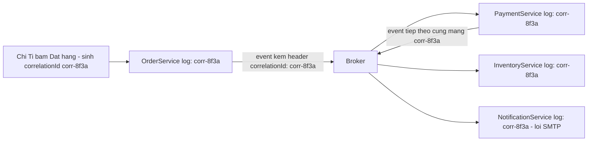

> **"Event-Driven: 10 Bài Toán Kinh Điển" — Phần 6/7 (khép loạt bài).** Chị Tí gọi tổng đài: "đơn của tôi đâu rồi?". Trong monolith, Tèo grep một file log, đọc một stack trace, xong. Ở MuaLẹ, đơn #4711 đã đi qua 5 service và 3 topic — mỗi service một log riêng, giữa chúng là những khoảng lặng của broker. Câu hỏi "request này chết ở đâu" trở thành cuộc điều tra liên tỉnh. Đây là bài toán bonus, khép lại loạt bài — cùng với bảng tra cứu và glossary tổng hợp toàn bộ 6 phần trước.

- **Observability** (khả năng quan sát) trong hệ event-driven không tự nhiên có — phải _gieo_ từ trước: **correlation ID** sinh ở entry point, chép vào mọi event và mọi log.
- Bốn metric bắt buộc, mỗi cái canh một bài toán: consumer lag, DLQ depth, error rate, end-to-end latency.
- Bảng tra cứu 10 vấn đề → tính chất → pattern → cái giá, và glossary gộp toàn bộ 20 tính chất của loạt bài.

---

## 1. Observability — debug khi không còn call stack

**What — vấn đề là gì?** Trong hệ đồng bộ, một request là _một_ chuỗi gọi hàm — stack trace và log của một tiến trình kể trọn câu chuyện. Trong hệ event-driven, một nghiệp vụ là _nhiều_ mảnh xử lý rời rạc, ở nhiều tiến trình, nối nhau qua broker — **không tồn tại call stack xuyên suốt**. Khi có sự cố, câu hỏi không phải "dòng nào lỗi" mà là "mảnh nào của chuỗi đã chạy, mảnh nào chưa, mảnh nào chạy sai" — và mặc định, không công cụ nào trả lời được nếu ta không tự gieo manh mối từ trước.

**Why — vì sao xảy ra?** Vì **context bị cắt đứt tại mỗi lần đi qua broker**: thread xử lý ở consumer không có quan hệ gì với thread đã publish — không chung tiến trình, không chung thời điểm, có khi không chung máy. Mọi thứ tự động "đi theo luồng" trong hệ đồng bộ (thread-local context, stack trace, transaction hiện hành) đều rơi rụng ở ranh giới này. Muốn nối lại câu chuyện, manh mối phải _đi trong chính message_.

**How — giải quyết thế nào? Gieo manh mối vào từng event.**

- **Correlation ID:** sinh một ID duy nhất tại điểm vào đầu tiên (lúc chị Tí bấm Đặt hàng), rồi _chép tiếp vào header của mọi event và mọi dòng log_ phát sinh từ nghiệp vụ đó, qua mọi service. Search một ID → toàn bộ câu chuyện của đơn #4711 hiện ra theo dòng thời gian. Rẻ, thủ công, hiệu quả tức thì.
- **Distributed tracing:** phiên bản công nghiệp của ý tưởng trên — chuẩn **OpenTelemetry**: mỗi bước xử lý là một _span_ (đoạn có thời điểm đầu-cuối), các span nối thành _trace_ (cây phả hệ của request); trace context truyền qua header của message; backend (Jaeger, Tempo, Datadog...) vẽ thành sơ đồ thời gian.
- **Structured logging:** log dạng JSON có field chuẩn (`correlationId`, `eventId`, `orderId`) thay vì chuỗi văn tự do — để "search một ID" là một câu query, không phải một buổi grep.
- **Bộ metric tối thiểu** — bốn đồng hồ phải có trên dashboard, mỗi cái canh một phần của loạt bài: **consumer lag** ([Phần 5](/memo/posts/event-driven-part-5-backpressure-and-schema-evolution-vi/) — hệ có đang ứ?), **DLQ depth** ([Phần 3](/memo/posts/event-driven-part-3-poison-messages-and-ordering-vi/) — có message chết chưa ai khám?), **processing error rate** ([Phần 2](/memo/posts/event-driven-part-2-outbox-and-retries-vi/) — retry đang gồng cho cái gì?), **end-to-end latency** ([Phần 4](/memo/posts/event-driven-part-4-consistency-and-sagas-vi/) — khe hở nhất quán đang rộng bao nhiêu?).
- **Event replay:** đặc quyền của broker kiểu log như Kafka (message không bị xoá khi đọc — chỉ có con trỏ offset di chuyển): cho consumer _tua lại_ đọc từ offset quá khứ. Ứng dụng: dựng lại read model từ đầu sau khi fix bug, cho service mới "học" lịch sử, kiểm chứng giả thuyết sự cố. Điều kiện an toàn để tua: consumer idempotent — [Phần 1](/memo/posts/event-driven-part-1-lost-and-duplicate-events-vi/), lần cuối cùng loạt bài nhắc đến nó.

Correlation ID chảy xuyên hệ thống như chất nhuộm màu trong mạch nước: search `corr-8f3a` trên hệ log tập trung → thấy ngay 4 mảnh đã chạy, 1 mảnh lỗi ở đâu, lúc nào. Quy tắc bất di bất dịch: consumer khi phát event _tiếp theo_ phải chép correlationId từ event nó đang xử lý — đứt một mắt xích là đứt cả sợi dây.

## 2. Tổng kết — đọc lại cả loạt bài trong bốn câu

**(1)** Chọn kiến trúc event-driven là chọn đưa mạng và một bên trung gian vào giữa mọi cuộc giao tiếp — từ đó event có thể mất, và cách duy nhất chống mất (ack + gửi lại) sinh ra trùng lặp. **(2)** Vì không thể ngăn trùng lặp và xáo trộn từ gốc, hệ thống bền vững không cố đòi hạ tầng hoàn hảo — nó thiết kế nghiệp vụ _miễn nhiễm_: idempotency cho trùng, version cho xáo trộn, compensating transaction cho dở dang. **(3)** Phần còn lại là quản lý dòng chảy (backoff, DLQ, backpressure, ưu tiên hoá) và quản lý lời hứa (mức nhất quán, hợp đồng schema). **(4)** Và vì mọi thứ diễn ra phân tán — phải gieo sẵn khả năng quan sát vào từng message, trước khi cần đến nó.

### Bảng tra nhanh: vấn đề → tính chất → pattern → cái giá

| #   | Vấn đề                    | Tính chất cốt lõi                             | Pattern giải quyết                                                     | Cái giá phải trả                                          |
| --- | ------------------------- | --------------------------------------------- | ---------------------------------------------------------------------- | --------------------------------------------------------- |
| 1   | Event bị mất              | Delivery guarantee, durability, ack           | acks=all + replication; ack sau khi xử lý                              | Chậm hơn; sinh duplicate (→2)                             |
| 2   | Event bị trùng            | **Idempotency**, dedup                        | Idempotent consumer: key + bảng processed_events cùng transaction      | Thêm 1 bảng + 1 ràng buộc cho mọi consumer                |
| 3   | Dual-write                | Atomicity                                     | Transactional outbox; CDC (Debezium)                                   | Thêm độ trễ + relay phải vận hành; vẫn at-least-once (→2) |
| 4   | Retry sao cho đúng        | Backoff, jitter, circuit breaker              | Phân loại lỗi; exponential backoff + jitter; retry topic; cầu dao      | Phức tạp hơn; non-blocking phá thứ tự (→6)                |
| 5   | Poison message            | Dead-lettering, redrive                       | Max attempts → DLQ + alert + người trực                                | DLQ không người trực = mất event kiểu mới                 |
| 6   | Sai thứ tự                | Per-key ordering, causality, commutativity    | Partition key theo aggregate; version number; thiết kế giao hoán       | Từ bỏ thứ tự toàn cục; nguy cơ hot partition (→9)         |
| 7   | Eventual consistency      | Staleness, read-your-own-writes               | Chọn mức nhất quán từng luồng đọc; optimistic UI; version token        | UX và tư duy phải chấp nhận "đang cập nhật"               |
| 8   | Transaction xuyên service | Saga, compensating transaction, semantic lock | Saga (choreography / orchestration) + giao dịch bù                     | Phải viết và test code hoàn tác cho từng bước             |
| 9   | Lag & quá tải             | **Backpressure**, **failover**, hot partition | Scale theo partition; pull/prefetch; tách topic ưu tiên; load shedding | Quy hoạch partition từ đầu; rebalance sinh duplicate (→2) |
| 10  | Schema evolution          | Contract, backward/forward compatibility      | Luật chỉ-thêm-optional; expand–contract; schema registry               | Thay đổi lớn phải đi 3 thì, chậm mà chắc                  |
| +   | Không debug được          | Traceability, correlation                     | Correlation ID; OpenTelemetry; 4 metric; event replay                  | Kỷ luật gieo context ở MỌI service, không trừ ai          |

### Glossary — mọi tính chất trong một màn hình

- **At-most-once / At-least-once / Exactly-once** — ba mức đảm bảo giao nhận (delivery guarantee): mỗi event được xử lý tối đa 1 lần (có thể mất) / ít nhất 1 lần (có thể trùng) / đúng 1 lần (chỉ đạt được end-to-end bằng at-least-once + idempotency). [Phần 1](/memo/posts/event-driven-part-1-lost-and-duplicate-events-vi/)
- **Durability** (độ bền) — dữ liệu đã xác nhận thì sống sót qua crash: đã ghi đĩa và/hoặc đã nhân bản. [Phần 1](/memo/posts/event-driven-part-1-lost-and-duplicate-events-vi/)
- **Acknowledgement/ack** (xác nhận xử lý) — tín hiệu chuyển giao trách nhiệm consumer → broker; đặt sau xử lý = at-least-once, đặt trước = at-most-once. [Phần 1](/memo/posts/event-driven-part-1-lost-and-duplicate-events-vi/)
- **Idempotency** (tính luỹ đẳng) — làm nhiều lần kết quả như một lần: f(f(x)) = f(x). Tính chất trung tâm của cả loạt bài. [Phần 1](/memo/posts/event-driven-part-1-lost-and-duplicate-events-vi/)
- **Deduplication** (khử trùng lặp) — chặn xử lý lặp bằng định danh duy nhất trong một cửa sổ thời gian. [Phần 1](/memo/posts/event-driven-part-1-lost-and-duplicate-events-vi/)
- **Atomicity** (tính nguyên tử) — nhóm thao tác cùng thành công hoặc cùng thất bại, chỉ có sẵn trong phạm vi một database. [Phần 2](/memo/posts/event-driven-part-2-outbox-and-retries-vi/)
- **Exponential backoff + jitter** (lùi cấp số nhân, có nhiễu) — khoảng chờ retry nhân đôi dần + thành phần ngẫu nhiên chống đồng pha. [Phần 2](/memo/posts/event-driven-part-2-outbox-and-retries-vi/)
- **Circuit breaker** (cầu dao ngắt mạch) — ngừng gọi dịch vụ đang lỗi nặng trong một khoảng nghỉ, bổ sung cho retry. [Phần 2](/memo/posts/event-driven-part-2-outbox-and-retries-vi/)
- **Head-of-line blocking** (kẹt từ đầu hàng) — một message chậm/hỏng ở đầu hàng chặn mọi message phía sau. [Phần 2](/memo/posts/event-driven-part-2-outbox-and-retries-vi/), [Phần 3](/memo/posts/event-driven-part-3-poison-messages-and-ordering-vi/)
- **Dead Letter Queue (DLQ)** (hàng đợi thư chết) — nơi cách ly message thất bại lặp lại, đi cùng alert + quy trình redrive. [Phần 3](/memo/posts/event-driven-part-3-poison-messages-and-ordering-vi/)
- **Ordering guarantee** (đảm bảo thứ tự) — total (toàn cục) vs per-key (theo khoá — mức nghiệp vụ thường cần). [Phần 3](/memo/posts/event-driven-part-3-poison-messages-and-ordering-vi/)
- **Commutativity** (tính giao hoán) — đổi thứ tự thực hiện không đổi kết quả, thiết kế được thì bài toán ordering tự biến mất. [Phần 3](/memo/posts/event-driven-part-3-poison-messages-and-ordering-vi/)
- **Eventual consistency** (nhất quán sau cùng) — ngừng ghi thì mọi nơi rồi sẽ hội tụ; đo bằng staleness, quản bằng SLO. [Phần 4](/memo/posts/event-driven-part-4-consistency-and-sagas-vi/)
- **Read-your-own-writes** (đọc thấy điều mình vừa ghi) — mức nhất quán tối thiểu cho UX. [Phần 4](/memo/posts/event-driven-part-4-consistency-and-sagas-vi/)
- **Saga & Compensating transaction** (chuỗi giao dịch + giao dịch bù) — transaction lớn = chuỗi transaction nhỏ; bước sau hỏng thì chạy thao tác nghiệp vụ đảo ngược cho các bước trước. [Phần 4](/memo/posts/event-driven-part-4-consistency-and-sagas-vi/)
- **Semantic lock** (khoá ngữ nghĩa) — trạng thái trung gian (PENDING) đánh dấu dữ liệu đang trong saga dở dang. [Phần 4](/memo/posts/event-driven-part-4-consistency-and-sagas-vi/)
- **Consumer lag** (độ trễ tiêu thụ) — số message đã vào topic nhưng chưa được xử lý. [Phần 5](/memo/posts/event-driven-part-5-backpressure-and-schema-evolution-vi/)
- **Backpressure** (áp lực ngược) — hạ nguồn báo thượng nguồn chậm lại thay vì chết chìm trong im lặng. [Phần 5](/memo/posts/event-driven-part-5-backpressure-and-schema-evolution-vi/)
- **Failover & Rebalancing** (tự chuyển vai khi node chết) — vai trò của node chết được node sống tiếp quản tự động, cần sẵn bản sao, và sinh duplicate lúc chuyển giao. [Phần 5](/memo/posts/event-driven-part-5-backpressure-and-schema-evolution-vi/)
- **Hot partition** (làn quá nóng) — partition key phân bố lệch dồn tải vào một làn; thêm consumer không cứu được. [Phần 5](/memo/posts/event-driven-part-5-backpressure-and-schema-evolution-vi/)
- **Backward / Forward compatibility** (tương thích lùi / tiến) — mới đọc được đồ cũ / cũ đọc được đồ mới; đạt cả hai (full) thì các team deploy không cần hẹn nhau. [Phần 5](/memo/posts/event-driven-part-5-backpressure-and-schema-evolution-vi/)
- **Correlation ID** (mã định danh xuyên chuỗi) — một ID sinh ở điểm vào, chép vào mọi event và log — sợi dây nối lại câu chuyện khi không còn call stack. Phần 6 (bài này)

## 3. Nguồn

- Martin Kleppmann — _Designing Data-Intensive Applications_ (O'Reilly, 2017): delivery guarantees, ordering, consistency.
- Chris Richardson — microservices.io: [Transactional Outbox](https://microservices.io/patterns/data/transactional-outbox.html), [Saga](https://microservices.io/patterns/data/saga.html).
- Hohpe & Woolf — _Enterprise Integration Patterns_ (2003): Dead Letter Channel, Idempotent Receiver, Correlation Identifier.
- AWS Architecture Blog — _Exponential Backoff and Jitter_; AWS Builders' Library — _Timeouts, retries, and backoff with jitter_.
- Uber Engineering — _Building Reliable Reprocessing and Dead Letter Queues with Apache Kafka_.
- Stripe docs — _Idempotent Requests_.
- Kafka documentation / Confluent Developer: acks, replication, consumer group, transactions, schema registry.

---

← **Trước:** [Phần 5 — Backpressure & Schema](/memo/posts/event-driven-part-5-backpressure-and-schema-evolution-vi/) · Đây là phần khép loạt bài.

**Loạt bài — Event-Driven: 10 Bài Toán Kinh Điển:** [0 · Nền tảng](/memo/posts/event-driven-part-0-foundations-vi/) · [1 · Mất & Trùng](/memo/posts/event-driven-part-1-lost-and-duplicate-events-vi/) · [2 · Outbox & Retry](/memo/posts/event-driven-part-2-outbox-and-retries-vi/) · [3 · Poison & Thứ tự](/memo/posts/event-driven-part-3-poison-messages-and-ordering-vi/) · [4 · Consistency & Saga](/memo/posts/event-driven-part-4-consistency-and-sagas-vi/) · [5 · Backpressure & Schema](/memo/posts/event-driven-part-5-backpressure-and-schema-evolution-vi/) · **6 · Observability & Tổng kết (đang ở đây)**
