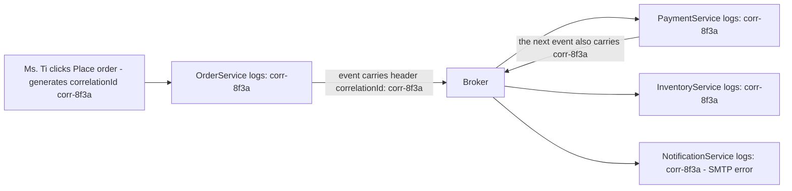

> **"Event-Driven Architecture: The Top 10 Classic Problems" — Part 6 of 7 (closing the series).** Ms. Tí calls support: "where's my order?" In a monolith, Tèo greps one log file, reads one stack trace, done. At MuaLẹ, order #4711 has passed through 5 services and 3 topics — each service with its own log, separated by the broker's silences. "Where did this request die" turns into a cross-service investigation. This is the bonus problem that closes the series, alongside a lookup table and glossary covering everything from the previous six parts.

- **Observability** doesn't happen for free in an event-driven system — it has to be _seeded_ ahead of time: a **correlation ID** generated at the entry point, copied into every event and every log line.
- Four mandatory metrics, each one watching a different problem from the series: consumer lag, DLQ depth, error rate, end-to-end latency.
- A lookup table mapping all 10 problems to their property, pattern, and cost, plus a glossary of all 20 properties defined across the series.

---

## 1. Observability — debugging without a call stack

**What is it?** In a synchronous system, a request is _one_ chain of function calls — a single process's stack trace and logs tell the whole story. In an event-driven system, one business transaction is _many_ disconnected pieces of work, running in different processes, stitched together through a broker — **there's no call stack spanning the whole thing**. When something breaks, the question isn't "which line failed" but "which piece of the chain ran, which didn't, and which ran wrong" — and by default, no tool can answer that unless you seed the clues yourself, ahead of time.

**Why does it happen?** Because **context breaks every time a message crosses the broker**: the thread processing on the consumer side has no relationship to the thread that published — different process, different moment, sometimes a different machine. Everything that automatically "follows the flow" in a synchronous system (thread-local context, a stack trace, the current transaction) falls away at that boundary. To reconnect the story, the clue has to travel _inside the message itself_.

**How do you fix it? Seed a clue into every event.**

- **Correlation ID:** generate one unique ID at the very first entry point (the moment Ms. Tí clicks "Place order"), then _copy it into the headers of every event and every log line_ produced by that transaction, across every service. Search one ID → the entire story of order #4711 appears in chronological order. Cheap, manual, and immediately effective.
- **Distributed tracing:** the industrial-strength version of the same idea — the **OpenTelemetry** standard: each processing step is a _span_ (a segment with a start and end time), spans chain into a _trace_ (the request's family tree); trace context travels in message headers; a backend (Jaeger, Tempo, Datadog...) renders it as a timeline.
- **Structured logging:** JSON logs with standard fields (`correlationId`, `eventId`, `orderId`) instead of free-text strings — so "search one ID" becomes a query, not a grepping session.
- **A minimum metric set** — four gauges every dashboard needs, each one watching a different part of this series: **consumer lag** ([Part 5](/memo/posts/event-driven-part-5-backpressure-and-schema-evolution/) — is the system backing up?), **DLQ depth** ([Part 3](/memo/posts/event-driven-part-3-poison-messages-and-ordering/) — are there dead messages nobody's looked at?), **processing error rate** ([Part 2](/memo/posts/event-driven-part-2-outbox-and-retries/) — what is retry actually straining against?), **end-to-end latency** ([Part 4](/memo/posts/event-driven-part-4-consistency-and-sagas/) — how wide is the consistency gap right now?).
- **Event replay:** a privilege of log-based brokers like Kafka (a message isn't deleted on read — only an offset pointer moves): let the consumer _rewind_ and read from a past offset. Uses: rebuild a read model from scratch after fixing a bug, let a new service "learn" history, verify an incident hypothesis. The safety condition for replaying: the consumer has to be idempotent — [Part 1](/memo/posts/event-driven-part-1-lost-and-duplicate-events/), making its last appearance in this series.

A correlation ID flows through the system like a tracer dye in a water main: search `corr-8f3a` in a centralized log system → immediately see which 4 pieces ran, which one failed, and when. The unbreakable rule: whenever a consumer publishes a _follow-up_ event, it must copy the correlation ID from the event it's processing — break one link, and the whole thread is gone.

## 2. Recap — the whole series in four sentences

**(1)** Choosing event-driven architecture means choosing to put a network and a middleman between every conversation — which means events can be lost, and the only defense against loss (acknowledge, then resend) creates duplicates. **(2)** Since duplication and reordering can't be eliminated at the source, a durable system doesn't chase perfect infrastructure — it designs the business logic to be _immune_: idempotency for duplicates, version numbers for reordering, compensating transactions for work left half-done. **(3)** Everything else is flow management (backoff, DLQs, backpressure, prioritization) and promise management (consistency levels, schema contracts). **(4)** And because it's all distributed, seed observability into every message before you need it.

### Cheat sheet: problem → property → pattern → cost

| #   | Problem                    | Core property                                  | Solving pattern                                                              | Cost                                                          |
| --- | -------------------------- | ---------------------------------------------- | ---------------------------------------------------------------------------- | ------------------------------------------------------------- |
| 1   | Lost events                | Delivery guarantee, durability, ack            | acks=all + replication; ack after processing                                 | Slower; creates duplicates (→2)                               |
| 2   | Duplicate events           | **Idempotency**, dedup                         | Idempotent consumer: key + processed_events table in one transaction         | One more table + one more constraint on every consumer        |
| 3   | Dual-write                 | Atomicity                                      | Transactional outbox; CDC (Debezium)                                         | Added latency + a relay to operate; still at-least-once (→2)  |
| 4   | Getting retries right      | Backoff, jitter, circuit breaker               | Classify errors; exponential backoff + jitter; retry topics; circuit breaker | More complexity; non-blocking retry breaks ordering (→6)      |
| 5   | Poison messages            | Dead-lettering, redrive                        | Max attempts → DLQ + alert + a human owner                                   | An unattended DLQ is a new flavor of lost event               |
| 6   | Out-of-order events        | Per-key ordering, causality, commutativity     | Partition key on the aggregate; version numbers; commutative design          | Giving up global ordering; risk of hot partitions (→9)        |
| 7   | Eventual consistency       | Staleness, read-your-own-writes                | Per-read-path consistency level; optimistic UI; version tokens               | UX and mental model must accept "still updating"              |
| 8   | Cross-service transactions | Saga, compensating transaction, semantic lock  | Saga (choreography / orchestration) + compensating logic                     | Must write and test an undo path per step                     |
| 9   | Lag & overload             | **Backpressure**, **failover**, hot partitions | Scale by partition count; pull/prefetch; priority topics; load shedding      | Plan partitions early; rebalancing creates duplicates (→2)    |
| 10  | Schema evolution           | Contract, backward/forward compatibility       | Additive-only rule; expand-contract; schema registry                         | Big changes take three deliberate phases                      |
| +   | Can't debug it             | Traceability, correlation                      | Correlation ID; OpenTelemetry; the 4 metrics; event replay                   | Discipline of seeding context in EVERY service, no exceptions |

### Glossary — every property in one screen

- **At-most-once / At-least-once / Exactly-once** — three delivery guarantee levels: each event processed at most once (may be lost) / at least once (may be duplicated) / exactly once (only achievable end-to-end via at-least-once + idempotency). [Part 1](/memo/posts/event-driven-part-1-lost-and-duplicate-events/)
- **Durability** — once acknowledged, data survives a crash: written to disk and/or replicated. [Part 1](/memo/posts/event-driven-part-1-lost-and-duplicate-events/)
- **Acknowledgement/ack** — the signal that transfers responsibility from consumer to broker; placed after processing = at-least-once, placed before = at-most-once. [Part 1](/memo/posts/event-driven-part-1-lost-and-duplicate-events/)
- **Idempotency** — doing something multiple times behaves like doing it once: f(f(x)) = f(x). The central property of the entire series. [Part 1](/memo/posts/event-driven-part-1-lost-and-duplicate-events/)
- **Deduplication** — blocking a repeat using a unique identifier within a time window. [Part 1](/memo/posts/event-driven-part-1-lost-and-duplicate-events/)
- **Atomicity** — a group of operations succeeding or failing together, only guaranteed within a single database. [Part 2](/memo/posts/event-driven-part-2-outbox-and-retries/)
- **Exponential backoff + jitter** — a retry wait that doubles each time, plus a random component to break synchronization. [Part 2](/memo/posts/event-driven-part-2-outbox-and-retries/)
- **Circuit breaker** — pausing calls to a heavily failing service for a cooldown period, complementing retry. [Part 2](/memo/posts/event-driven-part-2-outbox-and-retries/)
- **Head-of-line blocking** — a slow or broken message at the front of the line blocks everything behind it. [Part 2](/memo/posts/event-driven-part-2-outbox-and-retries/), [Part 3](/memo/posts/event-driven-part-3-poison-messages-and-ordering/)
- **Dead Letter Queue (DLQ)** — where repeatedly-failing messages are quarantined, paired with alerts and a redrive process. [Part 3](/memo/posts/event-driven-part-3-poison-messages-and-ordering/)
- **Ordering guarantee** — total (global) vs. per-key (what the business usually actually needs). [Part 3](/memo/posts/event-driven-part-3-poison-messages-and-ordering/)
- **Commutativity** — swapping execution order doesn't change the result; design for it and the ordering problem disappears. [Part 3](/memo/posts/event-driven-part-3-poison-messages-and-ordering/)
- **Eventual consistency** — once writes stop, every replica converges; measured as staleness, managed via an SLO. [Part 4](/memo/posts/event-driven-part-4-consistency-and-sagas/)
- **Read-your-own-writes** — the minimum consistency level users actually notice. [Part 4](/memo/posts/event-driven-part-4-consistency-and-sagas/)
- **Saga & Compensating transaction** — a large transaction as a chain of small ones; a later failure triggers business-level undos for the earlier steps. [Part 4](/memo/posts/event-driven-part-4-consistency-and-sagas/)
- **Semantic lock** — an intermediate state (PENDING) marking data as part of an unfinished saga. [Part 4](/memo/posts/event-driven-part-4-consistency-and-sagas/)
- **Consumer lag** — how many messages have entered the topic but haven't been processed. [Part 5](/memo/posts/event-driven-part-5-backpressure-and-schema-evolution/)
- **Backpressure** — downstream telling upstream to slow down, instead of silently drowning. [Part 5](/memo/posts/event-driven-part-5-backpressure-and-schema-evolution/)
- **Failover & Rebalancing** — a dead node's role automatically taken over by a live one; requires a standby, and creates duplicates during the handoff. [Part 5](/memo/posts/event-driven-part-5-backpressure-and-schema-evolution/)
- **Hot partition** — a skewed partition key dumping load into one lane; adding consumers doesn't help. [Part 5](/memo/posts/event-driven-part-5-backpressure-and-schema-evolution/)
- **Backward / Forward compatibility** — new code reads old data / old code reads new data; both together (full) means teams can deploy in any order. [Part 5](/memo/posts/event-driven-part-5-backpressure-and-schema-evolution/)
- **Correlation ID** — an ID generated at the entry point, copied into every event and log — the thread that reconnects the story once there's no call stack left. Part 6 (this post)

## 3. Sources

- Martin Kleppmann — _Designing Data-Intensive Applications_ (O'Reilly, 2017): delivery guarantees, ordering, consistency.
- Chris Richardson — microservices.io: [Transactional Outbox](https://microservices.io/patterns/data/transactional-outbox.html), [Saga](https://microservices.io/patterns/data/saga.html).
- Hohpe & Woolf — _Enterprise Integration Patterns_ (2003): Dead Letter Channel, Idempotent Receiver, Correlation Identifier.
- AWS Architecture Blog — _Exponential Backoff and Jitter_; AWS Builders' Library — _Timeouts, retries, and backoff with jitter_.
- Uber Engineering — _Building Reliable Reprocessing and Dead Letter Queues with Apache Kafka_.
- Stripe docs — _Idempotent Requests_.
- Kafka documentation / Confluent Developer: acks, replication, consumer groups, transactions, schema registry.

---

← **Previous:** [Part 5 — Backpressure & Schema Evolution](/memo/posts/event-driven-part-5-backpressure-and-schema-evolution/) · This closes the series.

**The series — Event-Driven Architecture: The Top 10 Classic Problems:** [0 · Foundations](/memo/posts/event-driven-part-0-foundations/) · [1 · Lost & Duplicate Events](/memo/posts/event-driven-part-1-lost-and-duplicate-events/) · [2 · Outbox & Retries](/memo/posts/event-driven-part-2-outbox-and-retries/) · [3 · Poison Messages & Ordering](/memo/posts/event-driven-part-3-poison-messages-and-ordering/) · [4 · Consistency & Sagas](/memo/posts/event-driven-part-4-consistency-and-sagas/) · [5 · Backpressure & Schema Evolution](/memo/posts/event-driven-part-5-backpressure-and-schema-evolution/) · **6 · Observability & Recap (you are here)**
