> Bài này sinh ra từ một câu hỏi rất thật: vừa merge xong một pull request, gõ `git pull`,
> terminal in ra chữ **`Fast-forward`** — và không hiểu chữ đó nghĩa là gì.
> Mọi đoạn output trong bài đều là **chạy thật** trên các repo demo dựng bằng `git init`,
> không phải minh hoạ bịa ra.
> Ngày: 2026-08-03

---

## Tóm tắt nhanh (TL;DR)

- Git **không** lưu lịch sử dạng đường thẳng theo thời gian. Nó lưu một **đồ thị**, mỗi commit trỏ ngược về cha nó.
- Một **commit** là một **snapshot** (bản chụp toàn bộ thư mục), **không phải** một diff.
- **Branch** chỉ là một file text chứa **một** mã hash. **HEAD** là con trỏ trỏ vào tên branch.
- **Fast-forward** không phải một "kiểu merge" — nó là chuyện git chỉ **trượt con trỏ** vì không có gì để trộn.
- **Merge commit** và **squash** cho ra **tree giống hệt nhau**; khác biệt duy nhất là có ghi lại "cha thứ hai" hay không.
- **Rebase** viết lại từng commit thành object mới → **hash đổi hết**.
- **`git reflog`** là lưới an toàn: cứu được commit đã "biến mất" sau `reset --hard`.

---

## 1. Chuyện bắt đầu từ một dòng chữ trong terminal

Sau khi bấm nút merge một pull request trên GitHub, về máy gõ `git pull`, terminal in ra:

```
$ git pull origin master
Updating ebed928..0a5f7ac
Fast-forward
 docs/tribe/planning/README.md | 2 +-
 ...
 11 files changed, 21 insertions(+), 331 deletions(-)
```

"Fast-forward" — tua nhanh. Tua nhanh cái gì? Muốn trả lời được, phải đi xuống một tầng:
**git thực ra lưu dữ liệu như thế nào.**

---

## 2. Git lưu cái gì? — Object database

Trước hết một thuật ngữ: **object database** (kho object) là nơi git cất mọi thứ, nằm trong
thư mục ẩn `.git/objects` của repo. Mỗi thứ cất vào đó được gọi là một **object**, và được
đặt tên bằng chính **mã băm SHA** của nội dung nó — cái dãy `bd9ec51...` bạn thấy hằng ngày.

Có 4 loại object. Ba loại quan trọng nhất:

| Loại | Nó là gì | Ví von |
|---|---|---|
| **blob** | nội dung thô của **một file** (không chứa tên file) | ruột của file |
| **tree** | danh sách "tên → blob/tree con" của **một thư mục** | mục lục thư mục |
| **commit** | một **snapshot** + metadata (ai, khi nào, cha là ai) | một tấm ảnh chụp toàn repo |

Sơ đồ quan hệ ba loại đó:

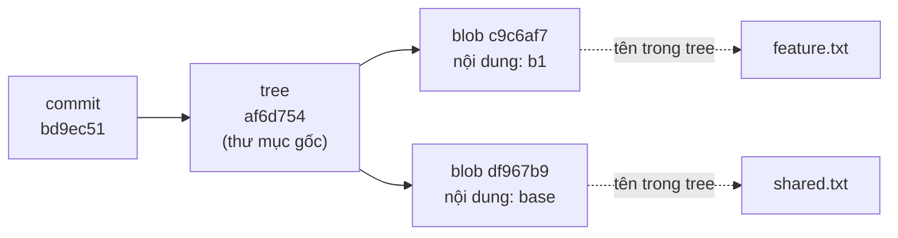

Kiểm chứng bằng lệnh thật. `git cat-file -p <hash>` là lệnh in **nguyên xi** nội dung một
object (chữ `-p` = pretty-print):

```
$ git cat-file -p bd9ec51            # đây là commit
tree af6d7545afca6b0567a329226737918271bfa6a5
parent 94cb66e752a67f47f8bfd937c660bd99ecfc61a2
...

$ git cat-file -p af6d7545            # đi tiếp vào tree
100644 blob c9c6af7f78bc47490dbf3e822cf2f3c24d4b9061	feature.txt
100644 blob df967b96a579e45a18b8251732d16804b2e56a55	shared.txt

$ git cat-file -p c9c6af7f            # đi tiếp vào blob
b1
```

Ba lệnh, ba tầng: commit → tree → blob. Đúng như sơ đồ.

> **Plumbing vs porcelain.** Git chia lệnh làm hai nhóm: **plumbing** (ống nước) là lệnh cấp
> thấp như `cat-file`, output ổn định để máy đọc; **porcelain** (đồ sứ) là lệnh cấp cao dành
> cho người như `log`, `show`, `status`. Bài này dùng nhiều plumbing vì chỉ nó mới cho thấy
> tầng dữ liệu thật.

---

## 3. Mổ xẻ một commit object

### 3.1 Bốn cách xem

```bash
git cat-file -p <hash>            # plumbing: in raw object — thấp nhất, thật nhất
git cat-file -t <hash>            # object này loại gì? -> in ra "commit"/"tree"/"blob"
git log -1 --format=raw <hash>    # cũng ra field thô, khỏi cần nhớ cat-file
git show <hash>                   # porcelain: bản dễ đọc, kèm luôn diff
```

### 3.2 Các field bên trong

Chạy thật trên một commit thường:

```
$ git cat-file -p bd9ec51
tree af6d7545afca6b0567a329226737918271bfa6a5
parent 94cb66e752a67f47f8bfd937c660bd99ecfc61a2
author demo (d@e.com) 1785743086 +0700
committer demo (d@e.com) 1785743086 +0700
gpgsig -----BEGIN PGP SIGNATURE-----
 ...
 -----END PGP SIGNATURE-----

b1
```

Sơ đồ hoá nó ra:

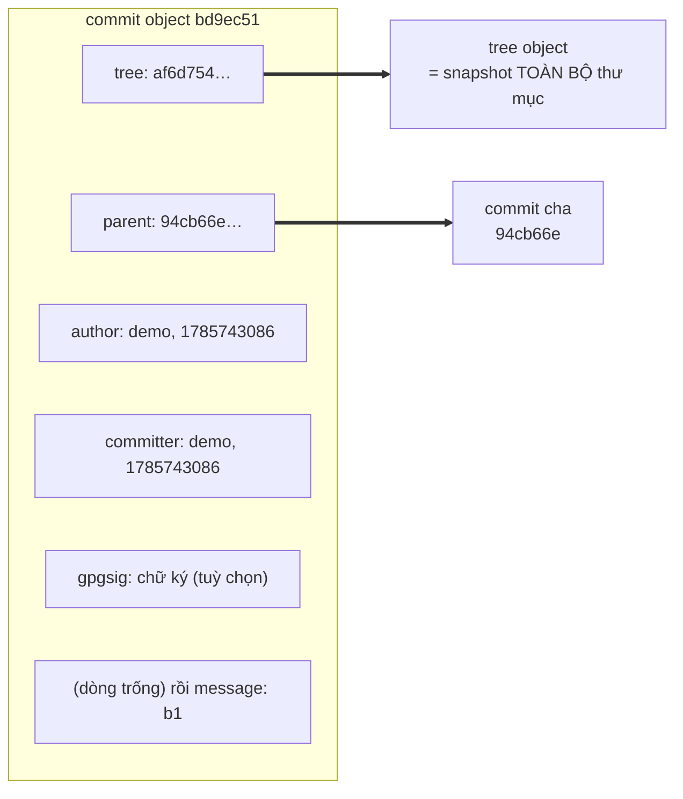

Bảng giải nghĩa:

| Field | Ý nghĩa |
|---|---|
| `tree` | con trỏ tới tree object = **snapshot toàn bộ** cây thư mục lúc commit |
| `parent` | **0 dòng** = commit đầu tiên của repo; **1 dòng** = commit thường; **≥2 dòng** = merge commit |
| `author` | ai **viết** thay đổi + thời điểm viết |
| `committer` | ai **tạo ra object commit này** + thời điểm tạo |
| `gpgsig` | chữ ký GPG xác thực (tuỳ chọn, không phải commit nào cũng có) |
| dòng trống + phần còn lại | **commit message** |

### 3.3 Điểm gây sốc thứ nhất: commit là snapshot, không phải diff

Nhìn kỹ bảng trên: **không có field nào tên là `diff`**. Trực giác thông thường ("commit lưu
phần thay đổi") là sai. Mỗi commit trỏ tới một tree = **bản chụp đầy đủ** trạng thái repo tại
thời điểm đó.

Vậy cái diff xanh-đỏ đẹp đẽ khi chạy `git show` ở đâu ra? Git **tính lại** nó mỗi lần bạn hỏi,
bằng cách so tree của commit này với tree của commit cha:

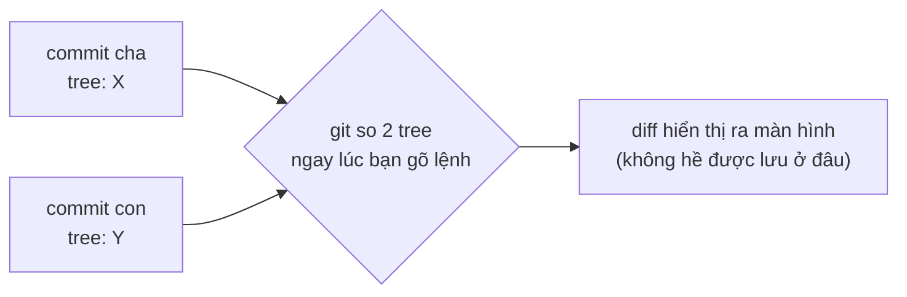

(Về mặt lưu trữ, git có nén các object giống nhau lại bằng cơ chế **packfile** để tiết kiệm ổ
cứng, nhưng đó là chuyện tối ưu bên dưới — mô hình logic vẫn là snapshot.)

### 3.4 Điểm gây sốc thứ hai: `author` và `committer` có thể khác nhau

Đây là commit merge thật của một pull request trên GitHub:

```
$ git cat-file -p HEAD
tree c57843bd3392a846cbc0befb88e970cec9748a4b
parent ebed9286844b53309c17e8e278cde08b7f22a252
parent 2eb2372cebcda206006f43ef2e9690fd7a88ede4
author   Todd  (redacted@example.com)   1785740523 +0700
committer GitHub (noreply@github.com)   1785740523 +0700
...
Merge pull request #72 from ...
```

`author` là người dùng, nhưng `committer` là **GitHub**. Lý do: cái nút "Merge pull request"
trên web là bên **thực sự chạy lệnh tạo ra object này**, còn người dùng chỉ là người viết code
gốc. `git rebase` cũng tách hai field y hệt vậy: giữ nguyên `author` gốc, đặt `committer` là
người/máy chạy rebase. Đó là lý do hai field này tồn tại riêng.

Và để ý: commit này có **2 dòng `parent`** — dấu hiệu nhận biết một merge commit.

---

## 4. Git tổ chức commit như thế nào — DAG, không phải timeline

Trực giác thông thường: "git là một danh sách commit xếp theo thời gian". Gần đúng, nhưng
không phải. Git lưu một **DAG** — viết tắt của **Directed Acyclic Graph** (đồ thị có hướng,
không chu trình):

- **Directed** (có hướng): mỗi commit chỉ trỏ **ngược về quá khứ**, qua field `parent`. Không
  commit nào biết con nó là ai.
- **Acyclic** (không chu trình): không thể có vòng lặp — bạn không thể là ông nội của chính mình.

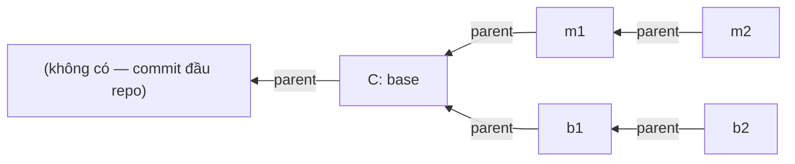

Mũi tên **chỉ về bên phải**, tức về phía quá khứ. Thứ tự thời gian mà bạn thấy trong `git log`
chỉ là **hệ quả** của việc lần theo các mũi tên `parent` này, chứ không có "trục thời gian" nào
được lưu sẵn cả.

---

## 5. Branch chỉ là một con trỏ. HEAD là con trỏ trỏ vào con trỏ.

### 5.1 Branch = một file text chứa một dãy số

Đây là thứ gây ngạc nhiên nhất với người mới. Một **branch** trong git không phải bản sao code,
không chứa lịch sử. Nó là **một file text** nằm ở `.git/refs/heads/<tên-branch>`, bên trong
đúng **một dòng hash**:

```
$ cat .git/refs/heads/main
53559503d6e17355dd804e1b574be2baca7b6cdf
$ cat .git/refs/heads/feature
66dfe6f2f0b50800f6122efda8e92862e9265693
```

Hết. Vậy khi bạn commit, git làm đúng hai việc:

1. Tạo commit object mới, với `parent` = commit đang được branch trỏ tới.
2. **Ghi đè** hash mới vào file `refs/heads/<branch>`.

"Branch tiến lên" thực chất chỉ là **file này đổi nội dung**.

> Ghi chú: git đôi khi "đóng gói" các ref vào `.git/packed-refs` cho gọn, lúc đó file rời có
> thể không tồn tại. Về mặt logic thì không đổi gì.

### 5.2 HEAD = "tôi đang đứng ở đâu"

**HEAD** là một con trỏ đặc biệt trả lời câu hỏi *bạn đang đứng trên branch nào*. Nó **không**
trỏ thẳng vào commit — nó trỏ vào **tên branch** (thuật ngữ: **symbolic ref**, con trỏ tượng trưng):

```
$ cat .git/HEAD
ref: refs/heads/main
```

Thành ra một chuỗi ba tầng:

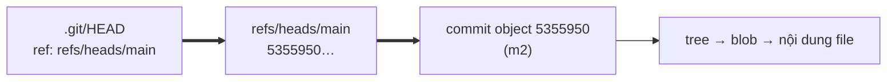

`git checkout feature` làm gì? Chỉ đổi nội dung file `.git/HEAD` thành `ref: refs/heads/feature`
(rồi cập nhật file trong thư mục làm việc cho khớp). Nhẹ hều — đó là lý do checkout nhanh.

**Detached HEAD** (HEAD tách rời): nếu bạn checkout thẳng một hash thay vì tên branch, `.git/HEAD`
sẽ chứa luôn hash đó, không qua branch nào. Hệ quả: commit mới tạo tiếp **không có branch nào
theo dõi** → dễ "mất". Cứu bằng `reflog` ở phần 8.

---

## 6. Khi hai nhánh cùng tiến

Giờ dựng đúng tình huống kinh điển: từ commit `C`, tách nhánh `feature` làm 2 commit `b1`, `b2`;
cùng lúc `main` cũng có 2 commit `m1`, `m2`.

```bash
git checkout -b feature      # tách nhánh tại C
# ... tạo b1, b2
git checkout main
# ... tạo m1, m2
```

Kết quả thật:

```
$ git log --all --graph --oneline --decorate
* 66dfe6f (feature) b2
* bd9ec51 b1
| * 5355950 (HEAD -> main) m2
| * 013fb44 m1
|/
* 94cb66e C: base
```

Vẽ lại cho dễ nhìn:

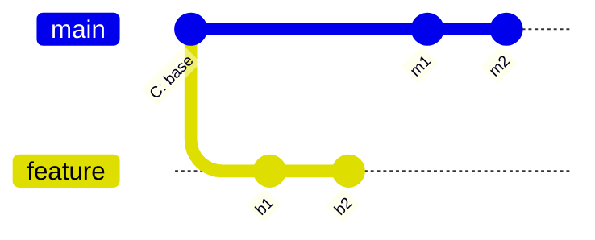

Một thuật ngữ quan trọng xuất hiện ở đây: **merge-base** (điểm gốc chung / tổ tiên chung) — là
commit cuối cùng mà **cả hai** nhánh đều có. Ở đây là `C`. Git tự tìm được nó:

```
$ git merge-base main feature
94cb66e752a67f47f8bfd937c660bd99ecfc61a2      # chính là C
```

Ghi nhớ con số này — phần 7 sẽ dùng lại nó.

---

## 7. Bốn cách hợp nhánh

Điều cần nói trước, vì rất dễ hiểu lầm: **GitHub không phát minh ra ba nút merge.** Nút "Merge
pull request" chỉ gọi đúng những lệnh git mà bạn chạy tay ở local được. Dưới đây là từng cách,
kèm cơ chế thật bên dưới.

### 7.1 Fast-forward — không tạo commit nào cả

**Điều kiện:** nhánh đích (ví dụ `main`) **không có** commit mới nào kể từ lúc rẽ nhánh. Lịch sử
nằm thẳng hàng → **không có gì để trộn**.

Lúc đó git chỉ làm một việc: **ghi đè file ref**, trượt con trỏ `main` tới thẳng commit cuối của
`feature`.

```
$ git log --all --graph --oneline --decorate    # trước
* 49bbb23 (feature) C3
* b17bace C2
* 0126fff (HEAD -> main) C1

$ git merge feature
Updating 0126fff..49bbb23
Fast-forward

$ git log --all --graph --oneline --decorate    # sau
* 49bbb23 (HEAD -> main, feature) C3
* b17bace C2
* 0126fff C1
```

Để ý dòng cuối: `(HEAD -> main, feature)` — **hai branch giờ trỏ vào đúng cùng một commit**.
Không object nào được tạo ra.

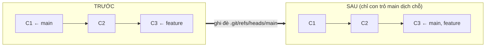

**Nên nhớ:** fast-forward là một **cơ chế**, không phải một "chiến lược merge" ngang hàng với ba
cái dưới. Nó chỉ xảy ra khi hoàn cảnh cho phép.

### 7.2 "Create a merge commit" = `git merge --no-ff`

Cờ `--no-ff` nghĩa là "no fast-forward": ép tạo commit merge kể cả khi tua nhanh được.

**Cơ chế:** tìm merge-base → chạy **three-way merge** (phần 8) để ra tree kết quả → tạo một
commit mới có **hai dòng `parent`**.

```
$ git merge --no-ff feature -m "Merge branch 'feature'"

$ git log --all --graph --oneline --decorate
*   2347b62 (HEAD -> main) Merge branch 'feature'
|\
| * 66dfe6f (feature) b2
| * bd9ec51 b1
* | 5355950 m2
* | 013fb44 m1
|/
* 94cb66e C: base

$ git cat-file -p main | grep -E "^(tree|parent)"
tree   dff6edc2ceb3063b1507f2c720b43f356ea72fdd
parent 53559503d6e17355dd804e1b574be2baca7b6cdf     ← đầu main cũ (m2)
parent 66dfe6f2f0b50800f6122efda8e92862e9265693     ← đầu feature (b2)
```

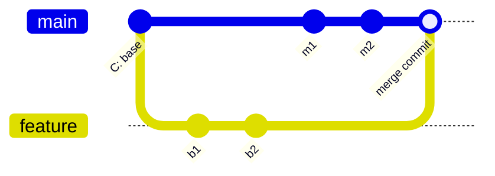

`b1`, `b2` **giữ nguyên hash gốc**. Merge commit chỉ là một node nối thêm vào đồ thị, đánh dấu
rõ "chỗ này hai nhánh gặp nhau".

### 7.3 "Squash and merge" = `git merge --squash` + `git commit`

**Cơ chế:** dùng **đúng cùng thuật toán three-way merge** như trên để tính ra tree — nhưng
`--squash` cố tình **không ghi cha thứ hai**, chỉ để tree kết quả nằm sẵn trong staging area.
Bạn tự `git commit` sau, tạo ra một commit **một cha** bình thường.

```
$ git merge --squash feature && git commit -m "Squash b1+b2"

$ git log --all --graph --oneline --decorate
* 9492118 (HEAD -> main) Squash b1+b2
* 5355950 m2
* 013fb44 m1
| * 66dfe6f (feature) b2
| * bd9ec51 b1
|/
* 94cb66e C: base

$ git cat-file -p main | grep -E "^(tree|parent)"
tree   dff6edc2ceb3063b1507f2c720b43f356ea72fdd     ← Y HỆT tree của merge commit ở 7.2!
parent 53559503d6e17355dd804e1b574be2baca7b6cdf     ← chỉ MỘT dòng
```

Đây là phát hiện đáng giá nhất của cả bài. Đặt hai kết quả cạnh nhau:

| | Merge commit (7.2) | Squash (7.3) |
|---|---|---|
| `tree` | `dff6edc…` | `dff6edc…` **giống hệt** |
| số dòng `parent` | 2 | 1 |

**Nội dung file sau merge của hai cách là hoàn toàn như nhau.** Khác biệt **duy nhất** nằm ở
chỗ có ghi lại cha thứ hai hay không. Mà cái "cha thứ hai" đó chính là sợi dây duy nhất nối
`main` với lịch sử của `feature`. Cắt nó đi thì:

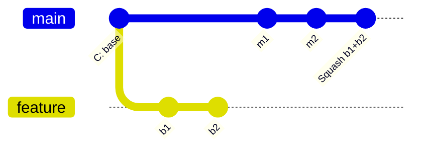

Nhìn sơ đồ: nhánh `feature` **lơ lửng**, không nối vào `main` chỗ nào. Từ `main` nhìn lại,
`b1` và `b2` chưa từng tồn tại. Đó là cái giá của squash: đổi lịch sử gọn gàng lấy khả năng
truy ngược từng commit gốc.

### 7.4 "Rebase and merge" = `git rebase`

Cơ chế **khác hẳn** ba cái trên: không tạo merge commit nào cả.

Với **từng** commit trên `feature` (theo thứ tự `b1` rồi `b2`), git tính ra **diff** mà commit đó
tạo ra so với cha của chính nó, rồi **áp lại** cái diff đó lên đỉnh mới của `main` — bản chất
giống chạy `git cherry-pick` liên tiếp. Vì cha đã đổi (`C` → `m2`), mỗi commit buộc phải trở
thành **object mới, hash mới**:

```
$ git checkout feature && git rebase main

$ git log --all --graph --oneline --decorate
* 0d29435 (HEAD -> feature) b2      ← hash mới
* ddaf64e b1                        ← hash mới
* 5355950 (main) m2
* 013fb44 m1
* 94cb66e C: base
```

So sánh trực tiếp:

| Commit | Trước rebase | Sau rebase |
|---|---|---|
| `b1` | `bd9ec51` (cha = `C`) | `ddaf64e` (cha = `m2`) |
| `b2` | `66dfe6f` | `0d29435` |

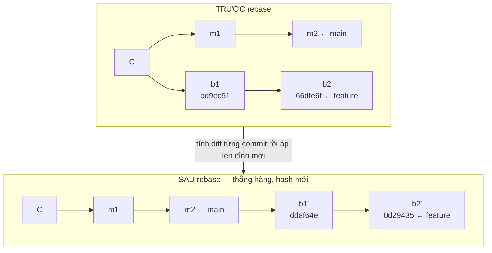

Nội dung code giống hệt, nhưng đứng ở tầng object thì đây là **những commit hoàn toàn khác**.
Và vì sau rebase `feature` đã nằm thẳng hàng sau `main`, bước merge cuối cùng chỉ còn là…
**fast-forward** (7.1). Vòng tròn khép lại.

### 7.5 Bảng tổng kết bốn cách

| Cách | Lệnh git thật | Cơ chế lõi | Commit mới | Giữ hash gốc? |
|---|---|---|---|---|
| **Fast-forward** | `git merge` (khi không rẽ nhánh) | ghi đè file ref, hết | 0 | có |
| **Merge commit** | `git merge --no-ff` | merge-base + three-way + tạo commit 2 cha | 1 | có |
| **Squash** | `git merge --squash` + `commit` | y hệt trên, nhưng **bỏ** cha thứ 2 | 1 | **không** |
| **Rebase** | `git rebase` | lặp: diff từng commit → áp lên base mới | n (viết lại) | **không** |

---

## 8. Thuật toán three-way merge

### 8.1 Vì sao phải là "ba chiều"?

Tưởng tượng cách ngây thơ: chỉ so hai bản A và B với nhau (**two-way merge**). Gặp một dòng có
ở A mà không có ở B — không thể biết là **A vừa thêm dòng đó** hay **B vừa xoá nó đi**. Hai
tình huống trái ngược, cùng một hiện tượng.

Cách giải: nhìn thêm **điểm thứ ba** — bản gốc chung (merge-base) trước khi hai bên rẽ nhánh.
Đó là **three-way merge**: `base`, `A`, `B`.

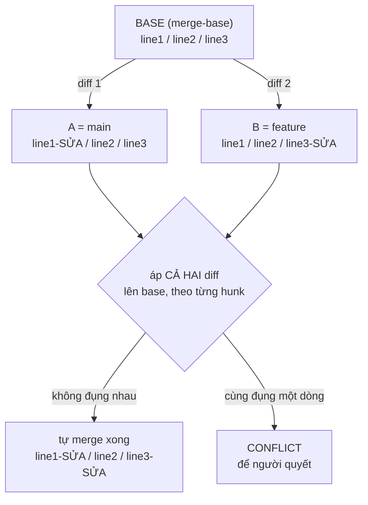

Thuật ngữ: **hunk** = một cụm dòng liền kề bị thay đổi. Git xét theo từng hunk chứ không theo
cả file.

### 8.2 Trường hợp thuận: hai bên sửa hai chỗ khác nhau

Base là ba dòng `line1 / line2 / line3`. `main` sửa dòng 1, `feature` sửa dòng 3:

```
$ git merge --no-ff feature -m "merge clean case"
Auto-merging f.txt

$ cat f.txt
line1-EDITED-BY-MASTER
line2
line3-EDITED-BY-FEATURE
```

Hai thay đổi không đụng nhau → git ghép cả hai, không hỏi ai một câu.

### 8.3 Trường hợp nghịch: hai bên cùng sửa một dòng

```
$ git merge --no-ff feature -m "merge conflicting case"
Auto-merging f.txt
CONFLICT (content): Merge conflict in f.txt
Automatic merge failed; fix conflicts and then commit the result.

$ cat f.txt
line1
line2
<<<<<<< HEAD
MASTER-VERSION
=======
FEATURE-VERSION
>>>>>>> feature
```

Thuật toán không có cơ sở nào để quyết bên nào đúng, nên nó **không đoán** — nó giữ cả hai phiên
bản kèm **conflict marker** (dấu xung đột) cho người chọn:

| Marker | Nghĩa |
|---|---|
| `<<<<<<< HEAD` | mở đầu — phía dưới là bản của **nhánh bạn đang đứng** |
| `=======` | ranh giới giữa hai bản |
| `>>>>>>> feature` | kết thúc — phía trên là bản của **nhánh đem vào** |

Việc của bạn: sửa file thành bản đúng, xoá cả ba dòng marker, `git add`, rồi `git commit`.

> Chi tiết bổ sung: thuật toán mặc định của git hiện nay tên là **ort** (thay cho `recursive`
> từ git 2.34). Khi hai nhánh có **nhiều hơn một** merge-base, nó merge đệ quy các base đó lại
> thành một base ảo rồi mới chạy three-way như trên.

### 8.4 Chốt lại một hiểu lầm

Three-way merge là cơ chế dùng chung cho **cả** merge commit **lẫn** squash. Bằng chứng chính là
hai tree `dff6edc…` giống hệt nhau ở phần 7.3. Khác biệt giữa hai cách nằm ở bước **ghi parent**,
không nằm ở bước **tính tree**.

---

## 9. `git reflog` — lưới an toàn cứu bạn khi lỡ tay

### 9.1 Nó là gì

**reflog** (viết tắt của *reference log* — nhật ký con trỏ) ghi lại **mọi lần một ref (HEAD hoặc
một branch) đổi hash**: do commit, checkout, merge, rebase, reset — bất kể lý do gì.

Hai tính chất quan trọng: nó **chỉ tồn tại ở máy bạn** (không push lên remote, không ai khác
thấy), và nó ghi lại cả những trạng thái mà `git log` **không còn hiển thị**.

### 9.2 Demo: cứu commit sau `reset --hard`

Tạo 3 commit, rồi lỡ tay xoá mất 2 cái cuối:

```
$ git reset --hard HEAD~2
HEAD is now at c3f192f commit 1

$ git log --oneline
c3f192f commit 1              ← "commit 2" và "commit 3" biến mất!
```

Nhưng reflog vẫn nhớ:

```
$ git reflog
c3f192f HEAD@{0}: reset: moving to HEAD~2
0bd6192 HEAD@{1}: commit: commit 3      ← hash vẫn còn đây
4d6bcb5 HEAD@{2}: commit: commit 2
c3f192f HEAD@{3}: commit (initial): commit 1
```

Cứu lại bằng đúng một lệnh:

```
$ git reset --hard HEAD@{1}
$ git log --oneline
0bd6192 commit 3
4d6bcb5 commit 2
c3f192f commit 1
```

### 9.3 Vì sao cứu được?

Vì `git log` và object database là **hai chuyện khác nhau**:

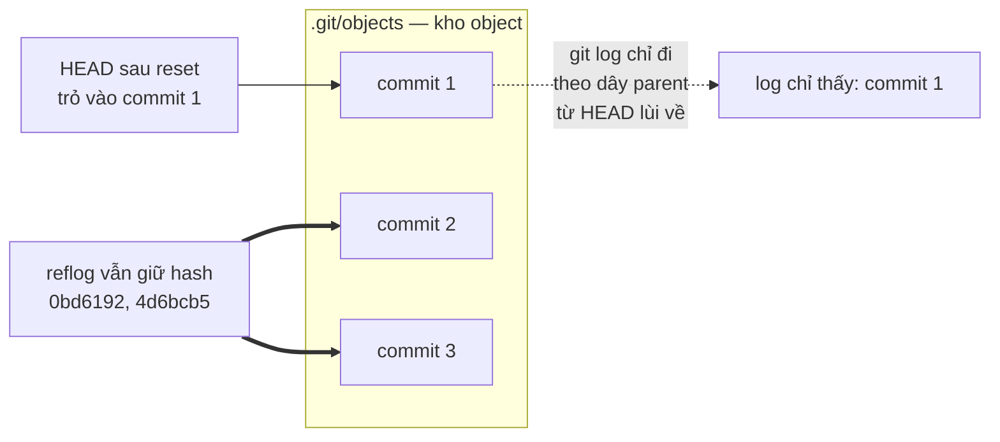

`git log` chỉ lần theo dây `parent` từ HEAD hiện tại lùi về. HEAD dời chỗ → những commit không
còn nằm trên đường đó biến mất khỏi log. Nhưng **object của chúng vẫn nằm nguyên trong
`.git/objects`**, chỉ là không còn ai trỏ tới (thuật ngữ: **unreachable** — không tới được).
Reflog giữ hash → bạn trỏ lại được.

**Hạn dùng:** reflog tự hết hạn sau khoảng 90 ngày (với commit còn reachable) hoặc 30 ngày (với
unreachable), rồi `git gc` (garbage collector — bộ dọn rác) mới xoá thật.

**Dùng khi:** lỡ `reset --hard`, rebase hỏng, xoá nhầm branch, hoặc mất commit vì detached HEAD.

---

## 10. Cheat sheet

Lệnh để tự soi:

```bash
git cat-file -p <hash>              # in raw object (commit/tree/blob)
git cat-file -t <hash>              # object này loại gì
git log --all --graph --oneline --decorate   # vẽ DAG ra terminal
git merge-base <A> <B>              # tìm tổ tiên chung
cat .git/HEAD                       # đang đứng ở đâu
cat .git/refs/heads/<branch>        # branch đang trỏ vào hash nào
git reflog                          # nhật ký cứu hộ
```

Bảy điều đọng lại:

1. Commit = `tree` + `parent(s)` + `author`/`committer` + message. Là **snapshot**, không phải diff.
2. Branch = một file chứa một hash. HEAD = con trỏ trỏ vào **tên branch**.
3. Git lưu **DAG**, mũi tên chỉ ngược về quá khứ.
4. **Fast-forward** là cơ chế trượt con trỏ, không phải chiến lược merge.
5. Merge commit và squash cho **tree giống hệt nhau** — chỉ khác ở dòng `parent` thứ hai.
6. Rebase **viết lại object** → hash đổi; `author` giữ nguyên, `committer` đổi.
7. Reflog cứu được gần như mọi thứ chưa bị `gc` dọn — nhưng chỉ ở máy bạn.

Và câu trả lời cho dòng chữ mở đầu bài: `Fast-forward` nghĩa là git **không phải trộn gì cả** —
nó chỉ dịch một con trỏ từ hash này sang hash kia.
