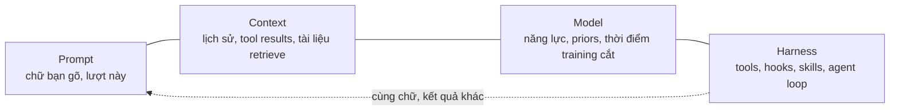
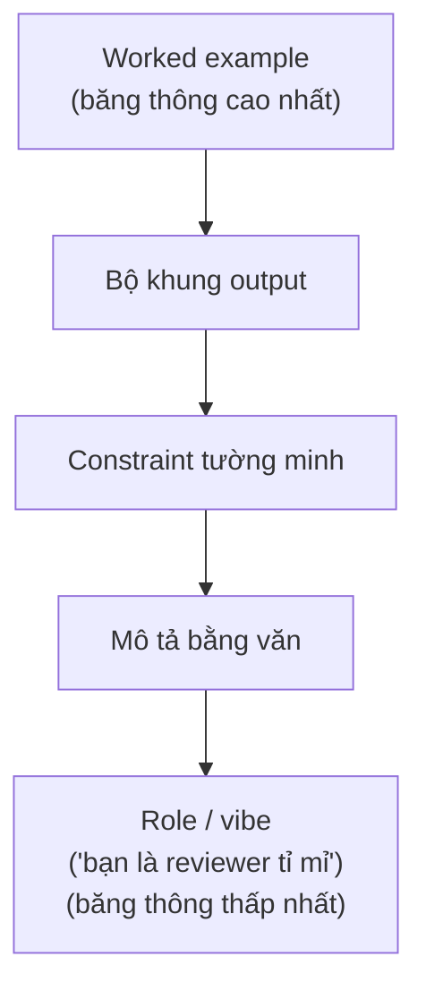
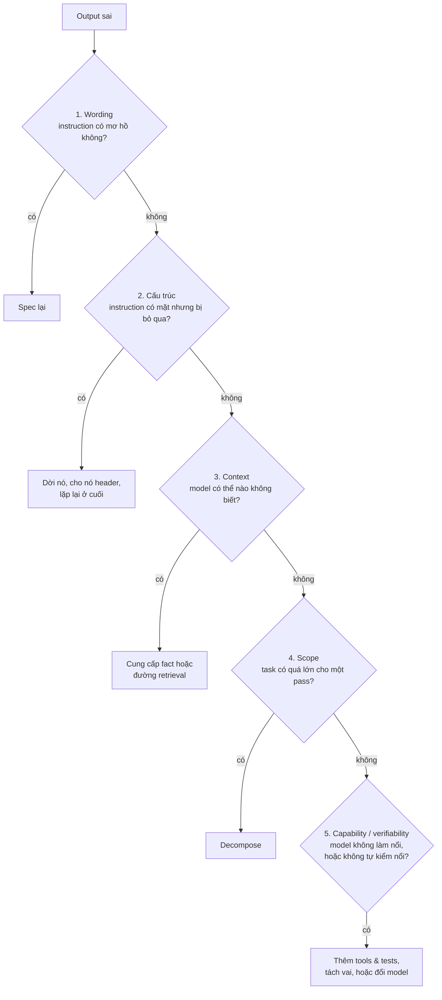
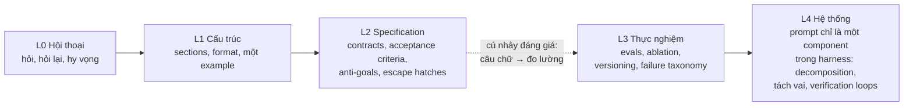

Phần lớn lời khuyên về "prompt tốt hơn" là một danh sách mẹo vặt: lịch sự vào, bảo model "hít thở sâu", thêm câu "bạn là chuyên gia". Vài mẹo trong đó từng có tác dụng thật, ít nhất là trên các model đời cũ — nhưng coi đó là cả cái nghề thì chẳng khác gì học nấu ăn bằng cách thuộc lòng tên hãng gia vị thay vì hiểu về nhiệt, vị chua, và thời gian. Bên dưới đống mẹo vặt đó là một mental model thật sự, một bộ thành phần chịu lực nhỏ gọn, và — quan trọng hơn — một *cách luyện tập* để lên trình có đo lường được, thay vì đoán mò. Đây là cẩm nang cho cả ba thứ đó.

## TL;DR

1. **Prompt không phải lệnh — nó nắn một phân phối xác suất (probability distribution).** Model *tiếp tục* một văn bản, không execute một cây instruction. Prompting là nghề dịch khối xác suất về phía output bạn chấp nhận được.
2. **Đơn vị phân tích là bộ (prompt, context, model, harness), không bao giờ là prompt đứng một mình.** Cùng một đoạn chữ hành xử khác nhau giữa API call trần, chat có memory, và agentic loop có tools/skills.
3. **Model là một non-situated reader** (người đọc không có bối cảnh) — cực giỏi, tổng quát, nhưng context "hành lang" bằng không. Bài test quan trọng nhất: một người lạ trình độ world-class, chỉ cầm văn bản này cộng những gì harness cung cấp, có ra được thứ bạn muốn không?
4. **Ambiguity (sự mơ hồ) chết trong im lặng.** Model không hỏi lại — nó chọn một cách đọc, đầy tự tin, rồi xây tiếp. Đóng ambiguity trên các chiều load-bearing (chịu lực); ép phần còn lại phải lộ diện ("nêu giả định trước khi bắt đầu").
5. **Prompt tốt được xây từ các thành phần chịu lực**: mục tiêu falsifiable (có thể kiểm chứng sai/đúng), context vừa đủ, constraints viết dạng "không X, thay bằng Y, vì Z", examples (kênh băng thông cao nhất), output contract, process có thứ tự/vị trí, và escape hatch cho tình huống không chắc.
6. **Ba lực kinh tế học giải thích giải phẫu trên**: thứ bậc băng thông (worked example > bộ khung output > constraint tường minh > văn xuôi > role/vibe), thuế overspecification đối trọng với drift của underspecification, và priors của model — cưỡi thì rẻ, chống thì đắt.
7. **Prompt không có verification là nửa cái prompt.** Acceptance criteria, một bước tự-kiểm, và — với việc high-stakes — một evaluator độc lập, adversarial phải nằm trong thiết kế prompt, không phải gắn thêm sau.
8. **Một output sai có một trong năm nguyên nhân, theo thứ tự leo thang**: wording (câu chữ) → cấu trúc → context → scope (phạm vi) → capability/verifiability (năng lực/khả năng kiểm chứng). Chẩn đúng tầng trước khi chạm chữ là một nửa kỹ năng.
9. **Lên trình là kỷ luật feedback loop**, không phải kho từ vựng thần chú: evals tí hon, mutation-test evals, ablation, giao thức paraphrase-back, failure journal có taxonomy, bài test thần đèn (genie test), version prompt như code, thư viện block tái dùng, và viết spec trước khi viết prompt.
10. **Một thang trưởng thành (L0 hội thoại → L4 hệ thống)** giúp bạn tự định vị; đa số dừng ở L1–L2 vì L3 đòi đo lường, không phải câu chữ hay hơn.

---

## 1. Chỉnh mental model trước đã

Bắt đầu từ đây, vì gần như toàn bộ phần còn lại của bài suy ra từ đúng một ý: prompt không phải là lệnh. Model không parse chữ của bạn thành cây instruction rồi execute; nó *tiếp tục một văn bản*. Mọi thứ trong context window — chữ của bạn, system prompt, tool results, kể cả lỗi chính tả — đều dịch chuyển phân phối xác suất của những gì sinh ra tiếp theo. Prompting là nghề nắn phân phối đó sao cho phần lớn khối lượng xác suất rơi vào vùng output bạn chấp nhận được.

Ba hệ quả kéo theo.

**Một, đơn vị phân tích không bao giờ là prompt đứng một mình, mà là bộ (prompt, context, model, harness).** Cùng một đoạn chữ sẽ hành xử khác nhau trong một API call trần, trong chat có memory, và trong agentic loop có tools, hooks, skills gánh sẵn definitions mà prompt được phép bỏ qua. Đánh giá prompt tách khỏi môi trường sống của nó cũng như đánh giá function tách khỏi runtime.



**Hai, model là một non-situated reader** — một contractor cực giỏi bị teleport vào project trong tình trạng mất trí nhớ. Skill tổng quát khổng lồ, context "hành lang" bằng không. Nó chưa đọc Slack của team, không biết "cách vẫn hay làm" là cách nào, và trong agentic run thường không hỏi lại được. Bài test hữu dụng nhất của prompting: *một người lạ trình độ world-class, chỉ cầm đúng văn bản này cộng những gì harness cung cấp, có ra được thứ mình muốn không?* Nếu câu trả lời là không, lỗ hổng nằm ở văn bản, không nằm ở người đọc.

**Ba, ambiguity chết trong im lặng.** Đồng nghiệp người thật sẽ hỏi lại; model thì chọn một cách đọc — đầy tự tin — rồi xây tiếp lên đó. Mỗi câu mơ hồ là một branch point (điểm rẽ nhánh), và thiệt hại kỳ vọng bằng xác suất chọn nhầm nhánh nhân với chi phí của mọi thứ xây bên trên. Không bao giờ khử được hết ambiguity, và cũng không nên cố (xem phần thuế overspecification bên dưới). Kỹ năng nằm ở chỗ: đóng ambiguity trên các chiều load-bearing, và ép phần còn lại phải lộ diện — "nêu các giả định trước khi bắt đầu" chỉ tốn một câu mà hoàn vốn liên tục.

## 2. Giải phẫu: các thành phần chịu lực

Không phải prompt nào cũng cần đủ bộ. Nhưng prompt tốt nào cũng đã *chủ động quyết định* nó cần những phần nào.

**Một mục tiêu falsifiable.** Gọi tên deliverable và định nghĩa "done", ở dạng có thể đối chiếu output vào để kiểm. "Phân tích PR này" là một điều ước. "Đưa recommendation go/no-go cho việc merge, liệt kê ba thay đổi rủi ro cao nhất, và đề xuất một test có khả năng falsify claim về coverage" mới là một task. Nếu bạn không phát biểu được acceptance criteria, model không thể bắn trúng — nó chỉ có thể đoán.

**Context vừa đủ, không hơn.** Context window là một ngân sách. Đưa vào những gì model không thể biết: facts của domain, trạng thái hiện tại, định nghĩa jargon nội bộ — một thuật ngữ team tự đặt là nhiễu cho đến khi được định nghĩa, hoặc đến khi skill / project doc gánh sẵn definition đó, và đó mới là chỗ ở đúng cho mọi thứ dùng lại nhiều lần. Loại ra những gì có thể retrieve khi cần và những gì không chịu lực. Token thừa không vô hại; nó pha loãng salience (độ nổi bật) của mọi thứ còn lại.

**Constraints và anti-goals.** Constraints định nghĩa đích; anti-goals cắt tỉa search space, và chúng mạnh nhất khi mỗi cái encode một failure đã thực sự xảy ra, kèm lý do. Một cảnh báo: "đừng làm X" trơ trọi lại đặt X vào context và có thể tăng salience của nó — hiệu ứng con voi hồng (pink-elephant problem). Dạng bền là bộ ba: không X; thay bằng Y; vì Z. Cấm, thay thế, lý do.

**Examples.** Kênh băng thông cao nhất bạn có. Mô tả truyền đi một đường biên; example truyền đi cả một phân phối. Nhưng example bị rò rỉ: model copy cả tone, độ dài, và các chi tiết cấu trúc ngẫu nhiên cùng với ý định, nên hãy đa dạng hóa nếu không muốn mấy chi tiết ngẫu nhiên đó bị clone theo. Một negative example dán nhãn *vì sao nó fail* đáng giá hơn vài nguyên tắc trừu tượng — một ca thất bại falsifiable neo constraint chắc hơn cả một đoạn văn nói về nó.

**Một output contract.** Cấu trúc, schema, sections, độ dài, tags. Cách rẻ nhất để phát biểu contract là *cho xem* một cái: bộ khung output đã điền mẫu thắng đứt ba câu mô tả nó.

**Process và vị trí.** Khi thứ tự quan trọng, đánh số các bước — sequencing chôn trong văn nối là thứ chết đầu tiên trong một run dài. Và attention không đồng đều: đầu và cuối prompt có trọng lượng vượt cỡ trong khi phần giữa võng xuống (hiệu ứng lost-in-the-middle), và một item xếp nhầm dưới header sai sẽ thừa hưởng attention weight sai. Invariants đặt trên đầu; yêu cầu trực tiếp đặt gần cuối; thứ gì bắt buộc nằm giữa mà phải sống sót thì nên ngắn, có header riêng, hoặc được nhắc lại.

**Escape hatches.** Định nghĩa hành vi ở biên: khi không chắc thì hỏi; hoặc nêu giả định inline; hoặc gắn tag `[UNVERIFIED]`; hoặc dừng ở checkpoint và báo cáo. Prompt không định nghĩa hành vi ở biên sẽ nhận về hành vi ứng biến ở biên.

## 3. Kinh tế học bên dưới các thành phần

Vì sao phần giải phẫu ở trên hoạt động? Vài lực giải thích điều đó, và đáng nắm trực tiếp vì chúng tổng quát hơn mọi template — không chỉ "làm theo mẫu này".

**Có một thứ bậc băng thông giữa các kênh.** Worked example thắng bộ khung output, bộ khung output thắng constraint tường minh, constraint tường minh thắng mô tả bằng văn, mô tả bằng văn thắng role và vibe. Thứ gì quan trọng, đẩy nó lên bậc cao hơn — đừng chỉ nói nó *to giọng* hơn.



"Bạn là một reviewer tỉ mỉ" là công cụ yếu nhất trên bàn; một example của một bài review tỉ mỉ là công cụ mạnh nhất.

**Có thuế overspecification và có drift của underspecification, và prompting sống giữa hai thứ đó.**

```
thiếu spec ◄─────────────── điểm cân bằng ───────────────► thừa spec
  model lấp chỗ trống          invariants được ràng,          các constraint chen lấn
  bằng default nghe-hợp-lý-    incidentals được im lặng       salience của nhau;
  nhưng-sai ("drift")                                         công sức tiêu vào nghi thức;
                                                               mỗi rule mới đánh thuế
                                                               attention của rule cũ
                                                               ("bẫy bồi đắp")
```

Spec thiếu, model lấp chỗ trống bằng default nghe-hợp-lý-nhưng-sai. Spec thừa, bạn trả giá ba lần: các constraint chen lấn salience của nhau, model tiêu công sức vào nghi thức thay vì bản chất, và bạn ôm thêm gánh bảo trì — mỗi rule thêm vào đánh thuế lên attention dành cho mọi rule đã có. Cơ chế cuối chính là bẫy bồi đắp (accretion trap): prompt cứ vá thêm "một rule nữa" sau mỗi sự cố sẽ thành nồi súp rule, và súp rule cần refactor y hệt như code. Ràng invariants; im lặng với những thứ ngẫu nhiên.

**Cuối cùng, model có priors** — thiên về helpfulness, rào đón, dài dòng, bày list, đồng thuận. Cưỡi theo prior gần như miễn phí; chống lại prior tốn nhấn mạnh, lặp lại, và đôi khi vẫn thua. Có những hành vi sửa bằng một pass thứ hai hoặc post-processing rẻ hơn nhiều so với viết hoa to dần trong prompt.

## 4. Prompt không có verification là nửa cái prompt

Nếu bạn không có cách kiểm output, bạn vừa spec một điều ước, không phải một task. Verification thuộc về bên trong prompt, không phải sau nó: acceptance criteria mà model tự đối chiếu được; một bước cuối tường minh ("trước khi chốt, kiểm mọi claim đều có nguồn; gắn tag cho thứ không kiểm được"); và với mọi thứ high-stakes, tách vai — generator không được tự chấm bài của mình. Một pass evaluator độc lập, adversarial từ trong thiết kế, bắt được những thứ self-review về mặt cấu trúc không thể bắt, vì self-review thừa hưởng đúng những điểm mù đã sinh ra output. Trong bối cảnh agentic, việc này di cư vào harness — hooks, evaluator subagents, test thật — nhưng thói quen bắt đầu từ tầng prompt: đừng bao giờ yêu cầu output mà bạn không thể falsify.

## 5. Khi vấn đề không nằm ở prompt

Sai lầm đắt nhất của prompting là sửa chữ trong khi lỗi sống ở tầng khác. Trước khi chạm vào một chữ, hãy chạy output qua cái thang này — mỗi bậc là một cách sửa đắt hơn bậc trước:



Chỉnh câu chữ cho một lỗi tầng 5 là cargo cult. Một nửa kỹ năng prompting là chẩn đúng tầng trước khi chạm vào một chữ.

## 6. Lên trình: cái loop mới là kỹ năng

Không ai prompt giỏi nhờ biết câu thần chú. Người prompt giỏi chạy feedback loop chặt hơn — họ đã chuyển giai thoại thành bằng chứng. Cụ thể:

**Xây evals tí hon.** Năm đến hai mươi input đại diện, gồm cả mấy ca xấu xí, chạy lại sau mỗi lần đổi prompt. Không có bộ so sánh cố định, "cảm giác tốt hơn" chỉ là nhiễu, và bạn sẽ làm hỏng lại cái fix của tuần trước mà không hay.

**Mutation-test chính bộ evals.** Cố ý làm hỏng prompt — xóa phần anti-goals, làm méo một definition — rồi xem evals có phát hiện không. Không phát hiện nghĩa là chúng chưa từng bảo vệ bạn. Đây đúng là logic của Stryker đẩy lên một tầng: test của test, eval của eval.

**Ablation.** Bỏ một section, dự đoán hệ quả, chạy, so với dự đoán. Không gì calibrate model-của-bạn-về-model nhanh hơn, và nó lộ ra đều đặn rằng một phần lớn của prompt trưởng thành là trọng lượng chết — bạn chỉ chưa biết phần nào.

**Giao thức paraphrase-back.** Trước khi execute: phát biểu lại task, plan, và các giả định. Máy dò ambiguity rẻ nhất đang tồn tại — nó biến việc chọn nhánh trong im lặng thành phát biểu nhìn thấy được và sửa được.

**Giữ một failure journal có taxonomy.** Gắn tag mọi failure: missing-info, ambiguity, salience, scope, capability, format, hay conflict. Tag quyết định cách fix; phần lớn chu kỳ lãng phí đến từ việc chữa lỗi salience như lỗi wording, hoặc chữa lỗi capability bằng bất cứ thứ gì thuộc về câu chữ.

**Red-team bằng bài test thần đèn.** Hỏi: một vị thần đèn lười và hiểu-đúng-nghĩa-đen sẽ thỏa mãn prompt này về mặt kỹ thuật mà vẫn trượt trọng tâm bằng cách nào? Vá đúng chỗ thần đèn khai thác. Prompt tốt là prompt kháng-bàn-tay-khỉ.

**Version prompt như code.** Files, diffs, changelog, review. Một prompt chịu lực xứng đáng với vệ sinh của một artifact chịu lực, và diff là câu trả lời trung thực duy nhất cho "đã thay đổi gì kể từ lần cuối nó còn chạy đúng?"

**Xây thư viện block.** Section anti-goals đã kiểm chứng, mệnh đề escape-hatch, bộ khung output, bước verification. Lắp ghép thắng ứng biến, và tái sử dụng là cách các bài học đơn lẻ tích lũy kép.

**Viết spec trước khi viết prompt.** Nếu bạn không tự phát biểu được acceptance criteria trong đầu mình, không câu chữ nào lén đưa được chúng vào prompt. Prompt là tấm gương: đưa vào sự rối, nhận lại sự rối. Một phần lớn đến bất ngờ của "cải thiện prompting" thực chất là cải thiện năng lực định nghĩa vấn đề, mặc một cái tên khác.

## 7. Mấy huyền thoại nên bỏ

Câu thần chú — lịch sự, "hít thở sâu", tip và dọa nạt — từng có hiệu ứng đo được nhưng bất ổn, chủ yếu trên các model đời cũ; hãy coi chúng là claim thực nghiệm để test, đừng coi là nghi lễ để tuân thủ. Bơm role ("bạn là chuyên gia giỏi nhất thế giới…") là đòn bẩy yếu nhất hiện có: một example của tiêu chuẩn thắng một tính từ nói về tiêu chuẩn. Dài hơn không phải tốt hơn; context là ngân sách và salience là đồng tiền. Và không câu chữ nào vá được khoảng trống capability — nếu model về căn bản không làm nổi task, hãy decompose, thêm tool, hoặc verify từ bên ngoài.

## 8. Thang trình độ, và checklist trước khi bay

Một cái thang thô để tự định vị:



Đa số người dừng lại giữa L1 và L2, vì bước sang L3 không còn là chuyện câu chữ mà là chuyện đo lường — và chính vì thế nó mới là cú nhảy đáng giá.

Trước khi ship một prompt quan trọng, kiểm:

- Deliverable đã được gọi tên; acceptance criteria falsifiable
- Jargon nội bộ đã định nghĩa, hoặc đã delegate cho skill / doc mà harness cung cấp
- Ambiguity trên các chiều chịu lực đã đóng; giả định còn lại bị ép lộ diện
- Anti-goals viết ở dạng "không X, thay bằng Y, vì Z"
- Có example ở mọi chỗ format hoặc thanh chất lượng quan trọng — đủ đa dạng để không bị clone chi tiết ngẫu nhiên
- Sequencing đã đánh số; invariants ở đầu; yêu cầu trực tiếp ở cuối
- Có escape hatch cho tình huống không chắc
- Có bước verification mà model thực sự chạy được
- Đã chạy một lượt bài test thần đèn tử tế
- Kiểm tầng: có phần nào trong này đáng lẽ thuộc về harness thay vì prompt không?

Nếu chỉ lấy một thói quen từ bài này, hãy lấy checklist trước-khi-bay ở trên — và nếu lấy được hai, thêm cái thang chẩn đoán lỗi ở mục 5. Hai thứ này gộp lại bắt được hai sai lầm đắt nhất: ship một điều ước không thể falsify, và sửa nhầm tầng.
