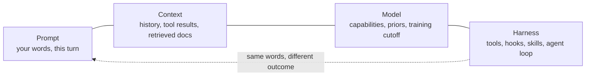
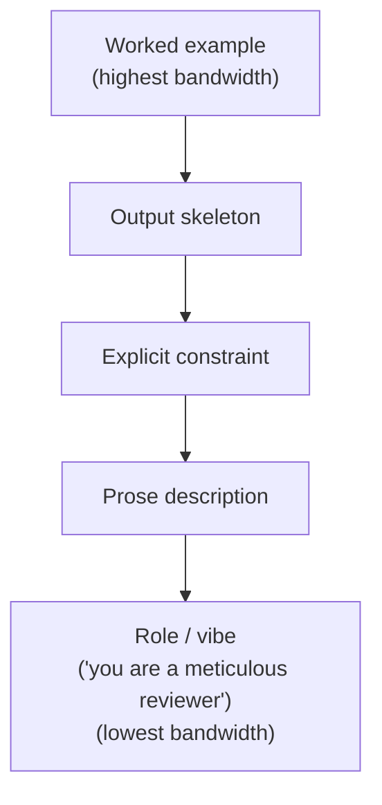
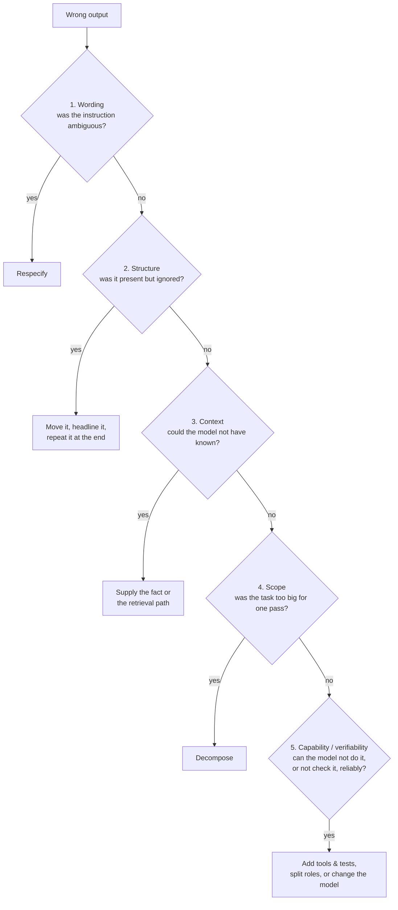
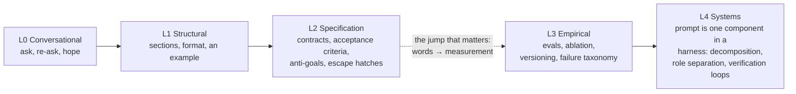

Most advice about "better prompting" is a list of tricks: be polite, tell it to take a deep breath, add "you are an expert." Some of that folklore even worked, once, on older models — but treating it as the craft is like learning to cook by memorizing seasoning brands instead of understanding heat, acid, and time. Underneath the tricks there is an actual mental model, a small set of load-bearing components, and — more importantly — a _practice_ for getting measurably better instead of guessing. This is a field guide to all three.

## TL;DR

1. **A prompt is not a command — it shapes a probability distribution.** The model continues a document; it does not execute an instruction tree. Prompting is the craft of shifting probability mass toward outputs you'd accept.
2. **The unit of analysis is the tuple (prompt, context, model, harness), never the prompt alone.** The same words behave differently in a bare API call vs. a chat with memory vs. an agentic loop with tools and skills.
3. **The model is a non-situated reader** — brilliant, general-purpose, zero hallway context. The test that matters: would a world-class stranger, given only this document plus what the harness supplies, produce what you want?
4. **Ambiguity fails silently.** The model doesn't ask a clarifying question — it picks a reading, confidently, and builds on it. Close ambiguity on load-bearing dimensions; force disclosure everywhere else ("state your assumptions before you start").
5. **A good prompt is built from load-bearing components**: a falsifiable objective, sufficient (not excess) context, constraints written as "not X, instead Y, because Z", examples (the highest-bandwidth channel), an output contract, ordered/positioned process, and escape hatches for uncertainty.
6. **Three economic forces explain the anatomy**: a bandwidth hierarchy (worked example > output skeleton > explicit constraint > prose > role/vibe), an overspecification tax vs. underspecification drift, and model priors that are cheap to ride and expensive to fight.
7. **A prompt without verification is half a prompt.** Acceptance criteria, a self-check step, and — for high-stakes work — an independent adversarial evaluator belong inside the prompt design, not bolted on after.
8. **A wrong output has one of five causes, in escalating order**: wording → structure → context → scope → capability/verifiability. Diagnosing the layer before editing a single word is half the skill.
9. **Getting better is a feedback-loop discipline**, not a vocabulary of magic words: tiny evals, mutation-testing the evals, ablation, the paraphrase-back protocol, a tagged failure journal, the genie test, versioning prompts like code, a reusable block library, and writing the spec before the prompt.
10. **A maturity ladder (L0 conversational → L4 systems)** locates where you are; most people plateau at L1–L2 because L3 requires measurement, not better phrasing.

---

## 1. Get the mental model right first

Start here, because almost everything else in this piece falls out of one idea: a prompt is not a command. The model does not parse your text into an instruction tree and execute it — it continues a document. Everything in the context window — your words, the system prompt, tool results, even your typos — shifts a probability distribution over what comes next. Prompting is the craft of shaping that distribution so most of the mass lands on outputs you would accept.

Three consequences follow.

**First, the unit of analysis is never the prompt alone but the tuple (prompt, context, model, harness).** The same words behave differently in a bare API call, in a chat window with memory, and in an agentic loop with tools, hooks, and skills that carry definitions the prompt can omit. Judging a prompt without its habitat is judging a function without its runtime.



**Second, the model is a non-situated reader:** a brilliant contractor teleported into your project with amnesia. Enormous general skill, zero hallway context. It has not read your Slack threads, does not know what "the usual way" means, and in an agentic run often cannot ask. The single most useful test in prompting: _would a world-class stranger, given only this document plus whatever the harness supplies, produce what I want?_ If the answer is no, the gap is in the document, not in the reader.

**Third, ambiguity fails silently.** A human collaborator asks a clarifying question; the model picks one reading — confidently — and builds on it. Every ambiguous clause is a branch point, and the expected damage equals the probability of the wrong branch times the cost of everything built on top of it. You will never remove all ambiguity, and you should not try (more on why below). The skill is closing ambiguity on the load-bearing dimensions and forcing disclosure everywhere else — "state your assumptions before you start" is one sentence and pays for itself constantly.

## 2. Anatomy: the load-bearing components

Not every prompt needs all of these. Every good prompt has consciously decided which ones it needs.

**A falsifiable objective.** Name the deliverable and the definition of done, in a form the output can be checked against. "Analyze this PR" is a wish. "Produce a go/no-go recommendation for merging, list the three highest-risk changes, and propose one test that would falsify the coverage claim" is a task. If you cannot state acceptance criteria, the model cannot hit them — it can only guess at them.

**Sufficient context, and no more.** The window is a budget. Include what the model cannot know: domain facts, current state, definitions of local jargon — a term your team invented is noise until defined, or until a skill or project doc carries the definition for you, which is the better home for anything reused. Exclude what is retrievable on demand and anything that is not load-bearing. Irrelevant tokens are not neutral; they dilute the salience of everything else.

**Constraints and anti-goals.** Constraints define the target; anti-goals prune the search space, and they are most powerful when each one encodes a failure you have actually observed, with the reason attached. One caution: a bare "don't do X" puts X into the context and can raise its salience — the pink-elephant problem. The robust form is a triple: not X; instead Y; because Z. Prohibition, replacement, rationale.

**Examples.** The highest-bandwidth channel you have. A description transmits a boundary; an example transmits a distribution. But examples leak: models copy tone, length, and structural incidentals along with the intent, so diversify them unless you want the incidentals cloned too. A negative example labeled with _why it fails_ is worth several abstract principles — one falsifiable failure case anchors a constraint better than a paragraph about it.

**An output contract.** Structure, schema, sections, length, tags. The cheapest way to state a contract is to show one: a filled-in skeleton of the expected output beats three sentences describing it.

**Process and position.** When order matters, number the steps — sequencing buried in connective prose is the first thing to die in a long run. And attention is not uniform: the beginning and the end of a prompt punch above their weight while the middle sags (the lost-in-the-middle effect), and an item filed under the wrong header inherits the wrong attention weight. Invariants go at the top; the immediate ask goes near the end; anything mid-prompt that must survive should be short, headlined, or repeated.

**Escape hatches.** Define behavior at the edge: when uncertain, ask; or state assumptions inline; or tag claims `[UNVERIFIED]`; or stop at a checkpoint and report. A prompt with no defined edge behavior gets improvised edge behavior.

## 3. The economics underneath the components

Why does the anatomy above work? A few forces explain it, and they're worth knowing directly because they generalize past any template.

**There is a bandwidth hierarchy of channels.** Worked example beats output skeleton beats explicit constraint beats prose description beats role and vibe. When something matters, promote it up the hierarchy — don't just say it harder.



"You are a meticulous reviewer" is the weakest instrument on the board; one example of a meticulous review is the strongest.

**There is an overspecification tax and an underspecification drift, and prompting lives between them.**

```
underspecified ◄─────────────── sweet spot ───────────────► overspecified
  model fills gaps with          invariants constrained,       constraints crowd each
  plausible-but-wrong            incidentals left silent       other's salience;
  defaults ("drift")                                           effort spent on ceremony;
                                                                every new rule taxes
                                                                attention on old rules
                                                                ("accretion trap")
```

Underspecify, and the model fills the gaps with plausible-but-wrong defaults. Overspecify, and you pay three times: constraints crowd each other's salience, the model spends effort on ceremony instead of substance, and you inherit a maintenance burden — every rule you add taxes the attention paid to every rule you already had. That last mechanism is the accretion trap: a prompt patched with "one more rule" after every incident turns into rule soup, and rule soup needs refactoring exactly the way code does. Constrain the invariants; stay silent on the incidentals.

**Finally, the model has priors** — toward helpfulness, hedging, verbosity, list-making, agreement. Riding a prior is nearly free; fighting one costs emphasis and repetition, and sometimes still fails. Some behaviors are cheaper to fix with a second pass or in post-processing than with ever-larger capital letters in the prompt.

## 4. A prompt without verification is half a prompt

If you have no way to check the output, you specified a wish, not a task. Verification belongs inside the prompt, not after it: acceptance criteria the model can self-test against; an explicit final step ("before finalizing, verify every claim has a source; tag what you cannot verify"); and, for anything high-stakes, role separation — the generator should not grade its own homework. An independent, adversarial evaluator pass catches what self-review structurally cannot, because self-review inherits the same blind spots that produced the output. In agentic settings this migrates into the harness — hooks, evaluator subagents, real tests — but the habit starts at the prompt level: never request output you cannot falsify.

## 5. When the prompt is not the problem

The most expensive prompting mistake is editing words when the failure lives at another layer. Before you touch a single word, run the output through this ladder — each rung is a more expensive fix than the last:



Tweaking phrasing on a layer-5 problem is cargo cult. Half of prompting skill is diagnosing the layer before touching a single word.

## 6. Getting better: the loop is the skill

Nobody prompts well because they know magic words. People who prompt well run tighter feedback loops — they have converted anecdote into evidence. Concretely:

**Build tiny evals.** Five to twenty representative inputs, including the ugly ones, run against every prompt change. Without a fixed comparison set, "it feels better" is noise, and you will re-break last week's fix without noticing.

**Mutation-test the evals.** Deliberately degrade the prompt — delete the anti-goals, garble a definition — and check whether your evals notice. If they don't, they were never protecting you. This is Stryker's logic applied one level up: tests of tests, evals of evals.

**Ablate.** Remove a section, predict the effect, run, compare against your prediction. Nothing calibrates your model-of-the-model faster, and it reliably reveals that a large fraction of a mature prompt is dead weight — you just didn't know which fraction.

**Use the paraphrase-back protocol.** Before execution: restate the task, the plan, and the assumptions. It is the cheapest ambiguity detector in existence — it converts silent branch-picking into visible, correctable statements.

**Keep a failure journal with a taxonomy.** Tag every failure: missing-info, ambiguity, salience, scope, capability, format, or conflict. The tag dictates the fix; most wasted cycles come from treating a salience failure as a wording failure, or a capability failure as anything fixable by words at all.

**Red-team with the genie test.** Ask how a lazy, literal-minded genie would technically satisfy this prompt while missing the point, then patch what the genie exploits. Good prompts are monkey's-paw-resistant.

**Version prompts like code.** Files, diffs, changelog, review. A load-bearing prompt deserves the hygiene of a load-bearing artifact, and a diff is the only honest answer to "what changed since it last worked?"

**Build a block library.** Your proven anti-goals section, escape-hatch clause, output skeleton, verification step. Composition beats improvisation, and reuse is how individual lessons compound.

**Write the spec before the prompt.** If you cannot state the acceptance criteria to yourself, no phrasing will smuggle them into the prompt. The prompt is a mirror: confusion in, confusion out. A surprising amount of "prompting improvement" is problem-definition improvement wearing a different name.

## 7. Myths worth dropping

Magic incantations — politeness, "take a deep breath", tips and threats — showed measurable but unstable effects mostly on older models; treat them as empirical claims to test, never as rituals to observe. Role inflation ("you are the world's best…") is the weakest lever available: an example of the standard outperforms an adjective about the standard. Longer is not better; context is a budget and salience is the currency. And no phrasing fixes a capability gap — if the model fundamentally cannot do the task, decompose it, tool it, or verify it externally.

## 8. A maturity ladder, and a pre-flight checklist

A rough ladder for locating yourself:



Most people plateau between L1 and L2, because moving to L3 stops being about words and starts being about measurement — which is precisely why it is the jump that matters.

Before shipping a prompt that matters, check:

- Deliverable named; acceptance criteria falsifiable
- Local jargon defined, or delegated to a skill / doc the harness provides
- Load-bearing ambiguities closed; remaining assumptions forced into the open
- Anti-goals written as "not X, instead Y, because Z"
- An example wherever format or quality bar matters — diverse enough not to clone incidentals
- Sequencing numbered; invariants at the top; the ask at the end
- An escape hatch for uncertainty
- A verification step the model can actually run
- One honest pass of the genie test
- Layer check: does any of this belong in the harness instead of the prompt?

If you take one habit from this piece, make it the pre-flight checklist above — and if you take two, add the failure ladder in section 5. Between them they catch the two most expensive mistakes: shipping an unfalsifiable wish, and fixing the wrong layer.
