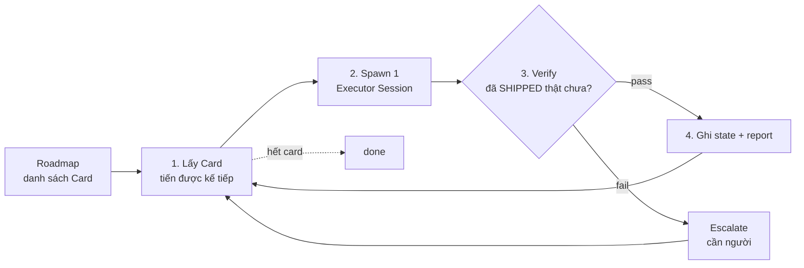
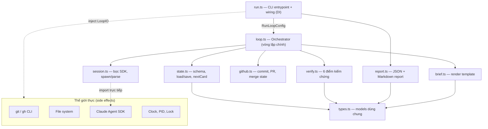
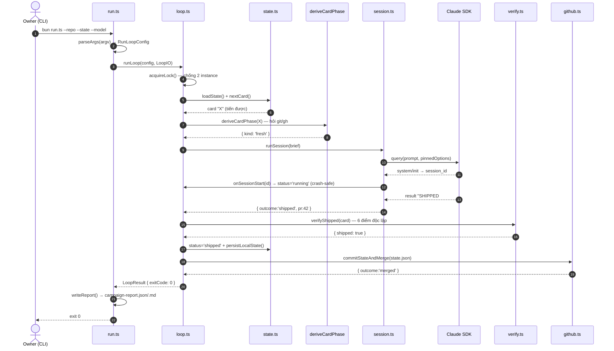
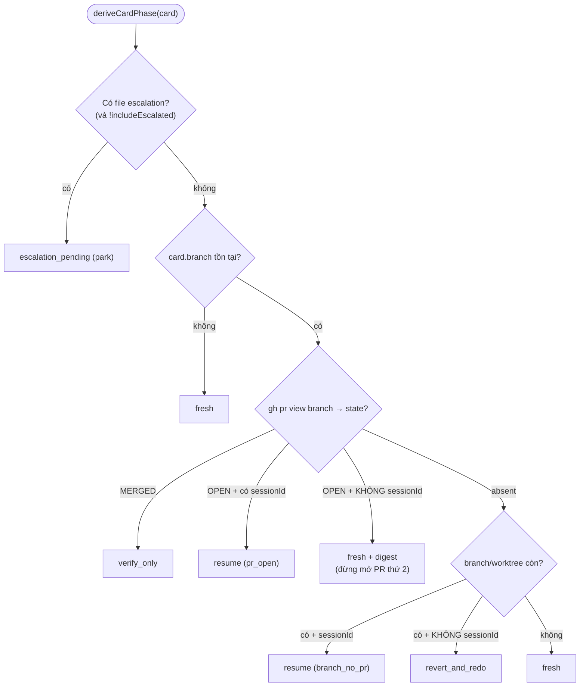
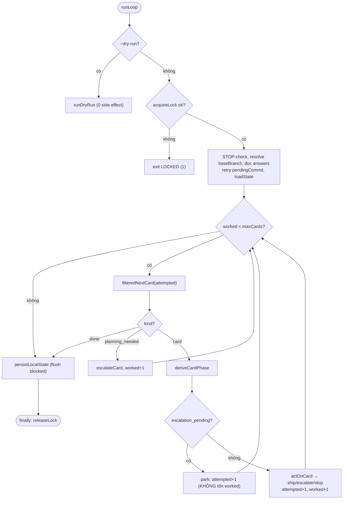
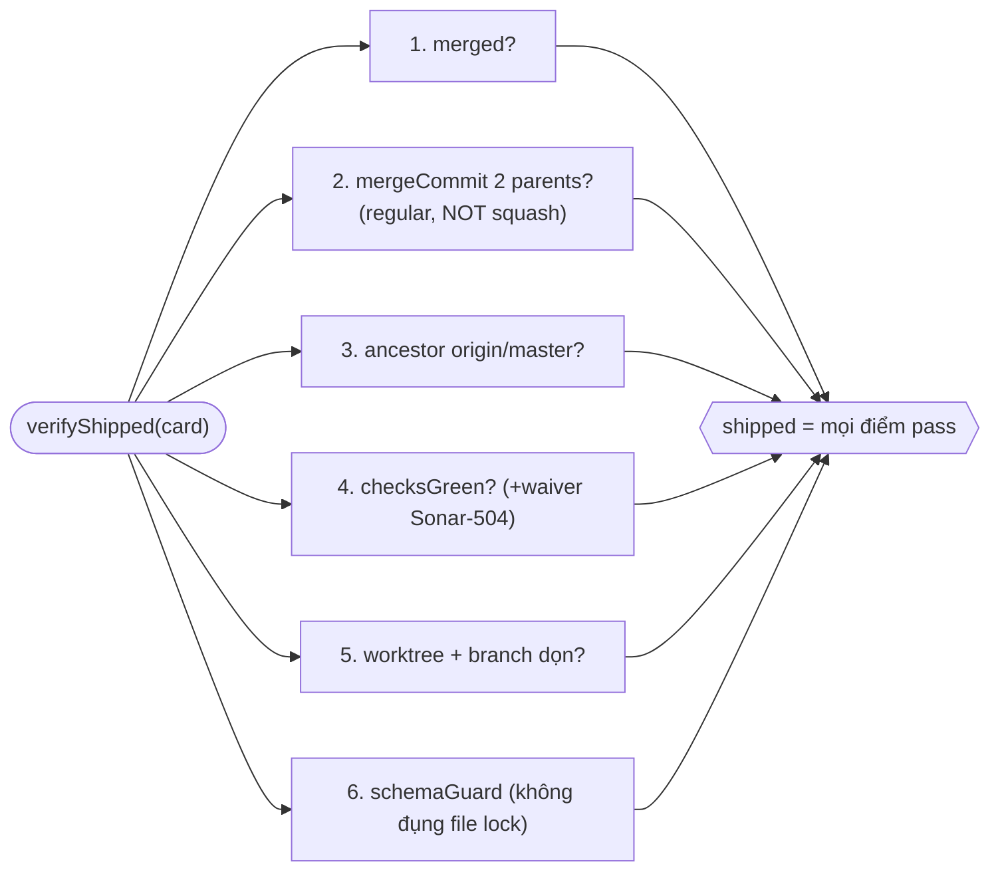
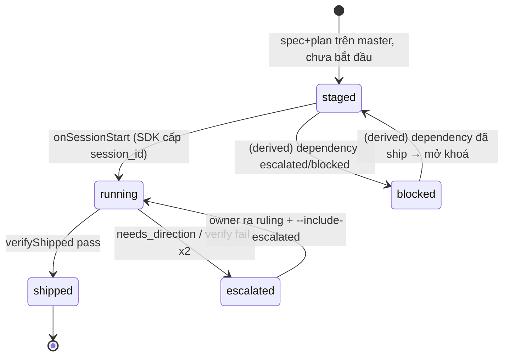

Bộ **campaign runner** trong plugin `tribe` là một **orchestrator** (nhạc trưởng): nó điều phối việc "ship" từng hạng mục công việc của một chiến dịch phát triển — **tự nó không viết code, không gọi AI/LLM** (tốn 0 token), chỉ đẻ ra và giám sát các phiên thực thi. Bài này đi **top-down**: bức tranh tổng thể trước, rồi mới xuống từng module. Baseline người đọc: **dân C#** đọc hiểu TypeScript cơ bản — mọi "đường ngọt" (sugar syntax) của TS đều được đối chiếu sang C#.

## 1. Bức tranh tổng thể — bộ code này làm gì?

Vài thuật ngữ (định nghĩa trước khi dùng):

- **Campaign (chiến dịch):** một loạt hạng mục xếp theo thứ tự.
- **Card (thẻ):** một đơn vị công việc (vd "thêm feature X"), mỗi card có _spec_ + _plan_.
- **Executor session (phiên thực thi):** một tiến trình _Claude Agent SDK_ được spawn ra để **thực sự làm** một card (viết code, mở PR, merge). Runner chỉ đẻ ra rồi giám sát.

Vòng lặp cốt lõi:



Nguyên tắc bao trùm: **"stateless-capability wall"** — runner **không hardcode** giá trị môi trường nào (repo, model, path, giá trị campaign); tất cả là **input qua CLI**. Cùng một script chạy được cho bất kỳ repo/campaign nào.

## 2. Ý niệm quan trọng nhất: "The Seam" (Dependency Injection)

Điều dân C# thấy quen nhất. **Mọi thao tác chạm thế giới thực** (gọi `git`/`gh`, đọc/ghi file, spawn SDK, đọc đồng hồ, đọc lock) **không** gọi trực tiếp trong module logic, mà đi qua một _interface được inject vào_ (TS gọi là "seam" — đường may). Đây chính là **constructor injection** với `IFileSystem`, `IProcessRunner`… để unit test không đụng file/network thật.

```typescript
export interface VerifyIO {
  exec(cmd: string[], options?: { cwd?: string }): Promise<ExecResult>;
  readFile(resolvedPath: string): Promise<string> | string;
}
```

| Cú pháp TS                  | Ý nghĩa                                | Tương đương C#                      |
| --------------------------- | -------------------------------------- | ----------------------------------- |
| `Promise<T>`                | Kết quả bất đồng bộ                    | `Task<T>` (`async/await` giống hệt) |
| `Promise<string> \| string` | **Union type**: "cái này HOẶC cái kia" | Không có sẵn                        |
| `options?:`                 | Tham số **optional**                   | `= null` (nullable)                 |

**Vì sao quan trọng:** chỉ `run.ts` được `import` `node:fs`, `child_process`, SDK thật. Mọi module khác chỉ nhận seam ⇒ chúng **pure** và **unit-test được 100%** không đụng binary/network.

## 3. Kiến trúc & bản đồ module

9 module chia 3 tầng: **wiring** (ráp thế giới thực) → **orchestration** → **capabilities**. Nét liền = "gọi/điều phối"; nét đứt = "chạm thế giới thực (chỉ `run.ts` & `session.ts`)".



| Module       | Vai trò                        | Ẩn dụ C#                      |
| ------------ | ------------------------------ | ----------------------------- |
| `run.ts`     | CLI entrypoint, ráp seam thực  | `Program.Main` + `Startup` DI |
| `loop.ts`    | Orchestrator chính (vòng lặp)  | `CampaignService`             |
| `state.ts`   | Schema + load/save + chọn card | `Repository` + validation     |
| `session.ts` | Bọc Claude Agent SDK           | Adapter cho external SDK      |
| `verify.ts`  | 6 bước kiểm chứng "đã shipped" | Domain validator              |
| `github.ts`  | Commit/push/PR/merge state     | Git/GitHub gateway            |
| `report.ts`  | Sinh report JSON + Markdown    | Output DTO builder            |
| `brief.ts`   | Render brief từ template       | Template renderer             |
| `types.ts`   | Kiểu dữ liệu dùng chung        | POCO/DTO models               |

## 4. Một flow hoàn chỉnh — các class kết nối ra sao

Sequence diagram trace **một card** từ lúc CLI khởi động đến khi được "ship":



**Điểm mấu chốt:** dòng "SHIPPED #42" từ SDK _chỉ là tín hiệu_. Runner **không tin ngay** — nó gọi `verifyShipped` chạy lại 6 kiểm tra thật. Chỉ khi verify pass, card mới ghi `shipped`.

## 5. `run.ts` — điểm vào (entrypoint)

Là `Program.Main`. Hai phần: **`parseArgs`** (thuần, test được) và **`main()`** (ráp thế giới thực, không test). `parseArgs` trả **discriminated union** `ParseArgsResult | ParseArgsError` — pattern thay cho `throw`. Caller kiểm tra `if ('error' in parsed)` (≈ `OneOf<Success, Error>` / `Result<T>`).

```typescript
const token = argv[i] as string; // 'as' = ép kiểu ở mức compiler (KHÔNG check runtime)
if (value === undefined) return { error: `${token} requires a value` };
```

`main()` ráp seam thật:

```typescript
function realExec(cmd: string[], opts?: { cwd?: string }): Promise<ExecResult> {
  return new Promise(resolve => {
    // ≈ TaskCompletionSource
    const child = spawn(cmd[0] as string, cmd.slice(1), { cwd: opts?.cwd });
    let stdout = "";
    child.stdout?.on("data", chunk => (stdout += chunk.toString())); // ?. optional chaining
    child.on("close", code => resolve({ stdout, stderr, exitCode: code ?? 1 })); // ?? nullish
  });
}
```

`isProcessAlive` probe OS xem PID còn sống (dùng cho lock): `process.kill(pid, 0)` — signal 0 CHỈ kiểm tra tồn tại, KHÔNG giết; bắt `EPERM` nghĩa là "tồn tại nhưng không có quyền → vẫn sống".

Exit code: `0`=OK, `1`=locked, `2`=escalated, `3`=session-incomplete, `4`=error. Comment nhấn mạnh: _"exit code chỉ là gợi ý, report mới là sự thật"_.

## 6. `loop.ts` — orchestrator chính (trái tim)

### 6.1 `deriveCardPhase` — "phân loại thực tại" cho resume

Khi runner khởi động lại (vd sau crash), nó **không tin trạng thái trong file** mà **hỏi lại git/gh**. Nguyên tắc vàng: _"file là data, git/gh mới là authority"_.



Kết quả là **discriminated union** `CardPhase` (≈ `abstract record` + pattern matching C#):

```typescript
export type CardPhase =
  | { kind: "verify_only"; pr: number }
  | {
      kind: "resume";
      sessionId: string;
      reason: "pr_open" | "branch_no_pr";
      pr?: number;
    }
  | { kind: "revert_and_redo" }
  | { kind: "fresh"; digest?: string }
  | { kind: "escalation_pending"; escalationPath: string };
```

Nếu PR đang OPEN mà **không** có `sessionId` để resume, spawn "fresh mù" sẽ khiến session mới **mở PR thứ 2**. Nên nó nhét `digest` (tóm tắt trạng thái) để session mới biết "PR #N đã tồn tại — đừng mở PR mới".

### 6.2 Lock chống chạy 2 instance

```typescript
export function acquireLock(io: LockIO): LockResult {
  const existing = io.readLock();
  if (existing && io.isProcessAlive(existing.pid)) {
    // có process SỐNG giữ lock
    return {
      ok: false,
      reason: `held by live pid ${existing.pid}`,
      heldBy: existing,
    };
  }
  io.writeLock({ pid: io.currentPid(), startedAt: io.now() }); // lock chết/trống → chiếm
  return { ok: true };
}
```

Dùng **liveness-probe** thay TTL: TTL quá ngắn giết nhầm session dài, quá dài thì lock chết kẹt lâu. Probe process thì _chính xác cả hai chiều_, tốn đúng 1 syscall.

### 6.3 `runLoop` — vòng lặp chính (park-and-continue)



```typescript
const attempted = new Set<string>();     // card ĐÃ CHỌN pass này (chống lặp vô hạn)
let worked = 0;                           // ngân sách --max-cards đã tiêu
const limit = config.maxCards ?? Infinity;

while (worked < limit) {
  if (isStopRequested(...)) break;                 // STOP tôn trọng GIỮA các card
  const nc = filteredNextCard(state, config, io, attempted);
  if (nc.kind === 'done') break;
  // planning_needed → escalate; escalation_pending → park; else actOnCard
}
persistLocalState(state, resolved, io);   // flush trạng thái blocked tính lúc 'done'
```

Ba điều thiết kế đắt giá:

1. **`attempted` (Set) vs `worked` (số) tách biệt.** `attempted` đảm bảo _kết thúc chắc chắn_ — mỗi card mỗi pass chỉ chọn 1 lần, sequence đưa cho `nextCard` **co lại mỗi vòng** ⇒ không lặp vô hạn. `worked` chỉ đếm việc thực (ship/escalate/stop) để tôn trọng `--max-cards`. Card chỉ "parked" (escalation cũ) không tốn budget.
2. **Park-and-continue:** escalate/stop _không_ dừng cả pass — vòng sau tự lấy card tiếp theo.
3. **STOP file mềm:** dừng _giữa_ các card, không cắt ngang 1 card đang chạy. Dùng `finally { releaseLock(io) }` (≈ `finally` C#).

**Resume-with-fallback:** chỉ fallback fresh khi outcome là `'error'`, **KHÔNG** khi `'timeout'` (timeout nghĩa là session cũ có thể _vẫn đang chạy_, spawn thêm sẽ nhân đôi).

## 7. `state.ts` — schema, load/save, chọn card

**Zod** = thư viện validate schema lúc _runtime_ (C# gần nhất: FluentValidation + tự suy ra type). `z.looseObject` **giữ field lạ** ⇒ load→save round-trip **byte-identical**. `dependsOn` cố ý **không** `.default([])` để không chèn key mới vào file; caller tự áp `card.dependsOn ?? []`. 4 lỗi custom bị từ chối _ngay lúc load_: version lạ, `sequence`/`dependsOn` trỏ card không tồn tại, và **cycle** (DFS gray/white).

### `blocked` là trạng thái DẪN XUẤT (derived) — ý niệm cốt lõi

`blocked` **không bao giờ tin từ file** — tính lại tới **fixpoint** mỗi lần gọi:

```typescript
while (changed) {
  changed = false;
  for (const [cardId, card] of Object.entries(cards)) {
    // for…of + destructuring [k,v]
    if (
      blocked.has(cardId) ||
      card.status === "shipped" ||
      card.status === "escalated"
    )
      continue;
    const isParked = (card.dependsOn ?? []).some(
      depId => cards[depId]?.status === "escalated" || blocked.has(depId)
    ); // dep escalated / (bắc cầu) blocked
    if (isParked) {
      blocked.add(cardId);
      changed = true;
    }
  }
}
```

**Vì sao 1 pass là sai:** với `A escalated`, `B dependsOn A`, `C dependsOn B` — duyệt 1 lần theo `[C,B,A]` thấy B "chưa ship" chứ chưa "blocked" khi xét C ⇒ bỏ sót C. Fixpoint khiến kết quả **độc lập thứ tự**. `Object.entries` ≈ `foreach kvp`; `for (const [k,v] of …)` là **array destructuring** (giống deconstruction tuple C#).

## 8. `session.ts` — bọc Claude Agent SDK (module DUY NHẤT chạm SDK)

Nếu SDK nâng cấp, chỉ file này đổi. **Pinned options**:

```typescript
systemPrompt: { type: 'preset', preset: 'claude_code' }, // BẮT BUỘC để CLAUDE.md có hiệu lực
settingSources: ['project'],                              // load config của TARGET repo
plugins: [{ type: 'local', path: TRIBE_PLUGIN_DIR }],     // agent tribe, KHÔNG dùng ~/.claude/agents
permissionMode: 'bypassPermissions',                      // headless: không treo chờ hỏi quyền
```

Parse từ **typed `result`**, KHÔNG scrape stdout:

```typescript
const SHIPPED_RE = /SHIPPED\s+#?(\d+)\s+([0-9a-f]{7,40})/i; // "SHIPPED #123 abc1234"
```

`SessionMessage` có index signature `[key: string]: unknown` — "object có thêm key string bất kỳ, kiểu `unknown`". `unknown` ≈ `object` nhưng an toàn hơn (phải narrow trước khi dùng). Stream + timeout bằng `Promise.race([sessionPromise, timeoutPromise])` (≈ `Task.WhenAny`); timeout gọi `abortController.abort()` (≈ `CancellationToken`). **`runSession` không bao giờ throw** — mọi lỗi thành `SessionResult` có `outcome` rõ ràng.

## 9. `verify.ts` — 6 điểm kiểm chứng "đã shipped"

Chạy **6 kiểm tra độc lập, không short-circuit** để báo cáo _mọi_ điểm fail (feed file escalation):



- **Bước 2 (2 parents):** merge thường có 2 parent; squash/rebase chỉ 1 ⇒ enforce luật "no-squash".
- **Bước 4 flake-waiver:** chỉ tha khi check đỏ _duy nhất_ khớp "SonarCloud 504" **và** diff toàn docs. `docsOnlyPaths` rỗng ⇒ **fail-closed** (không tha gì).
- `{owner}`/`{repo}` trong `gh api repos/{owner}/{repo}/pulls/N` là placeholder của chính gh (gh tự thay từ repo trong cwd) — không phải interpolation ⇒ giữ stateless wall.

## 10. `github.ts` — commit/push/PR/merge state

Helper "docs-PR" tự động: commit state lên branch `campaign-state/<card>`, mở PR, poll CI, **merge regular** (không squash), xoá branch, ff-sync base. Toàn bộ trả **outcome có cấu trúc, KHÔNG throw** (vì cũng chạy trên đường escalation — mà lý do escalate thường CHÍNH LÀ CI hỏng).

`CommitStateAndMergeResult = MergedResult | EscalateResult | CommitFailedResult`. Poll CI qua `io.sleep` (seam) ⇒ test chạy mili-giây, prod chờ 10 phút thật. Idempotent: dùng `git checkout -B` (create-or-reset) + `push --force`; **luôn khôi phục base branch ở mọi đường thoát** (best-effort).

## 11. `report.ts` — sinh báo cáo

Sinh **1 cấu trúc `CampaignReport` chung** rồi render ra **cả JSON và Markdown** ⇒ parity JSON↔MD là _cấu trúc_, không phải "hứa bằng tay". Hai quyết định tách thành hàm thuần test riêng:

```typescript
export function shouldWriteReport(p: {
  dryRun: boolean;
  exitCode: number;
}): boolean {
  if (p.dryRun) return false; // dry-run: 0 side-effect
  if (p.exitCode === EXIT_LOCKED) return false; // process bị từ chối KHÔNG đè report process sống
  return true;
}
```

Đọc `card.status` là **authoritative** — không tự tính lại fixpoint `dependsOn` (state.ts đã sở hữu).

## 12. `brief.ts` + `types.ts`

`brief.ts` đọc `brief-template.md` rồi thay placeholder `{{VAR}}`:

```typescript
return template.replace(/\{\{(\w+)\}\}/g, (match, key: string) => {
  if (!Object.prototype.hasOwnProperty.call(vars, key))
    throw new Error(`unknown placeholder {{${key}}}`); // placeholder lạ → fail loud
  return vars[key] as string;
});
```

`\{\{(\w+)\}\}` khớp `{{TEN}}` — `\{` phải escape vì `{` là ký tự đặc biệt regex. `types.ts` chứa model dùng chung (`Card`, `CampaignState`, `CardStatus`…) ≈ thư mục `Models/`.

## 13. Vòng đời một Card (state machine)



`running` luôn re-derive từ git/gh (không tin file); `blocked` là _derived_ tính lại mỗi lần.

## 14. Tổng kết — 7 điểm thiết kế nên nhớ

1. **Seam / DI ở mọi nơi** → thuần & test được 100% không đụng git/network/SDK thật.
2. **"File là data, git/gh là thẩm quyền"** → `deriveCardPhase` luôn hỏi lại thực tại (chống crash/resume, không mở PR trùng).
3. **Discriminated union + trả outcome thay vì throw** → mọi lỗi là kết quả báo cáo được.
4. **`blocked` là derived**, fixpoint mỗi lần → độc lập thứ tự.
5. **Stateless wall** → không hardcode repo/model/campaign.
6. **Kết thúc structural** → Set `attempted` làm sequence co lại mỗi vòng.
7. **Ship = verify độc lập** → không tin dòng "SHIPPED" của agent.
