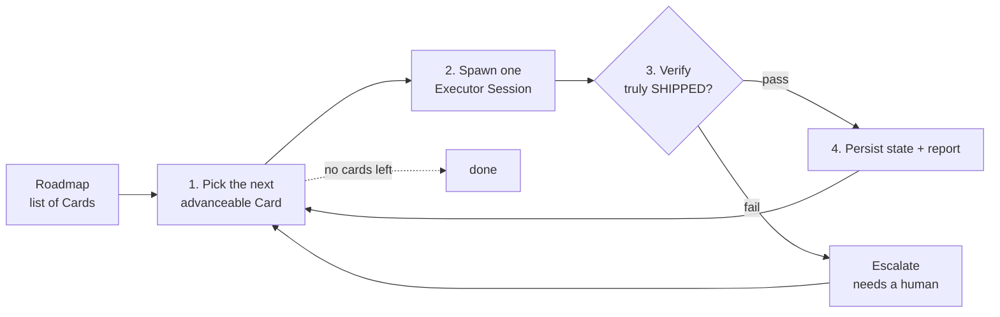
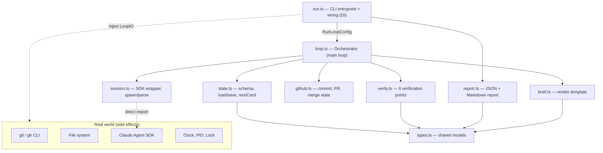
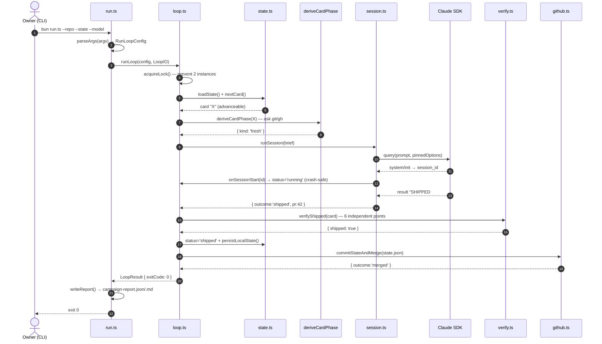
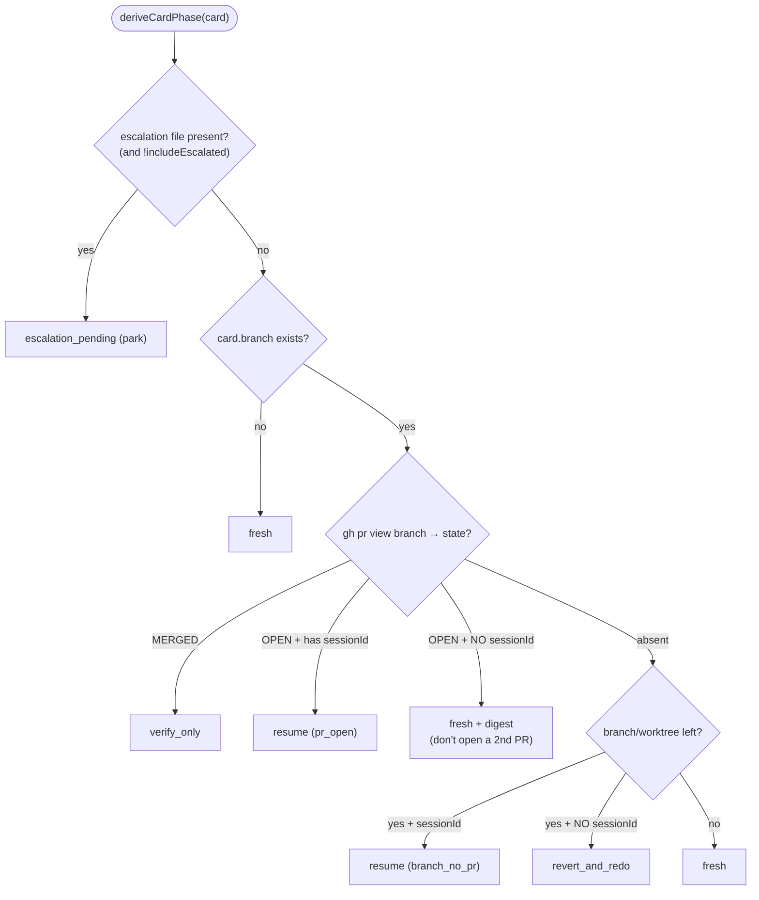
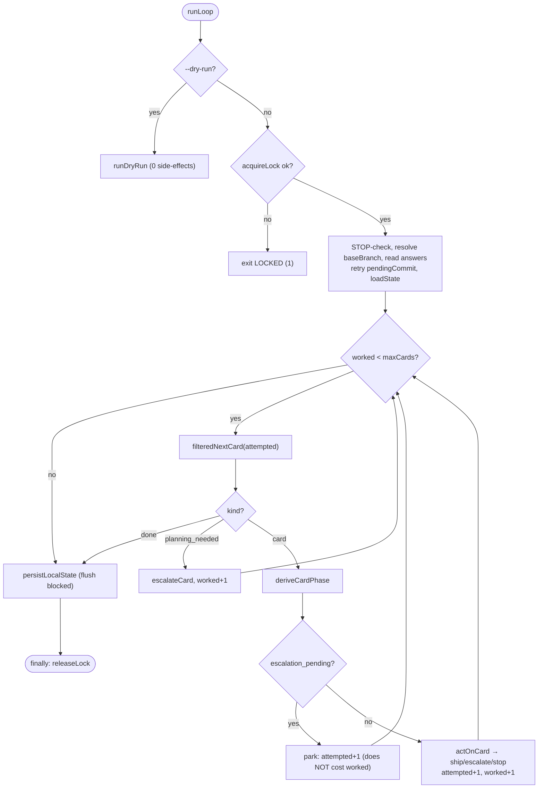
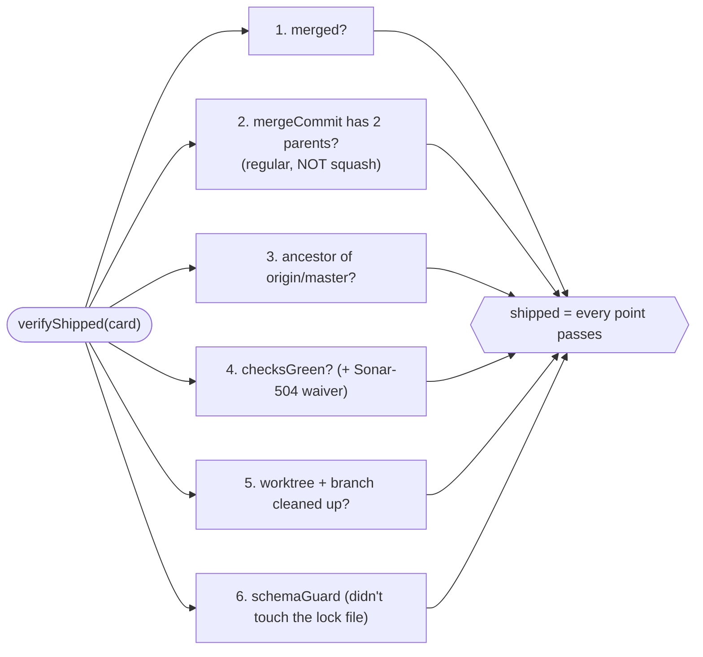
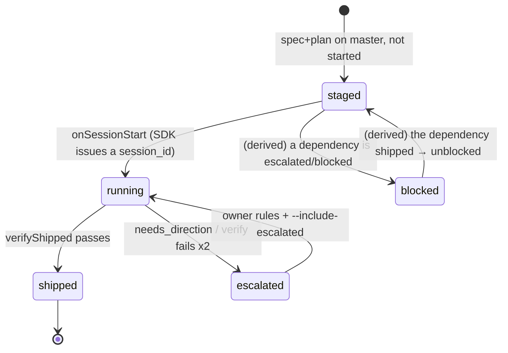

The **campaign runner** in the `tribe` plugin is an **orchestrator** (a conductor): it coordinates the "shipping" of each work item in a development campaign — it **writes no code itself and calls no AI/LLM** (zero tokens), it only spawns and supervises execution sessions. This post goes **top-down**: the big picture first, then down into each module. Reader baseline: a **C# developer** who can read basic TypeScript — every TS "sugar syntax" is mapped back to C#.

## 1. The big picture — what does this code do?

A few terms (defined before use):

- **Campaign:** an ordered series of work items.
- **Card:** one unit of work (e.g. "add feature X"), each card carries a _spec_ + _plan_.
- **Executor session:** a _Claude Agent SDK_ process spawned to **actually do** a card (write code, open a PR, merge). The runner only spawns it, then watches.

The core loop:



The overarching principle: the **"stateless-capability wall"** — the runner **hardcodes no** environment value (repo, model, path, campaign value); everything is a **CLI input**. The same script runs for any repo/campaign.

## 2. The most important idea: "The Seam" (Dependency Injection)

The bit a C# developer finds most familiar. **Every real-world operation** (invoking `git`/`gh`, reading/writing files, spawning the SDK, reading the clock, reading the lock) is **not** called directly inside a logic module; it goes through an _injected interface_ (TS calls it a "seam"). This is precisely **constructor injection** with `IFileSystem`, `IProcessRunner`… so unit tests never touch the real filesystem/network.

```typescript
export interface VerifyIO {
  exec(cmd: string[], options?: { cwd?: string }): Promise<ExecResult>;
  readFile(resolvedPath: string): Promise<string> | string;
}
```

| TS syntax                   | Meaning                        | C# equivalent                          |
| --------------------------- | ------------------------------ | -------------------------------------- |
| `Promise<T>`                | Asynchronous result            | `Task<T>` (`async/await` is identical) |
| `Promise<string> \| string` | **Union type**: "this OR that" | No built-in equivalent                 |
| `options?:`                 | **Optional** parameter         | `= null` (nullable)                    |

**Why it matters:** only `run.ts` may `import` `node:fs`, `child_process`, the real SDK. Every other module receives only seams ⇒ they are **pure** and **100% unit-testable** without touching a binary/network.

## 3. Architecture & module map

9 modules across 3 layers: **wiring** (assembling the real world) → **orchestration** → **capabilities**. Solid arrows = "calls/orchestrates"; dashed = "touches the real world (only `run.ts` & `session.ts`)".



| Module       | Role                                 | C# analogy                    |
| ------------ | ------------------------------------ | ----------------------------- |
| `run.ts`     | CLI entrypoint, assembles real seams | `Program.Main` + `Startup` DI |
| `loop.ts`    | Main orchestrator (the loop)         | `CampaignService`             |
| `state.ts`   | Schema + load/save + card selection  | `Repository` + validation     |
| `session.ts` | Claude Agent SDK wrapper             | Adapter for an external SDK   |
| `verify.ts`  | 6-step "is it shipped" verification  | Domain validator              |
| `github.ts`  | Commit/push/PR/merge state           | Git/GitHub gateway            |
| `report.ts`  | Emits JSON + Markdown report         | Output DTO builder            |
| `brief.ts`   | Renders a brief from a template      | Template renderer             |
| `types.ts`   | Shared data types                    | POCO/DTO models               |

## 4. One complete flow — how the classes connect

A sequence diagram tracing **one card** from CLI startup to being "shipped":



**The crux:** the "SHIPPED #42" line from the SDK is _just a signal_. The runner **does not trust it immediately** — it calls `verifyShipped`, which re-runs 6 real checks. Only when verify passes does the card get written as `shipped`.

## 5. `run.ts` — the entrypoint

This is `Program.Main`. Two parts: **`parseArgs`** (pure, testable) and **`main()`** (assembles the real world, not tested). `parseArgs` returns a **discriminated union** `ParseArgsResult | ParseArgsError` — a pattern that replaces `throw`. The caller checks `if ('error' in parsed)` (≈ `OneOf<Success, Error>` / `Result<T>`).

```typescript
const token = argv[i] as string; // 'as' = a compiler-level cast (NO runtime check)
if (value === undefined) return { error: `${token} requires a value` };
```

`main()` assembles the real seams:

```typescript
function realExec(cmd: string[], opts?: { cwd?: string }): Promise<ExecResult> {
  return new Promise(resolve => {
    // ≈ TaskCompletionSource
    const child = spawn(cmd[0] as string, cmd.slice(1), { cwd: opts?.cwd });
    let stdout = "";
    child.stdout?.on("data", chunk => (stdout += chunk.toString())); // ?. optional chaining
    child.on("close", code => resolve({ stdout, stderr, exitCode: code ?? 1 })); // ?? nullish
  });
}
```

`isProcessAlive` probes the OS for whether a PID is still alive (used by the lock): `process.kill(pid, 0)` — signal 0 ONLY checks existence, it does NOT kill; catching `EPERM` means "exists but no permission → still alive".

Exit codes: `0`=OK, `1`=locked, `2`=escalated, `3`=session-incomplete, `4`=error. A comment stresses: _"the exit code is only a hint, the report is the truth"_.

## 6. `loop.ts` — the main orchestrator (the heart)

### 6.1 `deriveCardPhase` — "classifying reality" for resume

When the runner restarts (e.g. after a crash), it **does not trust the state in the file** — it **re-asks git/gh**. The golden rule: _"the file is data, git/gh is the authority"_.



The result is a **discriminated union** `CardPhase` (≈ C# `abstract record` + pattern matching):

```typescript
export type CardPhase =
  | { kind: "verify_only"; pr: number }
  | {
      kind: "resume";
      sessionId: string;
      reason: "pr_open" | "branch_no_pr";
      pr?: number;
    }
  | { kind: "revert_and_redo" }
  | { kind: "fresh"; digest?: string }
  | { kind: "escalation_pending"; escalationPath: string };
```

If a PR is OPEN but there is **no** `sessionId` to resume from, spawning a "blind fresh" session would make the new session **open a second PR**. So it injects a `digest` (a state summary) telling the new session "PR #N already exists — do not open a new PR".

### 6.2 A lock to prevent running 2 instances

```typescript
export function acquireLock(io: LockIO): LockResult {
  const existing = io.readLock();
  if (existing && io.isProcessAlive(existing.pid)) {
    // a LIVE process holds the lock
    return {
      ok: false,
      reason: `held by live pid ${existing.pid}`,
      heldBy: existing,
    };
  }
  io.writeLock({ pid: io.currentPid(), startedAt: io.now() }); // dead/empty lock → claim it
  return { ok: true };
}
```

It uses a **liveness-probe** instead of a TTL: too short a TTL kills long-running sessions by mistake, too long and a dead lock stays stuck for ages. Probing the process is _accurate in both directions_ and costs exactly one syscall.

### 6.3 `runLoop` — the main loop (park-and-continue)



```typescript
const attempted = new Set<string>();     // cards ALREADY PICKED this pass (blocks infinite loops)
let worked = 0;                           // --max-cards budget spent
const limit = config.maxCards ?? Infinity;

while (worked < limit) {
  if (isStopRequested(...)) break;                 // STOP is honored BETWEEN cards
  const nc = filteredNextCard(state, config, io, attempted);
  if (nc.kind === 'done') break;
  // planning_needed → escalate; escalation_pending → park; else actOnCard
}
persistLocalState(state, resolved, io);   // flush the blocked state computed at 'done'
```

Three costly-but-worth-it design choices:

1. **`attempted` (a Set) vs `worked` (a number) kept separate.** `attempted` guarantees _definite termination_ — each card is picked at most once per pass, so the sequence handed to `nextCard` **shrinks every iteration** ⇒ no infinite loop. `worked` only counts real work (ship/escalate/stop) so it honors `--max-cards`. A merely "parked" card (an old escalation) costs no budget.
2. **Park-and-continue:** an escalate/stop does _not_ halt the whole pass — the next iteration simply picks up the next card.
3. **Soft STOP file:** stops _between_ cards, never interrupting a card mid-run. It uses `finally { releaseLock(io) }` (≈ C# `finally`).

**Resume-with-fallback:** it only falls back to fresh when the outcome is `'error'`, **NOT** on `'timeout'` (a timeout means the old session may _still be running_, and spawning another would duplicate it).

## 7. `state.ts` — schema, load/save, card selection

**Zod** = a runtime schema-validation library (closest C#: FluentValidation + inferred types). `z.looseObject` **keeps unknown fields** ⇒ a load→save round-trip is **byte-identical**. `dependsOn` deliberately has **no** `.default([])` so no new key is injected into the file; the caller applies `card.dependsOn ?? []` itself. Four custom errors are rejected _at load time_: an unknown version, a `sequence`/`dependsOn` pointing at a non-existent card, and a **cycle** (gray/white DFS).

### `blocked` is a DERIVED state — the core idea

`blocked` is **never trusted from the file** — it is recomputed to a **fixpoint** on every call:

```typescript
while (changed) {
  changed = false;
  for (const [cardId, card] of Object.entries(cards)) {
    // for…of + [k,v] destructuring
    if (
      blocked.has(cardId) ||
      card.status === "shipped" ||
      card.status === "escalated"
    )
      continue;
    const isParked = (card.dependsOn ?? []).some(
      depId => cards[depId]?.status === "escalated" || blocked.has(depId)
    ); // dep escalated / (transitively) blocked
    if (isParked) {
      blocked.add(cardId);
      changed = true;
    }
  }
}
```

**Why a single pass is wrong:** with `A escalated`, `B dependsOn A`, `C dependsOn B` — a single pass over `[C,B,A]` sees B as "not yet shipped" rather than "blocked" when evaluating C ⇒ it misses C. The fixpoint makes the result **order-independent**. `Object.entries` ≈ `foreach kvp`; `for (const [k,v] of …)` is **array destructuring** (like C# tuple deconstruction).

## 8. `session.ts` — the Claude Agent SDK wrapper (the ONLY module touching the SDK)

If the SDK is upgraded, only this file changes. **Pinned options**:

```typescript
systemPrompt: { type: 'preset', preset: 'claude_code' }, // REQUIRED so CLAUDE.md takes effect
settingSources: ['project'],                              // load the TARGET repo's config
plugins: [{ type: 'local', path: TRIBE_PLUGIN_DIR }],     // the tribe agent, NOT ~/.claude/agents
permissionMode: 'bypassPermissions',                      // headless: never hang waiting on a prompt
```

It parses from the **typed `result`**, NOT by scraping stdout:

```typescript
const SHIPPED_RE = /SHIPPED\s+#?(\d+)\s+([0-9a-f]{7,40})/i; // "SHIPPED #123 abc1234"
```

`SessionMessage` has an index signature `[key: string]: unknown` — "an object with any extra string keys, of type `unknown`". `unknown` ≈ `object` but safer (you must narrow it before use). Streaming + timeout via `Promise.race([sessionPromise, timeoutPromise])` (≈ `Task.WhenAny`); the timeout calls `abortController.abort()` (≈ `CancellationToken`). **`runSession` never throws** — every error becomes a `SessionResult` with an explicit `outcome`.

## 9. `verify.ts` — 6 "is it shipped" verification points

It runs **6 independent checks with no short-circuit** so it can report _every_ failing point (which feeds the escalation file):



- **Step 2 (2 parents):** a regular merge has 2 parents; squash/rebase has only 1 ⇒ this enforces the "no-squash" rule.
- **Step 4 flake-waiver:** it only forgives when the _sole_ red check matches "SonarCloud 504" **and** the diff is docs-only. An empty `docsOnlyPaths` ⇒ **fail-closed** (forgives nothing).
- `{owner}`/`{repo}` in `gh api repos/{owner}/{repo}/pulls/N` are gh's own placeholders (gh substitutes them from the repo in the cwd) — not string interpolation ⇒ this preserves the stateless wall.

## 10. `github.ts` — commit/push/PR/merge state

An automated "docs-PR" helper: commit state onto a `campaign-state/<card>` branch, open a PR, poll CI, **merge regular** (no squash), delete the branch, ff-sync the base. Everything returns a **structured outcome and NEVER throws** (because it also runs on the escalation path — where the very reason for escalating is often that CI is broken).

`CommitStateAndMergeResult = MergedResult | EscalateResult | CommitFailedResult`. It polls CI via `io.sleep` (a seam) ⇒ tests run in milliseconds while prod waits a real 10 minutes. It is idempotent: it uses `git checkout -B` (create-or-reset) + `push --force`, and **always restores the base branch on every exit path** (best-effort).

## 11. `report.ts` — emitting the report

It builds **one shared `CampaignReport` structure** and renders it to **both JSON and Markdown** ⇒ JSON↔MD parity is _structural_, not a "hand-kept promise". Two decisions are split into separately-testable pure functions:

```typescript
export function shouldWriteReport(p: {
  dryRun: boolean;
  exitCode: number;
}): boolean {
  if (p.dryRun) return false; // dry-run: 0 side-effects
  if (p.exitCode === EXIT_LOCKED) return false; // a rejected process must NOT overwrite the live process's report
  return true;
}
```

Reading `card.status` is **authoritative** here — it does not re-run the `dependsOn` fixpoint (state.ts already owns that).

## 12. `brief.ts` + `types.ts`

`brief.ts` reads `brief-template.md` and substitutes `{{VAR}}` placeholders:

```typescript
return template.replace(/\{\{(\w+)\}\}/g, (match, key: string) => {
  if (!Object.prototype.hasOwnProperty.call(vars, key))
    throw new Error(`unknown placeholder {{${key}}}`); // unknown placeholder → fail loud
  return vars[key] as string;
});
```

`\{\{(\w+)\}\}` matches `{{NAME}}` — `\{` must be escaped because `{` is a regex special character. `types.ts` holds the shared models (`Card`, `CampaignState`, `CardStatus`…) ≈ a `Models/` folder.

## 13. A Card's lifecycle (state machine)



`running` is always re-derived from git/gh (never trusted from the file); `blocked` is _derived_, recomputed each time.

## 14. Wrap-up — 7 design points to remember

1. **Seam / DI everywhere** → pure & 100% testable without touching real git/network/SDK.
2. **"The file is data, git/gh is the authority"** → `deriveCardPhase` always re-asks reality (crash/resume-safe, never opens a duplicate PR).
3. **Discriminated union + return-an-outcome instead of throwing** → every error is a reportable result.
4. **`blocked` is derived**, to a fixpoint each time → order-independent.
5. **Stateless wall** → nothing about repo/model/campaign is hardcoded.
6. **Structural termination** → the `attempted` Set makes the sequence shrink every iteration.
7. **Ship = independent verify** → never trust the agent's own "SHIPPED" line.
